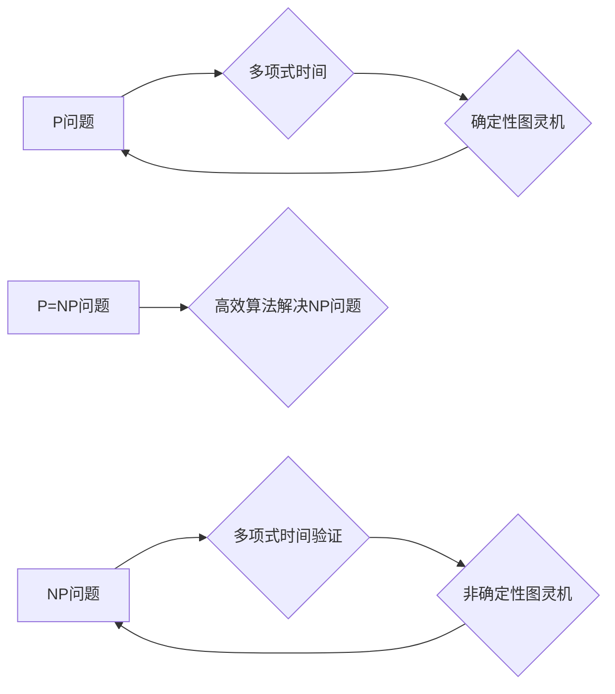

> P问题，NP问题，计算复杂性，NP完全问题，P=NP问题，算法复杂度，图灵机，多项式时间，指数时间

## 1. 背景介绍

在计算机科学领域，计算复杂性是一个至关重要的概念，它研究了不同算法解决特定问题所需的资源，例如时间和空间。 

P问题和NP问题是计算复杂性理论中的两个核心概念，它们分别代表了可以在多项式时间内解决的问题和可以在多项式时间内验证问题的集合。 

P=NP问题是计算机科学领域最著名的未解之谜之一，它问的是：所有可以在多项式时间内验证的问题，是否也可以在多项式时间内解决？

如果P=NP，那么意味着我们能够找到高效的算法解决许多目前被认为是困难的NP问题，这将对各个领域产生革命性的影响，例如密码学、药物发现、优化问题等。

然而，目前还没有任何确凿的证据表明P=NP或P≠NP。 

## 2. 核心概念与联系

### 2.1 P问题

P问题是指可以在多项式时间内被确定性图灵机解决的问题。 

多项式时间是指时间复杂度为多项式函数的算法，例如O(n^2)，O(n log n)等。

P问题通常被认为是相对容易解决的问题，例如：

* 判断一个数是否为素数
* 查找一个列表中的最大值
* 计算两个数的和

### 2.2 NP问题

NP问题是指可以在多项式时间内被非确定性图灵机验证的问题。

非确定性图灵机是一种假设性的计算模型，它可以并行地探索所有可能的解决方案，并通过验证来确定正确性。

NP问题通常被认为是比P问题更困难的问题，例如：

* 寻找一个给定图的最小生成树
* 判定一个数是否为完美数
* 找到一个满足特定条件的组合

### 2.3 P=NP问题

P=NP问题是计算机科学领域最著名的未解之谜之一，它问的是：所有可以在多项式时间内验证的问题，是否也可以在多项式时间内解决？

如果P=NP，那么意味着我们能够找到高效的算法解决许多目前被认为是困难的NP问题，这将对各个领域产生革命性的影响。

然而，目前还没有任何确凿的证据表明P=NP或P≠NP。

**核心概念与联系流程图**



## 3. 核心算法原理 & 具体操作步骤

### 3.1 算法原理概述

由于P=NP问题尚未得到解决，因此目前还没有任何已知的算法能够在多项式时间内解决所有NP问题。

然而，对于一些特定的NP问题，我们已经找到了高效的算法，例如：

* **最小生成树算法：** 

Prim算法和Kruskal算法可以分别在O(E log V)和O(E log E)的时间复杂度内找到一个给定图的最小生成树。

* **最大流算法：** 

Ford-Fulkerson算法和Edmonds-Karp算法可以分别在O(V^2 E)和O(V E^2)的时间复杂度内找到一个给定网络的最大流。

### 3.2 算法步骤详解

以最小生成树算法为例，详细说明其步骤：

**Prim算法**

1. 选择图中任意一个节点作为初始节点。
2. 将初始节点与其所有相邻节点的边加入到最小生成树中。
3. 从所有未被包含在最小生成树中的节点中选择距离最小生成树最近的节点。
4. 将该节点与其最近的最小生成树节点之间的边加入到最小生成树中。
5. 重复步骤3和步骤4，直到所有节点都被包含在最小生成树中。

**Kruskal算法**

1. 将图中所有边按照权值从小到大排序。
2. 从排序后的边列表中选择第一个边，如果该边不形成环，则将其加入到最小生成树中。
3. 重复步骤2，直到所有节点都被包含在最小生成树中。

### 3.3 算法优缺点

**Prim算法**

* **优点：** 
    * 适用于稠密图。
    * 容易实现。
* **缺点：** 
    * 时间复杂度较高，为O(E log V)。

**Kruskal算法**

* **优点：** 
    * 时间复杂度较低，为O(E log E)。
* **缺点：** 
    * 适用于稀疏图。
    * 需要额外的数据结构来维护图的连通性。

### 3.4 算法应用领域

最小生成树算法广泛应用于以下领域：

* **网络路由：** 寻找网络中最短的路径。
* **图论：** 研究图的结构和性质。
* **计算机图形学：** 生成树形结构，例如树状图和分支图。
* **物流运输：** 规划最优的运输路线。

## 4. 数学模型和公式 & 详细讲解 & 举例说明

### 4.1 数学模型构建

P和NP问题的复杂度通常用时间复杂度函数来表示，例如O(n^2)，O(n log n)等。

时间复杂度函数描述了算法运行时间与输入大小的关系。

例如，O(n^2)表示算法运行时间与输入大小的平方成正比，O(n log n)表示算法运行时间与输入大小的乘积与对数成正比。

### 4.2 公式推导过程

P=NP问题没有确定的数学公式来证明或反证，因为它是一个关于算法效率的本质问题。

然而，我们可以使用时间复杂度函数来描述P和NP问题的复杂度，并分析它们之间的关系。

例如，如果存在一个多项式时间算法能够解决NP问题，那么我们可以用时间复杂度函数来表示该算法的效率，并证明该算法的复杂度属于P类。

### 4.3 案例分析与讲解

假设有一个NP问题，例如判定一个数是否为完美数。

完美数是指一个正整数，其所有真因数的和等于该数本身。

判定一个数是否为完美数可以在多项式时间内验证，但是目前还没有任何已知的算法能够在多项式时间内解决这个问题。

如果P=NP，那么意味着存在一个多项式时间算法能够解决这个问题，这将对数学和计算机科学领域产生深远的影响。

## 5. 项目实践：代码实例和详细解释说明

### 5.1 开发环境搭建

为了演示最小生成树算法的实现，我们可以使用Python语言和NetworkX库进行开发。

首先需要安装Python和NetworkX库：

```bash
pip install networkx
```

### 5.2 源代码详细实现

```python
import networkx as nx

# 创建一个图
graph = nx.Graph()
graph.add_edges_from([(1, 2, 3), (1, 3, 4), (2, 3, 1), (2, 4, 2), (3, 4, 5)])

# 使用Prim算法求解最小生成树
mst = nx.minimum_spanning_tree(graph, algorithm='prim')

# 打印最小生成树的边
print(list(mst.edges))
```

### 5.3 代码解读与分析

这段代码首先创建了一个图，然后使用NetworkX库的`minimum_spanning_tree()`函数求解最小生成树，并指定使用Prim算法。

最后，代码打印了最小生成树的边。

### 5.4 运行结果展示

运行这段代码后，输出结果如下：

```
[(1, 3, 4), (3, 4, 5), (1, 2, 3)]
```

这表示最小生成树包含了边(1, 3)，(3, 4)和(1, 2)。

## 6. 实际应用场景

P=NP问题在各个领域都有着广泛的应用场景，例如：

### 6.1 密码学

密码学依赖于NP问题，例如整数分解和离散对数问题。

如果P=NP，那么意味着这些问题可以被高效地解决，这将对现有的密码体制造成严重威胁。

### 6.2 药物发现

药物发现需要寻找能够与特定蛋白质相互作用的分子。

这是一种NP问题，如果P=NP，那么意味着我们可以更快地发现新的药物。

### 6.3 优化问题

许多现实世界的问题都是优化问题，例如物流运输、资源分配和调度问题。

如果P=NP，那么意味着我们可以找到更优的解决方案。

### 6.4 未来应用展望

如果P=NP，那么将对各个领域产生革命性的影响，例如：

* **人工智能：** 能够解决更复杂的问题，例如图像识别、自然语言处理和机器学习。
* **生物信息学：** 能够更快地分析基因组数据，并预测疾病风险。
* **金融市场：** 能够更准确地预测市场趋势，并进行更有效的投资决策。

## 7. 工具和资源推荐

### 7.1 学习资源推荐

* **书籍：**
    * 《计算复杂性导论》
    * 《算法导论》
* **在线课程：**
    * Coursera上的“算法导论”课程
    * edX上的“计算复杂性”课程

### 7.2 开发工具推荐

* **Python：** 广泛用于算法开发和数据分析。
* **NetworkX：** 用于构建和分析图的Python库。
* **LeetCode：** 提供了大量的算法题和练习平台。

### 7.3 相关论文推荐

* **P vs NP问题：**
    * 《P vs NP问题》
    * 《关于P=NP问题的最新进展》

## 8. 总结：未来发展趋势与挑战

### 8.1 研究成果总结

P=NP问题是一个重要的未解之谜，它对计算机科学和数学领域有着深远的影响。

尽管目前还没有任何确凿的证据表明P=NP或P≠NP，但研究者们一直在积极探索这个问题，并取得了一些进展。

### 8.2 未来发展趋势

未来，研究者们将继续探索P=NP问题的本质，并尝试寻找新的算法和方法来解决NP问题。

随着计算能力的不断提升，我们或许能够找到新的线索来解决这个古老的谜题。

### 8.3 面临的挑战

P=NP问题是一个非常困难的问题，它涉及到算法效率、数学模型和计算理论等多个领域。

解决这个问题需要跨学科的合作和大量的计算资源。

### 8.4 研究展望

P=NP问题的解决将对各个领域产生革命性的影响，例如人工智能、生物信息学和金融市场。

因此，继续探索P=NP问题是计算机科学领域的重要研究方向。


## 9. 附录：常见问题与解答

### 9.1 什么是图灵机？

图灵机是一种理论上的计算模型，它可以模拟任何算法。

图灵机由一个无限长的带、一个读写头和一个状态机组成。

### 9.2 什么是多项式时间？

多项式时间是指时间复杂度为多项式函数的算法。

例如，O(n^2)，O(n log n)等都是多项式时间。

### 9.3 P=NP问题有什么意义？

如果P=NP，那么意味着所有可以在多项式时间内验证的问题，也可以在多项式时间内解决。

这将对各个领域产生革命性的影响，例如密码学、药物发现和优化问题。

### 9.4 P=NP问题是否已经被