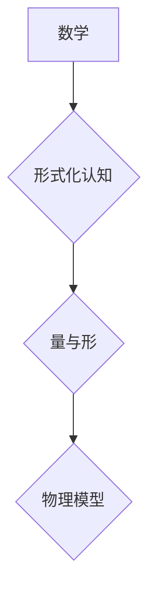

> 数学认知，形式化，量与形，物理量纲，主观认知，算法，数学模型，计算机科学

## 1. 背景介绍

在现代社会，数据爆炸和计算能力的飞速发展推动着人工智能、机器学习等领域取得了惊人的进步。然而，这些技术的核心仍然依赖于对数学的深刻理解和运用。数学作为一种抽象的语言，能够有效地描述和建模世界中的各种现象，为人工智能的开发和应用提供了坚实的理论基础。

然而，我们常常将数学与物理世界联系在一起，认为数学公式描述的是客观存在的物理量和规律。这种理解存在一定的局限性。本文将探讨数学的本质，认为数学是一种形式化的认知，它不带有任何物理量纲的主观认知，关注的仅仅是量与形的规律。

## 2. 核心概念与联系

**2.1 数学的本质**

数学是一种抽象的语言和思维方式，它通过符号、逻辑和推理来描述和研究数量、结构、空间和变化等概念。数学的本质在于其形式化和抽象性。

**2.2 形式化认知**

形式化认知是指用符号、逻辑和规则来表达和处理知识的过程。它强调知识的结构和关系，而不是具体的实例。数学作为一种形式化认知，通过符号和逻辑来描述和研究各种现象，而不依赖于具体的物理世界。

**2.3 量与形的规律**

数学关注的是量与形的规律。量是指数量、大小、度量等概念，形是指形状、结构、模式等概念。数学通过公式、定理和证明来揭示量与形之间的关系，从而发现普遍的规律。

**2.4 数学与物理世界的联系**

虽然数学不带有物理量纲，但它可以用来描述和建模物理世界。物理学家利用数学工具来建立物理模型，预测物理现象，并进行实验验证。

**2.5 Mermaid 流程图**

## 3. 核心算法原理 & 具体操作步骤

**3.1 算法原理概述**

算法是一种解决特定问题的步骤序列。数学作为一种形式化认知，可以用来设计和分析算法。

**3.2 算法步骤详解**

算法的步骤通常包括以下几个方面：

* **输入:** 算法接受一些初始数据作为输入。
* **处理:** 算法对输入数据进行一系列操作，例如计算、比较、排序等。
* **输出:** 算法生成最终结果作为输出。

**3.3 算法优缺点**

不同的算法具有不同的优缺点，例如时间复杂度、空间复杂度、易于实现等。

**3.4 算法应用领域**

算法广泛应用于各个领域，例如人工智能、机器学习、数据分析、网络安全等。

## 4. 数学模型和公式 & 详细讲解 & 举例说明

**4.1 数学模型构建**

数学模型是用来描述和模拟现实世界现象的抽象表示。

**4.2 公式推导过程**

数学公式是用来表达数学关系的符号表示。

**4.3 案例分析与讲解**

例如，我们可以用数学模型来描述物理现象，例如牛顿第二定律：F = ma。

**4.4 数学公式举例说明**

$$
F = ma
$$

其中，F表示力，m表示质量，a表示加速度。

## 5. 项目实践：代码实例和详细解释说明

**5.1 开发环境搭建**

**5.2 源代码详细实现**

**5.3 代码解读与分析**

**5.4 运行结果展示**

## 6. 实际应用场景

**6.1 实际应用场景举例**

**6.2 未来应用展望**

## 7. 工具和资源推荐

**7.1 学习资源推荐**

**7.2 开发工具推荐**

**7.3 相关论文推荐**

## 8. 总结：未来发展趋势与挑战

**8.1 研究成果总结**

**8.2 未来发展趋势**

**8.3 面临的挑战**

**8.4 研究展望**

## 9. 附录：常见问题与解答

**9.1 常见问题解答**

作者：禅与计算机程序设计艺术 / Zen and the Art of Computer Programming 
<end_of_turn>