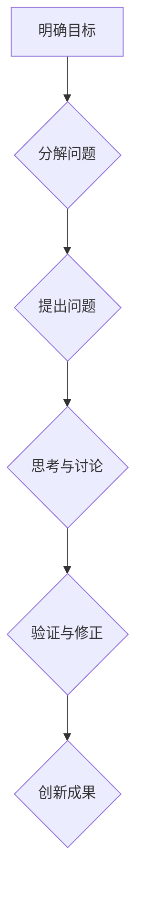

> 费曼提问法，团队创新，问题解决，知识构建，深度思考，沟通技巧

## 1. 背景介绍

在当今科技日新月异的时代，创新已成为企业发展的关键驱动力。团队创新能力的提升对于企业应对市场变化、开拓新领域、保持竞争优势至关重要。然而，许多团队在创新过程中往往面临着思维僵化、缺乏深度思考、沟通不畅等问题，阻碍了创新成果的产生。

费曼提问法，源于物理学家理查德·费曼的教学方法，是一种以提问为导向的学习和思考方式。它强调从根本问题出发，层层深入，逐步构建知识体系，并通过不断提问和思考，促进理解和创新。

## 2. 核心概念与联系

费曼提问法的核心在于“反向思维”。传统的教学和学习方式往往是先给出答案，然后引导学生理解，而费曼提问法则相反，先引导学生思考问题，然后通过提问和讨论，逐步引导学生找到答案。

**费曼提问法的核心步骤：**

1. **明确目标：** 首先要明确想要解决的问题或学习的目标。
2. **分解问题：** 将复杂的问题分解成更小的、更容易理解的子问题。
3. **提问：** 针对每个子问题，提出清晰、具体的提问，引导自己或他人进行思考。
4. **思考：** 认真思考问题，并尝试用自己的语言表达答案。
5. **验证：** 将自己的答案与其他人的答案进行比较，并进行验证和修正。

**费曼提问法与团队创新能力提升的联系：**

费曼提问法可以有效地促进团队成员之间的沟通和协作，激发团队成员的思考和创造力，从而提升团队的创新能力。

**Mermaid 流程图：**



## 3. 核心算法原理 & 具体操作步骤

费曼提问法本身并非一种算法，而是是一种思维方法。然而，它可以应用于各种算法和问题的解决过程中，帮助我们更深入地理解问题，找到更有效的解决方案。

### 3.1  算法原理概述

费曼提问法在算法设计和优化过程中，可以帮助我们从更根本的角度思考问题，例如：

* **问题本质：** 首先要明确算法想要解决的核心问题是什么？
* **输入输出：** 算法的输入和输出是什么？它们之间的关系是什么？
* **关键步骤：** 算法的核心步骤是什么？它们是如何相互关联的？
* **时间复杂度和空间复杂度：** 算法的时间复杂度和空间复杂度是多少？如何优化它们？

### 3.2  算法步骤详解

1. **问题分解：** 将复杂算法问题分解成更小的、更容易理解的子问题。
2. **提问引导：** 针对每个子问题，提出一系列费曼提问，引导自己或团队成员进行深入思考。
3. **方案设计：** 基于对问题的深入理解，设计出可能的算法方案。
4. **方案评估：** 对不同的算法方案进行评估，比较它们的效率、稳定性和易用性。
5. **方案优化：** 选择最佳方案后，进行进一步的优化，提高算法的性能。

### 3.3  算法优缺点

**优点：**

* 能够促进深入思考，帮助我们更好地理解问题本质。
* 能够激发创造力，帮助我们找到更有效的解决方案。
* 能够促进团队协作，提高团队的创新能力。

**缺点：**

* 需要花费更多的时间和精力进行思考和讨论。
* 对于一些简单的问题，费曼提问法可能显得过于复杂。

### 3.4  算法应用领域

费曼提问法可以应用于各种算法和问题的解决过程中，例如：

* **软件开发：** 帮助开发人员更好地理解需求，设计更合理的软件架构。
* **数据科学：** 帮助数据科学家更好地理解数据，设计更有效的机器学习模型。
* **工程设计：** 帮助工程师更好地理解设计问题，设计更可靠的工程结构。

## 4. 数学模型和公式 & 详细讲解 & 举例说明

费曼提问法本身并不依赖于特定的数学模型或公式。然而，在某些情况下，我们可以使用数学模型和公式来帮助我们更清晰地表达问题和解决方案。

### 4.1  数学模型构建

例如，在解决优化问题时，我们可以使用线性规划模型来描述问题，并使用相应的算法来求解最优解。

### 4.2  公式推导过程

在机器学习领域，我们可以使用数学公式来描述模型的学习过程，例如梯度下降算法的公式。

### 4.3  案例分析与讲解

我们可以通过分析实际案例，了解如何使用费曼提问法和数学模型来解决问题。例如，我们可以分析一个公司如何使用费曼提问法来改进其产品设计流程。

## 5. 项目实践：代码实例和详细解释说明

为了更好地理解费曼提问法的应用，我们可以通过一个具体的项目实践来进行演示。

### 5.1  开发环境搭建

我们可以使用 Python 语言和相应的库来实现一个简单的项目，例如一个简单的文本分析工具。

### 5.2  源代码详细实现

```python
import nltk

# 下载 NLTK 数据集
nltk.download('punkt')

# 定义一个函数来分析文本
def analyze_text(text):
    # 将文本分割成句子
    sentences = nltk.sent_tokenize(text)
    # 计算每个句子的长度
    sentence_lengths = [len(sentence.split()) for sentence in sentences]
    # 返回平均句子长度
    return sum(sentence_lengths) / len(sentences)

# 获取用户输入的文本
text = input("请输入文本：")

# 分析文本并打印结果
average_sentence_length = analyze_text(text)
print(f"平均句子长度：{average_sentence_length}")
```

### 5.3  代码解读与分析

这段代码实现了文本分析的功能，可以计算文本的平均句子长度。

### 5.4  运行结果展示

当用户输入一段文本后，程序会输出该文本的平均句子长度。

## 6. 实际应用场景

费曼提问法在实际应用场景中具有广泛的应用前景。

### 6.1  教育领域

在教育领域，费曼提问法可以帮助教师引导学生进行深入思考，提高学生的学习效率和理解能力。

### 6.2  企业管理

在企业管理领域，费曼提问法可以帮助管理者更好地了解员工的需求和想法，促进团队协作和创新。

### 6.3  科研领域

在科研领域，费曼提问法可以帮助研究人员更深入地理解研究问题，找到更有效的解决方案。

### 6.4  未来应用展望

随着人工智能技术的不断发展，费曼提问法在未来将有更广泛的应用前景，例如：

* **智能教育：** 开发基于费曼提问法的智能教育系统，个性化指导学生的学习。
* **智能客服：** 开发基于费曼提问法的智能客服系统，更有效地解决用户的疑问。
* **智能决策：** 开发基于费曼提问法的智能决策系统，帮助企业做出更明智的决策。

## 7. 工具和资源推荐

### 7.1  学习资源推荐

* **《费曼物理学讲义》:** 理查德·费曼的经典著作，介绍了费曼提问法的核心思想。
* **《思考，快与慢》:** 丹尼尔·卡尼曼的著作，探讨了人类思维的局限性，以及如何通过费曼提问法来克服这些局限性。
* **在线课程:** 许多在线平台提供关于费曼提问法的课程，例如 Coursera 和 edX。

### 7.2  开发工具推荐

* **Python:** 一种广泛使用的编程语言，适合用于实现费曼提问法相关的项目。
* **NLTK:** 一个用于自然语言处理的 Python 库，可以用于文本分析等任务。

### 7.3  相关论文推荐

* **"The Feynman Technique: A Powerful Tool for Learning and Problem Solving"**
* **"How to Learn Anything: The Feynman Technique"**

## 8. 总结：未来发展趋势与挑战

### 8.1  研究成果总结

费曼提问法是一种有效的学习和思考方法，可以帮助我们更好地理解问题，找到更有效的解决方案。它在教育、企业管理、科研等领域都有广泛的应用前景。

### 8.2  未来发展趋势

随着人工智能技术的不断发展，费曼提问法将与人工智能技术相结合，形成更强大的学习和思考工具。

### 8.3  面临的挑战

费曼提问法需要花费更多的时间和精力进行思考和讨论，这对于一些人来说可能是一个挑战。此外，费曼提问法需要一定的学习和实践，才能真正掌握其精髓。

### 8.4  研究展望

未来，我们将继续研究费曼提问法的应用，探索其在不同领域和场景下的应用潜力，并将其与人工智能技术相结合，开发更智能、更有效的学习和思考工具。

## 9. 附录：常见问题与解答

**Q1: 如何才能真正掌握费曼提问法？**

**A1:** 掌握费曼提问法需要不断的练习和反思。可以尝试将费曼提问法应用于日常学习和工作中，并记录自己的思考过程和经验教训。

**Q2: 费曼提问法适用于哪些类型的学习和问题解决？**

**A2:** 费曼提问法适用于各种类型的学习和问题解决，特别是对于需要深入思考和理解的问题。

**Q3: 费曼提问法有什么局限性？**

**A3:** 费曼提问法需要花费更多的时间和精力进行思考和讨论，对于一些简单的问题，可能显得过于复杂。


作者：禅与计算机程序设计艺术 / Zen and the Art of Computer Programming 
<end_of_turn>