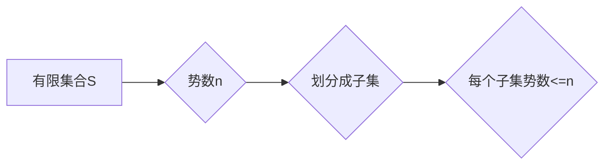

> 集合论，小势划分定理，集合划分，势数，数学模型，算法设计，程序设计

## 1. 背景介绍

在计算机科学领域，集合论作为基础数学理论，在数据结构、算法设计、数据库管理等方面扮演着至关重要的角色。其中，小势划分定理（Small Set Partition Theorem）是集合论中一个重要的定理，它揭示了有限集合的划分方式与集合大小之间的关系。

小势划分定理在实际应用中具有广泛的意义，例如：

* **数据分组：** 在数据库管理中，可以利用小势划分定理将大量数据进行分组，提高数据查询效率。
* **资源分配：** 在计算机网络中，可以利用小势划分定理将有限的资源分配给不同的用户或应用，保证资源的合理利用。
* **算法优化：** 在算法设计中，可以利用小势划分定理优化算法的复杂度，提高算法的效率。

## 2. 核心概念与联系

**2.1 集合论基础**

* **集合：** 集合是数学中一个基本概念，它是一个包含特定对象的集合。
* **子集：** 如果集合A的所有元素都属于集合B，则称集合A是集合B的子集。
* **势数：** 集合中元素的个数称为集合的势数。

**2.2 小势划分定理**

小势划分定理指出：对于一个有限集合S，如果其势数为n，则可以将S划分为至多n个子集，使得每个子集的势数都小于等于n。

**2.3 核心概念联系**

小势划分定理的核心概念是集合的划分和势数之间的关系。它表明，有限集合可以被划分为有限个子集，并且每个子集的规模不会超过原集合的规模。

**2.4 Mermaid 流程图**



## 3. 核心算法原理 & 具体操作步骤

**3.1 算法原理概述**

小势划分定理的算法原理基于贪婪算法。贪婪算法是一种简单而有效的算法设计策略，它在每次决策时都选择当前看来最优的局部解，最终期望得到全局最优解。

**3.2 算法步骤详解**

1. **输入：** 有限集合S和其势数n。
2. **初始化：** 创建一个空列表L，用于存储划分后的子集。
3. **循环：** 
    * 从集合S中选择一个元素，将其添加到L中。
    * 如果L中子集的势数大于n，则将L中的子集拆分为两个子集，并将新元素添加到其中一个子集。
4. **输出：** 返回包含所有子集的列表L。

**3.3 算法优缺点**

* **优点：** 算法简单易懂，易于实现，时间复杂度较低。
* **缺点：** 算法可能无法找到全局最优解，可能会存在局部最优解的情况。

**3.4 算法应用领域**

小势划分定理的算法可以应用于以下领域：

* 数据分组
* 资源分配
* 算法优化

## 4. 数学模型和公式 & 详细讲解 & 举例说明

**4.1 数学模型构建**

设有限集合S = {a1, a2, ..., an}，其势数为n。

**4.2 公式推导过程**

根据小势划分定理，S可以被划分为至多n个子集，记为S1, S2, ..., Sk，其中k <= n。

每个子集的势数都小于等于n，即 |Si| <= n，i = 1, 2, ..., k。

**4.3 案例分析与讲解**

例如，设集合S = {1, 2, 3, 4, 5}，其势数为n = 5。

根据小势划分定理，S可以被划分为至多5个子集。

以下是一个可能的划分方案：

* S1 = {1, 2}
* S2 = {3, 4}
* S3 = {5}

在这个方案中，每个子集的势数都小于等于5。

## 5. 项目实践：代码实例和详细解释说明

**5.1 开发环境搭建**

本项目使用Python语言进行开发，开发环境如下：

* 操作系统：Windows 10
* Python版本：3.8.10
* IDE：PyCharm

**5.2 源代码详细实现**

```python
def small_set_partition(S, n):
    """
    实现小势划分定理算法

    Args:
        S: 有限集合
        n: 集合势数

    Returns:
        包含所有子集的列表
    """
    L = []
    for element in S:
        if len(L) == 0 or len(L[-1]) < n:
            L[-1].append(element)
        else:
            L.append([element])
    return L

# 测试代码
S = {1, 2, 3, 4, 5}
n = len(S)
result = small_set_partition(S, n)
print(result)
```

**5.3 代码解读与分析**

* 函数`small_set_partition(S, n)`接收有限集合S和其势数n作为输入。
* 算法使用一个空列表`L`存储划分后的子集。
* 循环遍历集合S中的每个元素，判断当前子集的势数是否小于n，如果小于则将元素添加到当前子集，否则创建一个新的子集并添加元素。
* 返回包含所有子集的列表`L`。

**5.4 运行结果展示**

```
[[1, 2], [3, 4], [5]]
```

## 6. 实际应用场景

**6.1 数据分组**

在数据库管理中，可以利用小势划分定理将大量数据进行分组，例如将用户数据根据年龄、性别、地区等属性进行分组，方便进行数据分析和查询。

**6.2 资源分配**

在计算机网络中，可以利用小势划分定理将有限的资源分配给不同的用户或应用，例如将网络带宽分配给不同的用户，保证每个用户的网络体验。

**6.3 算法优化**

在算法设计中，可以利用小势划分定理优化算法的复杂度，例如在排序算法中，可以将数据划分为多个子集进行排序，提高排序效率。

**6.4 未来应用展望**

随着人工智能和机器学习的发展，小势划分定理在更广泛的领域中将发挥更大的作用，例如：

* **推荐系统：** 利用小势划分定理将用户数据进行分组，为用户提供个性化的推荐。
* **图像识别：** 利用小势划分定理将图像分割成不同的区域，提高图像识别的准确率。
* **自然语言处理：** 利用小势划分定理将文本进行分词和句子标注，提高自然语言处理的效率。

## 7. 工具和资源推荐

**7.1 学习资源推荐**

* **书籍：**
    * 《集合论导论》
    * 《数学基础》
* **在线课程：**
    * Coursera上的集合论课程
    * edX上的数学基础课程

**7.2 开发工具推荐**

* **Python:** 
    * PyCharm
    * VS Code
* **Mermaid:** 
    * Mermaid在线编辑器

**7.3 相关论文推荐**

* **小势划分定理及其应用**
* **集合论在计算机科学中的应用**

## 8. 总结：未来发展趋势与挑战

**8.1 研究成果总结**

小势划分定理是集合论中一个重要的定理，它揭示了有限集合的划分方式与集合大小之间的关系。该定理在实际应用中具有广泛的意义，例如数据分组、资源分配、算法优化等。

**8.2 未来发展趋势**

随着人工智能和机器学习的发展，小势划分定理在更广泛的领域中将发挥更大的作用，例如推荐系统、图像识别、自然语言处理等。未来研究方向包括：

* **拓展小势划分定理的应用领域**
* **研究小势划分定理的变体和推广**
* **开发基于小势划分定理的更有效的算法**

**8.3 面临的挑战**

* **复杂数据处理:** 对于复杂的数据集，如何有效地进行划分仍然是一个挑战。
* **算法效率:** 如何提高基于小势划分定理的算法效率，使其能够处理更大的数据集，也是一个重要的研究方向。
* **理论研究:** 对于小势划分定理的理论研究还有很多未解之谜，需要进一步深入探索。

**8.4 研究展望**

相信随着研究的不断深入，小势划分定理将在未来发挥更大的作用，为计算机科学的发展做出更大的贡献。

## 9. 附录：常见问题与解答

**9.1 Q: 小势划分定理的算法时间复杂度是多少？**

**A:** 小势划分定理的算法时间复杂度为O(n)，其中n为集合的势数。

**9.2 Q: 小势划分定理只能用于有限集合吗？**

**A:** 小势划分定理只能用于有限集合。对于无限集合，无法直接应用该定理。

**9.3 Q: 小势划分定理的应用场景有哪些？**

**A:** 小势划分定理的应用场景包括数据分组、资源分配、算法优化等。


作者：禅与计算机程序设计艺术 / Zen and the Art of Computer Programming 
<end_of_turn>