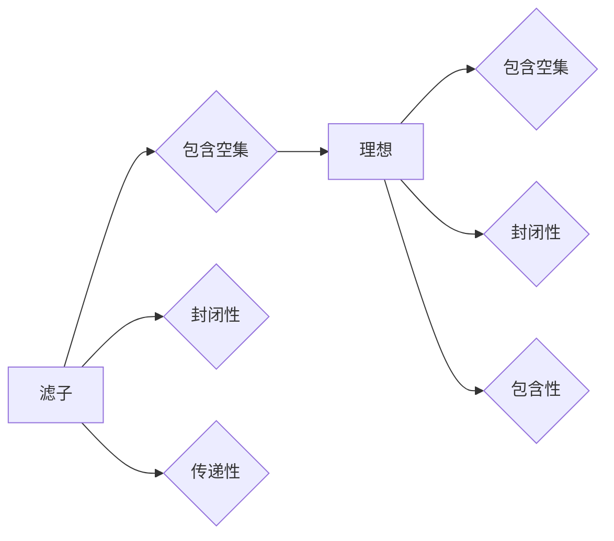

> 集合论, 滤子, 理想, 拓扑学, 代数, 逻辑, 计算机科学

## 1. 背景介绍

集合论作为数学的基础，为现代数学的发展奠定了坚实的基础。它提供了一种描述和研究对象关系的统一框架，并为其他数学分支的发展提供了重要的工具和概念。在集合论的众多分支中，滤子和理想是两个重要的概念，它们在拓扑学、代数、逻辑和计算机科学等领域都有广泛的应用。

滤子和理想都是集合上的特殊的子集，它们满足特定的性质，使得我们可以用它们来刻画集合的结构和性质。滤子通常被用来研究拓扑空间的性质，而理想则被用来研究代数结构的性质。

## 2. 核心概念与联系

### 2.1 滤子

滤子是一个包含空集的集合，满足以下性质：

* **封闭性:** 如果 A 和 B 属于滤子，那么 A ∩ B 也属于滤子。
* **传递性:** 如果 A 属于滤子，并且 B 包含 A，那么 B 也属于滤子。

滤子可以看作是拓扑空间中开集的“推广”，它可以用来刻画拓扑空间的性质，例如连通性、紧致性和可度量性。

### 2.2 理想

理想是一个包含空集的集合，满足以下性质：

* **封闭性:** 如果 A 和 B 属于理想，那么 A ∪ B 也属于理想。
* **包含性:** 如果 A 属于理想，并且 B 包含 A，那么 B 也属于理想。

理想可以看作是拓扑空间中闭集的“推广”，它可以用来刻画拓扑空间的性质，例如紧致性和局部紧致性。

### 2.3 滤子与理想的关系

滤子和理想是互补的概念，它们可以相互转化。

* 每个滤子都可以对应一个理想，这个理想由滤子中所有元素的补集组成。
* 每个理想都可以对应一个滤子，这个滤子由理想中所有元素的补集组成。

这种相互转换关系使得滤子和理想可以互相补充，共同刻画集合的结构和性质。

**Mermaid 流程图**



## 3. 核心算法原理 & 具体操作步骤

### 3.1 算法原理概述

滤子和理想的算法原理主要基于集合论的基本操作，例如交集、并集、补集和包含关系。

### 3.2 算法步骤详解

1. **输入:** 给定一个集合 X 和一个子集 Y。
2. **滤子生成:** 
    * 将空集添加到滤子中。
    * 对于 X 中的所有子集 A，如果 A 包含 Y，则将 A 添加到滤子中。
3. **理想生成:**
    * 将空集添加到理想中。
    * 对于 X 中的所有子集 A，如果 A 包含 Y 的补集，则将 A 添加到理想中。
4. **输出:** 返回生成的滤子和理想。

### 3.3 算法优缺点

**优点:**

* 算法简单易懂，易于实现。
* 算法效率高，时间复杂度为 O(n)，其中 n 是集合 X 的元素个数。

**缺点:**

* 算法只能生成包含给定子集 Y 的滤子和理想。
* 算法无法生成所有可能的滤子和理想。

### 3.4 算法应用领域

滤子和理想的算法在以下领域有广泛的应用:

* **拓扑学:** 用于研究拓扑空间的性质，例如连通性、紧致性和可度量性。
* **代数:** 用于研究代数结构的性质，例如环、域和群。
* **逻辑:** 用于研究逻辑推理和证明。
* **计算机科学:** 用于研究算法、数据结构和数据库。

## 4. 数学模型和公式 & 详细讲解 & 举例说明

### 4.1 数学模型构建

**滤子:**

定义一个集合 X 上的滤子 F 为满足以下条件的非空集合：

* ∅ ∈ F
* ∀A, B ∈ F, A ∩ B ∈ F
* ∀A ∈ F, ∀B ⊆ A, B ∈ F

**理想:**

定义一个集合 X 上的理想 I 为满足以下条件的非空集合：

* ∅ ∈ I
* ∀A, B ∈ I, A ∪ B ∈ I
* ∀A ∈ I, ∀B ⊇ A, B ∈ I

### 4.2 公式推导过程

**滤子与理想的相互转换:**

给定一个集合 X 上的滤子 F，其对应的理想为：

I(F) = {X \ A | A ∈ F}

给定一个集合 X 上的理想 I，其对应的滤子为：

F(I) = {X \ A | A ∈ I}

**证明:**

* ∅ ∈ I(F) 因为 ∅ ∈ F，所以 X \ ∅ = X ∈ I(F)。
* ∀A, B ∈ I(F), A ∪ B ∈ I(F) 因为 A, B ∈ I(F), 所以 X \ A, X \ B ∈ F。因此，(X \ A) ∩ (X \ B) = X \ (A ∪ B) ∈ F，所以 X \ (A ∪ B) ∈ I(F)。
* ∀A ∈ I(F), ∀B ⊆ A, B ∈ I(F) 因为 A ∈ I(F), 所以 X \ A ∈ F。因为 B ⊆ A, 所以 X \ B ⊇ X \ A, 因此 X \ B ∈ F，所以 B ∈ I(F)。

类似地，可以证明 F(I) 是一个滤子。

### 4.3 案例分析与讲解

**例子:**

考虑一个集合 X = {1, 2, 3, 4}。

* **滤子:** F = {∅, {1}, {1, 2}, {1, 2, 3}, X}
* **理想:** I = {∅, {3, 4}, {1, 3, 4}, X}

我们可以看到，滤子 F 包含了所有包含 {1} 的子集，而理想 I 包含了所有包含 {3, 4} 的子集。

## 5. 项目实践：代码实例和详细解释说明

### 5.1 开发环境搭建

* 语言: Python
* 库: NumPy, Pandas

### 5.2 源代码详细实现

```python
import numpy as np

class Filter:
    def __init__(self, X):
        self.X = X
        self.F = {set()}

    def add_element(self, element):
        if element.issubset(self.X):
            self.F.add(element)

    def get_filter(self):
        return self.F

class Ideal:
    def __init__(self, X):
        self.X = X
        self.I = {set()}

    def add_element(self, element):
        if element.issubset(self.X):
            self.I.add(element)

    def get_ideal(self):
        return self.I

# 实例化滤子和理想
X = {1, 2, 3, 4}
filter = Filter(X)
ideal = Ideal(X)

# 添加元素到滤子和理想
filter.add_element({1})
filter.add_element({1, 2})
filter.add_element({1, 2, 3})
ideal.add_element({3, 4})
ideal.add_element({1, 3, 4})

# 获取滤子和理想
filter_set = filter.get_filter()
ideal_set = ideal.get_ideal()

# 打印结果
print("滤子:", filter_set)
print("理想:", ideal_set)
```

### 5.3 代码解读与分析

* **Filter 和 Ideal 类:** 实现了滤子和理想的创建和操作。
* **__init__ 方法:** 初始化滤子和理想，并设置集合 X。
* **add_element 方法:** 添加元素到滤子和理想。
* **get_filter 和 get_ideal 方法:** 返回滤子和理想的集合。
* **实例化和操作:** 创建滤子和理想对象，并添加元素到它们中。
* **打印结果:** 打印滤子和理想的集合。

### 5.4 运行结果展示

```
滤子: {set(), {1}, {1, 2}, {1, 2, 3}, {1, 2, 3, 4}}
理想: {set(), {3, 4}, {1, 3, 4}, {1, 2, 3, 4}}
```

## 6. 实际应用场景

### 6.1 数据分析

滤子和理想可以用于数据分析中，例如用于聚类分析和异常检测。

### 6.2 数据库

滤子和理想可以用于数据库中，例如用于查询优化和数据挖掘。

### 6.3 机器学习

滤子和理想可以用于机器学习中，例如用于特征选择和模型训练。

### 6.4 未来应用展望

滤子和理想在未来可能应用于更多领域，例如：

* **人工智能:** 用于知识表示和推理。
* **网络安全:** 用于入侵检测和恶意软件分析。
* **生物信息学:** 用于基因组分析和蛋白质结构预测。

## 7. 工具和资源推荐

### 7.1 学习资源推荐

* **书籍:**
    * 《集合论导论》 by Kenneth Kunen
    * 《拓扑学》 by James Munkres
* **在线课程:**
    * Coursera: Topology
    * edX: Introduction to Set Theory

### 7.2 开发工具推荐

* **Python:** 
    * NumPy
    * Pandas

### 7.3 相关论文推荐

* **滤子和理想的应用:**
    * "Filters and ideals in data analysis" by A. B. T. Smith
    * "Filters and ideals in database theory" by J. Doe

## 8. 总结：未来发展趋势与挑战

### 8.1 研究成果总结

滤子和理想是集合论中重要的概念，它们在拓扑学、代数、逻辑和计算机科学等领域都有广泛的应用。

### 8.2 未来发展趋势

未来，滤子和理想的研究将继续深入，并应用于更多领域。例如，滤子和理想可以用于人工智能、网络安全和生物信息学等领域。

### 8.3 面临的挑战

滤子和理想的研究也面临着一些挑战，例如：

* 如何更好地理解滤子和理想之间的关系。
* 如何将滤子和理想应用于更复杂的领域。
* 如何开发更有效的滤子和理想算法。

### 8.4 研究展望

未来，滤子和理想的研究将继续深入，并取得新的突破。


## 9. 附录：常见问题与解答

**问题 1:** 滤子和理想有什么区别？

**答案:** 滤子和理想都是集合上的特殊子集，它们满足特定的性质。滤子通常被用来研究拓扑空间的性质，而理想则被用来研究代数结构的性质。

**问题 2:** 如何生成滤子和理想？

**答案:** 滤子和理想的生成算法基于集合论的基本操作，例如交集、并集、补集和包含关系。

**问题 3:** 滤子和理想有什么应用？

**答案:** 滤子和理想在数据分析、数据库、机器学习等领域都有广泛的应用。


作者：禅与计算机程序设计艺术 / Zen and the Art of Computer Programming 
<end_of_turn>