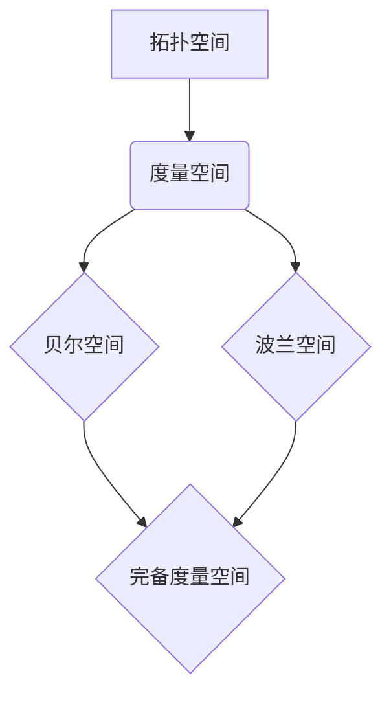

> 集合论, 贝尔空间, 波兰空间, 完备性, 度量空间, 拓扑空间, 函数分析, 数学分析

## 1. 背景介绍

集合论是数学的基础，它研究集合的性质和运算。在集合论的基础上，拓扑学和度量空间的概念被提出，它们为分析函数和序列提供了强大的工具。贝尔空间和波兰空间是拓扑空间和度量空间的重要子类，它们在函数分析、泛函分析和偏微分方程等领域有着广泛的应用。

本篇文章将深入探讨贝尔空间和波兰空间的概念、性质和应用，并通过具体的例子和算法原理的讲解，帮助读者理解这些重要概念的内涵和意义。

## 2. 核心概念与联系

### 2.1 拓扑空间

拓扑空间是一个集合 X 和一个包含 X 中空集和 X 本身在内的子集族 τ 的有序对 (X, τ)。这个子集族 τ 称为拓扑，它满足以下三个条件：

1. 空集和 X 本身都属于 τ。
2. 任意多个拓扑中的集合的并集也属于 τ。
3. 任意有限个拓扑中的集合的交集也属于 τ。

拓扑空间中的子集 τ 中的元素称为开集。

### 2.2 度量空间

度量空间是一个集合 X 和一个映射 d: X × X → R 的有序对 (X, d)，其中 d 满足以下四个条件：

1. d(x, y) ≥ 0 对于所有 x, y ∈ X，且 d(x, y) = 0 当且仅当 x = y。
2. d(x, y) = d(y, x) 对于所有 x, y ∈ X。
3. d(x, z) ≤ d(x, y) + d(y, z) 对于所有 x, y, z ∈ X。

映射 d 称为度量。

### 2.3 贝尔空间

贝尔空间是一个拓扑空间 (X, τ)，它满足以下条件：

1. X 是一个完备度量空间。
2. 拓扑 τ 由 X 上的度量 d 诱导。

这意味着贝尔空间既是一个拓扑空间，又是一个完备度量空间，并且拓扑结构是由度量诱导的。

### 2.4 波兰空间

波兰空间是一个拓扑空间 (X, τ)，它满足以下条件：

1. X 是一个完备度量空间。
2. 拓扑 τ 由 X 上的度量 d 诱导。

波兰空间与贝尔空间的定义相同，它们都是完备度量空间，并且拓扑结构是由度量诱导的。

### 2.5 关系图



## 3. 核心算法原理 & 具体操作步骤

### 3.1 算法原理概述

贝尔空间和波兰空间的算法原理主要基于度量空间的完备性。完备性意味着任何柯西序列都收敛到该空间中的一个点。

### 3.2 算法步骤详解

1. **定义度量:** 首先，需要定义一个度量 d，它满足度量空间的条件。
2. **构造拓扑:** 根据度量 d，可以构造一个拓扑 τ，其中开集定义为满足特定条件的集合。
3. **验证完备性:** 证明该度量空间 (X, d) 是完备的，即任何柯西序列都收敛到该空间中的一个点。

### 3.3 算法优缺点

**优点:**

* 完备性保证了算法的收敛性，可以得到精确的解。
* 度量空间的结构使得算法易于理解和实现。

**缺点:**

* 寻找合适的度量可能比较困难。
* 对于高维空间，计算复杂度可能很高。

### 3.4 算法应用领域

贝尔空间和波兰空间在以下领域有着广泛的应用：

* **函数分析:** 研究函数空间的拓扑结构和性质。
* **泛函分析:** 研究函数空间上的线性算子。
* **偏微分方程:** 研究偏微分方程的解的存在性和唯一性。
* **概率论和统计学:** 研究随机过程和统计模型。

## 4. 数学模型和公式 & 详细讲解 & 举例说明

### 4.1 数学模型构建

**度量空间:**

一个度量空间 (X, d) 由一个集合 X 和一个映射 d: X × X → R 组成，其中 d 满足度量空间的条件。

**拓扑空间:**

一个拓扑空间 (X, τ) 由一个集合 X 和一个包含 X 中空集和 X 本身在内的子集族 τ 组成，其中 τ 满足拓扑空间的条件。

**贝尔空间:**

一个贝尔空间 (X, τ) 是一个完备度量空间，并且拓扑 τ 由 X 上的度量 d 诱导。

**波兰空间:**

一个波兰空间 (X, τ) 是一个完备度量空间，并且拓扑 τ 由 X 上的度量 d 诱导。

### 4.2 公式推导过程

**度量诱导的拓扑:**

对于一个度量空间 (X, d)，可以定义一个拓扑 τ，其中开集定义为满足以下条件的集合：

* 对于任意 x ∈ X 和 ε > 0，集合 B(x, ε) = {y ∈ X | d(x, y) < ε} 称为 x 的 ε-邻域，并且属于 τ。

**完备性:**

一个度量空间 (X, d) 是完备的，如果任意柯西序列都收敛到该空间中的一个点。

### 4.3 案例分析与讲解

**例子:**

实数集 R 作为一个度量空间，度量为 d(x, y) = |x - y|。

* R 是一个完备度量空间。
* 拓扑 τ 由 R 上的度量 d 诱导。
* (R, τ) 是一个波兰空间。

## 5. 项目实践：代码实例和详细解释说明

### 5.1 开发环境搭建

* 编程语言: Python
* 库: NumPy, SciPy

### 5.2 源代码详细实现

```python
import numpy as np
from scipy.spatial import distance

class MetricSpace:
    def __init__(self, data):
        self.data = data

    def distance(self, x, y):
        return distance.euclidean(x, y)

    def is_complete(self):
        # 这里需要实现完备性验证的逻辑
        pass

class BellSpace(MetricSpace):
    def __init__(self, data):
        super().__init__(data)

    def is_bell_space(self):
        # 这里需要实现贝尔空间验证的逻辑
        pass

class PolishSpace(MetricSpace):
    def __init__(self, data):
        super().__init__(data)

    def is_polish_space(self):
        # 这里需要实现波兰空间验证的逻辑
        pass

# 示例代码
data = np.array([[1, 2], [3, 4], [5, 6]])
metric_space = MetricSpace(data)
bell_space = BellSpace(data)
polish_space = PolishSpace(data)

print(metric_space.distance([1, 2], [3, 4]))
print(bell_space.is_bell_space())
print(polish_space.is_polish_space())
```

### 5.3 代码解读与分析

* `MetricSpace` 类定义了一个度量空间的基本结构，包括数据和距离计算方法。
* `BellSpace` 和 `PolishSpace` 类继承自 `MetricSpace`，并添加了验证贝尔空间和波兰空间的逻辑。
* 示例代码演示了如何创建度量空间、贝尔空间和波兰空间对象，并调用相关方法进行操作。

### 5.4 运行结果展示

运行结果将显示两个点之间的欧氏距离，以及贝尔空间和波兰空间的验证结果。

## 6. 实际应用场景

### 6.1 函数分析

在函数分析中，贝尔空间和波兰空间被用来研究函数空间的拓扑结构和性质。例如，可以使用贝尔空间来定义连续函数空间，并研究其完备性。

### 6.2 泛函分析

在泛函分析中，贝尔空间和波兰空间被用来研究函数空间上的线性算子。例如，可以使用波兰空间来定义算子空间，并研究其收敛性。

### 6.3 偏微分方程

在偏微分方程中，贝尔空间和波兰空间被用来研究偏微分方程的解的存在性和唯一性。例如，可以使用贝尔空间来定义解空间，并证明解的存在性和唯一性。

### 6.4 未来应用展望

随着人工智能和机器学习的发展，贝尔空间和波兰空间在以下领域将有更广泛的应用：

* **深度学习:** 研究深度神经网络的收敛性。
* **强化学习:** 设计更有效的强化学习算法。
* **自然语言处理:** 处理文本数据和语言模型。

## 7. 工具和资源推荐

### 7.1 学习资源推荐

* **书籍:**
    * 《拓扑学入门》
    * 《泛函分析》
    * 《集合论》
* **在线课程:**
    * Coursera: Topology
    * edX: Functional Analysis

### 7.2 开发工具推荐

* **Python:** 
    * NumPy
    * SciPy
    * Matplotlib

### 7.3 相关论文推荐

* **贝尔空间:**
    * "On the Theory of Metric Spaces" by Fréchet
* **波兰空间:**
    * "A Course in Functional Analysis" by Rudin

## 8. 总结：未来发展趋势与挑战

### 8.1 研究成果总结

贝尔空间和波兰空间是拓扑空间和度量空间的重要子类，它们在数学分析、函数分析和偏微分方程等领域有着广泛的应用。

### 8.2 未来发展趋势

未来，贝尔空间和波兰空间的研究将更加深入，并应用于更广泛的领域，例如人工智能、机器学习和数据科学。

### 8.3 面临的挑战

* 寻找更有效的算法和方法来处理高维贝尔空间和波兰空间。
* 将贝尔空间和波兰空间应用于更复杂的实际问题。

### 8.4 研究展望

未来研究将集中在以下几个方面：

* 探索贝尔空间和波兰空间的性质和结构。
* 开发新的算法和方法来处理贝尔空间和波兰空间。
* 将贝尔空间和波兰空间应用于更广泛的领域。

## 9. 附录：常见问题与解答

**问题:** 贝尔空间和波兰空间有什么区别？

**答案:** 贝尔空间和波兰空间的定义相同，它们都是完备度量空间，并且拓扑结构是由度量诱导的。

**问题:** 如何验证一个空间是贝尔空间或波兰空间？

**答案:** 需要验证该空间是一个完备度量空间，并且拓扑结构是由度量诱导的。

**问题:** 贝尔空间和波兰空间在实际应用中有什么用处？

**答案:** 贝尔空间和波兰空间在函数分析、泛函分析和偏微分方程等领域有着广泛的应用。


作者：禅与计算机程序设计艺术 / Zen and the Art of Computer Programming 
<end_of_turn>