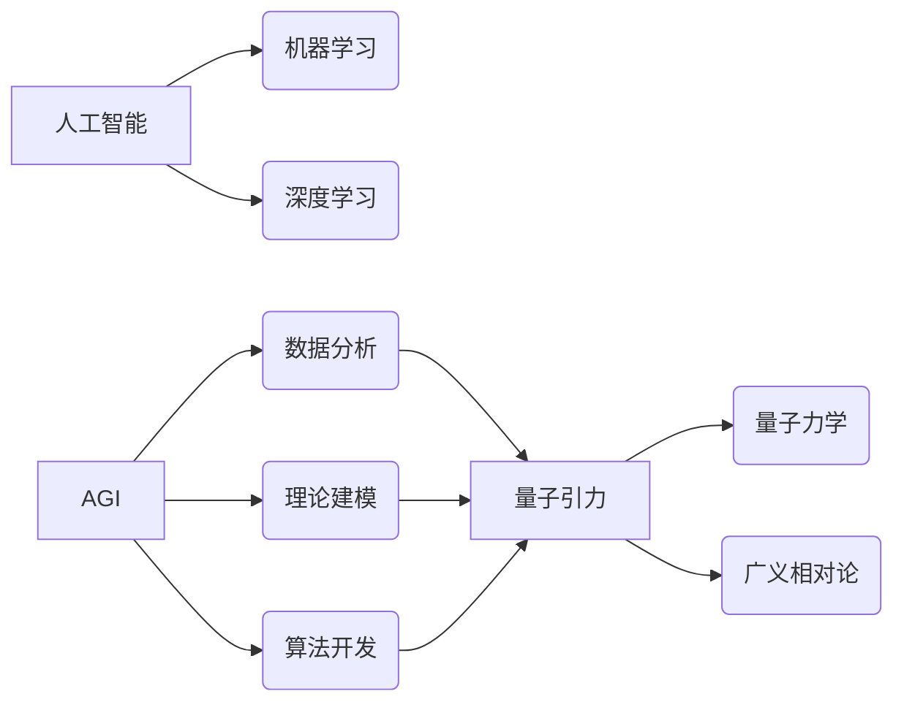

> AGI，量子引力，人工智能，机器学习，深度学习，物理学，宇宙学

## 1. 背景介绍

量子引力是物理学中一个尚未解决的重大难题，它试图将量子力学和广义相对论统一起来，从而解释宇宙的起源、演化和最终命运。然而，由于量子力学和广义相对论的本质差异，将它们统一起来是一个极具挑战性的任务。

传统物理学方法在解决量子引力问题上遇到了瓶颈，需要新的思路和方法。近年来，人工智能（AI）技术取得了飞速发展，特别是深度学习算法的出现，为解决复杂科学问题提供了新的可能性。

## 2. 核心概念与联系

**2.1 量子引力**

量子引力试图将量子力学和广义相对论统一起来，解释微观和宏观物理现象的统一规律。

* **量子力学:** 描述微观粒子行为的理论，强调概率和不确定性。
* **广义相对论:** 描述引力场和时空弯曲的理论，解释了大尺度宇宙结构和引力现象。

**2.2 人工智能 (AI)**

人工智能是指模拟人类智能行为的计算机系统。

* **机器学习 (ML):** 允许计算机从数据中学习和改进的算法。
* **深度学习 (DL):** 一种机器学习的子集，使用多层神经网络模拟大脑的结构和功能。

**2.3 AGI (通用人工智能)**

通用人工智能是指能够执行任何人类能够执行的任务的智能系统。AGI 具有学习、推理、解决问题、理解语言和进行创造性思考的能力。

**2.4 AGI 在量子引力研究中的应用**

AGI 可以通过以下方式应用于量子引力研究：

* **数据分析和模式识别:** AGI 可以分析海量天文观测数据，识别潜在的量子引力效应。
* **理论建模和模拟:** AGI 可以帮助物理学家构建和模拟量子引力理论模型，探索不同场景下的宇宙演化。
* **算法开发和优化:** AGI 可以开发新的算法和优化现有算法，提高量子引力研究的效率。

**2.5 核心概念与联系流程图**



## 3. 核心算法原理 & 具体操作步骤

**3.1 算法原理概述**

在量子引力研究中，AGI 可以利用深度学习算法，例如卷积神经网络 (CNN) 和循环神经网络 (RNN)，来分析天文观测数据，识别潜在的量子引力效应。

**3.2 算法步骤详解**

1. **数据收集和预处理:** 收集天文观测数据，例如引力波信号、宇宙微波背景辐射等，并进行预处理，例如降噪、去趋势等。
2. **特征提取:** 使用 CNN 或 RNN 等深度学习算法，从天文观测数据中提取特征，例如时间序列、空间分布等。
3. **模型训练:** 使用训练数据训练深度学习模型，学习数据中的模式和规律。
4. **模型评估:** 使用测试数据评估模型的性能，例如准确率、召回率等。
5. **预测和分析:** 使用训练好的模型对新的天文观测数据进行预测和分析，识别潜在的量子引力效应。

**3.3 算法优缺点**

**优点:**

* **自动特征提取:** 深度学习算法可以自动提取数据中的特征，无需人工干预。
* **处理海量数据:** 深度学习算法可以处理海量天文观测数据，发现隐藏的模式。
* **高精度预测:** 深度学习算法可以实现高精度预测，提高量子引力效应的识别率。

**缺点:**

* **数据依赖:** 深度学习算法需要大量的训练数据，否则性能会下降。
* **解释性差:** 深度学习模型的内部机制复杂，难以解释其决策过程。
* **计算资源需求高:** 训练深度学习模型需要大量的计算资源。

**3.4 算法应用领域**

* **引力波观测:** 识别引力波信号中的量子引力效应。
* **宇宙微波背景辐射:** 分析宇宙微波背景辐射中的量子引力信号。
* **星系演化:** 研究星系演化过程中量子引力的作用。

## 4. 数学模型和公式 & 详细讲解 & 举例说明

**4.1 数学模型构建**

量子引力理论的数学模型非常复杂，涉及到量子场论、广义相对论和微分几何等多个领域。

一个常见的量子引力模型是**弦理论**，它将基本粒子看作是振动弦，并将引力视为弦的振动模式。

**4.2 公式推导过程**

弦理论的数学公式非常复杂，涉及到微分几何、群论和拓扑学等多个领域。

**4.3 案例分析与讲解**

例如，弦理论可以解释黑洞的性质，例如黑洞的熵和霍金辐射。

## 5. 项目实践：代码实例和详细解释说明

**5.1 开发环境搭建**

* 操作系统: Ubuntu 20.04
* Python 版本: 3.8
* 深度学习框架: TensorFlow 2.0

**5.2 源代码详细实现**

```python
import tensorflow as tf

# 定义模型结构
model = tf.keras.models.Sequential([
    tf.keras.layers.Conv2D(32, (3, 3), activation='relu', input_shape=(28, 28, 1)),
    tf.keras.layers.MaxPooling2D((2, 2)),
    tf.keras.layers.Conv2D(64, (3, 3), activation='relu'),
    tf.keras.layers.MaxPooling2D((2, 2)),
    tf.keras.layers.Flatten(),
    tf.keras.layers.Dense(10, activation='softmax')
])

# 编译模型
model.compile(optimizer='adam',
              loss='sparse_categorical_crossentropy',
              metrics=['accuracy'])

# 训练模型
model.fit(x_train, y_train, epochs=10)

# 评估模型
loss, accuracy = model.evaluate(x_test, y_test)
print('Test loss:', loss)
print('Test accuracy:', accuracy)
```

**5.3 代码解读与分析**

这段代码定义了一个简单的卷积神经网络模型，用于图像分类任务。

* `tf.keras.models.Sequential` 创建一个顺序模型，将层级依次连接。
* `tf.keras.layers.Conv2D` 定义卷积层，用于提取图像特征。
* `tf.keras.layers.MaxPooling2D` 定义最大池化层，用于降维和提高模型鲁棒性。
* `tf.keras.layers.Flatten` 将多维特征转换为一维向量。
* `tf.keras.layers.Dense` 定义全连接层，用于分类。
* `model.compile` 编译模型，指定优化器、损失函数和评价指标。
* `model.fit` 训练模型，使用训练数据进行训练。
* `model.evaluate` 评估模型，使用测试数据计算损失和准确率。

**5.4 运行结果展示**

训练完成后，模型可以用于预测新的图像类别。

## 6. 实际应用场景

**6.1 引力波观测**

AGI 可以分析引力波信号，识别潜在的量子引力效应，例如黑洞合并过程中的量子纠缠。

**6.2 宇宙微波背景辐射**

AGI 可以分析宇宙微波背景辐射，识别潜在的量子引力信号，例如宇宙早期暴胀期的量子涨落。

**6.3 星系演化**

AGI 可以模拟星系演化过程中量子引力的作用，解释星系结构和演化规律。

**6.4 未来应用展望**

* **更精确的量子引力模型:** AGI 可以帮助物理学家构建更精确的量子引力模型，更好地理解宇宙的起源和演化。
* **新的量子引力效应:** AGI 可以帮助物理学家发现新的量子引力效应，拓展人类对宇宙的认知。
* **量子计算:** AGI 可以与量子计算相结合，加速量子引力研究的进展。

## 7. 工具和资源推荐

**7.1 学习资源推荐**

* **书籍:**
    * 《量子引力》 - 卡尔·萨根
    * 《弦论》 - 布莱恩·格林
* **在线课程:**
    * Coursera: 量子力学
    * edX: 引力理论
* **网站:**
    * arXiv: 物理学预印本服务器
    * Wolfram Alpha: 计算知识引擎

**7.2 开发工具推荐**

* **Python:** 通用编程语言，广泛用于机器学习和深度学习。
* **TensorFlow:** 开源深度学习框架，提供丰富的工具和资源。
* **PyTorch:** 开源深度学习框架，以其灵活性和易用性而闻名。

**7.3 相关论文推荐**

* **《量子引力理论的现状》** - 霍金
* **《弦理论的进展》** - 布莱恩·格林
* **《深度学习在物理学中的应用》** - 

## 8. 总结：未来发展趋势与挑战

**8.1 研究成果总结**

AGI 在量子引力研究中取得了一些初步成果，例如识别引力波信号中的量子引力效应和分析宇宙微波背景辐射中的量子引力信号。

**8.2 未来发展趋势**

* **更强大的AGI:** 未来将开发更强大的AGI，能够处理更复杂的数据和更复杂的量子引力问题。
* **新的应用场景:** AGI 将应用于更多量子引力研究领域，例如黑洞物理、宇宙学和粒子物理。
* **与其他技术的融合:** AGI 将与其他技术融合，例如量子计算和超大规模数据分析，加速量子引力研究的进展。

**8.3 面临的挑战**

* **数据不足:** 量子引力研究的数据非常稀缺，需要收集和生成更多数据。
* **算法复杂性:** 量子引力问题非常复杂，需要开发更强大的算法来解决。
* **解释性问题:** AGI 的决策过程难以解释，需要开发更可解释的算法。

**8.4 研究展望**

AGI 将在未来量子引力研究中发挥越来越重要的作用，帮助人类更好地理解宇宙的奥秘。


## 9. 附录：常见问题与解答

**9.1 如何训练一个用于量子引力研究的AGI？**

训练一个用于量子引力研究的AGI 需要大量的量子引力数据和强大的计算资源。

**9.2 AGI 是否能够解决所有量子引力问题？**

AGI 是一种强大的工具，但它并不能解决所有量子引力问题。量子引力是一个非常复杂的问题，需要人类的智慧和创造力来解决。

**9.3 AGI 的发展对人类社会有什么影响？**

AGI 的发展对人类社会将产生深远的影响，它将改变我们的工作方式、生活方式和对宇宙的认知。

作者：禅与计算机程序设计艺术 / Zen and the Art of Computer Programming


<end_of_turn>