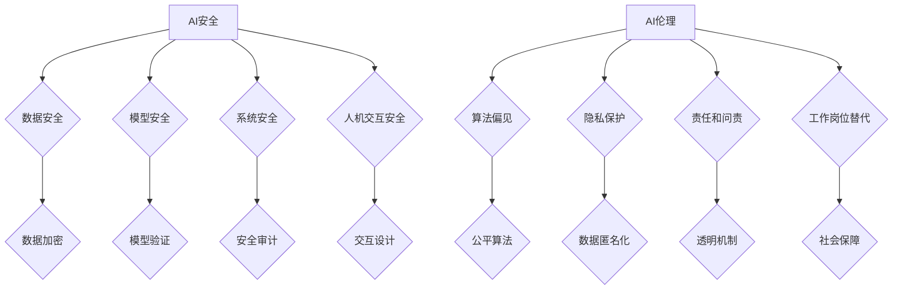

> 人工智能安全，人工智能伦理，机器学习，深度学习，数据隐私，算法偏见，可解释性，监管框架，社会影响

## 1. 背景介绍

人工智能（AI）技术近年来发展迅速，已渗透到各个领域，从医疗保健到金融，从交通运输到娱乐，AI正在改变着我们的生活方式。然而，随着AI技术的进步，也随之带来了新的挑战和机遇，其中AI安全与伦理问题尤为突出。

AI安全是指确保AI系统安全可靠地运行，防止其被恶意利用或造成不可预知的危害。AI伦理则关注AI技术的开发和应用是否符合人类的道德规范和社会价值观。

AI安全与伦理问题并非孤立存在，它们相互关联，共同影响着AI技术的可持续发展。

## 2. 核心概念与联系

**2.1 AI安全**

AI安全涵盖多个方面，包括：

* **数据安全:** 保护AI训练数据和运行数据免受泄露、篡改或攻击。
* **模型安全:** 确保AI模型本身不会被恶意攻击或操纵，其输出结果可靠准确。
* **系统安全:**  防止AI系统被恶意利用，例如进行网络攻击、身份盗窃或操控物理设备。
* **人机交互安全:**  确保AI与人类的交互安全可靠，避免误解或意外后果。

**2.2 AI伦理**

AI伦理涉及以下关键问题：

* **算法偏见:**  AI算法可能由于训练数据中的偏见而产生歧视性结果，加剧社会不平等。
* **隐私保护:**  AI技术可能收集和使用大量个人数据，需要确保数据的隐私和安全。
* **责任和问责:**  当AI系统造成损害时，谁应该承担责任？如何进行问责？
* **工作岗位替代:**  AI自动化可能导致大量工作岗位被取代，需要考虑社会影响和应对措施。

**2.3 AI安全与伦理的联系**

AI安全与伦理相互关联，共同影响着AI技术的可持续发展。

* **安全保障伦理:**  安全的AI系统才能更好地保障人类的利益，避免因安全漏洞导致的伦理问题。
* **伦理约束安全:**  伦理规范可以约束AI技术的开发和应用，避免其被用于违背人类价值观的目的。

**2.4  Mermaid 流程图**



## 3. 核心算法原理 & 具体操作步骤

### 3.1  算法原理概述

**3.1.1  强化学习**

强化学习是一种机器学习方法，它通过奖励和惩罚机制来训练智能体，使其在特定环境中做出最优决策。

**3.1.2  生成对抗网络 (GAN)**

GAN由两个神经网络组成：生成器和鉴别器。生成器试图生成逼真的数据，而鉴别器试图区分真实数据和生成数据。两者相互竞争，最终生成器能够生成与真实数据相似的样本。

**3.1.3  联邦学习**

联邦学习是一种分布式机器学习方法，它允许在不共享原始数据的情况下训练模型。模型参数在各个设备之间进行更新，最终得到一个全局模型。

### 3.2  算法步骤详解

**3.2.1  强化学习**

1.  **环境建模:** 建立一个模拟真实世界的环境，定义状态、动作和奖励函数。
2.  **智能体设计:** 设计一个智能体，它能够感知环境状态并做出动作。
3.  **训练过程:** 智能体在环境中进行交互，根据奖励信号更新其策略，最终学习到最优策略。

**3.2.2  生成对抗网络 (GAN)**

1.  **初始化:** 初始化生成器和鉴别器网络。
2.  **训练循环:**
    *   生成器生成样本数据。
    *   鉴别器对真实数据和生成数据进行分类。
    *   根据鉴别器的反馈，更新生成器和鉴别器的参数。
3.  **输出:** 生成器能够生成逼真的样本数据。

**3.2.3  联邦学习**

1.  **数据分发:** 将数据分散到各个设备上。
2.  **模型训练:** 各个设备在本地训练模型，并更新模型参数。
3.  **参数聚合:** 将各个设备的模型参数聚合到一个全局模型。
4.  **模型更新:** 将全局模型分发到各个设备，重复上述步骤。

### 3.3  算法优缺点

**3.3.1  强化学习**

*   优点: 可以学习复杂的任务，适应动态环境。
*   缺点: 训练过程可能很慢，需要大量的奖励信号。

**3.3.2  生成对抗网络 (GAN)**

*   优点: 可以生成逼真的数据，应用广泛。
*   缺点: 训练过程不稳定，容易出现模式崩溃问题。

**3.3.3  联邦学习**

*   优点: 保护数据隐私，提高数据安全。
*   缺点: 训练速度可能较慢，需要协调多个设备。

### 3.4  算法应用领域

**3.4.1  强化学习**

*   机器人控制
*   游戏 AI
*   推荐系统

**3.4.2  生成对抗网络 (GAN)**

*   图像生成
*   文本生成
*   语音合成

**3.4.3  联邦学习**

*   医疗数据分析
*   金融风险评估
*   个性化教育

## 4. 数学模型和公式 & 详细讲解 & 举例说明

### 4.1  数学模型构建

**4.1.1  强化学习**

强化学习模型的核心是价值函数，它估计在给定状态下采取特定动作的长期回报。

*   **状态价值函数:**  $V(s)$ 表示状态 $s$ 的价值。
*   **动作价值函数:** $Q(s,a)$ 表示在状态 $s$ 下采取动作 $a$ 的价值。

**4.1.2  生成对抗网络 (GAN)**

GAN模型由两个神经网络组成：生成器 $G$ 和鉴别器 $D$。

*   **生成器:** $G(z)$ 将随机噪声 $z$ 映射到数据样本 $x$。
*   **鉴别器:** $D(x)$ 将数据样本 $x$ 映射到一个概率值，表示 $x$ 是真实数据还是生成数据。

**4.1.3  联邦学习**

联邦学习模型训练过程可以看作是一个参数更新迭代的过程。

*   **本地训练:** 各个设备在本地训练模型，更新模型参数。
*   **参数聚合:** 将各个设备的模型参数聚合到一个全局模型。

### 4.2  公式推导过程

**4.2.1  强化学习**

强化学习算法的目标是最大化长期回报。常用的算法包括Q-learning和SARSA。

*   **Q-learning:** $Q(s,a) \leftarrow Q(s,a) + \alpha [r + \gamma \max_{a'} Q(s',a') - Q(s,a)]$

**4.2.2  生成对抗网络 (GAN)**

GAN模型的训练目标是使生成器生成逼真的数据，使鉴别器能够区分真实数据和生成数据。

*   **生成器损失函数:** $L_G = E_{z} [log(1-D(G(z)))]$
*   **鉴别器损失函数:** $L_D = E_{x} [log(D(x))] + E_{z} [log(1-D(G(z)))]$

**4.2.3  联邦学习**

联邦学习的模型更新过程通常使用平均聚合方法。

*   **全局模型更新:** $w_{global} \leftarrow \frac{1}{N} \sum_{i=1}^{N} w_{i}$

### 4.3  案例分析与讲解

**4.3.1  强化学习**

AlphaGo是DeepMind开发的围棋AI，它利用强化学习算法战胜了世界冠军围棋手。

**4.3.2  生成对抗网络 (GAN)**

StyleGAN可以生成逼真的人脸图像，并可以控制图像的风格和特征。

**4.3.3  联邦学习**

Google使用联邦学习技术训练语音识别模型，保护用户语音数据隐私。

## 5. 项目实践：代码实例和详细解释说明

### 5.1  开发环境搭建

*   操作系统: Ubuntu 20.04
*   编程语言: Python 3.8
*   深度学习框架: TensorFlow 2.0

### 5.2  源代码详细实现

```python
# 强化学习示例代码

import tensorflow as tf

# 定义状态空间和动作空间
state_size = 10
action_size = 5

# 定义Q网络
model = tf.keras.Sequential([
    tf.keras.layers.Dense(64, activation='relu', input_shape=(state_size,)),
    tf.keras.layers.Dense(action_size)
])

# 定义损失函数和优化器
loss_fn = tf.keras.losses.MeanSquaredError()
optimizer = tf.keras.optimizers.Adam(learning_rate=0.001)

# 训练循环
for episode in range(1000):
    state = env.reset()
    done = False
    while not done:
        # 选择动作
        action = tf.argmax(model(state)).numpy()
        # 执行动作并获取奖励和下一个状态
        next_state, reward, done, _ = env.step(action)
        # 更新Q网络
        with tf.GradientTape() as tape:
            target_q = reward + 0.99 * tf.reduce_max(model(next_state))
            q_value = model(state)[action]
            loss = loss_fn(target_q, q_value)
        gradients = tape.gradient(loss, model.trainable_variables)
        optimizer.apply_gradients(zip(gradients, model.trainable_variables))
        state = next_state

```

### 5.3  代码解读与分析

*   代码首先定义了状态空间、动作空间、Q网络结构、损失函数和优化器。
*   然后，代码实现了一个训练循环，在每个episode中，智能体与环境交互，根据奖励信号更新Q网络参数。
*   代码使用TensorFlow框架实现，并利用了自动微分功能，简化了梯度计算过程。

### 5.4  运行结果展示

训练完成后，可以评估Q网络的性能，例如通过测试集上的平均回报来衡量。

## 6. 实际应用场景

### 6.1  医疗保健

*   **疾病诊断:** AI可以分析患者的医疗影像数据，辅助医生进行疾病诊断。
*   **个性化治疗:** AI可以根据患者的基因信息和病史，推荐个性化的治疗方案。
*   **药物研发:** AI可以加速药物研发过程，例如预测药物的有效性和安全性。

### 6.2  金融

*   **欺诈检测:** AI可以分析交易数据，识别潜在的欺诈行为。
*   **风险评估:** AI可以评估投资风险，帮助投资者做出更明智的决策。
*   **个性化金融服务:** AI可以根据用户的财务状况和需求，提供个性化的金融服务。

### 6.3  交通运输

*   **自动驾驶:** AI可以控制自动驾驶汽车，提高道路安全