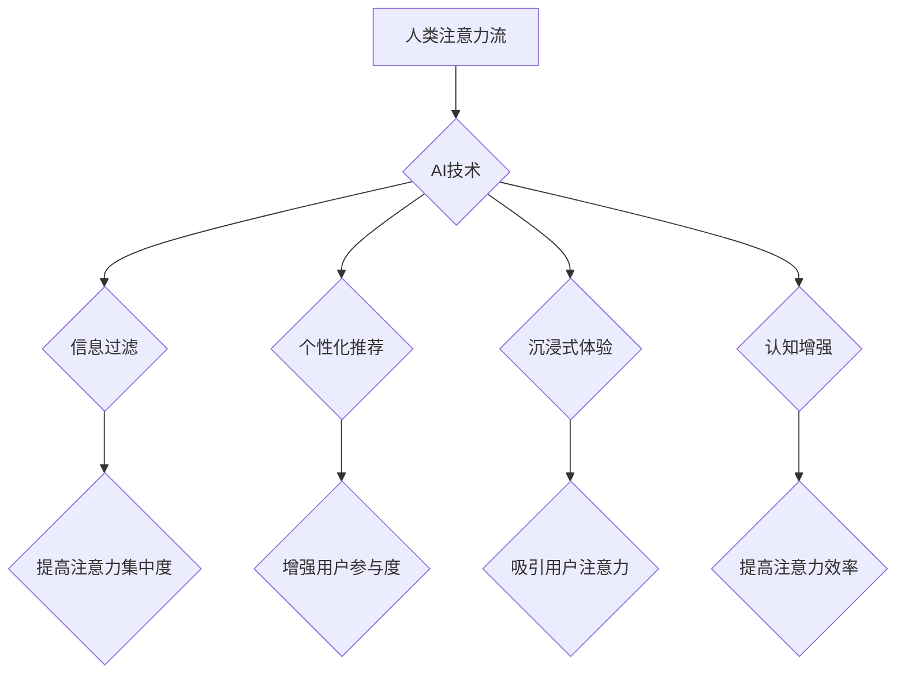

> 人工智能，注意力流，深度学习，认知科学，工作模式，道德伦理，未来趋势

## 1. 背景介绍

在信息爆炸的时代，人类的注意力资源变得越来越稀缺。我们每天被来自各种渠道的信息轰炸，从社交媒体的通知到电子邮件的提醒，从新闻网站的推送到广告的广告，无处不在的干扰让我们难以集中精力完成任务。与此同时，人工智能（AI）技术飞速发展，其强大的计算能力和学习能力正在深刻地改变着我们的生活和工作方式。

AI技术在许多领域取得了突破性进展，例如图像识别、自然语言处理、机器翻译等。这些技术不仅提高了工作效率，也为我们带来了新的可能性。然而，AI技术的快速发展也引发了一些新的问题和挑战，其中之一就是AI与人类注意力流之间的关系。

## 2. 核心概念与联系

**2.1 人类注意力流**

人类注意力流是指我们对信息进行选择性感知、加工和记忆的过程。它是一个复杂的心理过程，受多种因素影响，例如个体差异、环境刺激、任务要求等。注意力流可以分为以下几个阶段：

* **选择性注意:** 从众多信息中选择关注特定信息。
* **集中注意:** 将注意力集中在特定信息上，排除干扰。
* **分配注意:** 将注意力分配到多个任务或信息上。
* **转换注意:** 在不同任务或信息之间快速切换注意力。

**2.2 AI对注意力流的影响**

AI技术可以通过以下方式影响人类注意力流：

* **信息过滤:** AI算法可以根据用户的兴趣和偏好过滤信息，减少信息过载，提高注意力集中度。
* **个性化推荐:** AI算法可以根据用户的行为数据推荐个性化内容，增强用户参与度和注意力。
* **沉浸式体验:** AI技术可以创造沉浸式体验，例如虚拟现实和增强现实，吸引用户的注意力。
* **认知增强:** AI技术可以辅助人类完成认知任务，例如记忆、学习和决策，提高注意力效率。

**2.3 AI与注意力流的交互关系**

AI技术与人类注意力流之间存在着复杂的交互关系。一方面，AI技术可以帮助我们更好地管理注意力，提高注意力效率。另一方面，过度依赖AI技术也可能导致注意力分散、认知能力下降等问题。

**Mermaid 流程图**



## 3. 核心算法原理 & 具体操作步骤

**3.1 算法原理概述**

注意力机制是深度学习领域的一种重要技术，它能够模拟人类的注意力机制，学习到输入数据中最重要的信息。注意力机制的核心思想是通过一个“注意力权重”来分配不同输入元素的关注度，从而提高模型对重要信息的学习能力。

**3.2 算法步骤详解**

1. **计算注意力权重:** 对于输入序列中的每个元素，计算与目标元素之间的相关性，得到一个注意力权重。
2. **加权求和:** 将注意力权重与输入序列元素相乘，得到加权后的输入序列。
3. **输出结果:** 将加权后的输入序列作为模型的输入，进行后续的处理，例如分类、预测等。

**3.3 算法优缺点**

**优点:**

* 能够学习到输入数据中最重要的信息。
* 能够处理长序列数据。
* 能够提高模型的准确率和鲁棒性。

**缺点:**

* 计算复杂度较高。
* 需要大量的训练数据。
* 难以解释注意力权重。

**3.4 算法应用领域**

注意力机制在许多领域都有广泛的应用，例如：

* **自然语言处理:** 机器翻译、文本摘要、问答系统等。
* **计算机视觉:** 图像识别、目标检测、图像分割等。
* **语音识别:** 语音转文本、语音合成等。

## 4. 数学模型和公式 & 详细讲解 & 举例说明

**4.1 数学模型构建**

假设我们有一个输入序列 X = {x1, x2, ..., xn}，目标是学习到每个元素 x_i 对目标任务的重要性。我们可以使用以下数学模型来计算注意力权重：

```latex
a_{i} = \frac{exp(e_{i})}{\sum_{j=1}^{n} exp(e_{j})}
```

其中，e_i 是每个元素 x_i 与目标元素之间的相关性得分，可以由一个神经网络计算得到。

**4.2 公式推导过程**

注意力权重 a_i 的计算过程可以理解为一个归一化过程。

* 首先，计算每个元素 x_i 与目标元素之间的相关性得分 e_i。
* 然后，将所有元素的相关性得分进行指数化处理，得到一个概率分布。
* 最后，将概率分布进行归一化，得到每个元素的注意力权重 a_i。

**4.3 案例分析与讲解**

例如，在机器翻译任务中，输入序列是源语言文本，目标是翻译成目标语言文本。我们可以使用注意力机制来学习到源语言文本中每个词语对目标语言文本的影响程度。

## 5. 项目实践：代码实例和详细解释说明

**5.1 开发环境搭建**

* Python 3.6+
* TensorFlow 2.0+
* PyTorch 1.0+

**5.2 源代码详细实现**

```python
import tensorflow as tf

# 定义注意力机制
def attention_layer(inputs, query, key, value):
    # 计算注意力权重
    scores = tf.matmul(query, key, transpose_b=True)
    scores = scores / tf.math.sqrt(tf.cast(key.shape[-1], tf.float32))
    attention_weights = tf.nn.softmax(scores, axis=-1)
    # 加权求和
    context_vector = tf.matmul(attention_weights, value)
    return context_vector

# 示例代码
# 输入序列
inputs = tf.random.normal((10, 5, 128))
# 查询向量
query = tf.random.normal((10, 5, 64))
# 键向量
key = tf.random.normal((10, 5, 64))
# 值向量
value = tf.random.normal((10, 5, 128))
# 计算注意力输出
output = attention_layer(inputs, query, key, value)
print(output.shape)
```

**5.3 代码解读与分析**

* `attention_layer()` 函数实现了注意力机制的核心逻辑。
* `scores` 计算了每个元素 x_i 与目标元素之间的相关性得分。
* `attention_weights` 是每个元素的注意力权重。
* `context_vector` 是加权后的输入序列。

**5.4 运行结果展示**

运行上述代码，输出结果为 `(10, 5, 128)`，表示注意力机制将输入序列中的每个元素进行了加权求和，得到一个新的输出序列。

## 6. 实际应用场景

**6.1 个性化推荐系统**

AI技术可以分析用户的行为数据，例如浏览历史、购买记录、点赞行为等，学习到用户的兴趣偏好，并根据用户的兴趣推荐个性化的商品、内容或服务。

**6.2 智能客服系统**

AI技术可以训练一个智能客服系统，能够理解用户的自然语言输入，并提供准确、及时、个性化的服务。

**6.3 教育领域**

AI技术可以个性化学习路径，根据学生的学习进度和能力提供定制化的学习内容和练习题，提高学习效率。

**6.4 未来应用展望**

随着AI技术的不断发展，其与人类注意力流之间的交互关系将更加紧密。未来，AI技术可能能够帮助我们更好地理解和管理注意力，提高工作效率和生活质量。

## 7. 工具和资源推荐

**7.1 学习资源推荐**

* **书籍:**
    * 《深度学习》
    * 《Attention Is All You Need》
* **在线课程:**
    * Coursera: 深度学习
    * Udacity: 自然语言处理

**7.2 开发工具推荐**

* **TensorFlow:** 开源深度学习框架
* **PyTorch:** 开源深度学习框架
* **HuggingFace:** 自然语言处理模型库

**7.3 相关论文推荐**

* 《Attention Is All You Need》
* 《BERT: Pre-training of Deep Bidirectional Transformers for Language Understanding》

## 8. 总结：未来发展趋势与挑战

**8.1 研究成果总结**

近年来，AI技术在注意力机制方面的研究取得了显著进展，例如Transformer模型的提出，以及注意力机制在自然语言处理、计算机视觉等领域的广泛应用。

**8.2 未来发展趋势**

未来，注意力机制的研究将朝着以下几个方向发展：

* **更有效的注意力机制:** 设计更有效的注意力机制，提高模型的效率和准确率。
* **可解释性更高的注意力机制:** 研究注意力机制的内部机制，提高模型的可解释性。
* **跨模态注意力机制:** 研究跨模态注意力机制，例如图像和文本的联合学习。

**8.3 面临的挑战**

注意力机制的研究也面临着一些挑战：

* **计算复杂度:** 传统的注意力机制计算复杂度较高，难以处理大规模数据。
* **数据依赖性:** 注意力机制需要大量的训练数据，难以在数据稀缺的情况下应用。
* **伦理问题:** 注意力机制可能被用于操纵用户行为，需要关注其伦理问题。

**8.4 研究展望**

尽管面临着挑战，但注意力机制的研究前景广阔。相信随着技术的不断发展，注意力机制将发挥更大的作用，为人类社会带来更多福祉。

## 9. 附录：常见问题与解答

**9.1 如何选择合适的注意力机制？**

选择合适的注意力机制需要根据具体的应用场景和数据特点进行选择。例如，对于文本序列数据，可以使用Transformer模型中的自注意力机制；对于图像数据，可以使用空间注意力机制。

**9.2 如何解释注意力权重？**

注意力权重反映了模型对输入元素的关注程度。可以通过可视化注意力权重来理解模型的决策过程。

**9.3 注意力机制的伦理问题有哪些？**

注意力机制可能被用于操纵用户行为，例如通过个性化推荐系统引导用户购买特定商品。因此，需要关注注意力机制的伦理问题，确保其应用安全和可控。


作者：禅与计算机程序设计艺术 / Zen and the Art of Computer Programming 
<end_of_turn>