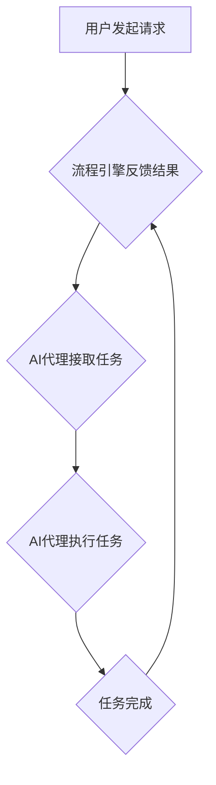

> AI代理，工作流，自动化，智能化，流程引擎，机器学习，自然语言处理

## 1. 背景介绍

在当今数据爆炸和智能化浪潮席卷的时代，人工智能（AI）正以惊人的速度发展，并深刻地改变着我们生活的方方面面。其中，AI代理作为一种新型的智能化应用，凭借其强大的自动化和智能化能力，在各个领域展现出巨大的潜力。

AI代理是指能够自主执行任务、与环境交互、学习和适应的智能软件实体。它可以理解人类的指令，并根据预设规则或学习到的知识，自动完成各种复杂的任务，例如：

* **客户服务：** 自动回复客户咨询，提供个性化服务。
* **业务流程自动化：** 自动化重复性任务，提高工作效率。
* **数据分析：** 自动收集、分析和处理数据，发现隐藏的模式和趋势。
* **决策支持：** 提供数据驱动的决策建议，辅助人类决策。

然而，构建高效的AI代理并非易事。它需要解决一系列技术挑战，例如：

* **任务建模：** 如何将复杂的任务分解成可执行的步骤，并构建清晰的流程图。
* **知识表示：** 如何将人类知识和经验以机器可理解的形式表示出来。
* **决策推理：** 如何让AI代理能够根据上下文信息和知识库做出合理的决策。
* **环境交互：** 如何让AI代理能够与外部系统和环境进行有效交互。

## 2. 核心概念与联系

AI代理工作流（AI Agent Workflow）是构建高效AI代理的关键技术之一。它提供了一种结构化和可扩展的方式，来定义、管理和执行AI代理的任务流程。

**核心概念：**

* **AI代理（AI Agent）：** 能够自主执行任务、与环境交互、学习和适应的智能软件实体。
* **工作流（Workflow）：** 一系列有序的步骤或任务，用于完成一个特定的目标。
* **流程引擎（Workflow Engine）：** 用于执行和管理工作流的软件系统。

**联系：**

AI代理工作流将AI代理与工作流引擎结合起来，形成一个完整的智能化工作流程系统。AI代理负责执行工作流中的任务，而流程引擎负责管理和协调AI代理的工作。

**Mermaid 流程图：**



## 3. 核心算法原理 & 具体操作步骤

### 3.1  算法原理概述

AI代理工作流的实现依赖于多种算法和技术，例如：

* **状态机：** 用于描述AI代理的状态和状态转换规则。
* **决策树：** 用于表示决策规则和条件分支。
* **机器学习：** 用于训练AI代理，使其能够学习和适应环境。
* **自然语言处理：** 用于理解和处理人类语言指令。

### 3.2  算法步骤详解

构建AI代理工作流的具体步骤如下：

1. **任务分析：** 首先需要对需要自动化执行的任务进行详细分析，明确任务的目标、步骤和输入/输出。
2. **流程设计：** 根据任务分析结果，设计一个清晰的流程图，定义AI代理需要执行的步骤和顺序。
3. **知识建模：** 将人类知识和经验以机器可理解的形式表示出来，例如规则库、知识图谱等。
4. **AI代理开发：** 开发AI代理，并根据流程图和知识库实现任务执行逻辑。
5. **流程引擎集成：** 将AI代理集成到流程引擎中，并配置工作流参数。
6. **测试和部署：** 对AI代理工作流进行测试和调试，确保其能够正常运行。然后将工作流部署到生产环境中。

### 3.3  算法优缺点

**优点：**

* **自动化：** 可以自动执行重复性任务，提高工作效率。
* **智能化：** 可以根据上下文信息和知识库做出合理的决策。
* **可扩展性：** 可以轻松地添加新的任务和功能。

**缺点：**

* **复杂性：** 构建复杂的AI代理工作流需要专业的技术知识和经验。
* **维护成本：** 需要定期维护和更新AI代理和工作流引擎。
* **安全风险：** AI代理可能存在安全漏洞，需要采取相应的安全措施。

### 3.4  算法应用领域

AI代理工作流在各个领域都有广泛的应用，例如：

* **金融：** 自动化贷款审批、风险评估等任务。
* **医疗：** 自动化病历分析、诊断辅助等任务。
* **制造业：** 自动化生产流程、设备维护等任务。
* **电商：** 自动化客户服务、商品推荐等任务。

## 4. 数学模型和公式 & 详细讲解 & 举例说明

### 4.1  数学模型构建

AI代理工作流可以抽象为一个状态机模型，其中每个状态代表AI代理执行任务的不同阶段，状态之间的转换由条件和事件触发。

**状态机模型：**

```
状态集合：S = {s0, s1, s2, ..., sn}
事件集合：E = {e1, e2, ..., em}
转换函数：δ: S × E → S
初始状态：s0
终止状态：sn
```

其中：

* S：状态集合
* E：事件集合
* δ：转换函数，描述状态之间的转换规则
* s0：初始状态
* sn：终止状态

### 4.2  公式推导过程

状态转换的公式可以表示为：

```
s' = δ(s, e)
```

其中：

* s'：新的状态
* s：当前状态
* e：触发转换的事件

### 4.3  案例分析与讲解

例如，一个简单的AI代理工作流用于处理客户咨询，状态机模型如下：

* 状态集合：S = {等待咨询、接收咨询、分析咨询、回复咨询、结束咨询}
* 事件集合：E = {收到咨询、分析完成、回复发送}
* 转换函数：δ(s, e)

根据事件和当前状态，AI代理会进行相应的状态转换。例如，当收到咨询事件时，AI代理会从等待咨询状态转换到接收咨询状态。

## 5. 项目实践：代码实例和详细解释说明

### 5.1  开发环境搭建

* 操作系统：Linux/macOS/Windows
* Python版本：3.7+
* 依赖库：

    * Flask：用于构建Web应用
    * SQLAlchemy：用于数据库操作
    * Celery：用于任务调度
    * NLTK：用于自然语言处理

### 5.2  源代码详细实现

```python
# app.py
from flask import Flask, request, jsonify
from celery import Celery

app = Flask(__name__)
celery = Celery(app.name, broker='redis://localhost:6379/0')

@app.route('/api/start_workflow', methods=['POST'])
def start_workflow():
    data = request.get_json()
    task = celery.send_task('process_request', args=[data])
    return jsonify({'task_id': task.id})

@celery.task
def process_request(data):
    # 处理客户请求，例如分析咨询内容，生成回复
    # ...
    return '任务完成'

if __name__ == '__main__':
    app.run(debug=True)
```

### 5.3  代码解读与分析

* `app.py` 文件定义了Flask Web应用，用于接收客户请求并启动工作流任务。
* `celery` 是一个异步任务调度器，用于将任务分发到不同的工作进程执行。
* `process_request` 是一个Celery任务，用于处理客户请求。
* 当收到 `/api/start_workflow` 请求时，会启动 `process_request` 任务，并将请求数据作为参数传递。

### 5.4  运行结果展示

启动应用后，可以通过发送POST请求到 `/api/start_workflow` 接口，启动AI代理工作流，处理客户请求。

## 6. 实际应用场景

### 6.1  客户服务自动化

AI代理可以自动回复客户咨询，提供24/7的在线服务，提高客户满意度。例如，可以训练AI代理识别常见问题，并提供相应的解决方案。

### 6.2  业务流程自动化

AI代理可以自动化重复性任务，例如数据录入、报表生成等，提高工作效率。例如，可以训练AI代理自动提取数据，并生成报表。

### 6.3  数据分析

AI代理可以自动收集、分析和处理数据，发现隐藏的模式和趋势。例如，可以训练AI代理分析客户行为数据，并提供个性化推荐。

### 6.4  未来应用展望

随着AI技术的不断发展，AI代理工作流将在更多领域得到应用，例如：

* **个性化教育：** 提供个性化的学习方案和辅导。
* **医疗诊断辅助：** 辅助医生进行诊断，提高诊断准确率。
* **智能家居：** 控制家居设备，提供更加智能化的生活体验。

## 7. 工具和资源推荐

### 7.1  学习资源推荐

* **书籍：**

    * 《人工智能：一种现代方法》
    * 《深度学习》
    * 《机器学习》

* **在线课程：**

    * Coursera：https://www.coursera.org/
    * edX：https://www.edx.org/
    * Udacity：https://www.udacity.com/

### 7.2  开发工具推荐

* **流程引擎：**

    * Apache Airflow：https://airflow.apache.org/
    * Camunda：https://camunda.com/
    * Activiti：https://www.activiti.org/

* **AI开发平台：**

    * Google AI Platform：https://cloud.google.com/ai-platform/
    * Amazon SageMaker：https://aws.amazon.com/sagemaker/
    * Microsoft Azure AI：https://azure.microsoft.com/en-us/services/ai/

### 7.3  相关论文推荐

* **AI代理：**

    * 《A Survey of Multi-Agent Reinforcement Learning》
    * 《Towards Autonomous Artificial Agents》

* **工作流引擎：**

    * 《Workflow Management Systems: Concepts, Architectures, and Trends》
    * 《A Survey of Workflow Management Systems》

## 8. 总结：未来发展趋势与挑战

### 8.1  研究成果总结

AI代理工作流是构建高效AI代理的关键技术之一，它将AI代理与工作流引擎结合起来，形成一个完整的智能化工作流程系统。

### 8.2  未来发展趋势

* **更智能的AI代理：** 利用深度学习等先进技术，训练更智能的AI代理，使其能够更好地理解和处理复杂的任务。
* **更灵活的工作流引擎：** 支持更灵活的流程设计和配置，能够适应更复杂的业务需求。
* **更广泛的应用场景：** AI代理工作流将在更多领域得到应用，例如个性化教育、医疗诊断辅助、智能家居等。

### 8.3  面临的挑战

* **数据安全和隐私保护：** AI代理需要处理大量的数据，因此需要采取相应的措施保障数据安全和隐私。
* **算法可解释性和透明度：** AI代理的决策过程往往是复杂的，需要提高算法的可解释性和透明度，以便更好地理解和信任AI代理。
* **伦理问题：** AI代理的应用可能会带来一些伦理问题，例如算法偏见、责任归属等，需要进行深入的探讨和研究。

### 8.4  研究展望

未来，我们将继续致力于研究AI代理工作流，探索更智能、更灵活、更安全的AI代理应用，为人类社会带来更多价值。

## 9. 附录：常见问题与解答

