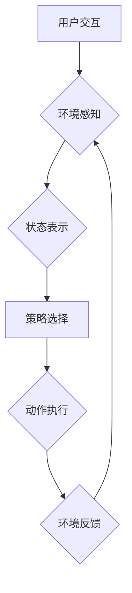

> 深度学习、智能家居、代理、强化学习、神经网络、模型训练、应用场景

## 1. 背景介绍

智能家居已成为现代生活的重要组成部分，它通过物联网技术将各种家居设备连接起来，实现自动化控制、远程管理和个性化服务。深度学习作为人工智能领域的重要分支，凭借其强大的学习能力和模式识别能力，为智能家居的智能化发展提供了强大的技术支撑。

传统的智能家居系统通常依赖于规则引擎或有限状态机，难以应对复杂多变的场景和用户需求。深度学习代理则通过学习用户行为模式和环境状态，能够自主决策、灵活应对，实现更智能、更人性化的家居体验。

## 2. 核心概念与联系

**2.1 深度学习代理**

深度学习代理是一种基于深度学习算法的智能代理，它能够通过学习用户行为模式和环境状态，自主决策并控制智能家居设备。

**2.2 强化学习**

强化学习是深度学习代理的核心算法之一，它通过奖励机制引导代理学习最优的行为策略。代理在智能家居环境中执行动作，根据动作的结果获得奖励或惩罚，通过不断学习和调整策略，最终达到最大化奖励的目标。

**2.3 智能家居环境**

智能家居环境包括各种智能设备、传感器和用户交互界面。深度学习代理需要感知环境状态，理解用户意图，并根据这些信息做出决策。

**2.4 流程图**



## 3. 核心算法原理 & 具体操作步骤

**3.1 算法原理概述**

深度学习代理的核心算法是强化学习，它通过以下步骤实现智能决策：

1. **状态表示:** 将智能家居环境的状态表示为向量，以便深度学习模型理解。
2. **策略选择:** 使用深度神经网络构建策略网络，根据当前状态预测最优动作。
3. **动作执行:** 代理执行预测的动作，并观察环境反馈。
4. **奖励机制:** 根据动作的结果获得奖励或惩罚，用于指导策略网络的学习。
5. **策略更新:** 使用强化学习算法，例如Q学习或深度Q网络，更新策略网络的参数，使其能够选择更优的动作。

**3.2 算法步骤详解**

1. **环境初始化:** 初始化智能家居环境，设置初始状态和奖励函数。
2. **状态表示:** 将环境状态转换为向量形式，例如温度、湿度、灯光状态等。
3. **策略网络初始化:** 使用深度神经网络构建策略网络，并随机初始化网络参数。
4. **训练循环:**
    - 代理根据当前状态选择动作。
    - 执行动作并观察环境反馈，获得奖励或惩罚。
    - 更新策略网络的参数，使其能够选择更优的动作。
5. **测试阶段:** 在测试环境中，代理使用训练好的策略网络进行决策，并评估其性能。

**3.3 算法优缺点**

**优点:**

- 能够学习复杂的用户行为模式和环境状态。
- 能够自主决策，灵活应对复杂场景。
- 能够不断学习和改进，提高智能化水平。

**缺点:**

- 训练过程需要大量数据和计算资源。
- 算法的稳定性和鲁棒性需要进一步提高。
- 难以解释代理的决策过程。

**3.4 算法应用领域**

深度学习代理在智能家居场景中具有广泛的应用前景，例如：

- 智能照明控制: 根据用户需求和环境光照情况自动调节灯光亮度和颜色。
- 智能空调控制: 根据用户喜好和环境温度自动调节空调温度和风速。
- 智能家居安全: 通过图像识别和行为分析，识别入侵者并报警。
- 智能家居娱乐: 根据用户喜好推荐音乐、视频和游戏内容。

## 4. 数学模型和公式 & 详细讲解 & 举例说明

**4.1 数学模型构建**

深度学习代理的数学模型可以表示为一个马尔可夫决策过程 (MDP)，其中包括以下要素:

- 状态空间 S: 智能家居环境的所有可能状态。
- 动作空间 A: 代理可以执行的所有动作。
- 转移概率 P(s', r | s, a): 从状态 s 执行动作 a 到状态 s' 的概率，以及获得奖励 r 的概率。
- 奖励函数 R(s, a): 代理在状态 s 执行动作 a 时获得的奖励。
- 策略 π(a | s): 在状态 s 下执行动作 a 的概率分布。

**4.2 公式推导过程**

强化学习的目标是找到最优策略 π*，使得代理在长期的交互过程中获得最大的累积奖励。最优策略可以通过动态规划或蒙特卡罗方法来求解。

**4.3 案例分析与讲解**

例如，在智能照明控制场景中，状态空间可以包含房间的光照强度、用户位置和时间等信息。动作空间可以包含调节灯光亮度、颜色和开关等操作。奖励函数可以根据用户反馈和环境光照情况来设计。

通过训练深度学习代理，它可以学习到用户喜好和环境变化的模式，并根据这些信息自动调节灯光，提供更舒适和便捷的照明体验。

## 5. 项目实践：代码实例和详细解释说明

**5.1 开发环境搭建**

- 操作系统: Ubuntu 20.04
- Python 版本: 3.8
- 深度学习框架: TensorFlow 2.0
- 其他依赖库: NumPy, Pandas, Matplotlib

**5.2 源代码详细实现**

```python
import tensorflow as tf

# 定义状态空间和动作空间
state_size = 10
action_size = 5

# 定义深度神经网络模型
model = tf.keras.models.Sequential([
    tf.keras.layers.Dense(64, activation='relu', input_shape=(state_size,)),
    tf.keras.layers.Dense(32, activation='relu'),
    tf.keras.layers.Dense(action_size)
])

# 定义损失函数和优化器
optimizer = tf.keras.optimizers.Adam()
loss_fn = tf.keras.losses.MeanSquaredError()

# 训练循环
for epoch in range(100):
    # 训练数据
    states = ...
    actions = ...
    rewards = ...

    # 计算损失
    with tf.GradientTape() as tape:
        predictions = model(states)
        loss = loss_fn(actions, predictions)

    # 更新模型参数
    gradients = tape.gradient(loss, model.trainable_variables)
    optimizer.apply_gradients(zip(gradients, model.trainable_variables))

# 测试阶段
states = ...
predictions = model(states)
```

**5.3 代码解读与分析**

- 代码首先定义了状态空间和动作空间，以及深度神经网络模型的结构。
- 然后定义了损失函数和优化器，用于训练模型。
- 训练循环中，使用训练数据计算模型的损失，并使用梯度下降算法更新模型参数。
- 测试阶段，使用训练好的模型预测动作。

**5.4 运行结果展示**

训练完成后，可以将代理部署到智能家居环境中，并观察其性能。例如，可以记录代理调节灯光亮度和颜色的次数，以及用户对灯光控制的满意度。

## 6. 实际应用场景

**6.1 智能照明控制**

深度学习代理可以根据用户喜好、环境光照情况和时间等信息，自动调节灯光亮度、颜色和开关，提供更舒适和便捷的照明体验。

**6.2 智能空调控制**

深度学习代理可以根据用户喜好、环境温度、湿度和时间等信息，自动调节空调温度、风速和模式，提供更舒适和节能的空调体验。

**6.3 智能家居安全**

深度学习代理可以利用图像识别和行为分析技术，识别入侵者、烟雾、火灾等异常情况，并及时报警，提高家居安全。

**6.4 未来应用展望**

随着深度学习技术的不断发展，深度学习代理在智能家居场景中的应用将更加广泛和深入，例如：

- 个性化家居服务: 根据用户的行为模式和喜好，提供个性化的家居服务，例如推荐音乐、视频和游戏内容。
- 预防性维护: 通过分析设备运行数据，预测设备故障，并及时进行维护，延长设备使用寿命。
- 语音控制: 支持语音控制，让用户更方便地与智能家居设备交互。

## 7. 工具和资源推荐

**7.1 学习资源推荐**

- 深度学习入门书籍: 《深度学习》
- 强化学习入门书籍: 《强化学习：算法、策略和应用》
- 在线课程: Coursera, Udacity, edX

**7.2 开发工具推荐**

- 深度学习框架: TensorFlow, PyTorch
- Python 开发环境: Anaconda, Jupyter Notebook
- 智能家居平台: Amazon Alexa, Google Assistant

**7.3 相关论文推荐**

- Deep Reinforcement Learning for Smart Home Automation
- A Deep Learning Approach to Smart Home Energy Management
- Deep Learning for Human Activity Recognition in Smart Homes

## 8. 总结：未来发展趋势与挑战

**8.1 研究成果总结**

深度学习代理在智能家居场景中展现出巨大的潜力，能够实现更智能、更人性化的家居体验。

**8.2 未来发展趋势**

- 更强大的深度学习模型: 随着深度学习技术的不断发展，将会有更强大的深度学习模型用于智能家居场景。
- 更丰富的传感器数据: 智能家居设备将配备更多传感器，提供更丰富的数据用于训练深度学习代理。
- 更个性化的服务: 深度学习代理将能够根据用户的个性化需求提供更个性化的家居服务。

**8.3 面临的挑战**

- 算法的稳定性和鲁棒性: 深度学习代理的算法需要更加稳定和鲁棒，能够应对复杂多变的场景。
- 数据安全和隐私保护: 智能家居设备收集的用户数据需要得到安全保护，防止数据泄露和滥用。
- 人机交互: 深度学习代理需要与用户进行更自然、更便捷的人机交互。

**8.4 研究展望**

未来，我们将继续研究深度学习代理在智能家居场景中的应用，致力于开发更智能、更安全、更便捷的智能家居系统。

## 9. 附录：常见问题与解答

**9.1 如何训练深度学习代理?**

训练深度学习代理需要准备训练数据，并使用深度学习框架进行模型训练。训练数据包括智能家居环境的状态、动作和奖励信息。

**9.2 深度学习代理的安全性如何保证?**

深度学习代理的安全性可以通过以下方式保证:

- 使用安全的训练数据，避免数据泄露和滥用。
- 对模型进行安全评估，检测是否存在安全漏洞。
- 使用安全协议进行数据传输，防止数据被窃取。

**9.3 深度学习代理的隐私保护如何实现?**

深度学习代理的隐私保护可以通过以下方式实现:

- 对用户数据进行匿名化处理，避免识别用户的个人信息。
- 使用联邦学习等隐私保护技术，避免将用户数据集中存储。
- 明确告知用户数据的使用方式，并获得用户的同意。


作者：禅与计算机程序设计艺术 / Zen and the Art of Computer Programming 
<end_of_turn>