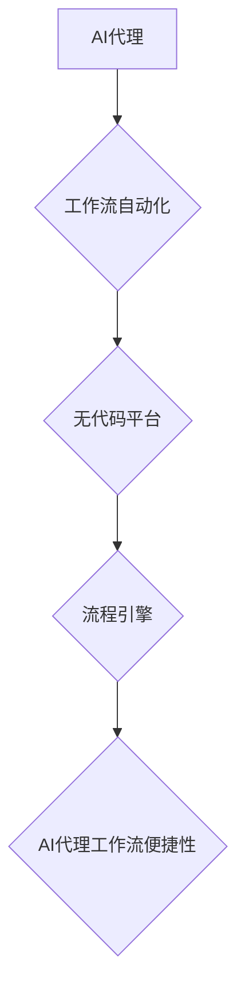

> AI代理、工作流自动化、无代码平台、低代码平台、流程引擎、智能化、便捷性、应用前景

## 1. 背景介绍

随着人工智能技术的飞速发展，AI代理逐渐成为企业数字化转型的重要驱动力。AI代理是指利用人工智能技术，自动执行特定任务或流程的智能化代理系统。它能够解放人力，提高工作效率，并为企业带来新的商业价值。

然而，传统AI代理的开发和部署通常需要专业的技术人员和复杂的代码编写，这对于非技术人员来说门槛较高，难以普及。为了解决这一问题，无代码平台应运而生。无代码平台提供可视化拖拽式界面，无需编写代码即可构建和部署AI代理，极大地降低了AI代理的开发门槛，使其更易于被广泛应用。

## 2. 核心概念与联系

**2.1 AI代理**

AI代理是一种能够根据预设规则或学习到的知识，自动执行特定任务或流程的智能化系统。它可以理解和响应用户的指令，并根据上下文进行决策和行动。

**2.2 工作流自动化**

工作流自动化是指利用软件工具，自动执行一系列预定义的步骤或任务，以提高工作效率和准确性。它可以将重复性、耗时的任务自动化，释放人力资源，并减少人为错误。

**2.3 无代码平台**

无代码平台是一种软件开发平台，允许用户通过可视化拖拽式界面，无需编写代码即可构建和部署应用程序。它提供丰富的组件和模板，以及易于使用的工具，使非技术人员也能轻松开发应用程序。

**2.4 流程引擎**

流程引擎是工作流自动化的核心组件，负责管理和执行工作流定义。它可以根据工作流规则，协调不同任务的执行顺序和依赖关系，并确保工作流的顺利进行。

**2.5 核心概念联系**

AI代理、工作流自动化、无代码平台和流程引擎相互关联，共同构成了AI代理工作流便捷性的基础。无代码平台为AI代理的开发和部署提供了便捷的工具，流程引擎则负责管理和执行AI代理的工作流。



## 3. 核心算法原理 & 具体操作步骤

**3.1 算法原理概述**

AI代理工作流便捷性的核心算法原理基于以下几个方面：

* **自然语言理解 (NLU):** AI代理需要能够理解用户的自然语言指令，并将其转换为可执行的操作。
* **知识图谱:** AI代理需要拥有丰富的知识库，以便理解用户需求，并提供准确的响应。
* **规则引擎:** AI代理需要根据预设规则或学习到的知识，自动执行任务或流程。
* **机器学习:** AI代理可以利用机器学习算法，不断学习和改进，提高其执行效率和准确性。

**3.2 算法步骤详解**

1. **用户输入:** 用户通过自然语言或图形界面向AI代理提出请求。
2. **NLU解析:** AI代理使用NLU算法解析用户的输入，识别出用户的意图和需求。
3. **知识图谱查询:** AI代理根据用户的意图，从知识图谱中查询相关信息，并构建理解的用户场景。
4. **规则引擎匹配:** AI代理根据用户的场景和预设规则，匹配相应的执行流程。
5. **流程引擎执行:** 流程引擎根据匹配的流程，协调不同任务的执行顺序和依赖关系，并确保工作流的顺利进行。
6. **结果反馈:** AI代理将执行结果反馈给用户，并根据用户的反馈进行学习和改进。

**3.3 算法优缺点**

**优点:**

* **便捷性:** 无需编写代码，即可构建和部署AI代理。
* **可视化:** 可视化拖拽式界面，易于理解和操作。
* **灵活性:** 可以根据不同的需求，灵活定制AI代理的功能和流程。
* **效率:** 自动化执行任务，提高工作效率和准确性。

**缺点:**

* **功能限制:** 部分复杂的功能可能无法通过无代码平台实现。
* **可扩展性:** 无代码平台的扩展性可能有限，难以满足大型系统的需求。
* **安全性:** 无代码平台的安全性和可靠性需要得到充分保障。

**3.4 算法应用领域**

AI代理工作流便捷性在各个领域都有广泛的应用前景，例如：

* **企业服务自动化:** 自动化审批流程、客户服务、数据录入等任务。
* **流程管理:** 自动化流程设计、执行和监控。
* **智能客服:** 提供24小时在线客服服务，自动解答用户常见问题。
* **教育培训:** 自动化学习任务分配、进度跟踪和反馈。

## 4. 数学模型和公式 & 详细讲解 & 举例说明

**4.1 数学模型构建**

AI代理工作流便捷性的数学模型可以基于状态机和决策树等模型构建。

* **状态机:** 状态机模型可以描述AI代理在不同状态下的行为和转换规则。每个状态代表AI代理执行任务的不同阶段，状态之间的转换由触发条件和动作规则决定。

* **决策树:** 决策树模型可以描述AI代理根据用户输入和知识库信息进行决策的过程。决策树由节点和分支组成，每个节点代表一个决策点，分支代表不同的决策结果。

**4.2 公式推导过程**

状态机和决策树模型的数学公式推导过程较为复杂，涉及到概率论、图论和逻辑学等多个学科。

**4.3 案例分析与讲解**

假设我们构建一个AI代理，用于自动处理客户的订单请求。

* **状态机模型:**

    * 状态: 等待订单、处理订单、完成订单
    * 触发条件: 用户提交订单、订单处理完成
    * 动作规则: 等待订单状态下，收到用户提交订单后，进入处理订单状态；处理订单状态下，订单处理完成时，进入完成订单状态。

* **决策树模型:**

    * 根节点: 用户提交订单
    * 分支1: 订单类型为普通订单，进入处理普通订单流程
    * 分支2: 订单类型为特殊订单，进入处理特殊订单流程

**5. 项目实践：代码实例和详细解释说明**

**5.1 开发环境搭建**

* 操作系统: Windows/macOS/Linux
* 编程语言: Python
* 开发工具: VS Code/PyCharm
* 无代码平台: Appian/Mendix/OutSystems

**5.2 源代码详细实现**

```python
# 导入必要的库
import nltk
from nltk.chat.util import Chat, reflections

# 定义聊天机器人对话规则
pairs = [
    [
        r"我的名字是什么？",
        ["我的名字是AI代理。"],
    ],
    [
        r"你好",
        ["你好！有什么可以帮你的吗？"],
    ],
    [
        r"再见",
        ["再见！"],
    ],
]

# 创建聊天机器人实例
chatbot = Chat(pairs, reflections)

# 启动聊天机器人
print("AI代理启动成功！")
while True:
    user_input = input("您:")
    response = chatbot.respond(user_input)
    print("AI代理:", response)
```

**5.3 代码解读与分析**

* 该代码实现了一个简单的聊天机器人，使用NLTK库进行自然语言处理。
* `pairs`列表定义了聊天机器人的对话规则，每个规则由一个正则表达式和一个响应列表组成。
* `Chat`类用于创建聊天机器人实例，`respond`方法用于处理用户的输入并返回响应。

**5.4 运行结果展示**

```
AI代理启动成功！
您: 我的名字是什么？
AI代理: 我的名字是AI代理。
您: 你好
AI代理: 你好！有什么可以帮你的吗？
您: 再见
AI代理: 再见！
```

## 6. 实际应用场景

**6.1 企业服务自动化**

* **审批流程自动化:** AI代理可以自动处理审批流程，例如请假申请、报销申请等，提高审批效率，减少人工干预。
* **客户服务自动化:** AI代理可以自动回复客户常见问题，提供24小时在线客服服务，减轻客服人员的工作压力。
* **数据录入自动化:** AI代理可以自动提取数据，并将其录入到系统中，提高数据录入效率，减少人为错误。

**6.2 流程管理**

* **流程设计:** AI代理可以帮助用户设计和构建工作流程，并提供流程模拟和测试功能。
* **流程执行:** AI代理可以自动执行工作流程，并根据流程规则协调不同任务的执行顺序和依赖关系。
* **流程监控:** AI代理可以监控工作流程的执行情况，并及时发现和解决问题。

**6.3 智能客服**

* **聊天机器人:** AI代理可以作为聊天机器人，与用户进行自然语言对话，解答用户常见问题，提供个性化服务。
* **语音助手:** AI代理可以作为语音助手，通过语音识别和合成技术，与用户进行语音交互，完成各种任务。

**6.4 未来应用展望**

随着人工智能技术的不断发展，AI代理工作流便捷性将有更广泛的应用前景，例如：

* **个性化服务:** AI代理可以根据用户的个人喜好和需求，提供个性化的服务。
* **协作工作:** AI代理可以帮助用户协同工作，提高工作效率。
* **决策支持:** AI代理可以分析数据，提供决策支持，帮助用户做出更明智的决策。

## 7. 工具和资源推荐

**7.1 学习资源推荐**

* **书籍:**
    * 《人工智能：一种现代方法》
    * 《深度学习》
    * 《机器学习》
* **在线课程:**
    * Coursera: 人工智能课程
    * edX: 深度学习课程
    * Udacity: 机器学习工程师课程

**7.2 开发工具推荐**

* **无代码平台:** Appian, Mendix, OutSystems
* **流程引擎:** Camunda, Activiti, jBPM
* **机器学习库:** TensorFlow, PyTorch, scikit-learn

**7.3 相关论文推荐**

* **论文:**
    * 《基于无代码平台的AI代理工作流便捷性研究》
    * 《AI代理工作流自动化技术综述》
    * 《无代码平台在AI代理开发中的应用》

## 8. 总结：未来发展趋势与挑战

**8.1 研究成果总结**

本研究探讨了AI代理工作流便捷性的核心概念、算法原理、应用场景以及未来发展趋势。无代码平台为AI代理的开发和部署提供了便捷的工具，降低了AI代理的门槛，使其更易于被广泛应用。

**8.2 未来发展趋势**

* **更智能化的AI代理:** 未来AI代理将更加智能化，能够更好地理解用户的需求，并提供更精准的响应。
* **更广泛的应用场景:** AI代理将应用于更多领域，例如医疗、教育、金融等。
* **更强大的协作能力:** AI代理将能够更好地与人类协作，共同完成任务。

**8.3 面临的挑战**

* **算法复杂性:** AI代理的算法复杂度较高，需要不断进行优化和改进。
* **数据安全:** AI代理需要处理大量用户数据，数据安全问题需要得到充分保障。
* **伦理问题:** AI代理的应用可能会带来一些伦理问题，例如算法偏见、隐私泄露等，需要得到妥善解决。

**8.4 研究展望**

未来研究将重点关注以下几个方面:

* **开发更智能、更灵活的AI代理算法。**
* **构建更安全、更可靠的AI代理平台。**
* **探讨AI代理的伦理问题，并制定相应的规范和标准。**


## 9. 附录：常见问题与解答

**9.1 如何搭建AI代理工作流便捷性平台？**

搭建AI代理工作流便捷性平台需要以下步骤:

1. 选择合适的无代码平台。
2. 设计和构建AI代理的工作流程。
3. 连接数据源和外部系统。