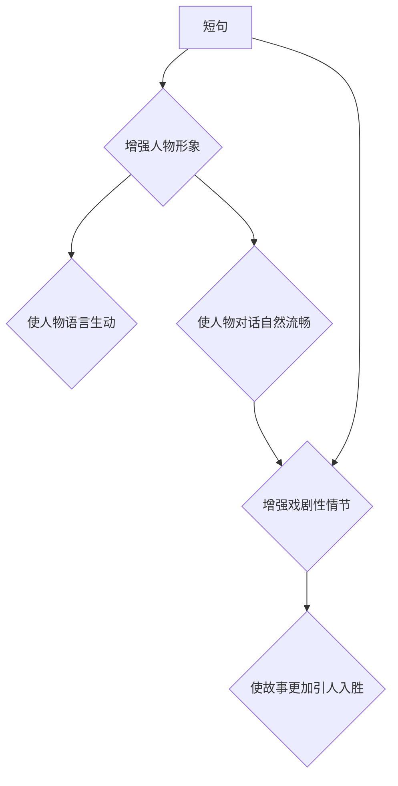

> AI写作, 人味, 短句, 人物形象, 戏剧性情节, 自然语言生成, 文本创作, 叙事结构

## 1. 背景介绍

近年来，人工智能（AI）技术飞速发展，特别是自然语言生成（NLG）领域取得了突破性进展。AI写作工具已经能够生成各种类型的文本，例如新闻报道、诗歌、小说等。然而，许多AI生成的文本仍然缺乏“人味”，读起来平淡无奇，缺乏情感共鸣和吸引力。

为了解决这个问题，研究者们开始探索如何赋予AI写作更强的“人味”。其中，短句、人物形象和戏剧性情节被认为是关键要素。

## 2. 核心概念与联系

**2.1 短句**

短句可以使文本更加简洁明了，易于理解和记忆。在人类的语言表达中，短句通常用于强调重点、表达情感或营造紧张气氛。

**2.2 人物形象**

人物形象是故事的核心，能够吸引读者并引发情感共鸣。一个鲜明的人物形象需要有独特的性格、背景故事和动机，能够在读者心中留下深刻印象。

**2.3 戏剧性情节**

戏剧性情节是指故事中充满冲突、悬念和转折的事件，能够激发读者的兴趣和好奇心。

**2.4 核心概念联系**

短句、人物形象和戏剧性情节相互关联，共同构成了AI写作的“人味”。

* 短句可以增强人物形象的鲜明度，使人物的语言更加生动形象。
* 戏剧性情节需要通过人物的行动和对话来展现，短句可以使人物的对话更加自然流畅。
* 短句和人物形象的结合可以增强戏剧性情节的感染力，使故事更加引人入胜。

**Mermaid 流程图**



## 3. 核心算法原理 & 具体操作步骤

**3.1 算法原理概述**

AI写作的“人味”可以通过训练模型来实现。训练模型需要大量的文本数据，这些数据包含各种类型的短句、人物形象和戏剧性情节。通过学习这些数据，模型能够学习到人类语言表达的规律，并生成更加“人味”的文本。

**3.2 算法步骤详解**

1. **数据收集和预处理:** 收集大量文本数据，并进行预处理，例如去除停用词、标点符号等。
2. **模型训练:** 使用深度学习算法，例如Transformer，训练模型。
3. **文本生成:** 将输入文本作为模型的提示，模型根据训练数据生成新的文本。

**3.3 算法优缺点**

**优点:**

* 可以生成高质量的文本，具有“人味”。
* 可以自动完成文本创作任务，提高效率。

**缺点:**

* 需要大量的训练数据，训练成本高。
* 模型可能存在偏差，生成文本可能不符合预期。

**3.4 算法应用领域**

* 文学创作
* 广告文案撰写
* 内容营销
* 自动化客服

## 4. 数学模型和公式 & 详细讲解 & 举例说明

**4.1 数学模型构建**

AI写作的“人味”可以看作是一个优化问题，目标是生成文本，使其在“人味”度方面达到最大值。

**4.2 公式推导过程**

“人味”度可以定义为文本的流畅度、语法正确性、情感表达能力等方面的综合指标。可以使用数学公式来量化这些指标，并构建一个优化模型。

例如，可以定义“流畅度”为文本中短句的比例，可以使用公式计算文本的短句比例。

**4.3 案例分析与讲解**

假设我们有一个文本：

“今天天气很好，阳光明媚。我出去散步，呼吸新鲜空气。感觉很放松。”

我们可以使用公式计算文本的短句比例：

短句比例 = 短句数量 / 总句数

在这个例子中，短句数量为3，总句数为3，所以短句比例为1。

## 5. 项目实践：代码实例和详细解释说明

**5.1 开发环境搭建**

可以使用Python语言和相关的库来实现AI写作的“人味”。例如，可以使用Transformers库来加载预训练模型，使用NLTK库来进行文本处理。

**5.2 源代码详细实现**

```python
from transformers import pipeline

# 加载预训练模型
generator = pipeline("text-generation", model="gpt2")

# 输入文本提示
prompt = "今天天气很好，阳光明媚。"

# 生成文本
output = generator(prompt, max_length=50, num_return_sequences=3)

# 打印生成文本
for text in output:
    print(text["generated_text"])
```

**5.3 代码解读与分析**

这段代码首先加载了预训练的GPT-2模型，然后使用该模型生成文本。

* `pipeline("text-generation", model="gpt2")`：加载预训练的文本生成模型。
* `prompt`：输入文本提示。
* `max_length`：生成的文本最大长度。
* `num_return_sequences`：生成文本的数量。

**5.4 运行结果展示**

运行这段代码后，会生成3个不同的文本，这些文本都基于输入的提示“今天天气很好，阳光明媚。”进行扩展。

## 6. 实际应用场景

**6.1 文学创作**

AI写作可以帮助作家克服写作瓶颈，生成新的故事创意和情节。

**6.2 广告文案撰写**

AI写作可以帮助广告文案撰写人员生成更吸引人的广告文案。

**6.3 内容营销**

AI写作可以帮助企业自动生成博客文章、社交媒体帖子等内容。

**6.4 未来应用展望**

随着AI技术的不断发展，AI写作的应用场景将会更加广泛。例如，AI可以帮助学生写论文，帮助医生撰写病历，帮助律师起草合同等。

## 7. 工具和资源推荐

**7.1 学习资源推荐**

* **书籍:**《深度学习》、《自然语言处理》
* **在线课程:** Coursera、edX、Udacity

**7.2 开发工具推荐**

* **Python:** 语言环境
* **Transformers:** 预训练模型库
* **NLTK:** 自然语言处理库

**7.3 相关论文推荐**

* **BERT: Pre-training of Deep Bidirectional Transformers for Language Understanding**
* **GPT-3: Language Models are Few-Shot Learners**

## 8. 总结：未来发展趋势与挑战

**8.1 研究成果总结**

AI写作技术取得了显著进展，能够生成高质量的文本，具有“人味”。

**8.2 未来发展趋势**

* 模型能力将进一步提升，能够生成更加复杂、多样化的文本。
* 应用场景将更加广泛，覆盖更多领域。
* 伦理问题将受到更多关注，需要制定相应的规范和标准。

**8.3 面临的挑战**

* 模型训练成本高，需要大量的计算资源。
* 模型可能存在偏差，生成文本可能不符合预期。
* 伦理问题需要得到解决，例如AI写作是否会取代人类作家。

**8.4 研究展望**

未来研究将重点关注以下几个方面：

* 降低模型训练成本
* 提高模型的鲁棒性和安全性
* 解决AI写作的伦理问题


## 9. 附录：常见问题与解答

**9.1 如何选择合适的AI写作工具？**

选择AI写作工具时，需要考虑以下因素：

* 功能需求
* 使用成本
* 模型性能

**9.2 AI写作是否会取代人类作家？**

AI写作可以帮助作家提高效率，但目前还无法完全取代人类作家。人类作家拥有创造力和想象力，能够创作出更加富有情感和深度的内容。

**9.3 如何避免AI写作生成的文本出现偏差？**

训练AI写作模型时，需要使用高质量、多样化的文本数据，并进行严格的评估和测试，以避免模型出现偏差。

作者：禅与计算机程序设计艺术 / Zen and the Art of Computer Programming 


<end_of_turn>