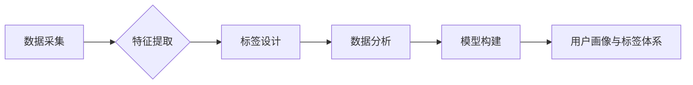

> AI创业公司,用户画像,标签体系,数据采集,特征提取,标签设计,机器学习,数据分析

## 1. 背景介绍

在当今数据爆炸的时代，AI创业公司面临着巨大的机遇和挑战。如何精准地了解用户需求，并将其转化为商业价值，是AI创业公司成功的关键。用户画像与标签体系构建是实现这一目标的重要手段。

用户画像是指对目标用户进行深入分析，并以图表、文本等形式呈现用户特征、行为、偏好等信息，形成对用户的全面认知。而标签体系则是对用户画像进行分类和组织，通过标签赋予用户不同的属性和特征，以便于进行更精准的细分和分析。

AI创业公司可以通过构建完善的用户画像与标签体系，实现以下目标：

* **精准用户定位:** 识别目标用户群体，了解他们的需求、痛点和行为模式。
* **个性化产品和服务:** 根据用户画像，提供个性化的产品推荐、内容推送和服务体验。
* **精准营销推广:** 通过标签筛选，精准投放广告和营销活动，提高营销效率。
* **用户关系管理:** 构建用户画像，了解用户之间的关系和互动模式，促进用户粘性和复购率。

## 2. 核心概念与联系

**2.1 用户画像**

用户画像是基于用户数据进行分析和总结，形成对用户的描述和理解。它包含用户基本信息、行为特征、兴趣爱好、价值观等多方面内容。

**2.2 标签体系**

标签体系是将用户画像进行分类和组织，通过标签赋予用户不同的属性和特征。标签可以是用户行为、兴趣爱好、产品偏好、地理位置等方面的分类。

**2.3 数据采集**

数据采集是构建用户画像和标签体系的基础。AI创业公司可以通过多种方式收集用户数据，例如：

* **用户注册信息:** 用户姓名、邮箱、手机号、性别、年龄等基本信息。
* **用户行为数据:** 用户访问网站、浏览商品、点击广告、购买产品等行为记录。
* **用户反馈数据:** 用户评论、评价、问答等反馈信息。
* **第三方数据:** 用户社交媒体信息、兴趣爱好数据等第三方数据。

**2.4 特征提取**

特征提取是指从原始数据中提取出具有代表性的特征，用于构建用户画像和标签体系。常见的特征提取方法包括：

* **文本特征提取:** 使用自然语言处理技术，提取文本中的关键词、主题、情感等特征。
* **数值特征提取:** 使用统计学方法，提取数值数据的均值、方差、标准差等特征。
* **图像特征提取:** 使用计算机视觉技术，提取图像中的颜色、形状、纹理等特征。

**2.5 标签设计**

标签设计是指根据用户画像和业务需求，设计出合理的标签体系。标签的设计要考虑以下因素：

* **标签的粒度:** 标签的细致程度，可以是粗粒度标签，也可以是细粒度标签。
* **标签的覆盖率:** 标签要能够覆盖用户画像中的大部分特征。
* **标签的互斥性:** 标签之间不能相互重叠，每个用户只能属于一个标签。
* **标签的稳定性:** 标签要能够保持稳定性，避免频繁的更新和修改。

**2.6 数据分析与模型构建**

数据分析和模型构建是构建用户画像和标签体系的关键步骤。AI创业公司可以使用机器学习算法，对用户数据进行分析，并构建用户画像和标签体系的模型。

**2.7 流程图**



## 3. 核心算法原理 & 具体操作步骤

### 3.1 算法原理概述

构建用户画像和标签体系的核心算法主要包括：

* **聚类算法:** 将用户数据进行分组，将具有相似特征的用户归为一类。常见的聚类算法包括K-means聚类、DBSCAN聚类等。
* **分类算法:** 根据用户特征，将用户分类到不同的标签类别。常见的分类算法包括决策树、支持向量机、神经网络等。
* **推荐算法:** 根据用户的历史行为和偏好，推荐相关的产品、内容或服务。常见的推荐算法包括协同过滤、内容过滤、混合推荐等。

### 3.2 算法步骤详解

**3.2.1 聚类算法**

1. **数据预处理:** 对用户数据进行清洗、转换和标准化。
2. **选择聚类算法:** 根据数据特点和业务需求，选择合适的聚类算法。
3. **设置聚类数量:** 确定聚类数量，可以使用肘部法则等方法进行判断。
4. **执行聚类:** 使用选择的聚类算法，对用户数据进行聚类。
5. **聚类结果分析:** 分析聚类结果，并对每个聚类进行命名和描述。

**3.2.2 分类算法**

1. **数据预处理:** 对用户数据进行清洗、转换和特征提取。
2. **选择分类算法:** 根据数据特点和业务需求，选择合适的分类算法。
3. **训练模型:** 使用训练数据，训练分类模型。
4. **模型评估:** 使用测试数据，评估模型的性能。
5. **模型部署:** 将训练好的模型部署到生产环境中。

**3.2.3 推荐算法**

1. **数据预处理:** 对用户数据进行清洗、转换和特征提取。
2. **选择推荐算法:** 根据数据特点和业务需求，选择合适的推荐算法。
3. **训练模型:** 使用训练数据，训练推荐模型。
4. **模型评估:** 使用测试数据，评估模型的性能。
5. **模型部署:** 将训练好的模型部署到生产环境中。

### 3.3 算法优缺点

**3.3.1 聚类算法**

* **优点:** 无需预先定义标签，能够自动发现用户群组。
* **缺点:** 聚类结果难以解释，聚类效果受初始参数影响较大。

**3.3.2 分类算法**

* **优点:** 可以将用户分类到预定义的标签类别，结果易于解释。
* **缺点:** 需要预先定义标签，标签设计需要经验和专业知识。

**3.3.3 推荐算法**

* **优点:** 可以根据用户的历史行为和偏好，推荐相关的产品、内容或服务。
* **缺点:** 需要大量的用户数据进行训练，推荐结果可能存在偏差。

### 3.4 算法应用领域

* **电商平台:** 用户画像和标签体系可以用于精准推荐商品、个性化营销推广。
* **社交媒体平台:** 用户画像和标签体系可以用于用户兴趣匹配、内容推荐、广告投放。
* **金融机构:** 用户画像和标签体系可以用于风险评估、精准营销、个性化金融服务。
* **医疗机构:** 用户画像和标签体系可以用于疾病诊断、个性化治疗、健康管理。

## 4. 数学模型和公式 & 详细讲解 & 举例说明

### 4.1 数学模型构建

用户画像和标签体系的构建可以看作是一个数学模型的构建过程。

**4.1.1 用户特征向量:**

每个用户可以被表示为一个特征向量，其中每个维度代表一个用户特征，例如年龄、性别、兴趣爱好、购买行为等。

**4.1.2 标签空间:**

标签空间是一个由标签组成的集合，每个标签代表一个用户属性或特征。

**4.1.3 用户-标签关系矩阵:**

用户-标签关系矩阵是一个二维矩阵，其中每一行代表一个用户，每一列代表一个标签。矩阵元素表示用户对标签的偏好程度或关联度。

### 4.2 公式推导过程

**4.2.1 用户相似度计算:**

可以使用余弦相似度等方法计算两个用户之间的相似度。

**4.2.2 标签聚类:**

可以使用K-means聚类等算法对标签进行聚类，将具有相似特征的标签归为一类。

**4.2.3 用户标签预测:**

可以使用分类算法，例如逻辑回归、支持向量机等，预测用户对特定标签的偏好程度。

### 4.3 案例分析与讲解

**4.3.1 电商平台用户画像:**

假设一个电商平台想要构建用户画像，可以收集用户的注册信息、购买记录、浏览历史等数据。

* **特征提取:** 可以提取用户的年龄、性别、购买频率、购买金额、喜欢的商品类别等特征。
* **聚类分析:** 可以使用K-means聚类算法，将用户分为不同的用户群组，例如“学生群体”、“白领群体”、“家庭用户”等。
* **标签设计:** 可以设计标签，例如“忠诚用户”、“高价值用户”、“潜在客户”等，并根据用户的特征和行为进行标签分配。

**4.3.2 社交媒体平台用户兴趣推荐:**

假设一个社交媒体平台想要推荐用户感兴趣的内容，可以收集用户的关注列表、点赞记录、评论内容等数据。

* **特征提取:** 可以提取用户的关注领域、点赞类型、评论主题等特征。
* **标签聚类:** 可以使用K-means聚类算法，将用户分为不同的兴趣群组，例如“科技爱好者”、“时尚达人”、“美食博主”等。
* **推荐算法:** 可以使用协同过滤算法，根据用户的兴趣群组和其他用户的行为，推荐相关的文章、视频、图片等内容。

## 5. 项目实践：代码实例和详细解释说明

### 5.1 开发环境搭建

* **操作系统:** Ubuntu 20.04 LTS
* **编程语言:** Python 3.8
* **库依赖:** pandas, numpy, scikit-learn, matplotlib

### 5.2 源代码详细实现

```python
import pandas as pd
from sklearn.cluster import KMeans

# 加载用户数据
data = pd.read_csv('user_data.csv')

# 特征提取
features = data[['age', 'gender', 'purchase_frequency', 'purchase_amount']]

# 聚类分析
kmeans = KMeans(n_clusters=3)
kmeans.fit(features)

# 获取聚类结果
labels = kmeans.labels_

# 添加标签到数据框
data['cluster'] = labels

# 保存聚类结果
data.to_csv('user_clusters.csv', index=False)
```

### 5.3 代码解读与分析

* **数据加载:** 使用pandas库加载用户数据。
* **特征提取:** 选择用户特征，例如年龄、性别、购买频率、购买金额等。
* **聚类分析:** 使用K-means聚类算法，将用户分为3个聚类。
* **标签分配:** 将聚类结果作为标签，添加到数据框中。
* **结果保存:** 将聚类结果保存到CSV文件。

### 5.4 运行结果展示

运行代码后，将生成一个包含用户聚类结果的CSV文件。

## 6. 实际应用场景

### 6.1 电商平台

* **精准推荐:** 根据用户的聚类结果和标签，推荐个性化的商品和服务。
* **精准营销:** 根据用户的标签，进行精准的营销推广活动。
* **用户画像分析:** 分析不同用户群体的特征和行为，制定针对性的营销策略。

### 6.2 社交媒体平台

* **内容推荐:** 根据用户的兴趣标签，推荐相关的文章、视频、图片等内容。
* **用户兴趣分析:** 分析用户的兴趣标签，了解用户的兴趣爱好和偏好。
* **精准广告投放:** 根据用户的标签，精准投放广告，提高广告效果。

### 6.3 金融机构

* **风险评估:** 根据用户的标签，评估用户的信用风险和投资风险。
* **个性化金融服务:** 根据用户的标签，提供个性化的金融产品和服务。
* **客户关系管理:** 分析用户的标签，了解用户的需求和偏好，提供更好的客户服务。

### 6.4 未来应用展望

随着人工智能技术的不断发展，用户画像和标签体系将应用于越来越多的领域，例如医疗、教育、交通等。

## 7. 工具和资源