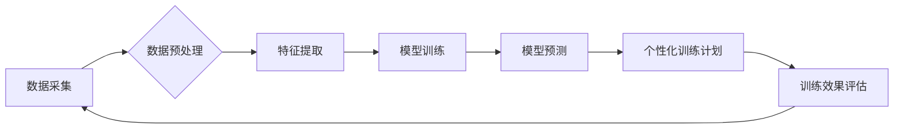

> 人工智能，体育训练，运动员表现，数据分析，机器学习，预测模型，个性化训练

## 1. 背景介绍

体育竞技是一个高度竞争的领域，运动员的成功取决于多种因素，包括天赋、努力、战术和技术。近年来，人工智能（AI）技术飞速发展，为体育训练带来了革命性的变革。AI算法能够分析海量运动数据，识别训练模式，预测运动员表现，从而帮助教练员和运动员制定更有效的训练计划，提升竞技水平。

## 2. 核心概念与联系

**2.1 核心概念**

* **人工智能 (AI):** 人工智能是指模拟人类智能行为的计算机系统，包括学习、推理、决策和解决问题等能力。
* **机器学习 (ML):** 机器学习是人工智能的一个子领域，它通过算法从数据中学习，不断改进预测和决策能力。
* **深度学习 (DL):** 深度学习是机器学习的一种高级形式，它使用多层神经网络来模拟人类大脑的结构和功能，能够处理更复杂的数据和任务。
* **数据分析:** 数据分析是指从数据中提取有价值信息的过程，包括识别趋势、模式和异常值。

**2.2 联系**

AI技术在体育训练中的应用主要基于以下核心概念的结合：

* **数据采集:** 利用传感器、摄像头等设备收集运动员的运动数据，包括速度、加速度、心率、呼吸频率等。
* **数据分析:** 使用机器学习算法分析运动数据，识别运动员的技术动作、运动模式和生理指标。
* **模型预测:** 建立预测模型，根据运动员的训练数据和生理指标预测其未来的表现，例如比赛成绩、受伤风险等。
* **个性化训练:** 根据预测结果和运动员的个人特点，制定个性化的训练计划，提高训练效率和效果。

**2.3 流程图**



## 3. 核心算法原理 & 具体操作步骤

**3.1 算法原理概述**

在AI辅助体育训练中，常用的算法包括：

* **监督学习:** 利用标记数据训练模型，例如根据运动员的训练数据和比赛成绩预测其未来的表现。
* **无监督学习:** 从未标记数据中发现模式和结构，例如识别运动员的技术动作和运动模式。
* **强化学习:** 通过奖励和惩罚机制训练模型，例如训练机器人进行运动技能模仿。

**3.2 算法步骤详解**

以监督学习为例，其训练步骤如下：

1. **数据收集:** 收集运动员的训练数据和比赛成绩等相关信息。
2. **数据预处理:** 清洗、转换和格式化数据，使其适合模型训练。
3. **特征提取:** 从原始数据中提取有价值的特征，例如速度、加速度、心率等。
4. **模型选择:** 选择合适的机器学习模型，例如线性回归、决策树、支持向量机等。
5. **模型训练:** 使用训练数据训练模型，调整模型参数，使其能够准确预测运动员的表现。
6. **模型评估:** 使用测试数据评估模型的性能，例如准确率、召回率、F1-score等。
7. **模型部署:** 将训练好的模型部署到实际应用场景中，例如为教练员提供预测结果。

**3.3 算法优缺点**

* **优点:** 能够从数据中发现隐藏的模式和规律，提高预测准确率。
* **缺点:** 需要大量的标记数据进行训练，训练过程复杂，模型解释性较差。

**3.4 算法应用领域**

* **运动员表现预测:** 预测运动员的比赛成绩、受伤风险等。
* **个性化训练计划:** 根据运动员的个人特点和训练目标制定个性化的训练计划。
* **运动技术分析:** 分析运动员的技术动作，识别改进空间。
* **对手分析:** 分析对手的比赛数据，制定针对性的战术策略。

## 4. 数学模型和公式 & 详细讲解 & 举例说明

**4.1 数学模型构建**

在AI辅助体育训练中，常用的数学模型包括线性回归、逻辑回归、支持向量机等。

**4.2 公式推导过程**

以线性回归为例，其目标是找到一条直线，使得预测值与实际值之间的误差最小。

* **线性回归模型:**  y = mx + c

其中，y是预测值，x是输入特征，m是斜率，c是截距。

* **损失函数:**  MSE = (1/n) * Σ(y_i - ŷ_i)^2

其中，n是样本数量，y_i是实际值，ŷ_i是预测值。

* **梯度下降算法:** 用于优化模型参数，使得损失函数最小。

**4.3 案例分析与讲解**

假设我们想要预测运动员的比赛成绩，输入特征包括训练时间、训练强度等。我们可以使用线性回归模型，根据训练数据训练模型，并使用测试数据评估模型的性能。

## 5. 项目实践：代码实例和详细解释说明

**5.1 开发环境搭建**

* Python 3.x
* TensorFlow/PyTorch
* NumPy
* Pandas

**5.2 源代码详细实现**

```python
import tensorflow as tf

# 定义模型
model = tf.keras.models.Sequential([
    tf.keras.layers.Dense(64, activation='relu', input_shape=(5,)),
    tf.keras.layers.Dense(32, activation='relu'),
    tf.keras.layers.Dense(1)
])

# 编译模型
model.compile(optimizer='adam', loss='mse')

# 训练模型
model.fit(X_train, y_train, epochs=10)

# 评估模型
loss = model.evaluate(X_test, y_test)
print('Loss:', loss)

# 预测结果
predictions = model.predict(X_new)
print('Predictions:', predictions)
```

**5.3 代码解读与分析**

* 代码首先定义了一个简单的线性回归模型，包含三个全连接层。
* 然后使用Adam优化器和均方误差损失函数编译模型。
* 使用训练数据训练模型，并设置训练轮数为10。
* 训练完成后，使用测试数据评估模型的性能。
* 最后，使用新的数据预测结果。

**5.4 运行结果展示**

运行结果将显示模型的损失值和预测结果。

## 6. 实际应用场景

**6.1 运动员表现预测**

AI可以预测运动员的比赛成绩、受伤风险等，帮助教练员制定更有效的训练计划。

**6.2 个性化训练计划**

根据运动员的个人特点和训练目标，AI可以制定个性化的训练计划，提高训练效率和效果。

**6.3 运动技术分析**

AI可以分析运动员的技术动作，识别改进空间，帮助运动员提高技术水平。

**6.4 未来应用展望**

* **虚拟教练:** AI虚拟教练可以根据运动员的训练数据和生理指标，提供个性化的训练指导和反馈。
* **智能运动设备:** AI嵌入到运动设备中，可以实时监测运动员的运动状态，提供个性化的训练建议。
* **运动数据平台:** AI可以构建运动数据平台，整合来自不同来源的运动数据，为教练员、运动员和研究人员提供更全面的数据分析和洞察。

## 7. 工具和资源推荐

**7.1 学习资源推荐**

* **书籍:**
    * 深度学习
    * 人工智能
* **在线课程:**
    * Coursera
    * edX
    * Udacity

**7.2 开发工具推荐**

* **Python:** 
* **TensorFlow/PyTorch:** 深度学习框架
* **NumPy/Pandas:** 数据处理库

**7.3 相关论文推荐**

* **AI in Sports: A Review**
* **Deep Learning for Sports Analytics**
* **Personalized Training Plans Using Machine Learning**

## 8. 总结：未来发展趋势与挑战

**8.1 研究成果总结**

AI技术在体育训练中的应用取得了显著成果，例如提高了运动员的表现预测准确率、个性化训练计划的制定效果等。

**8.2 未来发展趋势**

* **更精准的预测模型:** 利用更先进的机器学习算法和更丰富的运动数据，提高运动员表现预测的准确率。
* **更个性化的训练计划:** 基于运动员的生理指标、心理状态和训练目标，制定更个性化的训练计划。
* **更智能的运动设备:** 将AI嵌入到运动设备中，提供更智能的训练指导和反馈。

**8.3 面临的挑战**

* **数据获取和隐私保护:** 运动数据通常是敏感信息，需要确保数据获取的合法性和隐私保护。
* **模型解释性和可信度:** AI模型的决策过程往往是复杂的，需要提高模型的解释性和可信度。
* **技术应用的推广和普及:** 需要推动AI技术在体育训练领域的推广和普及，让更多教练员和运动员受益。

**8.4 研究展望**

未来，AI技术将在体育训练领域发挥更重要的作用，帮助运动员提升竞技水平，推动体育运动的发展。


## 9. 附录：常见问题与解答

**9.1 如何获取运动数据？**

运动数据可以从多种来源获取，例如传感器、摄像头、运动记录仪等。

**9.2 如何选择合适的机器学习模型？**

选择合适的机器学习模型需要根据具体应用场景和数据特点进行选择。

**9.3 如何评估AI模型的性能？**

可以使用准确率、召回率、F1-score等指标评估AI模型的性能。


作者：禅与计算机程序设计艺术 / Zen and the Art of Computer Programming 
<end_of_turn>