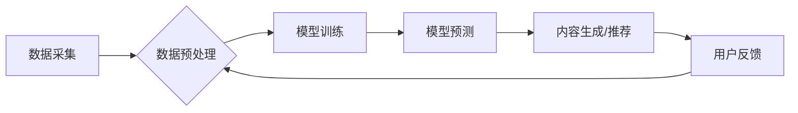

> AI,新闻生产,自动化,个性化,机器学习,自然语言处理,深度学习,新闻推荐,内容生成

## 1. 背景介绍

新闻行业正处于数字化转型和智能化升级的关键时期。传统新闻生产模式面临着信息爆炸、传播渠道多元化、读者需求个性化的挑战。人工智能（AI）技术作为新兴的科技力量，为新闻生产带来了新的机遇和可能性。

AI在新闻生产中的应用，主要体现在以下几个方面：

* **自动化新闻采集和处理:** AI可以自动采集来自互联网、社交媒体等各种渠道的信息，并进行文本清洗、结构化、分类等处理，提高新闻采集效率和准确性。
* **智能新闻内容生成:** AI可以根据预设的模板和规则，自动生成新闻报道、评论文章、数据分析报告等内容，减轻记者的工作负担，提高内容生产速度。
* **个性化新闻推荐:** AI可以根据用户的阅读习惯、兴趣偏好等信息，推荐个性化的新闻内容，提升用户阅读体验和新闻传播效果。
* **新闻内容审核和纠错:** AI可以利用自然语言处理技术，对新闻内容进行语法、逻辑、事实等方面的审核，提高新闻内容的质量和可信度。

## 2. 核心概念与联系

**2.1  新闻生产流程**

传统新闻生产流程通常包括以下几个阶段：

1. **新闻采集:** 记者通过各种渠道收集新闻线索和信息。
2. **新闻编辑:** 编辑对采集到的信息进行筛选、整理、加工，形成新闻稿件。
3. **新闻发布:** 新闻稿件通过各种媒体渠道发布到公众。

**2.2  AI技术在新闻生产中的应用**

AI技术可以应用于新闻生产流程的各个阶段，实现自动化和智能化。

* **新闻采集:** AI可以自动采集来自互联网、社交媒体等各种渠道的信息，并进行文本清洗、结构化、分类等处理。
* **新闻编辑:** AI可以辅助编辑进行新闻内容的筛选、整理、加工，并生成新闻稿件的草稿。
* **新闻发布:** AI可以根据用户的阅读习惯、兴趣偏好等信息，推荐个性化的新闻内容。

**2.3  AI技术架构**

AI技术在新闻生产中的应用，通常采用以下架构：



## 3. 核心算法原理 & 具体操作步骤

### 3.1  算法原理概述

AI在新闻生产中的应用，主要依赖于以下核心算法：

* **机器学习:** 机器学习算法可以从海量数据中学习模式和规律，用于新闻内容分类、主题提取、情感分析等任务。
* **自然语言处理:** 自然语言处理算法可以理解和处理人类语言，用于新闻文本的清洗、结构化、摘要、翻译等任务。
* **深度学习:** 深度学习算法可以学习更复杂的特征表示，用于新闻内容生成、个性化推荐等任务。

### 3.2  算法步骤详解

**3.2.1  机器学习算法步骤:**

1. **数据收集:** 收集大量新闻文本数据，并进行预处理，例如去除停用词、标点符号等。
2. **特征提取:** 从新闻文本中提取特征，例如词频、词向量、语法结构等。
3. **模型训练:** 使用机器学习算法，例如支持向量机、决策树、神经网络等，对训练数据进行训练，学习新闻内容的分类模式。
4. **模型评估:** 使用测试数据评估模型的性能，例如准确率、召回率、F1-score等。
5. **模型部署:** 将训练好的模型部署到生产环境中，用于对新新闻文本进行分类。

**3.2.2  自然语言处理算法步骤:**

1. **文本清洗:** 去除停用词、标点符号、HTML标签等，对文本进行标准化处理。
2. **分词:** 将文本分割成一个个独立的词语或短语。
3. **词性标注:** 为每个词语标注其词性，例如名词、动词、形容词等。
4. **依存句法分析:** 分析句子结构，确定每个词语与其他词语之间的关系。
5. **语义分析:** 理解文本的语义含义，例如情感倾向、主题类别等。

**3.2.3  深度学习算法步骤:**

1. **数据预处理:** 对新闻文本数据进行预处理，例如词嵌入、句子编码等。
2. **模型构建:** 使用深度学习框架，例如TensorFlow、PyTorch等，构建深度神经网络模型，例如循环神经网络、卷积神经网络等。
3. **模型训练:** 使用训练数据对深度神经网络模型进行训练，学习新闻内容的复杂特征表示。
4. **模型评估:** 使用测试数据评估模型的性能，例如准确率、召回率、F1-score等。
5. **模型部署:** 将训练好的深度神经网络模型部署到生产环境中，用于新闻内容生成、个性化推荐等任务。

### 3.3  算法优缺点

**3.3.1  机器学习算法:**

* **优点:** 能够从数据中学习模式和规律，适用于新闻内容分类、主题提取等任务。
* **缺点:** 需要大量 labeled 数据进行训练，对数据质量要求较高。

**3.3.2  自然语言处理算法:**

* **优点:** 可以理解和处理人类语言，适用于新闻文本的清洗、结构化、摘要等任务。
* **缺点:** 对于复杂、歧义的文本理解能力有限。

**3.3.3  深度学习算法:**

* **优点:** 可以学习更复杂的特征表示，适用于新闻内容生成、个性化推荐等任务。
* **缺点:** 需要大量数据和计算资源进行训练，模型解释性较差。

### 3.4  算法应用领域

* **新闻分类:** 根据新闻主题、类别等进行分类，方便用户查找和阅读。
* **新闻摘要:** 自动生成新闻的简要摘要，节省用户阅读时间。
* **新闻推荐:** 根据用户的阅读习惯和兴趣偏好，推荐个性化的新闻内容。
* **新闻内容生成:** 根据预设的模板和规则，自动生成新闻报道、评论文章等内容。
* **新闻事实核查:** 利用AI技术识别虚假信息和谣言，提高新闻内容的可信度。

## 4. 数学模型和公式 & 详细讲解 & 举例说明

### 4.1  数学模型构建

**4.1.1  新闻主题提取模型:**

假设新闻文本为 T，主题集合为 {t1, t2, ..., tn}。

目标是找到每个主题在新闻文本中的权重，即：

```latex
w_i = P(t_i | T)
```

其中，P(t_i | T) 表示给定新闻文本 T，主题 t_i 的条件概率。

可以使用概率模型，例如贝叶斯网络或隐马尔可夫模型，来计算主题权重。

**4.1.2  新闻推荐模型:**

假设用户 u 的历史阅读记录为 R_u，新闻 i 的特征向量为 f_i。

目标是预测用户 u 对新闻 i 的点击概率，即：

```latex
P(click | u, i) = sigmoid(w^T * [f_i; R_u])
```

其中，w 是模型参数，sigmoid 函数是激活函数。

可以使用深度学习模型，例如神经网络或梯度提升树，来学习模型参数。

### 4.2  公式推导过程

**4.2.1  贝叶斯网络主题提取模型:**

贝叶斯网络可以表示新闻文本和主题之间的概率关系。

假设每个词语属于某个主题的概率为：

```latex
P(w_j | t_i)
```

则新闻文本 T 中主题 t_i 的概率为：

```latex
P(t_i | T) = \frac{P(T | t_i) * P(t_i)}{P(T)}
```

其中，P(T | t_i) 是给定主题 t_i，新闻文本 T 的概率，P(t_i) 是主题 t_i 的先验概率，P(T) 是新闻文本 T 的边缘概率。

**4.2.2  梯度提升树新闻推荐模型:**

梯度提升树是一种集成学习算法，可以将多个弱学习器组合成强学习器。

在新闻推荐任务中，可以使用梯度提升树学习用户对新闻的点击概率。

训练过程包括以下步骤：

1. 初始化一个预测模型。
2. 计算模型预测结果与真实结果之间的误差。
3. 使用误差信息训练一个新的弱学习器。
4. 将新的弱学习器添加到模型中。
5. 重复步骤 2-4，直到模型性能达到预定目标。

### 4.3  案例分析与讲解

**4.3.1  主题提取案例:**

可以使用贝叶斯网络主题提取模型，从新闻文本中提取主题，例如“科技”、“财经”、“体育”等。

**4.3.2  新闻推荐案例:**

可以使用梯度提升树新闻推荐模型，根据用户的阅读历史和新闻特征，推荐个性化的新闻内容。

## 5. 项目实践：代码实例和详细解释说明

### 5.1  开发环境搭建

* **操作系统:** Ubuntu 18.04
* **编程语言:** Python 3.6
* **深度学习框架:** TensorFlow 2.0
* **自然语言处理库:** NLTK, SpaCy

### 5.2  源代码详细实现

```python
# 导入必要的库
import tensorflow as tf
from tensorflow.keras.models import Sequential
from tensorflow.keras.layers import Embedding, LSTM, Dense

# 定义新闻文本预处理函数
def preprocess_text(text):
    # ...

# 定义新闻特征提取函数
def extract_features(text):
    # ...

# 定义新闻推荐模型
def build_news_recommendation_model():
    model = Sequential()
    model.add(Embedding(input_dim=vocab_size, output_dim=embedding_dim))
    model.add(LSTM(units=lstm_units))
    model.add(Dense(units=1, activation='sigmoid'))
    return model

# 训练新闻推荐模型
model = build_news_recommendation_model()
model.compile(optimizer='adam', loss='binary_crossentropy', metrics=['accuracy'])
model.fit(X_train, y_train, epochs=10)

# 预测用户对新闻的点击概率
predictions = model.predict(X_test)
```

### 5.3  代码解读与分析

* **新闻文本预处理:** 将新闻文本转换为数字向量，例如使用词嵌入技术。
* **新闻特征提取:** 从新闻文本中提取特征，例如词频、词向量、语法结构等。
* **新闻推荐模型:** 使用深度学习模型，例如神经网络或梯度提升树，来学习用户对新闻的点击概率。
* **模型训练:** 使用训练数据对模型进行训练，学习模型参数。
* **模型预测:** 使用训练好的模型预测用户对新闻的点击概率。

### 5.4  运行结果展示

* **准确率:** 模型在测试数据上的准确率。
* **召回率:** 模型在测试数据中正确预测的正例占所有正例的比例。
* **F1-score:** 模型的准确率和召回率的调和平均值。

## 6. 实际应用场景

**6.1  新闻网站个性化推荐:**

新闻网站可以根据用户的阅读历史和兴趣偏好，推荐个性化的新闻内容，提高用户粘性和阅读体验。

**6.2  社交媒体新闻聚合:**

社交媒体平台可以利用AI技术，从海量用户发布的信息中聚合出热门新闻，并进行分类和推荐。

**6.3  智能新闻助理:**

智能新闻助理可以根据用户的需求，自动搜索和筛选新闻内容，并进行语音或文本播报，帮助用户快速获取所需信息。

**6.4