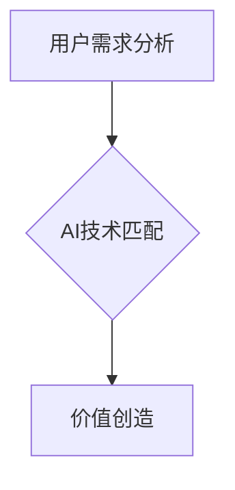

> 人工智能，用户需求，匹配，算法，模型，应用场景，未来趋势

## 1. 背景介绍

人工智能（AI）技术近年来发展迅速，已渗透到生活的方方面面，从智能手机的语音助手到自动驾驶汽车，从医疗诊断到金融风险评估，AI技术的应用场景日益广泛。然而，随着AI技术的不断发展，如何将AI技术与用户需求有效匹配，使其真正惠及人类社会，成为一个亟待解决的关键问题。

传统的软件开发模式往往以技术驱动为主，开发人员根据自身的技术水平和兴趣选择开发方向，而用户需求往往被忽视或被简化。这种模式在AI时代显得越来越不适用，因为AI技术的复杂性和用户需求的多样性，使得单纯依靠技术驱动的方式难以满足用户的实际需求。

## 2. 核心概念与联系

**2.1 用户需求分析**

用户需求分析是AI技术与用户需求匹配的关键环节。它需要深入了解用户的痛点、需求和期望，并将其转化为具体的技术指标和功能需求。

**2.2 AI技术匹配**

AI技术匹配是指根据用户需求选择合适的AI技术和算法，并将其应用于解决用户的实际问题。

**2.3 价值创造**

AI技术与用户需求的匹配最终目的是创造价值，为用户提供更好的体验、更高的效率和更智能的服务。

**Mermaid 流程图**



## 3. 核心算法原理 & 具体操作步骤

**3.1 算法原理概述**

深度学习是AI技术中的一种重要分支，它利用多层神经网络来模拟人类大脑的学习过程，能够从海量数据中学习到复杂的模式和特征。

**3.2 算法步骤详解**

1. 数据收集和预处理：收集相关数据并进行清洗、转换和特征工程等预处理操作。
2. 模型构建：选择合适的深度学习模型架构，例如卷积神经网络（CNN）、循环神经网络（RNN）等。
3. 模型训练：利用训练数据训练模型，调整模型参数，使其能够准确地预测或分类数据。
4. 模型评估：使用测试数据评估模型的性能，例如准确率、召回率、F1-score等。
5. 模型部署：将训练好的模型部署到实际应用场景中，用于预测或分类新的数据。

**3.3 算法优缺点**

**优点：**

* 能够学习到复杂的模式和特征。
* 性能优于传统机器学习算法。
* 可应用于多种领域，例如图像识别、自然语言处理、语音识别等。

**缺点：**

* 需要大量的训练数据。
* 计算资源需求高。
* 模型解释性差。

**3.4 算法应用领域**

* 图像识别和分类
* 自然语言处理
* 语音识别和合成
* 机器翻译
* 医疗诊断
* 金融风险评估

## 4. 数学模型和公式 & 详细讲解 & 举例说明

**4.1 数学模型构建**

深度学习模型通常由多层神经网络组成，每层神经网络包含多个神经元。每个神经元接收来自上一层的输入信号，并对其进行加权求和和激活函数处理，输出到下一层神经元。

**4.2 公式推导过程**

神经网络的学习过程本质上是一个参数优化过程，目标是找到最优的参数，使得模型的输出与真实值之间的误差最小。常用的优化算法包括梯度下降法、动量法、Adam算法等。

**4.3 案例分析与讲解**

例如，在图像识别任务中，深度学习模型可以学习到图像中不同物体特征的表示，并将其用于分类。

**举例说明：**

假设我们有一个包含猫和狗的图像数据集，训练一个深度学习模型进行图像分类。模型的输入是图像像素值，输出是猫和狗的概率。

训练过程中，模型会根据图像标签和模型输出之间的误差，调整模型参数，使得模型能够准确地预测图像中是猫还是狗。

## 5. 项目实践：代码实例和详细解释说明

**5.1 开发环境搭建**

使用Python语言和深度学习框架TensorFlow或PyTorch搭建开发环境。

**5.2 源代码详细实现**

```python
import tensorflow as tf

# 定义模型结构
model = tf.keras.models.Sequential([
    tf.keras.layers.Conv2D(32, (3, 3), activation='relu', input_shape=(28, 28, 1)),
    tf.keras.layers.MaxPooling2D((2, 2)),
    tf.keras.layers.Conv2D(64, (3, 3), activation='relu'),
    tf.keras.layers.MaxPooling2D((2, 2)),
    tf.keras.layers.Flatten(),
    tf.keras.layers.Dense(10, activation='softmax')
])

# 编译模型
model.compile(optimizer='adam',
              loss='sparse_categorical_crossentropy',
              metrics=['accuracy'])

# 训练模型
model.fit(x_train, y_train, epochs=10)

# 评估模型
loss, accuracy = model.evaluate(x_test, y_test)
print('Test loss:', loss)
print('Test accuracy:', accuracy)
```

**5.3 代码解读与分析**

这段代码定义了一个简单的卷积神经网络模型，用于图像分类任务。

* `tf.keras.models.Sequential` 创建了一个顺序模型，神经层按顺序连接。
* `tf.keras.layers.Conv2D` 定义了一个卷积层，用于提取图像特征。
* `tf.keras.layers.MaxPooling2D` 定义了一个最大池化层，用于降低特征图尺寸。
* `tf.keras.layers.Flatten` 将多维特征图转换为一维向量。
* `tf.keras.layers.Dense` 定义了一个全连接层，用于分类。
* `model.compile` 编译模型，指定优化器、损失函数和评价指标。
* `model.fit` 训练模型，使用训练数据进行训练。
* `model.evaluate` 评估模型，使用测试数据评估模型性能。

**5.4 运行结果展示**

训练完成后，模型可以用于预测新的图像类别。

## 6. 实际应用场景

**6.1 智能客服**

AI技术可以用于构建智能客服系统，自动回答用户常见问题，提高客户服务效率。

**6.2 个性化推荐**

AI技术可以分析用户的行为数据，提供个性化的商品或内容推荐，提升用户体验。

**6.3 医疗诊断辅助**

AI技术可以辅助医生进行医疗诊断，提高诊断准确率和效率。

**6.4 自动驾驶**

AI技术是自动驾驶汽车的核心技术，用于感知环境、规划路径和控制车辆。

**6.5 未来应用展望**

AI技术将继续在更多领域得到应用，例如教育、娱乐、金融等，为人类社会带来更多便利和价值。

## 7. 工具和资源推荐

**7.1 学习资源推荐**

* TensorFlow官方文档：https://www.tensorflow.org/
* PyTorch官方文档：https://pytorch.org/
* deeplearning.ai课程：https://www.deeplearning.ai/

**7.2 开发工具推荐**

* Jupyter Notebook：https://jupyter.org/
* Google Colab：https://colab.research.google.com/

**7.3 相关论文推荐**

* AlexNet: ImageNet Classification with Deep Convolutional Neural Networks
* VGGNet: Very Deep Convolutional Networks for Large-Scale Image Recognition
* ResNet: Deep Residual Learning for Image Recognition

## 8. 总结：未来发展趋势与挑战

**8.1 研究成果总结**

近年来，AI技术取得了长足的进步，在图像识别、自然语言处理、语音识别等领域取得了突破性进展。

**8.2 未来发展趋势**

* 模型规模和复杂度不断提高
* 跨模态学习和多任务学习
* 联邦学习和隐私保护
* AI伦理和社会影响

**8.3 面临的挑战**

* 数据获取和隐私保护
* 模型解释性和可信度
* AI伦理和社会影响

**8.4 研究展望**

未来，AI技术将继续朝着更智能、更安全、更可解释的方向发展，为人类社会带来更多福祉。

## 9. 附录：常见问题与解答

**9.1 如何选择合适的AI技术？**

选择合适的AI技术需要根据具体应用场景和数据特点进行分析。

**9.2 如何解决数据获取和隐私保护问题？**

可以采用联邦学习等技术，在不泄露原始数据的情况下进行模型训练。

**9.3 如何评估AI模型的性能？**

可以使用准确率、召回率、F1-score等指标评估模型性能。


作者：禅与计算机程序设计艺术 / Zen and the Art of Computer Programming 
<end_of_turn>