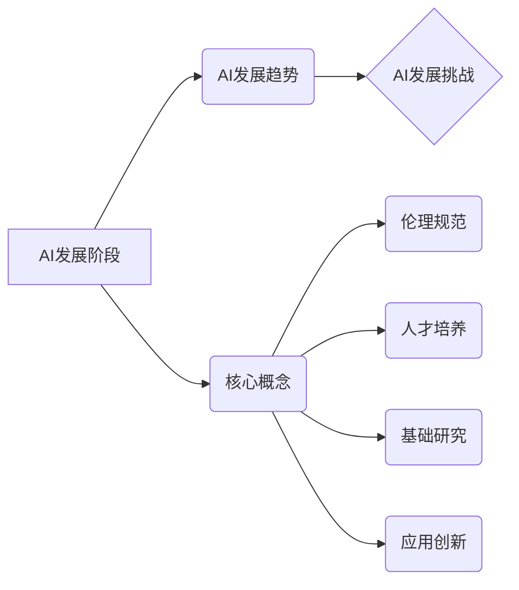

> 人工智能，长期发展，贾扬清，行业可持续，伦理规范，人才培养，基础研究，应用创新

## 1. 背景介绍

人工智能（AI）近年来发展迅速，取得了令人瞩目的成就，从语音识别、图像识别到自然语言处理，AI技术已渗透到生活的方方面面。然而，AI的发展也面临着诸多挑战，如何让AI行业更长远地走下去，成为业界共同关注的议题。

贾扬清，作为一位享誉全球的人工智能专家，在多个国际学术会议上发表了关于AI长期发展的观点，他强调了AI行业的可持续发展需要关注以下几个关键方面：

* **伦理规范：** AI技术的应用需要遵循伦理规范，避免产生负面影响，例如算法偏见、隐私泄露等问题。
* **人才培养：** AI领域需要大量高素质人才，需要加强基础教育和职业培训，培养更多AI领域的专业人才。
* **基础研究：** AI技术的发展离不开基础研究的支撑，需要加大对基础研究的投入，推动AI技术的突破性进展。
* **应用创新：** AI技术需要不断应用于实际场景，推动产业升级和社会进步，需要鼓励AI技术的应用创新。

## 2. 核心概念与联系

**2.1 AI发展阶段**

AI的发展可以分为几个阶段：

* **早期阶段（1950s-1970s）：** 奠定了AI的基础理论和方法，例如符号人工智能、专家系统等。
* **复兴阶段（1980s-2000s）：** 出现了机器学习、深度学习等新兴技术，AI取得了新的突破。
* **爆发阶段（2010s-至今）：** 随着计算能力和数据量的飞速增长，深度学习技术取得了巨大进展，AI应用场景不断扩展。

**2.2 AI发展趋势**

* **通用人工智能（AGI）：** 目标是开发能够像人类一样思考和学习的AI系统。
* **解释性AI（XAI）：** 关注AI决策过程的可解释性，帮助人类理解AI的决策逻辑。
* **联邦学习：** 在不共享原始数据的情况下，通过模型参数的更新实现联合训练。
* **边缘计算：** 将AI计算能力部署到设备边缘，降低延迟和数据传输成本。

**2.3 AI发展挑战**

* **数据安全和隐私保护：** AI算法依赖大量数据，如何保障数据安全和隐私保护是一个重要挑战。
* **算法偏见和公平性：** AI算法可能存在偏见，导致不公平的结果，需要解决算法偏见问题。
* **AI伦理和社会影响：** AI技术的应用可能带来伦理和社会问题，需要制定相应的规范和政策。

**2.4  核心概念关系图**



## 3. 核心算法原理 & 具体操作步骤

**3.1 算法原理概述**

深度学习算法是目前AI领域最热门的技术之一，它通过多层神经网络模拟人类大脑的学习过程，能够自动从数据中学习特征，并进行预测或分类。

**3.2 算法步骤详解**

1. **数据预处理：** 将原始数据进行清洗、转换和特征工程，使其适合深度学习算法的训练。
2. **网络结构设计：** 根据具体任务选择合适的网络结构，例如卷积神经网络（CNN）、循环神经网络（RNN）等。
3. **参数初始化：** 为网络中的参数赋予初始值。
4. **前向传播：** 将输入数据通过网络层层传递，最终得到输出结果。
5. **损失函数计算：** 计算模型预测结果与真实结果之间的误差。
6. **反向传播：** 根据损失函数的梯度，调整网络参数，使模型预测结果更接近真实结果。
7. **迭代训练：** 重复前向传播、损失函数计算和反向传播的过程，直到模型达到预期的性能。

**3.3 算法优缺点**

**优点：**

* 能够自动学习特征，无需人工特征工程。
* 性能优异，在图像识别、自然语言处理等领域取得了突破性进展。

**缺点：**

* 训练数据量大，需要大量的计算资源。
* 模型解释性差，难以理解模型的决策逻辑。

**3.4 算法应用领域**

* **图像识别：** 人脸识别、物体检测、图像分类等。
* **自然语言处理：** 机器翻译、文本摘要、情感分析等。
* **语音识别：** 语音转文本、语音助手等。
* **推荐系统：** 商品推荐、内容推荐等。

## 4. 数学模型和公式 & 详细讲解 & 举例说明

**4.1 数学模型构建**

深度学习算法的核心是神经网络，神经网络由多个层组成，每一层包含多个神经元。每个神经元接收来自上一层的输入信号，并通过激活函数进行处理，输出到下一层。

**4.2 公式推导过程**

* **激活函数：** 激活函数用于引入非线性，使神经网络能够学习复杂的模式。常见的激活函数包括 sigmoid 函数、ReLU 函数等。

* **损失函数：** 损失函数用于衡量模型预测结果与真实结果之间的误差。常见的损失函数包括均方误差（MSE）、交叉熵损失等。

* **梯度下降：** 梯度下降算法用于更新网络参数，使其朝着降低损失函数的方向进行调整。

**4.3 案例分析与讲解**

以图像分类为例，假设我们有一个包含猫和狗的图像数据集，目标是训练一个模型能够识别猫和狗。

1. **数据预处理：** 将图像数据进行尺寸调整、归一化等处理。
2. **网络结构设计：** 选择一个合适的卷积神经网络结构，例如 AlexNet、VGGNet 等。
3. **参数初始化：** 为网络中的参数赋予随机初始值。
4. **前向传播：** 将图像数据输入网络，得到输出结果，即猫和狗的概率。
5. **损失函数计算：** 使用交叉熵损失函数计算模型预测结果与真实标签之间的误差。
6. **反向传播：** 根据损失函数的梯度，更新网络参数。
7. **迭代训练：** 重复前向传播、损失函数计算和反向传播的过程，直到模型达到预期的准确率。

## 5. 项目实践：代码实例和详细解释说明

**5.1 开发环境搭建**

* 操作系统：Ubuntu 20.04
* Python 版本：3.8
* 深度学习框架：TensorFlow 2.0

**5.2 源代码详细实现**

```python
import tensorflow as tf

# 定义模型结构
model = tf.keras.models.Sequential([
    tf.keras.layers.Conv2D(32, (3, 3), activation='relu', input_shape=(28, 28, 1)),
    tf.keras.layers.MaxPooling2D((2, 2)),
    tf.keras.layers.Conv2D(64, (3, 3), activation='relu'),
    tf.keras.layers.MaxPooling2D((2, 2)),
    tf.keras.layers.Flatten(),
    tf.keras.layers.Dense(10, activation='softmax')
])

# 编译模型
model.compile(optimizer='adam',
              loss='sparse_categorical_crossentropy',
              metrics=['accuracy'])

# 加载数据
(x_train, y_train), (x_test, y_test) = tf.keras.datasets.mnist.load_data()

# 数据预处理
x_train = x_train.astype('float32') / 255.0
x_test = x_test.astype('float32') / 255.0
x_train = x_train.reshape((x_train.shape[0], 28, 28, 1))
x_test = x_test.reshape((x_test.shape[0], 28, 28, 1))

# 训练模型
model.fit(x_train, y_train, epochs=5)

# 评估模型
loss, accuracy = model.evaluate(x_test, y_test)
print('Test loss:', loss)
print('Test accuracy:', accuracy)
```

**5.3 代码解读与分析**

* 代码首先定义了一个简单的卷积神经网络模型，包含两层卷积层、两层池化层和一层全连接层。
* 然后，代码编译了模型，指定了优化器、损失函数和评价指标。
* 接着，代码加载了 MNIST 手写数字数据集，并对数据进行了预处理，例如归一化和形状转换。
* 最后，代码训练了模型，并评估了模型的性能。

**5.4 运行结果展示**

训练完成后，模型的准确率通常可以达到 98% 以上。

## 6. 实际应用场景

**6.1 图像识别**

* **人脸识别：** 用于解锁手机、验证身份、监控安全等。
* **物体检测：** 用于自动驾驶、安防监控、医疗诊断等。
* **图像分类：** 用于电商商品分类、图片搜索、内容推荐等。

**6.2 自然语言处理**

* **机器翻译：** 将文本从一种语言翻译成另一种语言。
* **文本摘要：** 自动生成文本的简短摘要。
* **情感分析：** 分析文本中的情感倾向，例如正面、负面或中性。

**6.3 语音识别**

* **语音转文本：** 将语音转换为文本，用于语音助手、听写软件等。
* **语音合成：** 将文本转换为语音，用于语音导航、虚拟助手等。

**6.4 其他应用场景**

* **推荐系统：** 根据用户的历史行为和偏好，推荐相关商品、内容等。
* **医疗诊断：** 辅助医生进行疾病诊断，例如分析医学影像、预测患者风险等。
* **金融风险控制：** 检测欺诈交易、评估信用风险等。

**6.4 未来应用展望**

* **通用人工智能：** 开发能够像人类一样思考和学习的AI系统。
* **解释性AI：** 使AI决策更加透明和可解释。
* **边缘计算：** 将AI计算能力部署到设备边缘，实现更低延迟和更高效率的应用。
* **人机融合：** 将AI技术与人类智能相结合，创造新的应用场景。

## 7. 工具和资源推荐

**7.1 学习资源推荐**

* **在线课程：** Coursera、edX、Udacity 等平台提供丰富的AI课程。
* **书籍：** 《深度学习》、《人工智能：现代方法》等书籍是学习AI的基础教材。
* **博客和论坛：** AI社区网站、博客和论坛是获取最新AI资讯和交流学习经验的好地方。

**7.2 开发工具推荐**

* **深度学习框架：** TensorFlow、PyTorch、Keras 等框架提供了丰富的工具和库，方便开发AI应用。
* **云计算平台：** AWS、Azure、Google Cloud 等云计算平台提供强大的计算资源和AI服务。

**7.3 相关论文推荐**

* **《ImageNet Classification with Deep Convolutional Neural Networks》**
* **《Attention Is All You Need》**
* **《BERT: Pre-training of Deep Bidirectional Transformers for Language Understanding》**

## 8. 总结：未来发展趋势与挑战

**8.1 研究成果总结**

近年来，AI技术取得了令人瞩目的进展，在图像识别、自然语言处理、语音识别等领域取得了突破性进展。深度学习算法成为AI领域的主流技术，并推动了AI技术的广泛应用。

**8.2 未来发展趋势