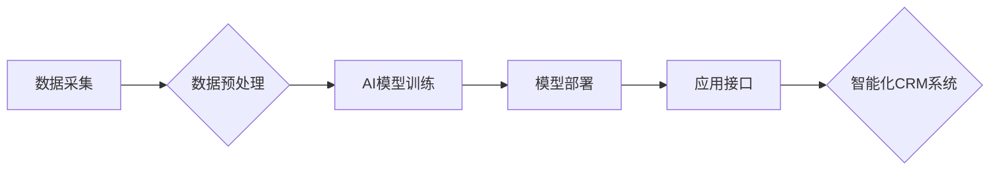

> AI, 客户关系管理, CRM, 机器学习, 自然语言处理, 个性化服务, 预见性分析, 优化

## 1. 背景介绍

在当今数据爆炸的时代，企业积累了海量的客户数据。如何有效地利用这些数据，提升客户体验，提高客户忠诚度，成为企业发展的关键。传统的客户关系管理 (CRM) 系统主要依靠人工操作和规则驱动，难以应对日益复杂的客户需求和数据规模。而人工智能 (AI) 技术的快速发展为CRM带来了新的机遇，为企业提供更智能、更精准、更个性化的客户服务解决方案。

AI驱动的CRM系统能够通过机器学习、自然语言处理等技术，对客户数据进行深度分析，挖掘客户行为模式、需求偏好等隐藏信息，从而实现以下目标：

* **个性化服务:** 根据客户的个人特征、购买历史、浏览行为等信息，提供个性化的产品推荐、营销活动推送和客户服务。
* **预见性分析:** 通过预测客户的未来行为，例如 churn 率、购买意愿等，帮助企业提前采取措施，降低客户流失率，提升销售业绩。
* **智能自动化:** 自动化处理客户咨询、订单处理、售后服务等重复性任务，释放人工资源，提高服务效率。
* **数据驱动决策:** 基于数据分析结果，为企业决策提供科学依据，优化营销策略、产品开发等。

## 2. 核心概念与联系

**2.1 CRM 系统架构**

传统的CRM系统通常由以下几个模块组成：

* **客户数据管理模块:** 用于存储和管理客户的基本信息、联系方式、交易记录等。
* **销售管理模块:** 用于管理销售线索、报价、订单等流程。
* **市场营销模块:** 用于管理营销活动、客户分层、邮件营销等。
* **客户服务模块:** 用于管理客户咨询、投诉、售后服务等流程。

**2.2 AI 技术在 CRM 中的应用**

AI技术可以应用于CRM系统的各个模块，提升其智能化水平。

* **客户数据分析:** 利用机器学习算法，对客户数据进行聚类分析、关联分析等，挖掘客户行为模式、需求偏好等隐藏信息。
* **个性化推荐:** 基于客户的兴趣爱好、购买历史等信息，推荐个性化的产品、服务和营销活动。
* **智能客服:** 利用自然语言处理技术，实现智能客服机器人，自动处理客户咨询、订单处理等任务。
* **预见性分析:** 利用机器学习算法，预测客户的未来行为，例如 churn 率、购买意愿等，帮助企业提前采取措施。

**2.3 AI 驱动的 CRM 系统架构**

AI驱动的CRM系统架构通常包含以下几个关键组件：

* **数据采集与存储:** 收集来自各种渠道的客户数据，并将其存储在统一的数据仓库中。
* **数据预处理与清洗:** 对收集到的数据进行清洗、转换、格式化等处理，使其能够被AI算法有效地使用。
* **AI 模型训练与部署:** 利用机器学习、深度学习等算法，训练出能够对客户数据进行分析和预测的AI模型，并将其部署到生产环境中。
* **应用接口与服务:** 提供API接口，将AI模型的预测结果和分析结果集成到CRM系统的各个模块中，实现智能化功能。

**2.4 Mermaid 流程图**



## 3. 核心算法原理 & 具体操作步骤

### 3.1  算法原理概述

AI驱动的CRM系统中，常用的算法包括：

* **机器学习:** 用于从数据中学习模式和规律，例如分类、回归、聚类等。
* **深度学习:** 一种更高级的机器学习算法，能够处理更复杂的数据，例如图像识别、自然语言处理等。
* **自然语言处理 (NLP):** 用于理解和处理自然语言文本，例如文本分类、情感分析、对话系统等。

### 3.2  算法步骤详解

**3.2.1 机器学习算法步骤:**

1. **数据收集与预处理:** 收集相关数据，并进行清洗、转换、格式化等预处理。
2. **特征工程:** 从原始数据中提取特征，用于训练机器学习模型。
3. **模型选择:** 根据具体任务选择合适的机器学习算法，例如分类算法、回归算法等。
4. **模型训练:** 利用训练数据训练机器学习模型，调整模型参数，使其能够准确地预测目标变量。
5. **模型评估:** 利用测试数据评估模型的性能，例如准确率、召回率、F1-score等。
6. **模型部署:** 将训练好的模型部署到生产环境中，用于实际应用。

**3.2.2 深度学习算法步骤:**

深度学习算法步骤与机器学习算法类似，但更加复杂，通常需要更大的数据集和更强大的计算资源。

**3.2.3 自然语言处理算法步骤:**

1. **文本预处理:** 对文本进行清洗、分词、词性标注等预处理。
2. **词向量表示:** 将单词映射到向量空间，例如Word2Vec、GloVe等。
3. **模型训练:** 利用训练数据训练NLP模型，例如文本分类模型、情感分析模型等。
4. **模型评估:** 利用测试数据评估模型的性能，例如准确率、F1-score等。
5. **模型部署:** 将训练好的模型部署到生产环境中，用于实际应用。

### 3.3  算法优缺点

**3.3.1 机器学习算法:**

* **优点:** 能够从数据中学习模式和规律，对未知数据进行预测。
* **缺点:** 需要大量的训练数据，对数据质量要求较高，难以解释模型的决策过程。

**3.3.2 深度学习算法:**

* **优点:** 能够处理更复杂的数据，性能优于传统机器学习算法。
* **缺点:** 需要更大的数据集和更强大的计算资源，难以解释模型的决策过程。

**3.3.3 自然语言处理算法:**

* **优点:** 能够理解和处理自然语言文本，应用于客户服务、营销等领域。
* **缺点:** 语言理解和生成仍然是一个复杂问题，模型的性能还有待提高。

### 3.4  算法应用领域

* **客户分层:** 根据客户的价值、行为等特征，将客户进行分层，以便针对不同客户群提供个性化的服务。
* **客户流失预测:** 利用机器学习算法，预测客户的流失风险，以便采取措施挽留客户。
* **营销活动优化:** 利用数据分析，优化营销活动的目标客户、营销渠道、营销内容等，提高营销效果。
* **智能客服:** 利用自然语言处理技术，开发智能客服机器人，自动处理客户咨询、订单处理等任务。

## 4. 数学模型和公式 & 详细讲解 & 举例说明

### 4.1  数学模型构建

**4.1.1 客户价值模型:**

客户价值模型可以用来量化客户的价值，例如客户生命周期价值 (CLTV) 、客户获取成本 (CAC) 等。

**4.1.2 客户流失预测模型:**

客户流失预测模型可以用来预测客户的流失风险，例如 logistic 回归模型、支持向量机 (SVM) 模型等。

**4.1.3 营销活动效果评估模型:**

营销活动效果评估模型可以用来评估营销活动的有效性，例如 A/B 测试、转化率分析等。

### 4.2  公式推导过程

**4.2.1 CLTV 计算公式:**

$$CLTV = \sum_{t=1}^{T} \frac{R_t}{(1+r)^t}$$

其中:

* $R_t$ 是第 t 个时间段的收入
* $r$ 是折扣率
* $T$ 是客户生命周期

**4.2.2 Logistic 回归模型:**

Logistic 回归模型用于预测二分类问题，例如客户是否流失。模型的输出是一个概率值，表示客户流失的可能性。

$$P(y=1|x) = \frac{1}{1+e^{-(w^Tx+b)}}$$

其中:

* $y$ 是客户是否流失的标签 (0 或 1)
* $x$ 是客户特征向量
* $w$ 是模型参数向量
* $b$ 是模型偏置项

### 4.3  案例分析与讲解

**4.3.1 CLTV 案例分析:**

假设一个电商平台的客户平均购买金额为 100 元，折扣率为 5%，客户生命周期为 2 年，那么该客户的 CLTV 为:

$$CLTV = \frac{100}{(1+0.05)^1} + \frac{100}{(1+0.05)^2} \approx 190.48$$

**4.3.2 客户流失预测案例分析:**

利用 Logistic 回归模型，可以预测客户流失的概率。例如，如果模型预测客户流失的概率为 70%，那么企业可以采取措施挽留该客户。

## 5. 项目实践：代码实例和详细解释说明

### 5.1  开发环境搭建

* **操作系统:** Ubuntu 20.04 LTS
* **编程语言:** Python 3.8
* **深度学习框架:** TensorFlow 2.0
* **数据处理库:** Pandas, NumPy
* **机器学习库:** scikit-learn

### 5.2  源代码详细实现

```python
# 导入必要的库
import pandas as pd
from sklearn.model_selection import train_test_split
from sklearn.linear_model import LogisticRegression
from sklearn.metrics import accuracy_score

# 加载客户数据
data = pd.read_csv('customer_data.csv')

# 选择特征和目标变量
features = ['age', 'income', 'purchase_frequency']
target = 'churn'

# 将数据进行训练集和测试集划分
X_train, X_test, y_train, y_test = train_test_split(data[features], data[target], test_size=0.2, random_state=42)

# 创建 Logistic 回归模型
model = LogisticRegression()

# 训练模型
model.fit(X_train, y_train)

# 对测试集进行预测
y_pred = model.predict(X_test)

# 计算模型准确率
accuracy = accuracy_score(y_test, y_pred)
print(f'模型准确率: {accuracy}')
```

### 5.3  代码解读与分析

* 代码首先导入必要的库，然后加载客户数据。
* 选择特征和目标变量，将数据进行训练集和测试集划分。
* 创建 Logistic 回归模型，并使用训练集训练模型。
* 对测试集进行预测，并计算模型准确率。

### 5.4  运行结果展示

运行上述代码后，会输出模型的准确率。例如，如果模型的准确率为 0.85，则表示模型能够准确预测客户流失的 85% 的情况。

## 6. 实际应用场景

**6.1  个性化营销:**

AI驱动的CRM系统可以根据客户的兴趣爱好、购买历史等信息，推荐个性化的产品、服务和营销活动，提高营销效果。例如，电商平台可以根据用户的浏览记录，推荐相关的商品，提高用户的购买意愿。

**6.2  智能客服:**

AI驱动的CRM系统可以开发智能客服机器人，自动处理客户咨询、订单处理等任务，提高服务效率。例如，银行可以开发智能客服机器人，帮助客户查询账户余额、转账等操作。

**6.3  客户关系管理:**

AI驱动的CRM系统可以帮助企业更好地管理客户关系，例如客户分层、客户流失预测、客户服务优化等。例如，企业可以利用客户流失预测模型，提前采取措施挽留流失客户。

**6.4  未来应用展望:**

随着AI技术的不断发展，AI驱动的CRM系统将会有更广泛的应用场景，例如：

* **更精准的客户画像:** 利用更先进的AI算法，构建更精准的客户画像，更好地