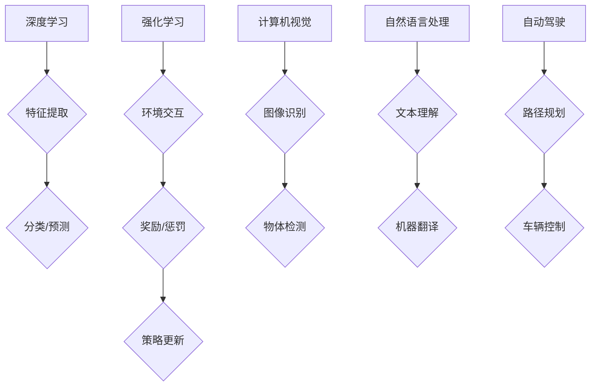

> 人工智能，深度学习，强化学习，计算机视觉，自然语言处理，自动驾驶，伦理

## 1. 背景介绍

人工智能（AI）正以惊人的速度发展，深刻地改变着我们生活的方方面面。从智能手机的语音助手到自动驾驶汽车，AI技术已经渗透到我们的日常生活中。而Andrej Karpathy，作为一位享誉全球的人工智能专家，其对AI未来发展趋势的洞察和预测，备受业界关注。

Karpathy曾担任特斯拉自动驾驶团队的负责人，并在OpenAI担任研究科学家。他是一位杰出的程序员、软件架构师和技术畅销书作者，对深度学习、强化学习、计算机视觉和自然语言处理等领域有着深入的研究和实践经验。

## 2. 核心概念与联系

**2.1 深度学习**

深度学习是人工智能领域的一个重要分支，它利用多层神经网络来模拟人类大脑的学习过程。通过大量的训练数据，深度学习模型能够自动学习特征，并进行复杂的模式识别和预测。

**2.2 强化学习**

强化学习是一种基于奖励机制的机器学习方法。在强化学习中，智能体通过与环境交互，获得奖励或惩罚，并根据这些反馈调整其行为策略，以最大化累积奖励。

**2.3 计算机视觉**

计算机视觉是人工智能领域的一个重要方向，它旨在使计算机能够“看”和理解图像和视频。计算机视觉技术广泛应用于图像识别、物体检测、场景理解等领域。

**2.4 自然语言处理**

自然语言处理（NLP）是人工智能领域的一个重要分支，它旨在使计算机能够理解和处理人类语言。NLP技术广泛应用于机器翻译、文本摘要、情感分析等领域。

**2.5 自动驾驶**

自动驾驶是人工智能技术应用的一个重要领域，它旨在开发能够自主驾驶的车辆。自动驾驶系统需要融合计算机视觉、传感器融合、路径规划等多种技术。

**2.6 伦理问题**

随着人工智能技术的快速发展，其伦理问题也日益受到关注。例如，人工智能算法的偏见、数据隐私保护、人工智能的责任归属等问题都需要认真思考和解决。

**Mermaid 流程图**

## 3. 核心算法原理 & 具体操作步骤

### 3.1 算法原理概述

深度学习算法的核心是多层神经网络。神经网络由多个层组成，每一层包含多个神经元。每个神经元接收来自上一层的输入信号，并对其进行处理，然后将处理后的信号传递给下一层的输入。通过训练，神经网络能够学习到数据的特征表示，并进行预测或分类。

### 3.2 算法步骤详解

1. **数据预处理:** 将原始数据转换为深度学习模型可以理解的格式。
2. **网络结构设计:** 根据任务需求设计神经网络的结构，包括层数、神经元数量、激活函数等。
3. **参数初始化:** 为神经网络的参数进行随机初始化。
4. **前向传播:** 将输入数据通过神经网络进行前向传播，得到输出结果。
5. **损失函数计算:** 计算模型输出与真实值的差异，即损失函数值。
6. **反向传播:** 利用梯度下降算法，反向传播损失函数值，更新神经网络的参数。
7. **训练迭代:** 重复步骤4-6，直到模型性能达到预期的水平。

### 3.3 算法优缺点

**优点:**

* 能够自动学习特征，无需人工特征工程。
* 能够处理高维数据，并发现复杂模式。
* 性能优异，在许多任务中取得了突破性进展。

**缺点:**

* 训练数据量大，需要大量的计算资源。
* 训练过程复杂，需要专业的知识和经验。
* 模型解释性差，难以理解模型的决策过程。

### 3.4 算法应用领域

深度学习算法广泛应用于图像识别、语音识别、自然语言处理、机器翻译、自动驾驶、医疗诊断等领域。

## 4. 数学模型和公式 & 详细讲解 & 举例说明

### 4.1 数学模型构建

深度学习模型通常采用多层感知机（MLP）或卷积神经网络（CNN）等结构。

**4.1.1 多层感知机（MLP）**

MLP由多个全连接层组成，每一层的神经元都与上一层的每个神经元连接。

**4.1.2 卷积神经网络（CNN）**

CNN利用卷积层和池化层来提取图像特征。卷积层通过卷积核对图像进行卷积运算，提取图像局部特征。池化层对卷积层的输出进行降维，减少计算量。

### 4.2 公式推导过程

**4.2.1 激活函数**

激活函数用于引入非线性，使神经网络能够学习复杂的模式。常见的激活函数包括ReLU、Sigmoid和Tanh。

**4.2.2 损失函数**

损失函数用于衡量模型预测结果与真实值的差异。常见的损失函数包括均方误差（MSE）和交叉熵损失（Cross-Entropy Loss）。

**4.2.3 梯度下降算法**

梯度下降算法用于更新神经网络的参数，使其朝着最小化损失函数的方向进行调整。

### 4.3 案例分析与讲解

**4.3.1 图像分类**

使用CNN模型进行图像分类，例如识别猫和狗的图片。

**4.3.2 语音识别**

使用RNN模型进行语音识别，例如将语音转换为文本。

## 5. 项目实践：代码实例和详细解释说明

### 5.1 开发环境搭建

使用Python语言和深度学习框架TensorFlow或PyTorch搭建开发环境。

### 5.2 源代码详细实现

使用TensorFlow或PyTorch框架实现一个简单的图像分类模型，例如识别手写数字。

### 5.3 代码解读与分析

解释代码中的关键部分，例如网络结构、损失函数、优化算法等。

### 5.4 运行结果展示

展示模型的训练过程和测试结果，例如准确率、损失函数值等。

## 6. 实际应用场景

### 6.1 自动驾驶

使用深度学习算法进行图像识别、物体检测和路径规划，实现自动驾驶汽车。

### 6.2 医疗诊断

使用深度学习算法进行图像分析，辅助医生进行疾病诊断。

### 6.3 金融风险管理

使用深度学习算法进行数据分析，识别金融风险。

### 6.4 未来应用展望

人工智能技术将继续发展，并在更多领域得到应用，例如个性化教育、智能家居、机器人等。

## 7. 工具和资源推荐

### 7.1 学习资源推荐

* **书籍:**
    * 深度学习
    * 人工智能：一个现代方法
* **在线课程:**
    * Coursera深度学习课程
    * Udacity人工智能课程

### 7.2 开发工具推荐

* **深度学习框架:** TensorFlow, PyTorch
* **编程语言:** Python
* **数据处理工具:** Pandas, NumPy

### 7.3 相关论文推荐

* **ImageNet Classification with Deep Convolutional Neural Networks**
* **Deep Learning**
* **Attention Is All You Need**

## 8. 总结：未来发展趋势与挑战

### 8.1 研究成果总结

深度学习算法取得了显著的进展，在图像识别、语音识别、自然语言处理等领域取得了突破性成果。

### 8.2 未来发展趋势

* **模型规模和复杂度提升:** 模型参数数量和层数将继续增加，以提高模型性能。
* **数据驱动的学习:** 更加注重数据质量和数据量的提升，以推动模型的进步。
* **跨模态学习:** 融合不同模态的数据，例如文本、图像、音频，以实现更全面的理解。
* **可解释性增强:** 研究更易于理解和解释的模型，以提高模型的信任度。

### 8.3 面临的挑战

* **数据偏见:** 训练数据可能存在偏见，导致模型输出结果不公平。
* **计算资源需求:** 训练大型深度学习模型需要大量的计算资源。
* **伦理问题:** 人工智能技术的应用可能带来伦理问题，需要认真思考和解决。

### 8.4 研究展望

未来人工智能研究将继续探索更强大的算法、更丰富的应用场景和更完善的伦理规范，以推动人工智能技术更好地服务于人类社会。

## 9. 附录：常见问题与解答

**9.1 什么是深度学习？**

深度学习是一种机器学习方法，它利用多层神经网络来模拟人类大脑的学习过程。

**9.2 深度学习有哪些应用场景？**

深度学习广泛应用于图像识别、语音识别、自然语言处理、机器翻译、自动驾驶、医疗诊断等领域。

**9.3 如何学习深度学习？**

可以通过阅读书籍、参加在线课程、参与开源项目等方式学习深度学习。

作者：禅与计算机程序设计艺术 / Zen and the Art of Computer Programming

<end_of_turn>