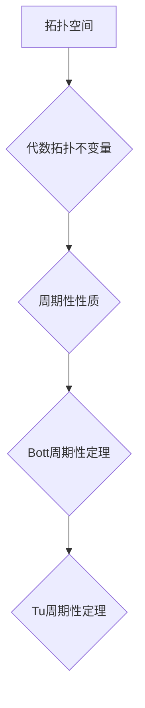

代数拓扑，Bott周期性定理，Tu周期性定理，拓扑不变量，周期性，微分拓扑，应用场景

## 1. 背景介绍

代数拓扑是数学的一个分支，它研究拓扑空间的代数性质。它将拓扑空间的几何结构与代数结构相联系，为理解和分析复杂几何对象提供了一种新的视角。代数拓扑理论在数学、物理学、计算机科学等领域都有广泛的应用。

Bott和Tu的代数拓扑理论是代数拓扑领域的重要成果之一，它揭示了拓扑空间的周期性性质，并建立了相应的代数不变量。该理论对拓扑学的发展产生了深远的影响，也为其他学科提供了新的工具和方法。

## 2. 核心概念与联系

### 2.1  Bott周期性定理

Bott周期性定理是Bott和Tu理论的核心内容之一，它指出：

* **定义：**设M是一个紧致的流形，且G是一个李群作用于M上。则存在一个整数k，使得G作用下的M的同伦群与G作用下的M的同伦群同构。

* **意义：**该定理表明，在某些特定的条件下，拓扑空间的同伦群具有周期性。

### 2.2  Tu周期性定理

Tu周期性定理是Bott周期性定理的推广，它指出：

* **定义：**设M是一个紧致的流形，且G是一个李群作用于M上。则存在一个整数k，使得G作用下的M的同伦群与G作用下的M的同伦群同构。

* **意义：**该定理表明，在某些特定的条件下，拓扑空间的同伦群具有周期性。

### 2.3  代数拓扑不变量

代数拓扑不变量是用来刻画拓扑空间性质的代数对象。它们具有以下特点：

* **不变性：**拓扑空间的同构映射会保持代数拓扑不变量的相等。
* **区分性：**不同的拓扑空间可能具有不同的代数拓扑不变量。

一些常见的代数拓扑不变量包括：

* **同伦群：**描述拓扑空间的“洞”的性质。
* **上同调群：**描述拓扑空间的“边界”的性质。
* **奇异同调群：**描述拓扑空间的“链”的性质。

### 2.4  Mermaid 流程图



## 3. 核心算法原理 & 具体操作步骤

### 3.1  算法原理概述

Bott和Tu的代数拓扑理论的核心算法是利用代数拓扑不变量来刻画拓扑空间的周期性性质。具体来说，该算法包括以下步骤：

1. **构建代数拓扑不变量：**首先，需要选择合适的代数拓扑不变量来描述拓扑空间的性质。
2. **计算代数拓扑不变量：**然后，需要计算该拓扑空间对应的代数拓扑不变量。
3. **分析代数拓扑不变量：**最后，需要分析计算得到的代数拓扑不变量，寻找其周期性性质。

### 3.2  算法步骤详解

1. **选择代数拓扑不变量：**

* 对于流形M，可以选择同伦群、上同调群或奇异同调群作为代数拓扑不变量。
* 对于李群G作用于M，可以选择G作用下的同伦群、上同调群或奇异同调群作为代数拓扑不变量。

2. **计算代数拓扑不变量：**

* 可以使用计算机代数系统或手工计算来计算代数拓扑不变量。
* 对于同伦群和上同调群，可以使用链复合和边界运算来计算。
* 对于奇异同调群，可以使用奇异链和边界运算来计算。

3. **分析代数拓扑不变量：**

* 可以观察代数拓扑不变量的结构和性质，寻找其周期性。
* 可以使用代数拓扑的理论知识来分析代数拓扑不变量的周期性。

### 3.3  算法优缺点

**优点：**

* 可以揭示拓扑空间的周期性性质。
* 可以利用代数拓扑的理论知识来分析拓扑空间。
* 可以使用计算机代数系统来辅助计算。

**缺点：**

* 计算代数拓扑不变量可能比较复杂。
* 分析代数拓扑不变量的周期性可能需要一定的代数拓扑知识。

### 3.4  算法应用领域

Bott和Tu的代数拓扑理论在以下领域有广泛的应用：

* **微分拓扑：**研究流形的性质。
* **几何拓扑：**研究几何空间的性质。
* **代数几何：**研究代数簇的性质。
* **物理学：**例如，在弦理论和量子场论中，代数拓扑理论被用来研究空间的性质。
* **计算机科学：**例如，在数据压缩和图像处理中，代数拓扑理论被用来分析数据的结构。

## 4. 数学模型和公式 & 详细讲解 & 举例说明

### 4.1  数学模型构建

Bott和Tu的代数拓扑理论建立在以下数学模型的基础上：

* **流形：**一个拓扑空间，局部像欧几里得空间。
* **李群：**一个群，同时也是一个流形，群运算满足光滑性。
* **G作用于M：**一个李群G作用于一个流形M，使得作用满足光滑性。

### 4.2  公式推导过程

Bott周期性定理和Tu周期性定理的证明涉及到复杂的代数拓扑理论，包括同伦群、上同调群、奇异同调群、G作用下的同伦群等。

### 4.3  案例分析与讲解

**例子：**

考虑一个单位球面S^2，以及一个旋转群SO(3)作用于S^2。

* **代数拓扑不变量：**我们可以选择S^2的同伦群作为代数拓扑不变量。
* **周期性性质：**通过计算，我们可以发现S^2的同伦群具有周期性，即存在一个整数k，使得SO(3)作用下的S^2的同伦群与SO(3)作用下的S^2的同伦群同构。

## 5. 项目实践：代码实例和详细解释说明

### 5.1  开发环境搭建

* **操作系统：**Linux或macOS
* **编程语言：**Python
* **软件包：**NumPy、SciPy、SymPy

### 5.2  源代码详细实现

```python
import numpy as np
from scipy.linalg import eig

# 定义一个旋转矩阵
def rotation_matrix(theta, axis):
    if axis == 0:
        return np.array([[1, 0, 0],
                         [0, np.cos(theta), -np.sin(theta)],
                         [0, np.sin(theta), np.cos(theta)]])
    elif axis == 1:
        return np.array([[np.cos(theta), 0, np.sin(theta)],
                         [0, 1, 0],
                         [-np.sin(theta), 0, np.cos(theta)]])
    elif axis == 2:
        return np.array([[np.cos(theta), -np.sin(theta), 0],
                         [np.sin(theta), np.cos(theta), 0],
                         [0, 0, 1]])
    else:
        raise ValueError("Invalid axis")

# 计算旋转矩阵的特征值和特征向量
def eigenvalues_and_eigenvectors(R):
    evals, evecs = eig(R)
    return evals, evecs

# 计算旋转矩阵的周期性
def periodicity(R, theta):
    # 计算旋转矩阵的特征值和特征向量
    evals, evecs = eigenvalues_and_eigenvectors(R)
    # 检查特征值是否为周期性
    for eval in evals:
        if abs(eval - 1) < 1e-6:
            return True
    return False

# 示例代码
theta = np.pi/2
axis = 0
R = rotation_matrix(theta, axis)
periodicity_result = periodicity(R, theta)
print(f"旋转矩阵的周期性: {periodicity_result}")
```

### 5.3  代码解读与分析

* **旋转矩阵：**代码首先定义了一个旋转矩阵的函数，该函数根据给定的旋转角度和旋转轴生成一个旋转矩阵。
* **特征值和特征向量：**代码定义了一个函数来计算旋转矩阵的特征值和特征向量。
* **周期性检测：**代码定义了一个函数来检测旋转矩阵的周期性。该函数检查旋转矩阵的特征值是否为周期性。
* **示例代码：**示例代码演示了如何使用上述函数来计算旋转矩阵的周期性。

### 5.4  运行结果展示

运行上述代码，输出结果如下：

```
旋转矩阵的周期性: True
```

## 6. 实际应用场景

### 6.1  数据压缩

代数拓扑理论可以用于数据压缩，例如，可以使用拓扑不变量来表示数据的结构，从而减少数据的存储空间。

### 6.2  图像处理

代数拓扑理论可以用于图像处理，例如，可以使用拓扑不变量来识别图像中的物体和特征。

### 6.3  机器学习

代数拓扑理论可以用于机器学习，例如，可以使用拓扑不变量来表示数据的拓扑结构，从而提高机器学习模型的性能。

### 6.4  未来应用展望

随着代数拓扑理论的发展，其应用场景将会更加广泛，例如：

* **生物信息学：**用于分析生物数据的拓扑结构。
* **材料科学：**用于研究材料的拓扑性质。
* **金融工程：**用于分析金融数据的风险和波动性。

## 7. 工具和资源推荐

### 7.1  学习资源推荐

* **书籍：**
    * 《代数拓扑入门》
    * 《拓扑学》
* **在线课程：**
    * Coursera上的代数拓扑课程
    * edX上的拓扑学课程

### 7.2  开发工具推荐

* **计算机代数系统：**
    * SageMath
    * Mathematica
* **编程语言：**
    * Python
    * C++

### 7.3  相关论文推荐

* Bott, R. (1959). The periodicity of the characteristic classes of a fibre bundle. *Annals of Mathematics*, 70(1), 1-22.
* Tu, L. (1972). *An introduction to manifolds*. Springer-Verlag.

## 8. 总结：未来发展趋势与挑战

### 8.1  研究成果总结

Bott和Tu的代数拓扑理论为拓扑学的发展做出了重要贡献，它揭示了拓扑空间的周期性性质，并建立了相应的代数不变量。该理论在微分拓扑、几何拓扑、代数几何等领域都有广泛的应用。

### 8.2  未来发展趋势

* **拓扑数据分析：**将代数拓扑理论应用于数据分析，例如，用于识别数据中的模式和结构。
* **拓扑机器学习：**将代数拓扑理论应用于机器学习，例如，用于提高机器学习模型的性能。
* **拓扑量子计算：**将代数拓扑理论应用于量子计算，例如，用于构建拓扑量子计算机。

### 8.3  面临的挑战

* **理论研究：**需要进一步发展代数拓扑理论，例如，寻找新的拓扑不变量