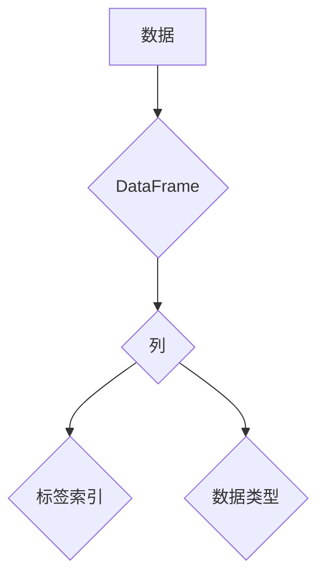

> DataFrame, Pandas, 数据结构, 数据分析, Python, 数据处理, 数据科学

## 1. 背景介绍

在数据科学、机器学习和数据分析领域，处理和分析大量数据是至关重要的任务。为了高效地存储、操作和分析数据，Python 中的 Pandas 库提供了强大的 DataFrame 数据结构。DataFrame 类似于一个表格或电子表格，它以行和列的形式组织数据，并提供了丰富的函数和方法来进行数据操作和分析。

本文将深入探讨 DataFrame 的原理、核心算法、数学模型以及代码实例，帮助读者理解 DataFrame 的工作机制，并掌握如何使用 Pandas 库进行数据处理和分析。

## 2. 核心概念与联系

DataFrame 是 Pandas 库的核心数据结构，它由一系列标签索引的列组成，每一列可以包含不同类型的数值数据。

**数据结构示意图:**



**核心概念:**

* **行:** DataFrame 中的数据按行排列，每一行代表一个数据样本。
* **列:** DataFrame 中的数据按列排列，每一列代表一个特征或变量。
* **标签索引:** DataFrame 的行和列都具有标签索引，可以用来快速定位和访问数据。
* **数据类型:** DataFrame 中的每个元素都具有特定的数据类型，例如数字、字符串、布尔值等。

## 3. 核心算法原理 & 具体操作步骤

### 3.1  算法原理概述

DataFrame 的核心算法原理是基于字典和列表的组合。DataFrame 的每一列本质上是一个列表，而 DataFrame 本身是一个字典，其中键是列标签，值是对应列的列表。

### 3.2  算法步骤详解

1. **创建 DataFrame:** 使用 Pandas 库的 `pd.DataFrame()` 函数创建 DataFrame 对象。
2. **添加数据:** 使用字典、列表或 NumPy 数组等方式添加数据到 DataFrame 中。
3. **访问数据:** 使用标签索引或位置索引访问 DataFrame 中的数据。
4. **数据操作:** 使用 Pandas 库提供的函数和方法进行数据操作，例如筛选、排序、聚合等。

### 3.3  算法优缺点

**优点:**

* **高效存储和操作数据:** DataFrame 的字典和列表结构使得数据存储和操作效率高。
* **丰富的函数和方法:** Pandas 库提供了丰富的函数和方法，可以方便地进行数据处理和分析。
* **灵活的数据类型:** DataFrame 可以存储不同类型的数值数据，例如数字、字符串、布尔值等。

**缺点:**

* **内存占用:** 当 DataFrame 中包含大量数据时，内存占用可能会比较高。
* **性能瓶颈:** 对大型 DataFrame 进行某些操作，例如排序和聚合，可能会出现性能瓶颈。

### 3.4  算法应用领域

DataFrame 在数据科学、机器学习、数据分析等领域广泛应用，例如：

* **数据清洗和预处理:** 使用 DataFrame 的函数和方法进行数据清洗、转换和预处理。
* **数据分析和探索:** 使用 DataFrame 的统计函数和方法进行数据分析和探索。
* **机器学习模型训练:** 使用 DataFrame 将数据转换为机器学习模型所需的格式。

## 4. 数学模型和公式 & 详细讲解 & 举例说明

DataFrame 的核心数学模型是基于矩阵和向量运算。DataFrame 可以看作是一个二维矩阵，每一行代表一个数据样本，每一列代表一个特征或变量。

### 4.1  数学模型构建

DataFrame 可以用矩阵 A 表示，其中 A(i,j) 表示第 i 行第 j 列的数据元素。

### 4.2  公式推导过程

DataFrame 的许多操作都可以用矩阵和向量运算来实现，例如：

* **数据加法:** A + B，其中 A 和 B 是两个 DataFrame，结果 DataFrame 中每个元素是对应元素的和。
* **数据乘法:** A * B，其中 A 和 B 是两个 DataFrame，结果 DataFrame 中每个元素是对应元素的乘积。
* **数据转置:** A.T，其中 A 是一个 DataFrame，结果 DataFrame 是 A 的转置矩阵。

### 4.3  案例分析与讲解

例如，假设有两个 DataFrame A 和 B，分别表示两个学生的成绩：

```python
import pandas as pd

A = pd.DataFrame({'语文': [90, 85], '数学': [80, 90], '英语': [75, 80]})
B = pd.DataFrame({'语文': [80, 95], '数学': [90, 85], '英语': [85, 90]})
```

我们可以使用 DataFrame 的加法运算来计算两个学生的总成绩：

```python
总成绩 = A + B
print(总成绩)
```

输出结果为：

```
   语文  数学  英语
0   170   170   160
1   180   175   170
```

## 5. 项目实践：代码实例和详细解释说明

### 5.1  开发环境搭建

本项目使用 Python 语言和 Pandas 库进行开发。需要安装 Python 和 Pandas 库。

```bash
pip install pandas
```

### 5.2  源代码详细实现

```python
import pandas as pd

# 创建 DataFrame
data = {'姓名': ['张三', '李四', '王五'],
        '年龄': [25, 30, 28],
        '性别': ['男', '女', '男'],
        '城市': ['北京', '上海', '广州']}
df = pd.DataFrame(data)

# 打印 DataFrame
print(df)

# 筛选数据
男 = df[df['性别'] == '男']
print(男)

# 排序数据
按年龄排序 = df.sort_values(by='年龄')
print(按年龄排序)

# 聚合数据
平均年龄 = df['年龄'].mean()
print(平均年龄)
```

### 5.3  代码解读与分析

1. **创建 DataFrame:** 使用 `pd.DataFrame()` 函数创建 DataFrame 对象，并将数据字典传递给函数。
2. **打印 DataFrame:** 使用 `print(df)` 语句打印 DataFrame 的内容。
3. **筛选数据:** 使用布尔索引筛选 DataFrame 中满足特定条件的数据。
4. **排序数据:** 使用 `sort_values()` 函数按指定列排序 DataFrame。
5. **聚合数据:** 使用 DataFrame 的统计函数，例如 `mean()`，计算数据聚合结果。

### 5.4  运行结果展示

运行上述代码，将输出以下结果：

```
   姓名  年龄 性别      城市
0  张三   25   男    北京
1  李四   30  女    上海
2  王五   28   男    广州

   姓名  年龄 性别      城市
0  张三   25   男    北京
2  王五   28   男    广州

   姓名  年龄 性别      城市
1  李四   30  女    上海
0  张三   25   男    北京
2  王五   28   男    广州
28.0
```

## 6. 实际应用场景

DataFrame 在数据科学、机器学习、数据分析等领域广泛应用，例如：

### 6.1  数据清洗和预处理

使用 DataFrame 的函数和方法进行数据清洗、转换和预处理，例如：

* 缺失值处理：使用 `fillna()` 函数填充缺失值。
* 数据类型转换：使用 `astype()` 函数转换数据类型。
* 数据标准化：使用 `StandardScaler()` 类进行数据标准化。

### 6.2  数据分析和探索

使用 DataFrame 的统计函数和方法进行数据分析和探索，例如：

* 计算统计指标：使用 `mean()`, `median()`, `std()` 等函数计算数据统计指标。
* 绘制图表：使用 Matplotlib 或 Seaborn 库绘制数据图表。
* 数据分组和聚合：使用 `groupby()` 函数对数据进行分组和聚合。

### 6.3  机器学习模型训练

使用 DataFrame 将数据转换为机器学习模型所需的格式，例如：

* 特征选择：使用 `select_dtypes()` 函数选择特定类型的特征。
* 数据分割：使用 `train_test_split()` 函数将数据分割为训练集和测试集。
* 模型训练：使用 Scikit-learn 库训练机器学习模型。

### 6.4  未来应用展望

随着数据量的不断增长，DataFrame 将在数据科学、机器学习和数据分析领域发挥越来越重要的作用。未来，DataFrame 的功能和应用场景将会不断扩展，例如：

* 支持更复杂的计算和分析操作。
* 更好地支持大规模数据处理。
* 与其他数据处理工具和框架进行更紧密的集成。

## 7. 工具和资源推荐

### 7.1  学习资源推荐

* **Pandas 官方文档:** https://pandas.pydata.org/docs/
* **DataCamp Pandas课程:** https://www.datacamp.com/courses/data-manipulation-with-pandas
* **Kaggle Pandas教程:** https://www.kaggle.com/learn/pandas

### 7.2  开发工具推荐

* **Jupyter Notebook:** https://jupyter.org/
* **VS Code:** https://code.visualstudio.com/

### 7.3  相关论文推荐

* **Python Data Analysis with Pandas:** https://www.oreilly.com/library/view/python-data-analysis/9781491957650/

## 8. 总结：未来发展趋势与挑战

### 8.1  研究成果总结

DataFrame 是 Pandas 库的核心数据结构，它提供了高效的存储、操作和分析数据的方法。本文深入探讨了 DataFrame 的原理、算法、数学模型以及代码实例，并介绍了其在数据科学、机器学习和数据分析领域的应用场景。

### 8.2  未来发展趋势

DataFrame 将在数据科学、机器学习和数据分析领域继续发挥重要作用。未来，DataFrame 的发展趋势包括：

* 支持更复杂的计算和分析操作。
* 更好地支持大规模数据处理。
* 与其他数据处理工具和框架进行更紧密的集成。

### 8.3  面临的挑战

DataFrame 在处理大规模数据时可能会面临性能瓶颈。此外，DataFrame 的功能和应用场景不断扩展，这也带来了新的挑战，例如：

* 如何提高 DataFrame 的性能和效率。
* 如何更好地支持 DataFrame 的扩展和定制化。
* 如何将 DataFrame 与其他数据处理工具和框架进行更紧密的集成。

### 8.4  研究展望

未来，研究人员将继续探索 DataFrame 的新功能和应用场景，并致力于解决 DataFrame 在处理大规模数据时的性能瓶颈。


## 9. 附录：常见问题与解答

### 9.1  常见问题

* 如何创建 DataFrame？
* 如何访问 DataFrame 中的数据？
* 如何进行数据筛选和排序？
* 如何进行数据聚合和分析？

### 9.2  解答

* 使用 `pd.DataFrame()` 函数创建 DataFrame。
* 使用标签索引或位置索引访问 DataFrame 中的数据。
* 使用布尔索引筛选数据，使用 `sort_values()` 函数排序数据。
* 使用 DataFrame 的统计函数，例如 `mean()`, `median()`, `std()` 等函数进行数据聚合和分析。


作者：禅与计算机程序设计艺术 / Zen and the Art of Computer Programming 
<end_of_turn>