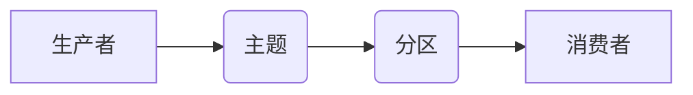

> Kafka, 消息队列, 分布式系统, 消费者, 生产者, 主题, 分区, 容错, 高可用性

## 1. 背景介绍

在当今以数据为中心的时代，海量数据实时处理和传输的需求日益增长。传统的单点式消息系统难以满足这种需求，分布式消息队列系统应运而生。其中，Apache Kafka 作为一款开源、高性能、分布式消息系统，凭借其强大的功能和灵活的架构，在实时数据流处理领域占据着举足轻重的地位。

Kafka 的核心设计理念是“发布订阅模式”，它将消息发布者（生产者）和消息订阅者（消费者）分离，并通过主题和分区来组织消息。生产者将消息发送到特定的主题，消费者则订阅特定的主题，并从主题中获取消息。这种模式使得消息系统更加灵活、可扩展和可靠。

## 2. 核心概念与联系

Kafka 的核心概念包括：

* **主题 (Topic):** 主题是消息的容器，可以理解为一个消息分类。每个主题可以包含多个分区。
* **分区 (Partition):** 分区是主题的逻辑分割，每个分区是一个独立的消息队列。分区可以水平扩展，提高消息吞吐量和容错能力。
* **生产者 (Producer):** 生产者负责将消息发送到 Kafka 集群中的主题。
* **消费者 (Consumer):** 消费者负责从 Kafka 集群中的主题获取消息并进行处理。
* **Broker:** Broker 是 Kafka 集群中的节点，负责存储和转发消息。

Kafka 的架构可以概括为以下流程：



## 3. 核心算法原理 & 具体操作步骤

### 3.1  算法原理概述

Kafka 的核心算法原理主要包括消息分片、消息存储、消息消费等。

* **消息分片:** Kafka 将消息按照主题和分区进行分片，每个分区是一个独立的消息队列，可以水平扩展，提高消息吞吐量和容错能力。
* **消息存储:** Kafka 使用日志文件存储消息，每个分区对应一个日志文件，日志文件按照时间顺序进行追加写入。
* **消息消费:** 消费者从 Kafka 集群中订阅主题，并从指定的分区中读取消息。消费者可以从指定位置开始读取消息，并进行处理。

### 3.2  算法步骤详解

1. **生产者发送消息:** 生产者将消息发送到 Kafka 集群中的主题，Kafka 集群会根据主题和分区将消息发送到对应的分区。
2. **消息存储:** Kafka 集群将消息写入对应的分区日志文件。
3. **消费者订阅主题:** 消费者订阅特定的主题，并指定消费的分区。
4. **消息消费:** 消费者从指定的分区中读取消息，并进行处理。

### 3.3  算法优缺点

**优点:**

* 高吞吐量：Kafka 可以处理海量消息，每秒可以处理数百万条消息。
* 高可用性：Kafka 集群可以容错，即使部分 Broker 节点故障，也能保证消息的可靠传输。
* 可扩展性：Kafka 可以水平扩展，增加 Broker 节点和分区数量，以满足不断增长的消息处理需求。
* 灵活的架构：Kafka 支持多种消息消费模式，例如顺序消费、并发消费等。

**缺点:**

* 学习曲线较陡：Kafka 的架构和功能比较复杂，需要一定的学习成本。
* 存储成本较高：Kafka 使用日志文件存储消息，需要较大的存储空间。

### 3.4  算法应用领域

Kafka 的应用领域非常广泛，包括：

* **实时数据流处理:** 例如，日志分析、用户行为分析、实时监控等。
* **消息队列:** 例如，用于异步任务处理、事件驱动架构等。
* **数据集成:** 例如，将数据从不同系统集成到一个中心平台。
* **流式计算:** 例如，使用 Apache Spark Streaming 等工具进行实时数据分析。

## 4. 数学模型和公式 & 详细讲解 & 举例说明

### 4.1  数学模型构建

Kafka 的消息存储和消费机制可以抽象为一个队列模型。

* **消息队列:** 每个分区可以看作是一个消息队列，消息按照FIFO（先进先出）的原则进行存储和消费。
* **生产者:** 生产者将消息添加到队列的尾部。
* **消费者:** 消费者从队列的头部读取消息。

### 4.2  公式推导过程

Kafka 的消息吞吐量可以表示为：

```latex
吞吐量 = 消息发送速率 / 消息处理延迟
```

其中：

* 消息发送速率：每秒发送的消息数量。
* 消息处理延迟：消费者处理一条消息所花费的时间。

### 4.3  案例分析与讲解

假设一个 Kafka 集群有 3 个 Broker 节点，每个 Broker 节点有 10 个分区，每秒可以发送 1000 条消息，每个消费者处理一条消息需要 10 毫秒，那么这个 Kafka 集群的吞吐量为：

```latex
吞吐量 = (3 * 10 * 1000) / (10 * 10^-3) = 300,000,000 条/秒
```

## 5. 项目实践：代码实例和详细解释说明

### 5.1  开发环境搭建

* Java Development Kit (JDK) 8 或更高版本
* Apache Kafka 集群
* IDE (例如 Eclipse, IntelliJ IDEA)

### 5.2  源代码详细实现

```java
// 生产者代码
import org.apache.kafka.clients.producer.KafkaProducer;
import org.apache.kafka.clients.producer.ProducerConfig;
import org.apache.kafka.clients.producer.ProducerRecord;

import java.util.Properties;

public class KafkaProducerExample {

    public static void main(String[] args) {
        // 配置生产者参数
        Properties props = new Properties();
        props.put(ProducerConfig.BOOTSTRAP_SERVERS_CONFIG, "localhost:9092");
        props.put(ProducerConfig.KEY_SERIALIZER_CLASS_CONFIG, "org.apache.kafka.common.serialization.StringSerializer");
        props.put(ProducerConfig.VALUE_SERIALIZER_CLASS_CONFIG, "org.apache.kafka.common.serialization.StringSerializer");

        // 创建生产者实例
        KafkaProducer<String, String> producer = new KafkaProducer<>(props);

        // 发送消息
        for (int i = 0; i < 10; i++) {
            ProducerRecord<String, String> record = new ProducerRecord<>("my-topic", "key" + i, "value" + i);
            producer.send(record);
        }

        // 关闭生产者
        producer.close();
    }
}

// 消费者代码
import org.apache.kafka.clients.consumer.ConsumerConfig;
import org.apache.kafka.clients.consumer.ConsumerRecord;
import org.apache.kafka.clients.consumer.ConsumerRecords;
import org.apache.kafka.clients.consumer.KafkaConsumer;
import org.apache.kafka.common.serialization.StringDeserializer;

import java.time.Duration;
import java.util.Collections;
import java.util.Properties;

public class KafkaConsumerExample {

    public static void main(String[] args) {
        // 配置消费者参数
        Properties props = new Properties();
        props.put(ConsumerConfig.BOOTSTRAP_SERVERS_CONFIG, "localhost:9092");
        props.put(ConsumerConfig.GROUP_ID_CONFIG, "my-group");
        props.put(ConsumerConfig.KEY_DESERIALIZER_CLASS_CONFIG, StringDeserializer.class.getName());
        props.put(ConsumerConfig.VALUE_DESERIALIZER_CLASS_CONFIG, StringDeserializer.class.getName());

        // 创建消费者实例
        KafkaConsumer<String, String> consumer = new KafkaConsumer<>(props);

        // 订阅主题
        consumer.subscribe(Collections.singletonList("my-topic"));

        // 消费消息
        while (true) {
            ConsumerRecords<String, String> records = consumer.poll(Duration.ofMillis(100));
            for (ConsumerRecord<String, String> record : records) {
                System.out.println("Received message: " + record.value());
            }
        }
    }
}
```

### 5.3  代码解读与分析

* **生产者代码:**
    * 配置生产者参数，包括 Broker 地址、key 和 value 的序列化器。
    * 创建 KafkaProducer 实例。
    * 发送消息到指定主题，每个消息包含 key 和 value。
    * 关闭生产者。
* **消费者代码:**
    * 配置消费者参数，包括 Broker 地址、组 ID、key 和 value 的反序列化器。
    * 创建 KafkaConsumer 实例。
    * 订阅指定主题。
    * 使用 poll 方法从主题中获取消息，并打印消息内容。

### 5.4  运行结果展示

运行上述代码，生产者会将 10 条消息发送到名为 "my-topic" 的主题，消费者会从该主题中订阅消息并打印消息内容。

## 6. 实际应用场景

Kafka 在各种实际应用场景中发挥着重要作用，例如：

* **日志分析:** 将应用程序日志发送到 Kafka 集群，并使用 Spark Streaming 等工具进行实时分析。
* **用户行为分析:** 将用户行为数据发送到 Kafka 集群，并使用机器学习算法进行用户画像和行为预测。
* **实时监控:** 将系统监控数据发送到 Kafka 集群，并使用 Grafana 等工具进行实时监控和告警。
* **电商平台:** 用于处理订单、商品信息、用户行为等数据，实现实时数据处理和分析。

### 6.4  未来应用展望

随着数据量的不断增长和实时数据处理需求的增加，Kafka 的应用场景将更加广泛。未来，Kafka 将在以下领域发挥更大的作用：

* **物联网:** 处理海量物联网设备数据，实现实时数据分析和决策。
* **金融科技:** 用于处理金融交易数据，实现实时风险控制和欺诈检测。
* **医疗健康:** 用于处理医疗数据，实现疾病诊断、患者管理等。

## 7. 工具和资源推荐

### 7.1  学习资源推荐

* **Apache Kafka 官方文档:** https://kafka.apache.org/documentation/
* **Kafka 入门教程:** https://www.tutorialspoint.com/kafka/index.htm
* **Kafka 实战指南:** https://www.packtpub.com/product/kafka-in-action/9781789957937

### 7.2  开发工具推荐

* **Apache Kafka CLI:** 用于管理 Kafka 集群和发送消息。
* **Kafka Manager:** 用于管理 Kafka 集群和监控消息流。
* **Confluent Platform:** 基于 Apache Kafka 的商业平台，提供更丰富的功能和支持。

### 7.3  相关论文推荐

* **Kafka: A Distributed Streaming Platform:** https://static.googleusercontent.com/media/research.google.com/en//pubs/archive/43211.pdf

## 8. 总结：未来发展趋势与挑战

### 8.1  研究成果总结

Kafka 作为一款成熟的分布式消息系统，已经取得了显著的成果，在实时数据流处理领域占据着重要地位。

### 8.2  未来发展趋势

* **更强大的性能和可扩展性:** Kafka 将继续提升性能和可扩展性，以满足海量数据处理的需求。
* **更丰富的功能和生态系统:** Kafka 的功能将不断丰富，生态系统也将更加完善，提供更多应用场景和解决方案。
* **更强的安全性:** Kafka 将加强安全性，提供更完善的访问控制和数据加密机制。

### 8.3  面临的挑战

* **复杂性:** Kafka 的架构和功能比较复杂，需要一定的学习成本。
* **存储成本:** Kafka 使用日志文件存储消息，需要较大的存储空间。
* **数据一致性:** 在分布式环境下，保证数据一致性是一个挑战。

### 8.4  研究展望

未来，Kafka