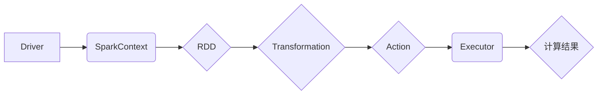

> Spark, 大数据处理, 分布式计算, 容错机制, 编程模型,  数据流处理,  机器学习

## 1. 背景介绍

在海量数据时代，高效处理和分析数据成为各行各业的关键挑战。传统的数据处理框架难以应对海量数据的处理需求，因此分布式计算框架应运而生。Apache Spark作为一款开源的分布式计算框架，凭借其高性能、易用性和灵活性，迅速成为大数据处理领域的领导者。

Spark 的出现，标志着数据处理领域迈入了新的阶段。它不仅能够高效处理海量数据，还能支持多种编程模型，满足不同用户的需求。Spark 的核心思想是将数据存储在内存中，并通过并行处理来加速计算。这种内存计算模式使得 Spark 在处理数据时具有极高的效率。

## 2. 核心概念与联系

Spark 的核心概念包括：

* **集群**: Spark 运行在集群环境中，由多个节点组成。每个节点都拥有自己的计算资源和内存。
* **Driver**: Driver 是 Spark 程序的入口点，负责调度任务并分配给各个节点执行。
* **Executor**: Executor 是运行在每个节点上的进程，负责执行 Spark 程序中的任务。
* **RDD**: Resilient Distributed Dataset (RDD) 是 Spark 的基本数据结构，它是一个分布式、可恢复的数据集。
* **DAG**: Directed Acyclic Graph (DAG) 是 Spark 程序的执行计划，它描述了所有任务之间的依赖关系。

**Spark 架构流程图:**



## 3. 核心算法原理 & 具体操作步骤

### 3.1  算法原理概述

Spark 的核心算法是基于 **数据分片和并行处理** 的。

* **数据分片**: 将大型数据集划分为多个小块，每个小块存储在不同的节点上。
* **并行处理**: 将每个数据分片分配给不同的 Executor 执行，并行处理多个任务，从而加速计算速度。

### 3.2  算法步骤详解

1. **数据加载**: 将数据加载到 Spark 集群中，并将其转换为 RDD。
2. **数据转换**: 对 RDD 进行各种转换操作，例如过滤、映射、聚合等，以满足数据处理需求。
3. **数据行动**: 对 RDD 执行行动操作，例如计算结果、保存到文件等，以获取最终结果。

### 3.3  算法优缺点

**优点**:

* **高性能**: 内存计算模式和并行处理机制使得 Spark 在处理海量数据时具有极高的效率。
* **易用性**: Spark 提供了简洁易用的 API，方便用户编写和执行数据处理程序。
* **灵活性**: Spark 支持多种编程模型，例如 Scala、Java、Python 等，满足不同用户的需求。

**缺点**:

* **资源消耗**: Spark 需要大量的内存和计算资源，对于小型数据集可能显得过于冗余。
* **复杂性**: Spark 的架构和功能较为复杂，需要一定的学习成本。

### 3.4  算法应用领域

Spark 在各个领域都有广泛的应用，例如：

* **数据分析**: 对海量数据进行分析，挖掘数据中的价值。
* **机器学习**: 训练机器学习模型，进行预测和分类。
* **实时数据处理**: 处理实时数据流，例如日志分析、用户行为分析等。

## 4. 数学模型和公式 & 详细讲解 & 举例说明

### 4.1  数学模型构建

Spark 的核心算法可以抽象为一个图论模型，其中：

* **节点**: 代表数据分片。
* **边**: 代表数据之间的依赖关系。

### 4.2  公式推导过程

Spark 的并行处理机制可以利用图论中的 **深度优先搜索 (DFS)** 算法来进行任务调度。

DFS 算法的伪代码如下：

```
DFS(节点)
    访问节点
    对于节点的每个邻居节点
        如果邻居节点未被访问
            DFS(邻居节点)
```

### 4.3  案例分析与讲解

假设我们有一个包含 10 个数据分片的 RDD，需要对每个数据分片进行计算。

使用 DFS 算法，Spark 会将任务分配给不同的 Executor，并按照依赖关系进行执行。例如，如果数据分片 A 依赖于数据分片 B，那么 Spark 会先执行数据分片 B 的任务，然后再执行数据分片 A 的任务。

## 5. 项目实践：代码实例和详细解释说明

### 5.1  开发环境搭建

* 安装 Java JDK
* 安装 Scala
* 安装 Apache Spark

### 5.2  源代码详细实现

```scala
import org.apache.spark.SparkContext
import org.apache.spark.SparkConf

object SparkWordCount {
  def main(args: Array[String]): Unit = {
    // 创建 SparkConf 配置对象
    val conf = new SparkConf().setAppName("SparkWordCount").setMaster("local")
    // 创建 SparkContext 上下文对象
    val sc = new SparkContext(conf)

    // 读取文本文件
    val lines = sc.textFile("input.txt")

    // 将每一行文本分割成单词
    val words = lines.flatMap(_.split(" "))

    // 统计每个单词的出现次数
    val wordCounts = words.map((_, 1)).reduceByKey(_ + _)

    // 打印结果
    wordCounts.foreach(println)

    // 关闭 SparkContext
    sc.stop()
  }
}
```

### 5.3  代码解读与分析

* `SparkConf` 对象用于配置 Spark 应用的运行环境。
* `SparkContext` 对象是 Spark 应用的入口点，用于创建 RDD 和执行 Spark 操作。
* `textFile()` 方法用于读取文本文件。
* `flatMap()` 方法用于将每个元素转换为多个元素。
* `map()` 方法用于将每个元素映射到另一个元素。
* `reduceByKey()` 方法用于对每个键进行聚合操作。
* `foreach()` 方法用于遍历 RDD 中的元素。

### 5.4  运行结果展示

运行上述代码后，会输出每个单词的出现次数。例如，如果输入文件 `input.txt` 中包含以下内容：

```
hello world
world hello
```

则输出结果为：

```
(hello,2)
(world,2)
```

## 6. 实际应用场景

Spark 在各个领域都有广泛的应用，例如：

* **电商**: 商品推荐、用户画像、订单分析等。
* **金融**: 风险评估、欺诈检测、客户关系管理等。
* **医疗**: 疾病诊断、药物研发、患者管理等。

### 6.4  未来应用展望

随着大数据和人工智能技术的不断发展，Spark 的应用场景将更加广泛。例如：

* **实时数据处理**: Spark Streaming 可以处理实时数据流，例如社交媒体数据、传感器数据等。
* **机器学习**: Spark MLlib 提供了丰富的机器学习算法，可以用于训练和部署机器学习模型。
* **云计算**: Spark 可以部署在云计算平台上，例如 AWS、Azure、GCP 等。

## 7. 工具和资源推荐

### 7.1  学习资源推荐

* **Spark 官方文档**: https://spark.apache.org/docs/latest/
* **Spark 中文文档**: http://spark.apache.org/docs/latest/zh-cn/
* **Spark 入门教程**: https://spark.apache.org/docs/latest/getting-started.html

### 7.2  开发工具推荐

* **IntelliJ IDEA**: https://www.jetbrains.com/idea/
* **Eclipse**: https://www.eclipse.org/

### 7.3  相关论文推荐

* **Spark: Cluster Computing with Working Sets**
* **Resilient Distributed Datasets: A Fault-Tolerant Abstraction for In-Memory Cluster Computing**

## 8. 总结：未来发展趋势与挑战

### 8.1  研究成果总结

Spark 作为一款开源的分布式计算框架，在数据处理领域取得了巨大的成功。其高性能、易用性和灵活性使其成为大数据处理的首选框架。

### 8.2  未来发展趋势

* **更强大的机器学习功能**: Spark MLlib 将继续发展，提供更强大的机器学习算法和功能。
* **更完善的实时数据处理能力**: Spark Streaming 将继续改进，提供更强大的实时数据处理能力。
* **更易于使用的界面**: Spark 的用户界面将继续改进，使其更易于使用。

### 8.3  面临的挑战

* **资源管理**: 随着数据量的不断增长，Spark 需要更有效的资源管理机制。
* **性能优化**: Spark 需要不断优化性能，以满足对更高效计算的需求。
* **生态系统建设**: Spark 需要不断完善其生态系统，提供更多工具和资源。

### 8.4  研究展望

未来，Spark 将继续朝着更强大、更易用、更灵活的方向发展。

## 9. 附录：常见问题与解答

* **Spark 和 Hadoop 的区别**: Spark 是一个更轻量级的框架，而 Hadoop 是一个更庞大的生态系统。Spark 更适合处理实时数据，而 Hadoop 更适合处理海量静态数据。
* **Spark 的编程模型**: Spark 支持多种编程模型，例如 Scala、Java、Python 等。
* **Spark 的容错机制**: Spark 使用 RDD 的容错机制，可以自动恢复数据丢失。


作者：禅与计算机程序设计艺术 / Zen and the Art of Computer Programming 
<end_of_turn>