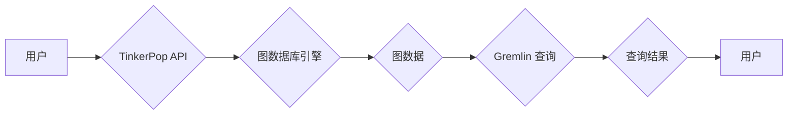

> TinkerPop, 图数据库, Gremlin, 关系型数据, 算法, 代码实例, 应用场景

## 1. 背景介绍

随着互联网和移动互联网的快速发展，海量数据呈爆炸式增长，传统的关系型数据库已经难以满足对数据存储和查询的需求。图数据库作为一种新型的数据存储模型，凭借其强大的数据关联分析能力和灵活的数据结构，在社交网络、推荐系统、知识图谱等领域得到了广泛应用。

TinkerPop是一个开源的图数据库框架，它提供了一套通用的图数据访问和操作API，支持多种图数据库引擎，例如Neo4j、OrientDB、Titan等。TinkerPop的核心是Gremlin，它是一种图查询语言，类似于SQL，但更适合于图数据操作。

## 2. 核心概念与联系

TinkerPop框架的核心概念包括：

* **图数据库:** 图数据库是一种专门用于存储和查询图数据的数据库。图数据库中的数据以节点和边表示，节点代表实体，边代表实体之间的关系。
* **Gremlin:** Gremlin是一种图查询语言，用于查询和操作图数据库中的数据。它提供了一系列操作符，用于遍历图结构、查找节点和边、聚合数据等。
* **TinkerPop API:** TinkerPop API提供了一套通用的图数据访问和操作接口，支持多种图数据库引擎。开发者可以使用TinkerPop API访问和操作图数据库中的数据，无需关心底层的数据库实现细节。

**TinkerPop 架构流程图:**



## 3. 核心算法原理 & 具体操作步骤

### 3.1  算法原理概述

TinkerPop框架基于图数据库的特性，提供了多种算法和操作符，用于遍历图结构、查找节点和边、聚合数据等。这些算法的原理主要基于图论和算法设计思想，例如深度优先搜索、广度优先搜索、图遍历算法等。

### 3.2  算法步骤详解

TinkerPop框架提供了多种算法和操作符，例如：

* **Traversal:** 用于遍历图结构，可以根据不同的条件和策略，遍历图中的节点和边。
* **Vertex:** 用于操作节点，例如添加节点、删除节点、查询节点属性等。
* **Edge:** 用于操作边，例如添加边、删除边、查询边属性等。
* **Aggregation:** 用于聚合数据，例如计算节点数量、边数量、平均度等。

### 3.3  算法优缺点

TinkerPop框架的算法具有以下优点：

* **灵活:** TinkerPop框架提供了丰富的操作符和算法，可以根据不同的需求灵活地操作图数据。
* **高效:** TinkerPop框架基于图数据库的特性，提供了高效的图数据访问和操作算法。
* **易用:** TinkerPop框架提供了简单的API，易于学习和使用。

TinkerPop框架的算法也存在一些缺点：

* **性能瓶颈:** 当图数据规模非常大时，某些算法可能会出现性能瓶颈。
* **复杂度:** 一些复杂的图算法可能需要较高的编程复杂度。

### 3.4  算法应用领域

TinkerPop框架的算法广泛应用于以下领域：

* **社交网络分析:** 分析用户之间的关系，发现社区结构、推荐好友等。
* **推荐系统:** 基于用户行为和商品关系，推荐感兴趣的商品或内容。
* **知识图谱构建:** 建立知识图谱，表示实体和关系，进行知识推理和查询。
* **网络安全:** 检测网络攻击、分析恶意行为等。

## 4. 数学模型和公式 & 详细讲解 & 举例说明

### 4.1  数学模型构建

图数据库中的数据可以用数学模型来表示。一个图可以表示为一个有序对 (V, E)，其中：

* V 是节点集，表示图中的实体。
* E 是边集，表示实体之间的关系。

每个节点 v ∈ V 可以用一个属性集 A(v) 来表示，属性集包含节点的各种特征信息。每个边 e ∈ E 可以用一个属性集 A(e) 来表示，属性集包含边的类型、方向等信息。

### 4.2  公式推导过程

TinkerPop框架中的算法通常基于图论和算法设计思想，例如深度优先搜索、广度优先搜索、图遍历算法等。这些算法的实现通常涉及到图的遍历、节点和边的访问、数据聚合等操作，可以使用数学公式来描述算法的执行过程。

例如，深度优先搜索算法可以描述为：

```
DFS(G, v)
  visited[v] = True
  for e in G.adj(v):
    u = e.target
    if not visited[u]:
      DFS(G, u)
```

其中：

* G 是图数据库。
* v 是当前访问的节点。
* visited 是一个布尔数组，用于记录已经访问过的节点。
* adj(v) 是节点 v 的邻接节点集。

### 4.3  案例分析与讲解

可以结合具体的案例分析 TinkerPop 框架中的算法原理和应用场景。例如，可以分析如何使用 TinkerPop 框架中的算法来查找社交网络中的好友关系，或者如何使用 TinkerPop 框架中的算法来构建知识图谱。

## 5. 项目实践：代码实例和详细解释说明

### 5.1  开发环境搭建

TinkerPop 框架支持多种图数据库引擎，例如 Neo4j、OrientDB、Titan 等。需要根据选择的图数据库引擎搭建相应的开发环境。

### 5.2  源代码详细实现

以下是一个使用 TinkerPop 框架访问 Neo4j 图数据库的简单代码示例：

```java
import org.apache.tinkerpop.gremlin.driver.Client;
import org.apache.tinkerpop.gremlin.driver.Cluster;
import org.apache.tinkerpop.gremlin.driver.Result;
import org.apache.tinkerpop.gremlin.driver.remote.DriverRemoteConnection;

public class TinkerPopExample {

  public static void main(String[] args) {
    // 连接 Neo4j 图数据库
    Cluster cluster = Cluster.build()
        .addContactPoint("localhost")
        .port(7687)
        .create();
    Client client = cluster.connect();

    // 执行 Gremlin 查询
    Result result = client.submit("g.V().has('name', 'Alice').count()");

    // 打印查询结果
    System.out.println(result.next());

    // 关闭连接
    client.close();
    cluster.close();
  }
}
```

### 5.3  代码解读与分析

这段代码首先连接到 Neo4j 图数据库，然后使用 Gremlin 查询语言执行一个查询语句，查询名为 "Alice" 的节点的数量。最后，代码打印查询结果并关闭连接。

### 5.4  运行结果展示

运行这段代码后，会输出查询结果，例如：

```
1
```

这表示图数据库中存在一个名为 "Alice" 的节点。

## 6. 实际应用场景

TinkerPop 框架在各种实际应用场景中得到了广泛应用，例如：

### 6.1  社交网络分析

TinkerPop 框架可以用于分析社交网络中的用户关系，发现社区结构、推荐好友等。例如，可以利用 TinkerPop 框架中的算法来查找用户之间的共同好友，或者来分析用户之间的关系强度。

### 6.2  推荐系统

TinkerPop 框架可以用于构建推荐系统，根据用户的行为和商品关系，推荐感兴趣的商品或内容。例如，可以利用 TinkerPop 框架中的算法来分析用户的购买历史，推荐与用户购买过的商品相似的商品。

### 6.3  知识图谱构建

TinkerPop 框架可以用于构建知识图谱，表示实体和关系，进行知识推理和查询。例如，可以利用 TinkerPop 框架中的算法来构建一个电影知识图谱，表示电影、演员、导演等实体之间的关系。

### 6.4  未来应用展望

随着图数据库技术的不断发展，TinkerPop 框架的应用场景将会更加广泛。例如，可以利用 TinkerPop 框架来分析生物网络、化学反应网络等复杂系统，或者来构建智能推荐系统、个性化学习平台等。

## 7. 工具和资源推荐

### 7.1  学习资源推荐

* TinkerPop 官方网站：https://tinkerpop.apache.org/
* TinkerPop 文档：https://tinkerpop.apache.org/docs/
* Gremlin 官方网站：https://gremlin.apache.org/

### 7.2  开发工具推荐

* Neo4j Desktop：https://neo4j.com/download/desktop/
* OrientDB Studio：https://orientdb.com/download/studio/
* Titan Graph Database：https://titan.io/

### 7.3  相关论文推荐

* TinkerPop: A Framework for Graph Data Processing
* Gremlin: A Graph Traversal Language
* Graph Databases: Concepts, Models, and Applications

## 8. 总结：未来发展趋势与挑战

### 8.1  研究成果总结

TinkerPop 框架为图数据处理提供了统一的接口和丰富的算法，促进了图数据库技术的应用和发展。

### 8.2  未来发展趋势

未来，TinkerPop 框架将会继续朝着以下方向发展：

* **性能优化:** 针对大规模图数据的处理，进一步优化 TinkerPop 框架的性能。
* **功能扩展:** 添加新的算法和操作符，支持更复杂的图数据分析需求。
* **生态系统建设:** 鼓励更多开发者参与 TinkerPop 框架的开发和维护，构建更加完善的生态系统。

### 8.3  面临的挑战

TinkerPop 框架也面临一些挑战：

* **标准化问题:** 图数据库领域缺乏统一的标准，不同图数据库引擎的实现方式存在差异，导致 TinkerPop 框架的兼容性问题。
* **性能瓶颈:** 当图数据规模非常大时，TinkerPop 框架的性能可能会受到限制。
* **复杂度问题:** 一些复杂的图算法可能需要较高的编程复杂度，不利于开发者使用。

### 8.4  研究展望

未来，研究者可以继续探索以下方向：

* 研究更有效的图数据存储和查询算法。
* 开发更易于使用的图数据处理工具和框架。
* 探索图数据库在更多领域的应用场景。

## 9. 附录：常见问题与解答

### 9.1  常见问题

* TinkerPop 框架支持哪些图数据库引擎？
* 如何连接到 Neo4j 图数据库？
* 如何执行 Gremlin 查询语句？

### 9.2  解答

* TinkerPop 框架支持 Neo4j、OrientDB、Titan 等多种图数据库引擎。
* 连接到 Neo4j 图数据库需要使用 TinkerPop 框架提供的连接配置信息。
* 执行 Gremlin 查询语句可以使用 TinkerPop 框架提供的 submit 方法。


作者：禅与计算机程序设计艺术 / Zen and the Art of Computer Programming 
<end_of_turn>