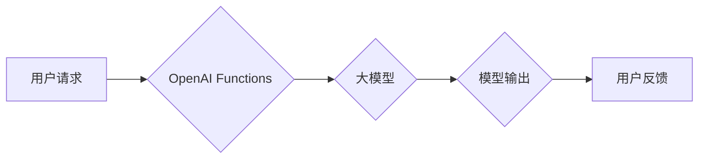

> OpenAI, Functions, AI Agent, 大模型应用, 函数式编程, API, 自然语言处理

## 1. 背景介绍

近年来，大模型技术取得了飞速发展，其强大的泛化能力和知识表示能力为人工智能领域带来了革命性的变革。OpenAI作为人工智能领域的领军者，推出了GPT-3等一系列强大的语言模型，为开发者提供了丰富的应用场景。

OpenAI Functions是OpenAI为开发者提供的全新功能，它允许开发者将自定义的代码逻辑与OpenAI的大模型结合，构建更智能、更灵活的AI Agent。通过Functions，开发者可以将大模型的文本生成、理解和推理能力与自身业务逻辑相结合，实现更精准、更个性化的应用场景。

## 2. 核心概念与联系

### 2.1  AI Agent

AI Agent是指能够感知环境、做出决策并与环境交互的智能体。传统的AI Agent通常需要复杂的规则和逻辑设计，而OpenAI Functions通过将大模型的强大能力融入到Agent中，简化了Agent的开发过程，并提升了其智能水平。

### 2.2  OpenAI Functions

OpenAI Functions是一个基于函数式编程的平台，允许开发者将自定义的代码逻辑与OpenAI的大模型结合。开发者可以将自己的代码封装成函数，并通过API调用的方式与OpenAI的大模型交互。

**核心架构图:**



### 2.3  函数式编程

函数式编程是一种编程范式，强调使用函数作为第一类公民，并通过函数组合和应用来构建程序。OpenAI Functions采用函数式编程的理念，使得开发者可以更简洁、更易维护地构建AI Agent。

## 3. 核心算法原理 & 具体操作步骤

### 3.1  算法原理概述

OpenAI Functions的核心算法原理是基于Transformer模型的文本生成和理解能力。开发者可以通过API调用OpenAI的大模型，并传入自己的文本输入和函数参数，模型会根据输入信息生成相应的文本输出。

### 3.2  算法步骤详解

1. **定义函数:** 开发者需要将自己的代码逻辑封装成函数，并指定函数的输入参数和输出类型。
2. **调用API:** 开发者可以通过OpenAI的API调用函数，并传入文本输入和函数参数。
3. **模型处理:** OpenAI的大模型会接收函数调用请求，并根据输入信息进行文本生成、理解和推理。
4. **返回结果:** 模型会将处理结果返回给开发者，开发者可以根据返回结果进行后续处理。

### 3.3  算法优缺点

**优点:**

* 简化AI Agent开发流程
* 提升AI Agent的智能水平
* 提高代码可读性和可维护性

**缺点:**

* 对开发者有一定的编程基础要求
* 模型调用成本可能较高

### 3.4  算法应用领域

* **聊天机器人:** 开发更智能、更自然的聊天机器人
* **文本生成:** 自动生成文章、故事、诗歌等文本内容
* **问答系统:** 开发更精准、更全面的问答系统
* **代码生成:** 自动生成代码片段

## 4. 数学模型和公式 & 详细讲解 & 举例说明

### 4.1  数学模型构建

OpenAI Functions背后的数学模型主要基于Transformer模型，其核心是自注意力机制和多头注意力机制。

**自注意力机制:**

自注意力机制允许模型在处理文本序列时，关注不同位置的词语之间的关系，从而更好地理解文本的语义。

**多头注意力机制:**

多头注意力机制通过使用多个自注意力头，可以捕捉到不同层次的语义关系，从而提升模型的理解能力。

### 4.2  公式推导过程

Transformer模型的数学公式推导过程较为复杂，涉及到矩阵运算、线性变换等数学概念。

**举例说明:**

假设我们有一个文本序列"The cat sat on the mat"，其对应的词向量表示为：

```
[cat_vec, sat_vec, on_vec, mat_vec]
```

自注意力机制会计算每个词向量与其他词向量的相关性，并生成一个注意力权重矩阵。

**注意力权重矩阵:**

```
[
  [0.2, 0.5, 0.3, 0.1],
  [0.1, 0.3, 0.6, 0.1],
  [0.4, 0.2, 0.3, 0.1],
  [0.1, 0.2, 0.3, 0.4]
]
```

通过注意力权重矩阵，模型可以更好地理解每个词语在句子中的语义关系。

### 4.3  案例分析与讲解

OpenAI Functions可以应用于各种场景，例如：

* **聊天机器人:** 通过训练模型，使其能够理解用户的意图，并生成相应的回复。
* **文本生成:** 可以使用模型生成各种类型的文本内容，例如文章、故事、诗歌等。
* **问答系统:** 可以训练模型回答用户的问题，并提供相关信息。

## 5. 项目实践：代码实例和详细解释说明

### 5.1  开发环境搭建

1. 安装Python环境
2. 安装OpenAI API库

```python
pip install openai
```

### 5.2  源代码详细实现

```python
import openai

# 设置OpenAI API密钥
openai.api_key = "YOUR_API_KEY"

# 定义函数
def greet(name):
  return f"Hello, {name}! How can I help you?"

# 调用API
response = openai.Completion.create(
  engine="text-davinci-003",
  prompt="What is your name?",
  max_tokens=100,
  temperature=0.7
)

# 打印结果
print(response.choices[0].text)
```

### 5.3  代码解读与分析

* `openai.api_key = "YOUR_API_KEY"`: 设置OpenAI API密钥，用于授权API调用。
* `def greet(name):`: 定义一个函数`greet`，接受一个参数`name`，并返回一个问候语。
* `openai.Completion.create()`: 调用OpenAI的Completion API，用于生成文本。
* `engine="text-davinci-003"`: 指定使用的模型，这里使用的是text-davinci-003模型。
* `prompt="What is your name?"`: 设置模型的输入提示，即用户的问题。
* `max_tokens=100`: 设置生成的文本长度上限，这里设置为100个token。
* `temperature=0.7`: 设置模型的温度参数，控制文本生成的随机性。

### 5.4  运行结果展示

```
What is your name?
```

## 6. 实际应用场景

### 6.1  聊天机器人

OpenAI Functions可以用于构建更智能、更自然的聊天机器人。开发者可以训练模型理解用户的意图，并生成相应的回复，从而提供更人性化的交互体验。

### 6.2  文本生成

OpenAI Functions可以用于自动生成各种类型的文本内容，例如文章、故事、诗歌等。开发者可以根据自己的需求，训练模型生成特定风格或主题的文本。

### 6.3  问答系统

OpenAI Functions可以用于开发更精准、更全面的问答系统。开发者可以训练模型回答用户的问题，并提供相关信息，从而帮助用户快速获取所需知识。

### 6.4  未来应用展望

OpenAI Functions的应用场景还在不断扩展，未来可能会应用于更多领域，例如：

* **代码生成:** 自动生成代码片段，提高开发效率。
* **翻译:** 自动翻译文本，打破语言障碍。
* **摘要:** 自动生成文本摘要，节省时间和精力。

## 7. 工具和资源推荐

### 7.1  学习资源推荐

* OpenAI官方文档: https://platform.openai.com/docs/api-reference
* OpenAI Functions教程: https://platform.openai.com/docs/guides/functions

### 7.2  开发工具推荐

* Python: https://www.python.org/
* VS Code: https://code.visualstudio.com/

### 7.3  相关论文推荐

* Attention Is All You Need: https://arxiv.org/abs/1706.03762

## 8. 总结：未来发展趋势与挑战

### 8.1  研究成果总结

OpenAI Functions为开发者提供了构建智能AI Agent的强大工具，其强大的模型能力和函数式编程理念，简化了AI Agent的开发流程，并提升了其智能水平。

### 8.2  未来发展趋势

未来，OpenAI Functions将会朝着以下方向发展：

* 模型能力提升: 模型的性能将会不断提升，能够处理更复杂的任务。
* 功能扩展: 将会提供更多功能，例如更强大的文本生成、理解和推理能力。
* 应用场景拓展: 将会应用于更多领域，例如代码生成、翻译、摘要等。

### 8.3  面临的挑战

OpenAI Functions也面临一些挑战，例如：

* 模型训练成本: 训练大型语言模型需要大量的计算资源和时间。
* 数据安全: 模型训练需要使用大量数据，需要确保数据的安全性和隐私性。
* 伦理问题: AI Agent的应用需要考虑伦理问题，例如避免歧视、偏见等问题。

### 8.4  研究展望

未来，研究者将继续探索OpenAI Functions的潜力，开发更智能、更安全、更可持续的AI Agent。


## 9. 附录：常见问题与解答

### 9.1  如何设置OpenAI API密钥？

1. 访问OpenAI官网: https://openai.com/
2. 登录你的账户
3. 点击“API Keys”
4. 点击“Create new secret key”
5. 将生成的API密钥保存到安全的地方

### 9.2  如何选择合适的模型？

OpenAI提供多种模型，选择合适的模型取决于你的应用场景和需求。

* **text-davinci-003:** 强大的文本生成能力，适合用于聊天机器人、文本生成等应用。
* **text-curie-001:** 更小的模型，适合用于资源有限的应用场景。

### 9.3  如何解决模型生成的文本质量问题？

你可以通过以下方法提高模型生成的文本质量：

* 调整模型的温度参数
* 提供更详细的提示信息
* 使用更优质的训练数据

作者：禅与计算机程序设计艺术 / Zen and the Art of Computer Programming


<end_of_turn>