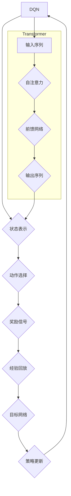

> 深度强化学习，注意力机制，DQN，Transformer，深度学习，强化学习，神经网络

## 1. 背景介绍

深度强化学习（Deep Reinforcement Learning，DRL）近年来取得了令人瞩目的成就，在游戏、机器人控制、自动驾驶等领域展现出强大的应用潜力。其核心在于训练智能体在环境中采取最优行动，以最大化累积奖励。然而，随着环境复杂度的增加，传统强化学习算法面临着巨大的挑战，例如：

* **状态空间维度过高：** 许多现实世界问题具有高维状态空间，导致传统方法难以有效处理。
* **稀疏奖励信号：** 强化学习算法依赖于奖励信号来指导学习，但现实世界中的奖励信号往往稀疏且延迟，难以有效地引导学习过程。

为了解决这些问题，深度学习与强化学习的结合成为了一个重要的研究方向。其中，注意力机制（Attention Mechanism）作为深度学习领域的重要创新，为强化学习带来了新的突破。

## 2. 核心概念与联系

注意力机制的核心思想是学习关注输入序列中最重要的部分，并根据其重要性分配不同的权重。它能够帮助模型聚焦于与当前任务最相关的信息，从而提高学习效率和准确性。

在强化学习领域，注意力机制被广泛应用于以下几个方面：

* **状态表示：** 通过注意力机制学习对高维状态进行压缩和表示，提取关键特征，提高模型对环境的理解能力。
* **动作选择：** 利用注意力机制关注与当前状态相关的动作，选择最优动作，提高决策效率。
* **策略优化：** 通过注意力机制学习策略网络的权重，提高策略的学习效率和稳定性。

**DQN与Transformer结合**

DQN（Deep Q-Network）是深度强化学习领域的重要算法，它利用深度神经网络来估计状态-动作价值函数，并通过经验回放和目标网络来稳定学习过程。然而，DQN在处理复杂环境时仍然存在局限性，例如：

* **长短期依赖问题：** DQN难以捕捉长序列状态之间的依赖关系，导致在处理长期的任务时表现不佳。

Transformer作为一种强大的序列建模模型，其自注意力机制能够有效地捕捉序列中的长短期依赖关系。因此，将Transformer与DQN结合，可以有效地解决DQN的上述问题。

**Mermaid 流程图**



## 3. 核心算法原理 & 具体操作步骤

### 3.1  算法原理概述

将Transformer与DQN结合，主要思路是利用Transformer的强大的序列建模能力来增强DQN的状态表示和动作选择能力。具体来说，可以将Transformer的编码器部分用于学习状态表示，解码器部分用于学习动作选择策略。

### 3.2  算法步骤详解

1. **状态表示：** 将环境状态作为输入，输入到Transformer的编码器中，编码器通过多层自注意力机制和前馈网络学习状态的表示。
2. **动作选择：** 将编码器输出的隐藏状态作为输入，输入到Transformer的解码器中，解码器通过自注意力机制和前馈网络学习动作选择策略。
3. **奖励信号：** 根据采取的动作和环境的反馈，获得奖励信号。
4. **经验回放：** 将状态、动作、奖励和下一个状态存储到经验回放池中。
5. **目标网络：** 使用目标网络估计状态-动作价值函数，并根据经验回放池中的数据进行更新。
6. **策略更新：** 使用策略梯度算法更新策略网络的权重，以最大化累积奖励。

### 3.3  算法优缺点

**优点：**

* **能够有效地捕捉长短期依赖关系：** Transformer的自注意力机制能够有效地捕捉序列中的长短期依赖关系，提高模型对环境的理解能力。
* **状态表示能力更强：** Transformer的编码器能够学习更丰富的状态表示，提高模型的决策能力。
* **学习效率更高：** 经验回放和目标网络等技术可以提高学习效率和稳定性。

**缺点：**

* **计算复杂度较高：** Transformer的计算复杂度较高，需要更多的计算资源。
* **训练数据需求量大：** Transformer需要大量的训练数据才能达到最佳性能。

### 3.4  算法应用领域

将Transformer与DQN结合的算法在以下领域具有广泛的应用前景：

* **游戏AI：** 提高游戏AI的策略水平，使其能够应对更复杂的挑战。
* **机器人控制：** 增强机器人的环境感知能力和决策能力，使其能够更好地完成复杂的任务。
* **自动驾驶：** 提高自动驾驶系统的决策能力，使其能够更安全地行驶。
* **医疗诊断：** 利用医疗数据训练模型，辅助医生进行诊断和治疗。

## 4. 数学模型和公式 & 详细讲解 & 举例说明

### 4.1  数学模型构建

**状态表示：**

Transformer的编码器部分可以表示为一个多层网络，每层包含自注意力机制和前馈网络。

**自注意力机制：**

自注意力机制可以计算每个词与所有其他词之间的相关性，并根据相关性分配权重。其计算公式如下：

$$
Attention(Q, K, V) = softmax(\frac{QK^T}{\sqrt{d_k}})V
$$

其中：

* $Q$：查询矩阵
* $K$：键矩阵
* $V$：值矩阵
* $d_k$：键向量的维度

**前馈网络：**

前馈网络是一个多层感知机，其计算公式如下：

$$
FFN(x) = \sigma(W_1x + b_1)
$$

其中：

* $x$：输入向量
* $W_1$：权重矩阵
* $b_1$：偏置向量
* $\sigma$：激活函数

**动作选择：**

Transformer的解码器部分可以用来学习动作选择策略。其输出是一个动作概率分布，可以表示为：

$$
P(a|s) = softmax(W_2h + b_2)
$$

其中：

* $a$：动作
* $s$：状态
* $h$：解码器输出的隐藏状态
* $W_2$：权重矩阵
* $b_2$：偏置向量

### 4.2  公式推导过程

**自注意力机制的softmax函数：**

softmax函数的作用是将输入向量转换为概率分布。其计算公式如下：

$$
softmax(x_i) = \frac{e^{x_i}}{\sum_{j=1}^{n}e^{x_j}}
$$

其中：

* $x_i$：输入向量的第i个元素
* $n$：输入向量的维度

**策略梯度算法：**

策略梯度算法是一种常用的强化学习算法，其目标是最大化累积奖励。其更新公式如下：

$$
\theta = \theta + \alpha \nabla J(\theta)
$$

其中：

* $\theta$：策略网络的权重
* $\alpha$：学习率
* $\nabla J(\theta)$：策略网络的梯度

### 4.3  案例分析与讲解

**游戏AI：**

将Transformer与DQN结合可以训练出更强大的游戏AI。例如，在游戏中，Transformer可以学习玩家的策略和游戏规则，并根据这些信息选择最优动作。

**机器人控制：**

在机器人控制领域，Transformer可以帮助机器人更好地理解环境信息，并做出更精确的动作。例如，在导航任务中，Transformer可以帮助机器人学习地图信息和障碍物位置，并规划最优路径。

## 5. 项目实践：代码实例和详细解释说明

### 5.1  开发环境搭建

* Python 3.7+
* TensorFlow 2.0+
* PyTorch 1.0+
* CUDA 10.0+

### 5.2  源代码详细实现

```python
# 导入必要的库
import tensorflow as tf

# 定义Transformer编码器
class TransformerEncoder(tf.keras.layers.Layer):
    def __init__(self, d_model, num_heads, ff_dim, num_layers):
        super(TransformerEncoder, self).__init__()
        self.layers = [
            TransformerEncoderLayer(d_model, num_heads, ff_dim)
            for _ in range(num_layers)
        ]

    def call(self, inputs, mask=None):
        for layer in self.layers:
            inputs = layer(inputs, mask)
        return inputs

# 定义Transformer编码器层
class TransformerEncoderLayer(tf.keras.layers.Layer):
    def __init__(self, d_model, num_heads, ff_dim):
        super(TransformerEncoderLayer, self).__init__()
        self.multihead_attention = tf.keras.layers.MultiHeadAttention(num_heads=num_heads, key_dim=d_model)
        self.ffn = tf.keras.layers.Dense(ff_dim, activation="relu")
        self.norm1 = tf.keras.layers.LayerNormalization(epsilon=1e-6)
        self.norm2 = tf.keras.layers.LayerNormalization(epsilon=1e-6)

    def call(self, inputs, mask=None):
        attn_output = self.multihead_attention(inputs, inputs, inputs, mask=mask)
        attn_output = self.norm1(inputs + attn_output)
        ffn_output = self.ffn(attn_output)
        ffn_output = self.norm2(attn_output + ffn_output)
        return ffn_output

# 定义DQN网络
class DQN(tf.keras.Model):
    def __init__(self, state_dim, action_dim, hidden_dim):
        super(DQN, self).__init__()
        self.encoder = TransformerEncoder(d_model=state_dim, num_heads=8, ff_dim=hidden_dim, num_layers=6)
        self.decoder = tf.keras.Sequential([
            tf.keras.layers.Dense(action_dim, activation="softmax")
        ])

    def call(self, inputs):
        encoded_state = self.encoder(inputs)
        action_probs = self.decoder(encoded_state)
        return action_probs

# 实例化DQN网络
dqn = DQN(state_dim=84, action_dim=4, hidden_dim=256)

# 训练DQN网络
# ...

```

### 5.3  代码解读与分析

* **TransformerEncoder:** 定义了Transformer的编码器部分，包含多层TransformerEncoderLayer。
* **TransformerEncoderLayer:** 定义了Transformer的编码器层，包含多头注意力机制和前馈网络。
* **DQN:** 定义了DQN网络，包含Transformer编码器和全连接解码器。
* **实例化DQN网络:** 实例化DQN网络，并设置网络参数。
* **训练DQN网络:** 使用强化学习算法训练DQN网络。

### 5.4  运行结果展示

训练完成后，可以将DQN网络应用于实际环境中，例如游戏环境或机器人控制环境，并观察其性能。

## 6. 实际应用场景

### 6.1  游戏AI

将Transformer与DQN结合可以训练出更强大的游戏AI，例如AlphaStar，它能够在星际争霸II游戏中战胜职业玩家。

### 6.2  机器人控制

Transformer