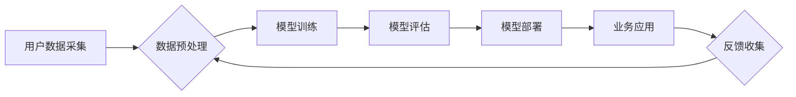

>  人工智能、商业化、Lepton AI、机器学习、深度学习、产品化、技术落地

## 1. 背景介绍

人工智能（AI）技术近年来发展迅速，从学术研究走向了实际应用，并开始深刻地改变着我们的生活。然而，将AI技术从实验室转化为商业产品仍然是一个巨大的挑战。Lepton AI作为一家致力于将AI技术应用于实际场景的初创公司，在商业化道路上积累了丰富的经验，并取得了显著的成果。本文将从Lepton AI的案例出发，探讨AI技术从技术到产品，从研发到商业化的全过程，并分享一些经验和思考。

## 2. 核心概念与联系

Lepton AI的核心业务是利用机器学习和深度学习技术，为客户提供个性化推荐、精准营销、智能客服等解决方案。

**Lepton AI的业务流程:**



**核心概念解释:**

* **用户数据采集:**  Lepton AI从各种渠道收集用户数据，例如用户行为、偏好、购买记录等。
* **数据预处理:**  收集到的原始数据通常需要进行清洗、转换、特征工程等处理，以便于模型训练。
* **模型训练:**  Lepton AI利用机器学习和深度学习算法，对预处理后的数据进行训练，构建预测模型。
* **模型评估:**  训练好的模型需要进行评估，以验证其性能和准确性。
* **模型部署:**  经过评估的模型部署到生产环境中，用于实际应用。
* **业务应用:**  Lepton AI的模型应用于各种业务场景，例如个性化推荐、精准营销、智能客服等。
* **反馈收集:**  Lepton AI收集用户反馈，用于模型优化和迭代。

## 3. 核心算法原理 & 具体操作步骤

### 3.1  算法原理概述

Lepton AI主要采用以下几种核心算法：

* **协同过滤:**  根据用户的历史行为和相似用户的信息，预测用户对特定物品的兴趣。
* **内容过滤:**  根据物品的特征和用户偏好，推荐与用户兴趣相符的物品。
* **深度学习:**  利用多层神经网络，从海量数据中学习复杂的特征，实现更精准的预测。

### 3.2  算法步骤详解

**协同过滤算法步骤:**

1. **构建用户-物品交互矩阵:**  记录用户对每个物品的评分或行为。
2. **计算用户相似度:**  根据用户的评分或行为，计算用户之间的相似度。
3. **预测用户对物品的评分:**  根据用户相似度和相似用户的评分，预测用户对目标物品的评分。

**内容过滤算法步骤:**

1. **提取物品特征:**  从物品的描述、标签、属性等信息中提取特征。
2. **构建用户兴趣向量:**  根据用户的历史行为和偏好，构建用户的兴趣向量。
3. **计算物品与用户兴趣向量的相似度:**  根据物品特征和用户兴趣向量，计算物品与用户的相似度。
4. **推荐相似度高的物品:**  推荐与用户兴趣向量相似度高的物品。

**深度学习算法步骤:**

1. **构建神经网络模型:**  根据任务需求，构建多层神经网络模型。
2. **训练神经网络模型:**  利用海量数据训练神经网络模型，学习复杂的特征。
3. **评估模型性能:**  评估模型的预测准确率和其他指标。
4. **优化模型参数:**  根据评估结果，调整模型参数，提高模型性能。

### 3.3  算法优缺点

**协同过滤算法:**

* **优点:**  能够发现用户之间的隐性关系，推荐个性化物品。
* **缺点:**  需要大量的用户数据，容易受到冷启动问题的影响。

**内容过滤算法:**

* **优点:**  能够根据物品特征进行推荐，不受用户数据量的限制。
* **缺点:**  难以发现用户之间的隐性关系，推荐结果可能缺乏个性化。

**深度学习算法:**

* **优点:**  能够学习复杂的特征，实现更精准的预测。
* **缺点:**  需要大量的训练数据和计算资源，模型解释性较差。

### 3.4  算法应用领域

Lepton AI的核心算法在以下领域得到广泛应用:

* **电商推荐:**  为用户推荐个性化的商品。
* **内容推荐:**  为用户推荐个性化的新闻、视频、音乐等内容。
* **精准营销:**  根据用户的兴趣和行为，进行精准的广告投放。
* **智能客服:**  利用自然语言处理技术，为用户提供智能化的客服服务。

## 4. 数学模型和公式 & 详细讲解 & 举例说明

### 4.1  数学模型构建

**协同过滤算法的数学模型:**

假设用户集合为U，物品集合为I，用户-物品交互矩阵为R，其中R(u,i)表示用户u对物品i的评分。协同过滤算法的目标是预测用户u对物品i的评分R(u,i)。

**协同过滤算法的数学公式:**

```latex
R(u,i) = \frac{\sum_{v \in N(u)} \frac{R(v,i) * sim(u,v)}{\sum_{w \in N(u)} sim(u,w)}}{\sum_{j \in I} sim(u,j)}
```

其中：

* N(u)表示与用户u相似的用户集合。
* sim(u,v)表示用户u和用户v之间的相似度。

**内容过滤算法的数学模型:**

假设物品集合为I，用户集合为U，物品特征向量为X，用户兴趣向量为Y。内容过滤算法的目标是预测用户u对物品i的评分R(u,i)。

**内容过滤算法的数学公式:**

```latex
R(u,i) = \frac{Y(u) * X(i)}{\|Y(u)\| * \|X(i)\|}
```

其中：

* Y(u)表示用户u的兴趣向量。
* X(i)表示物品i的特征向量。

### 4.2  公式推导过程

**协同过滤算法公式推导:**

协同过滤算法的公式基于用户的相似度和相似用户的评分。

1. 首先，计算用户u与其他用户的相似度。
2. 然后，根据相似用户的评分和相似度，对用户u对物品i的评分进行加权平均。

**内容过滤算法公式推导:**

内容过滤算法的公式基于物品特征和用户兴趣向量的点积。

1. 首先，提取物品的特征向量和用户的兴趣向量。
2. 然后，计算物品特征向量和用户兴趣向量的点积，得到用户对物品的评分预测值。

### 4.3  案例分析与讲解

**协同过滤算法案例:**

假设有两个用户A和B，他们都对电影A和电影B进行了评分。

* 用户A对电影A评分为5，对电影B评分为3。
* 用户B对电影A评分为4，对电影B评分为5。

如果我们计算用户A和用户B之间的相似度，发现他们对电影的评分趋势相似，因此可以认为他们属于相似用户。

根据协同过滤算法，我们可以预测用户A对电影C的评分，如果用户B对电影C评分为4，那么我们可以根据用户A和用户B的相似度和用户B对电影C的评分，预测用户A对电影C的评分。

**内容过滤算法案例:**

假设有一个电影推荐系统，它需要根据用户的兴趣推荐电影。

* 用户A喜欢动作片和科幻片。
* 用户B喜欢喜剧片和爱情片。

如果我们提取电影的特征向量，例如电影类型、导演、演员等信息，那么我们可以根据用户的兴趣向量和电影的特征向量，推荐用户A动作片和科幻片，推荐用户B喜剧片和爱情片。

## 5. 项目实践：代码实例和详细解释说明

### 5.1  开发环境搭建

Lepton AI的开发环境基于Python，主要使用以下工具和库:

* Python 3.x
* TensorFlow/PyTorch
* Scikit-learn
* Pandas
* NumPy

### 5.2  源代码详细实现

以下是一个简单的协同过滤算法的Python代码实现:

```python
import numpy as np

class CollaborativeFiltering:
    def __init__(self, data):
        self.data = data
        self.user_similarity = None

    def calculate_similarity(self):
        # 计算用户之间的相似度
        # ...

    def predict_rating(self, user, item):
        # 预测用户对物品的评分
        # ...

# 示例用法
data = np.array([[5, 3, 0],
                 [4, 5, 0],
                 [0, 0, 5]])

cf = CollaborativeFiltering(data)
cf.calculate_similarity()
rating = cf.predict_rating(0, 2)
print(f"用户0对物品2的预测评分: {rating}")
```

### 5.3  代码解读与分析

* **`__init__`方法:**  初始化协同过滤模型，并加载用户-物品交互数据。
* **`calculate_similarity`方法:**  计算用户之间的相似度，可以使用余弦相似度、皮尔逊相关系数等方法。
* **`predict_rating`方法:**  预测用户对物品的评分，根据用户相似度和相似用户的评分进行加权平均。

### 5.4  运行结果展示

运行上述代码，可以得到用户0对物品2的预测评分。

## 6. 实际应用场景

Lepton AI的AI技术已应用于多个实际场景，取得了显著的成果。

### 6.1  电商推荐

Lepton AI为电商平台提供个性化商品推荐服务，根据用户的浏览历史、购买记录、兴趣偏好等信息，推荐用户可能感兴趣的商品，提高用户转化率和销售额。

### 6.2  精准营销

Lepton AI利用用户画像和行为分析，为企业提供精准的广告投放服务，将广告精准地推送给目标用户，提高广告效果和投资回报率。

### 6.3  智能客服

Lepton AI开发了基于自然语言处理技术的智能客服系统，能够自动理解用户问题，并提供智能化的回复，提高客户服务效率和用户体验。

### 6.4  未来应用展望

Lepton AI将继续探索AI技术的应用场景，并将AI技术应用于更多领域，例如医疗、教育、金融等，为社会带来更多价值。

## 7. 工具和资源推荐

### 7.1  学习资源推荐

* **在线课程:**  Coursera、edX、Udacity等平台提供丰富的AI课程。
* **书籍:**  《深度学习》、《机器学习》、《人工智能导论》等书籍。
* **博客和论坛:**  机器之心、AI科技大本营、Stack Overflow等平台提供AI相关的资讯和讨论。

### 7.2  开发工具推荐

* **Python:**  Python是AI开发最常用的编程语言。
* **TensorFlow/PyTorch:**  TensorFlow和PyTorch是深度学习框架。
* **Scikit-learn:**  Scikit-learn是机器学习库。
* **Jupyter Notebook:**  Jupyter Notebook是交互式编程环境。

### 7.3  相关论文推荐

* **《ImageNet Classification with Deep Convolutional Neural Networks》**
* **《Attention Is All You Need》**
* **《BERT: Pre-training of Deep Bidirectional Transformers for Language Understanding》**

## 8. 总结：未来发展趋势与挑战

### 8.1  研究成果总结

Lepton AI在AI技术的研究和应用方面取得了显著的成果，为企业和社会带来了价值。

### 8.2  未来发展趋势

AI技术将继续发展，并应用于更多领域。未来，Lepton AI将继续探索AI技术的应用场景，并将AI技术应用于更多领域，