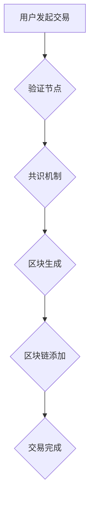

> 区块链，数据可信，加密算法，分布式账本，智能合约，代码实战

## 1. 背景介绍

在当今数据爆炸的时代，数据安全、可信和透明性成为越来越重要的议题。传统的数据存储和管理方式存在着中心化、可篡改和缺乏透明性的问题，这严重阻碍了数据共享和协作。区块链技术作为一种去中心化、分布式和不可篡改的账本技术，为解决这些问题提供了新的解决方案。

区块链技术的核心思想是将数据存储在多个节点上，每个节点都拥有完整的区块链副本。当新的数据需要被添加时，需要经过所有节点的验证和确认，才能被添加到区块链中。这种分布式存储和验证机制使得区块链具有高度的安全性、可靠性和透明性。

## 2. 核心概念与联系

**2.1 区块链结构**

区块链由一系列称为“区块”的数据结构组成。每个区块包含以下信息：

* **数据：** 区块中存储的数据可以是任何类型，例如交易记录、文件、代码等。
* **哈希值：** 每个区块的哈希值是其数据的唯一标识，也是与前一个区块连接的链接。
* **时间戳：** 记录区块的创建时间。
* **前置区块哈希值：** 指向前一个区块的哈希值，形成区块链的链式结构。

**2.2 核心概念**

* **去中心化：** 区块链没有中心化的管理机构，数据分布在所有节点上，任何节点都可以验证和修改数据。
* **分布式：** 区块链数据存储在多个节点上，即使部分节点出现故障，数据也不会丢失。
* **不可篡改：** 由于区块链的哈希值特性，一旦数据被添加到区块链中，就无法被修改。
* **透明性：** 区块链上的所有交易记录都是公开透明的，任何人都可以查看。

**2.3  数据可信原理**

区块链技术通过以下机制保证数据可信：

* **加密算法：** 区块链使用加密算法对数据进行加密，确保数据安全和完整性。
* **共识机制：** 区块链使用共识机制来验证和确认新的数据，确保数据一致性和可靠性。
* **分布式存储：** 区块链数据分布在多个节点上，即使部分节点出现故障，数据也不会丢失。

**2.4  Mermaid 流程图**



## 3. 核心算法原理 & 具体操作步骤

**3.1  算法原理概述**

区块链的核心算法包括哈希算法、加密算法和共识算法。

* **哈希算法：** 用于生成区块的哈希值，确保数据不可篡改。
* **加密算法：** 用于加密数据，确保数据安全。
* **共识算法：** 用于验证和确认新的数据，确保数据一致性和可靠性。

**3.2  算法步骤详解**

1. **用户发起交易：** 用户发起交易请求，包含交易信息和签名。
2. **验证节点验证交易：** 验证节点验证交易的合法性和有效性，例如检查交易金额是否充足、签名是否正确等。
3. **共识机制确认交易：** 验证通过的交易被添加到待确认交易池中，共识机制（例如工作量证明或权益证明）验证交易的有效性，并生成新的区块。
4. **区块生成：** 新区块包含待确认交易、前置区块哈希值、时间戳等信息，并使用哈希算法生成区块哈希值。
5. **区块链添加：** 新区块被添加到区块链中，所有节点的区块链副本都会更新。
6. **交易完成：** 交易被添加到区块链中，视为完成。

**3.3  算法优缺点**

* **优点：** 高安全性、可靠性、透明性、不可篡改性。
* **缺点：** 性能有限、可扩展性差、隐私性问题。

**3.4  算法应用领域**

* **金融：** 数字货币、支付结算、供应链金融。
* **医疗：** 电子病历、药品溯源、医疗数据共享。
* **物联网：** 设备身份认证、数据安全、智能合约。
* **政府：** 身份认证、投票系统、数据管理。

## 4. 数学模型和公式 & 详细讲解 & 举例说明

**4.1  数学模型构建**

区块链的数学模型主要基于哈希函数、密码学和概率论。

* **哈希函数：**  哈希函数将任意长度的数据映射到固定长度的哈希值，具有单向性、不可逆性和抗碰撞性。
* **密码学：** 密码学用于加密和解密数据，确保数据安全。常用的加密算法包括RSA、ECC等。
* **概率论：** 概率论用于分析共识机制的安全性，例如工作量证明的难度调整机制。

**4.2  公式推导过程**

* **哈希函数：**  H(x) = y，其中x为输入数据，y为哈希值。
* **加密算法：** E(k, m) = c，其中k为密钥，m为明文，c为密文。
* **共识机制：**  例如工作量证明，需要找到满足特定条件的哈希值，其难度根据网络难度进行调整。

**4.3  案例分析与讲解**

* **哈希函数：**  SHA-256哈希函数广泛应用于区块链中，其输出长度为256位，具有较高的安全性。
* **加密算法：**  比特币使用ECC加密算法，其密钥长度为256位，具有较高的安全性。
* **共识机制：**  工作量证明机制需要矿工进行大量的计算，找到满足特定条件的哈希值，从而获得奖励。

## 5. 项目实践：代码实例和详细解释说明

**5.1  开发环境搭建**

* **操作系统：** Linux或macOS
* **编程语言：** Python
* **开发工具：**  PyCharm、VS Code
* **区块链框架：**  Hyperledger Fabric、Ethereum

**5.2  源代码详细实现**

```python
# 创建一个简单的区块链
class Block:
    def __init__(self, timestamp, data, previous_hash):
        self.timestamp = timestamp
        self.data = data
        self.previous_hash = previous_hash
        self.hash = self.calculate_hash()

    def calculate_hash(self):
        sha = hashlib.sha256()
        sha.update(str(self.timestamp).encode('utf-8') +
                   str(self.data).encode('utf-8') +
                   str(self.previous_hash).encode('utf-8'))
        return sha.hexdigest()

class Blockchain:
    def __init__(self):
        self.chain = [self.create_genesis_block()]

    def create_genesis_block(self):
        return Block("Genesis Block", "0", "0")

    def add_block(self, new_block):
        new_block.previous_hash = self.chain[-1].hash
        new_block.hash = new_block.calculate_hash()
        self.chain.append(new_block)

# 创建一个区块链实例
blockchain = Blockchain()

# 添加一个新的区块
new_block = Block("Block 1", "Transaction 1", blockchain.chain[-1].hash)
blockchain.add_block(new_block)

# 打印区块链信息
for block in blockchain.chain:
    print("Timestamp:", block.timestamp)
    print("Data:", block.data)
    print("Hash:", block.hash)
    print("Previous Hash:", block.previous_hash)
    print("--------------------")
```

**5.3  代码解读与分析**

* **Block类：** 定义了区块的结构，包括时间戳、数据、前置区块哈希值和哈希值。
* **Blockchain类：** 定义了区块链的结构，包括链条和创世区块。
* **create_genesis_block()方法：** 创建创世区块，其前置区块哈希值为0。
* **add_block()方法：** 添加新的区块到区块链中，并更新区块的哈希值和前置区块哈希值。

**5.4  运行结果展示**

运行代码后，会输出每个区块的信息，包括时间戳、数据、哈希值和前置区块哈希值。

## 6. 实际应用场景

**6.1  数字货币**

比特币、以太坊等数字货币都基于区块链技术，实现去中心化的交易和资产管理。

**6.2  供应链管理**

区块链可以追踪商品的来源、运输过程和最终目的地，提高供应链的透明度和安全性。

**6.3  医疗保健**

区块链可以存储和管理患者的电子病历、医疗数据，确保数据的安全性和隐私性。

**6.4  未来应用展望**

区块链技术在未来将应用于更多领域，例如身份认证、投票系统、数据共享等，推动数字经济的发展。

## 7. 工具和资源推荐

**7.1  学习资源推荐**

* **书籍：** 《区块链：革命性的分布式账本技术》
* **在线课程：** Coursera、edX、Udemy
* **博客和论坛：** BitcoinTalk、Ethereum.org

**7.2  开发工具推荐**

* **区块链框架：** Hyperledger Fabric、Ethereum
* **开发语言：** Python、Go、JavaScript
* **钱包软件：** MetaMask、MyEtherWallet

**7.3  相关论文推荐**

* **比特币白皮书：** https://bitcoin.org/bitcoin.pdf
* **以太坊白皮书：** https://ethereum.org/en/whitepaper/

## 8. 总结：未来发展趋势与挑战

**8.1  研究成果总结**

区块链技术已经取得了显著的进展，在数字货币、供应链管理、医疗保健等领域取得了成功应用。

**8.2  未来发展趋势**

* **性能提升：** 研究更高效的共识机制和数据存储方案，提高区块链的性能。
* **隐私保护：** 开发隐私保护机制，保护用户数据隐私。
* **可扩展性：** 研究区块链的扩展方案，使其能够处理更大的交易量。
* **应用场景拓展：** 将区块链技术应用于更多领域，例如身份认证、投票系统、数据共享等。

**8.3  面临的挑战**

* **监管政策：** 区块链技术的监管政策尚不完善，需要政府和行业共同努力制定合理的监管框架。
* **技术标准：** 区块链技术标准尚不统一，需要行业共同制定标准，促进技术互操作性。
* **生态建设：** 区块链生态系统需要不断完善，吸引更多开发者和用户参与。

**8.4  研究展望**

未来，区块链技术将继续发展，并与其他新兴技术融合，例如人工智能、物联网等，为社会带来更多创新和变革。

## 9. 附录：常见问题与解答

**9.1  什么是区块链？**

区块链是一种分布式、去中心化的账本技术，用于记录和验证数据。

**9.2  区块链有哪些特点？**

区块链具有以下特点：

* **去中心化：** 数据分布在多个节点上，没有中心化的管理机构。
* **分布式：** 数据存储在多个节点上，即使部分节点出现故障，数据也不会丢失。
* **不可篡改：** 由于区块链的哈希值特性，一旦数据被添加到区块链中，就无法被修改。
* **透明性：** 区块链上的所有交易记录都是公开透明的，任何人都可以查看。

**9.3  区块链有哪些应用场景