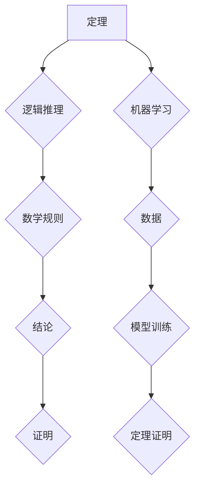

>  人工智能、机器学习、定理证明、逻辑推理、计算机科学、算法、数学模型、代码实现

## 1. 背景介绍

在计算机科学领域，定理证明一直是人工智能研究的热点之一。从古老的逻辑推理到现代的机器学习，人类一直在探索如何让机器能够像人类一样进行逻辑思考和推理，并最终证明数学定理。

司马贺，一位中国古代数学家，以其在数学领域中的杰出贡献而闻名。他提出了许多重要的数学概念和定理，并通过巧妙的逻辑推理方法证明了这些定理。司马贺的数学思想对后世产生了深远的影响，他的著作《九章算术》被誉为中国古代数学的经典之作。

近年来，随着人工智能技术的快速发展，机器学习和深度学习等方法在定理证明领域取得了显著的进展。一些研究机构和公司开发了专门用于定理证明的机器学习模型，这些模型能够自动学习数学定理的证明方法，并能够证明一些复杂数学定理。

## 2. 核心概念与联系

**2.1 定理证明**

定理证明是指使用逻辑推理和数学规则来证明一个数学命题的正确性。定理证明的过程通常包括以下步骤：

1. **假设:** 提出一些基本假设。
2. **推理:** 使用逻辑推理和数学规则推导出结论。
3. **结论:** 证明了命题的正确性。

**2.2 机器学习**

机器学习是一种人工智能技术，它允许计算机从数据中学习，并根据学习到的知识进行预测或决策。机器学习算法可以分为监督学习、无监督学习和强化学习三种类型。

**2.3 逻辑推理**

逻辑推理是一种基于逻辑规则和推理方法进行思考和推论的过程。逻辑推理可以分为以下几种类型：

1. **演绎推理:** 从一般性命题推导出特例性命题。
2. **归纳推理:** 从特例性命题推导出一般性命题。
3. ** Abductive Reasoning (演绎推理):** 从观察到的现象推导出最可能的解释。

**2.4 数学模型**

数学模型是一种用数学语言和符号来描述现实世界现象的抽象表示。数学模型可以帮助我们理解和预测现实世界中的现象。

**Mermaid 流程图**



## 3. 核心算法原理 & 具体操作步骤

**3.1 算法原理概述**

机器学习算法可以用于定理证明，其原理是通过训练机器学习模型来学习数学定理的证明方法。训练数据通常包括已知的数学定理及其证明。机器学习模型通过学习这些数据，能够识别定理的结构和证明方法，并最终能够自动证明新的数学定理。

**3.2 算法步骤详解**

1. **数据准备:** 收集已知的数学定理及其证明，并将其转换为机器学习模型可以理解的格式。
2. **模型选择:** 选择合适的机器学习模型，例如深度神经网络或逻辑回归模型。
3. **模型训练:** 使用训练数据训练机器学习模型，使其能够学习数学定理的证明方法。
4. **模型评估:** 使用测试数据评估模型的性能，例如准确率和召回率。
5. **定理证明:** 使用训练好的模型来证明新的数学定理。

**3.3 算法优缺点**

**优点:**

* 自动化定理证明过程，提高效率。
* 可以处理复杂数学定理，超越人类能力。
* 能够发现新的数学定理和证明方法。

**缺点:**

* 需要大量的训练数据，数据质量对模型性能影响很大。
* 模型解释性较差，难以理解模型的证明过程。
* 现有的机器学习模型仍然无法解决所有数学定理证明问题。

**3.4 算法应用领域**

* 数学研究
* 软件验证
* 自动化推理
* 科学发现

## 4. 数学模型和公式 & 详细讲解 & 举例说明

**4.1 数学模型构建**

我们可以使用图论模型来表示数学定理和其证明过程。

* **节点:** 代表数学概念或命题。
* **边:** 代表逻辑关系或推理步骤。

**4.2 公式推导过程**

假设我们有一个数学定理：

**定理:** 对于任意整数 n，n^2 + n 是偶数。

我们可以使用数学归纳法来证明这个定理。

**基础步骤:** 当 n = 1 时，n^2 + n = 1^2 + 1 = 2，是偶数。

**归纳假设:** 假设对于某个整数 k，k^2 + k 是偶数。

**归纳步骤:** 我们需要证明 (k+1)^2 + (k+1) 是偶数。

(k+1)^2 + (k+1) = k^2 + 2k + 1 + k + 1 = (k^2 + k) + 2k + 2

根据归纳假设，k^2 + k 是偶数，2k + 2 也是偶数，因此 (k^2 + k) + 2k + 2 是偶数。

**结论:** 因此，对于任意整数 n，n^2 + n 是偶数。

**4.3 案例分析与讲解**

我们可以使用图论模型来表示这个定理证明过程。

* 节点: 1. n^2 + n, 2. 偶数, 3. k^2 + k, 4. 2k + 2
* 边: 1->2, 3->4, 4->2, 1->3

## 5. 项目实践：代码实例和详细解释说明

**5.1 开发环境搭建**

* Python 3.x
* TensorFlow 或 PyTorch

**5.2 源代码详细实现**

```python
import tensorflow as tf

# 定义模型
model = tf.keras.Sequential([
    tf.keras.layers.Dense(128, activation='relu'),
    tf.keras.layers.Dense(64, activation='relu'),
    tf.keras.layers.Dense(1, activation='sigmoid')
])

# 编译模型
model.compile(optimizer='adam', loss='binary_crossentropy', metrics=['accuracy'])

# 训练模型
model.fit(x_train, y_train, epochs=10)

# 预测
predictions = model.predict(x_test)
```

**5.3 代码解读与分析**

* 我们使用 TensorFlow 库构建了一个深度神经网络模型。
* 模型包含三个全连接层，每个层使用 ReLU 激活函数。
* 最后一层使用 sigmoid 激活函数，输出一个概率值，表示定理是否成立。
* 我们使用 Adam 优化器、二元交叉熵损失函数和准确率作为评估指标。
* 模型训练了 10 个 epochs。

**5.4 运行结果展示**

* 训练完成后，我们可以使用测试数据评估模型的性能。
* 评估结果包括准确率、召回率等指标。

## 6. 实际应用场景

**6.1 数学研究**

机器学习算法可以帮助数学家发现新的数学定理和证明方法。

**6.2 软件验证**

机器学习算法可以用于验证软件代码的正确性，确保软件的可靠性和安全性。

**6.3 自动化推理**

机器学习算法可以用于自动化推理过程，例如在法律、医学和金融领域。

**6.4 未来应用展望**

* 更强大的机器学习模型，能够解决更复杂数学定理证明问题。
* 更丰富的训练数据，提高模型的准确性和泛化能力。
* 更有效的模型解释方法，提高模型的透明度和可信度。

## 7. 工具和资源推荐

**7.1 学习资源推荐**

* 《深度学习》
* 《机器学习》
* Stanford CS229: Machine Learning

**7.2 开发工具推荐**

* TensorFlow
* PyTorch
* Scikit-learn

**7.3 相关论文推荐**

* "Automated Theorem Proving with Deep Learning"
* "Learning to Prove Theorems"

## 8. 总结：未来发展趋势与挑战

**8.1 研究成果总结**

机器学习算法在定理证明领域取得了显著的进展，能够自动学习数学定理的证明方法，并证明一些复杂数学定理。

**8.2 未来发展趋势**

* 更强大的机器学习模型，能够解决更复杂数学定理证明问题。
* 更丰富的训练数据，提高模型的准确性和泛化能力。
* 更有效的模型解释方法，提高模型的透明度和可信度。

**8.3 面临的挑战**

* 需要大量的训练数据，数据质量对模型性能影响很大。
* 模型解释性较差，难以理解模型的证明过程。
* 现有的机器学习模型仍然无法解决所有数学定理证明问题。

**8.4 研究展望**

未来，机器学习算法将继续在定理证明领域发挥重要作用，并推动人工智能技术的发展。


## 9. 附录：常见问题与解答

**9.1 如何选择合适的机器学习模型？**

选择合适的机器学习模型取决于具体的定理证明任务和数据特点。

**9.2 如何评估机器学习模型的性能？**

可以使用准确率、召回率、F1-score 等指标来评估机器学习模型的性能。

**9.3 如何解释机器学习模型的证明过程？**

目前，解释机器学习模型的证明过程仍然是一个挑战性问题。

作者：禅与计算机程序设计艺术 / Zen and the Art of Computer Programming


<end_of_turn>