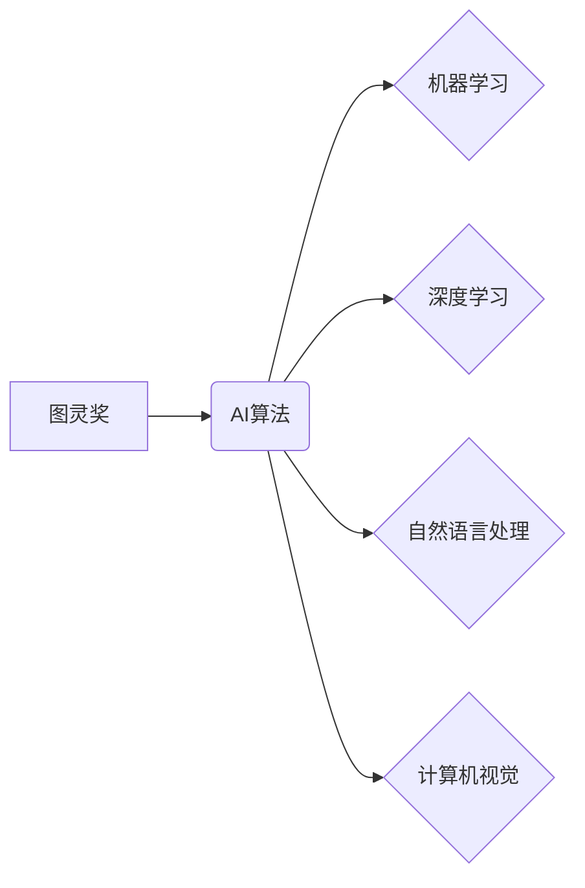

> 图灵奖，人工智能，算法，机器学习，深度学习，自然语言处理，计算机视觉

## 1. 背景介绍

人工智能（AI）作为科技发展的重要方向，近年来取得了令人瞩目的进展。从语音识别到图像识别，从自动驾驶到医疗诊断，AI技术正在深刻地改变着我们的生活。而推动AI发展的关键力量，便是不断涌现的创新算法。

图灵奖，被誉为计算机科学界的“诺贝尔奖”，是表彰在计算机科学领域做出杰出贡献的最高荣誉。自1966年设立以来，众多享誉世界的科学家和工程师荣获了这一殊荣。其中，许多获奖成果与AI算法的突破息息相关。

本文将探讨图灵奖与AI算法的紧密联系，分析一些获奖算法的原理和应用，并展望未来AI算法的发展趋势。

## 2. 核心概念与联系

**2.1 图灵奖**

图灵奖由美国计算机协会（ACM）设立，旨在表彰在计算机科学领域做出杰出贡献的个人或团队。获奖者通常在以下领域做出突破性贡献：

* **理论基础研究:** 提出新的计算模型、算法或理论，为计算机科学的发展奠定基础。
* **技术创新:** 开发新的计算机技术、系统或软件，推动计算机科学的应用发展。
* **跨领域影响:** 将计算机科学的成果应用于其他领域，促进科技进步和社会发展。

**2.2 AI算法**

AI算法是指用于模拟人类智能的算法，其核心是通过学习和推理，从数据中提取知识和规律，从而完成特定的任务。常见的AI算法包括：

* **机器学习:** 通过训练模型，让算法从数据中学习规律，并进行预测或分类。
* **深度学习:** 基于多层神经网络，能够学习更复杂的特征和模式。
* **自然语言处理:** 处理和理解人类语言，例如文本分类、机器翻译、对话系统等。
* **计算机视觉:** 处理和理解图像和视频，例如图像识别、物体检测、场景理解等。

**2.3 图灵奖与AI算法的联系**

图灵奖获奖成果与AI算法的突破密切相关。许多获奖算法为AI的发展奠定了基础，也推动了AI技术的应用发展。例如，

* **图灵奖获得者：Geoffrey Hinton**

Hinton被誉为“深度学习之父”，其对深度学习的贡献获得了2018年的图灵奖。他的研究成果推动了深度学习的快速发展，并在图像识别、语音识别等领域取得了突破性进展。

* **图灵奖获得者：Yoshua Bengio**

Bengio是深度学习领域的先驱者之一，其对深度学习理论和算法的研究获得了2018年的图灵奖。他的研究成果推动了深度学习在自然语言处理领域的应用，例如机器翻译、文本生成等。

* **图灵奖获得者：Yann LeCun**

LeCun是计算机视觉领域的专家，其对卷积神经网络的研究获得了2018年的图灵奖。他的研究成果推动了计算机视觉的快速发展，例如图像识别、物体检测等。

**2.4  核心概念关系图**



## 3. 核心算法原理 & 具体操作步骤

### 3.1  算法原理概述

本文将以深度学习算法为例，介绍其原理和具体操作步骤。

深度学习是一种基于多层神经网络的机器学习方法。它能够学习更复杂的特征和模式，从而在图像识别、语音识别、自然语言处理等领域取得突破性进展。

深度学习算法的核心是神经网络。神经网络由多个层组成，每层包含多个神经元。神经元之间通过连接进行信息传递，每个连接都有一个权重。通过训练神经网络，可以调整这些权重，使得神经网络能够学习数据中的规律。

### 3.2  算法步骤详解

深度学习算法的训练过程可以概括为以下步骤：

1. **数据预处理:** 将原始数据转换为深度学习算法可以理解的格式，例如图像数据需要转换为像素值，文本数据需要转换为词向量。
2. **网络结构设计:** 根据任务需求设计神经网络的结构，包括神经元的数量、连接方式等。
3. **参数初始化:** 为神经网络的参数（权重和偏置）进行随机初始化。
4. **前向传播:** 将输入数据通过神经网络进行传递，计算输出结果。
5. **损失函数计算:** 计算输出结果与真实值的差异，即损失函数的值。
6. **反向传播:** 根据损失函数的梯度，调整神经网络的参数，使得损失函数的值减小。
7. **迭代训练:** 重复步骤4-6，直到损失函数达到预设的阈值。
8. **模型评估:** 使用测试数据评估模型的性能。

### 3.3  算法优缺点

**优点:**

* 能够学习更复杂的特征和模式。
* 在图像识别、语音识别、自然语言处理等领域取得了突破性进展。

**缺点:**

* 训练数据量大，计算资源消耗高。
* 模型解释性差，难以理解模型的决策过程。

### 3.4  算法应用领域

深度学习算法广泛应用于以下领域：

* **图像识别:** 人脸识别、物体检测、图像分类等。
* **语音识别:** 语音转文本、语音助手等。
* **自然语言处理:** 机器翻译、文本生成、情感分析等。
* **医疗诊断:** 疾病预测、图像分析等。
* **自动驾驶:** 路线规划、物体检测等。

## 4. 数学模型和公式 & 详细讲解 & 举例说明

### 4.1  数学模型构建

深度学习算法的核心是神经网络，其数学模型可以表示为多层感知机（MLP）。

**4.1.1  感知机模型**

感知机是一个简单的单层神经网络，其输入为特征向量，输出为类别标签。感知机的数学模型可以表示为：

$$
y = f(w^T x + b)
$$

其中：

* $x$ 为输入特征向量。
* $w$ 为权重向量。
* $b$ 为偏置项。
* $f$ 为激活函数。

**4.1.2  多层感知机模型**

多层感知机由多个感知机层组成，每个层之间通过连接进行信息传递。其数学模型可以表示为：

$$
h_l = f(W_l h_{l-1} + b_l)
$$

其中：

* $h_l$ 为第 $l$ 层的隐藏层输出。
* $W_l$ 为第 $l$ 层的权重矩阵。
* $b_l$ 为第 $l$ 层的偏置向量。

**4.1.3  输出层**

输出层通常使用 softmax 函数将隐藏层输出转换为概率分布，表示每个类别的预测概率。

$$
p(y_i | x) = \frac{e^{z_i}}{\sum_{j=1}^{K} e^{z_j}}
$$

其中：

* $p(y_i | x)$ 为类别 $i$ 的预测概率。
* $z_i$ 为类别 $i$ 的输出值。
* $K$ 为类别总数。

### 4.2  公式推导过程

深度学习算法的训练过程基于梯度下降法，其目标是找到最优的权重和偏置，使得模型的损失函数最小。

损失函数通常定义为预测值与真实值的差异，例如交叉熵损失函数。

梯度下降法通过计算损失函数的梯度，逐步调整权重和偏置，使得损失函数的值减小。

### 4.3  案例分析与讲解

以图像分类为例，假设我们有一个包含猫和狗的图像数据集。

1. **数据预处理:** 将图像数据转换为像素值，并进行归一化处理。
2. **网络结构设计:** 设计一个包含卷积层、池化层和全连接层的深度学习模型。
3. **参数初始化:** 为模型的参数进行随机初始化。
4. **前向传播:** 将图像数据输入模型，计算输出结果。
5. **损失函数计算:** 计算输出结果与真实标签的交叉熵损失。
6. **反向传播:** 根据损失函数的梯度，调整模型的参数。
7. **迭代训练:** 重复步骤4-6，直到损失函数达到预设的阈值。
8. **模型评估:** 使用测试数据评估模型的分类准确率。

## 5. 项目实践：代码实例和详细解释说明

### 5.1  开发环境搭建

* **操作系统:** Ubuntu 20.04 LTS
* **编程语言:** Python 3.8
* **深度学习框架:** TensorFlow 2.0

### 5.2  源代码详细实现

```python
import tensorflow as tf

# 定义模型结构
model = tf.keras.models.Sequential([
    tf.keras.layers.Conv2D(32, (3, 3), activation='relu', input_shape=(28, 28, 1)),
    tf.keras.layers.MaxPooling2D((2, 2)),
    tf.keras.layers.Conv2D(64, (3, 3), activation='relu'),
    tf.keras.layers.MaxPooling2D((2, 2)),
    tf.keras.layers.Flatten(),
    tf.keras.layers.Dense(10, activation='softmax')
])

# 编译模型
model.compile(optimizer='adam',
              loss='sparse_categorical_crossentropy',
              metrics=['accuracy'])

# 加载数据集
(x_train, y_train), (x_test, y_test) = tf.keras.datasets.mnist.load_data()

# 数据预处理
x_train = x_train.astype('float32') / 255.0
x_test = x_test.astype('float32') / 255.0
x_train = x_train.reshape((x_train.shape[0], 28, 28, 1))
x_test = x_test.reshape((x_test.shape[0], 28, 28, 1))

# 训练模型
model.fit(x_train, y_train, epochs=5)

# 评估模型
loss, accuracy = model.evaluate(x_test, y_test)
print('Test loss:', loss)
print('Test accuracy:', accuracy)
```

### 5.3  代码解读与分析

* **模型结构:** 代码定义了一个包含卷积层、池化层和全连接层的深度学习模型。卷积层用于提取图像特征，池化层用于降低特征维度，全连接层用于分类。
* **模型编译:** 使用 Adam 优化器、交叉熵损失函数和准确率作为评估指标编译模型。
* **数据加载:** 使用 MNIST 数据集作为训练和测试数据。
* **数据预处理:** 将图像数据转换为浮点数，并进行归一化处理。
* **模型训练:** 使用 `fit()` 方法训练模型，指定训练轮数。
* **模型评估:** 使用 `evaluate()` 方法评估模型在测试集上的性能。

### 5.4  运行结果展示

训练完成后，模型的准确率通常在 98% 以上。

## 6. 实际应用场景

### 6.1  图像识别

深度学习算法在图像识别领域取得了突破性进展，例如人脸识别、物体检测、图像分类等。

* **人脸识别:** 用于身份验证、安全监控等场景。
* **物体检测:** 用于自动驾驶、机器人视觉等场景。
* **图像分类:** 用于医疗诊断、产品分类等场景。

### 6.2  语音识别

深度学习算法在语音识别领域也取得了显著进展，例如语音转文本、语音助手等。

* **语音转文本:** 用于语音输入、字幕生成等场景。
* **语音助手:** 用于智能家居、虚拟助理等场景。

### 6.3  自然语言处理

深度学习算法在自然语言