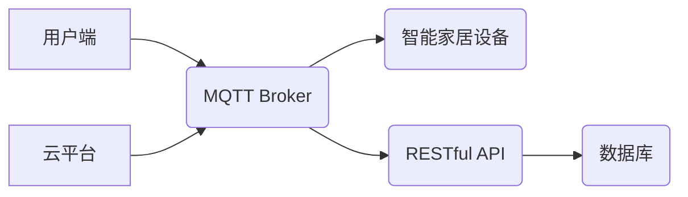

> 智能家居、MQTT协议、RESTful API、远程控制、安全模型、数据加密、身份验证、授权

## 1. 背景介绍

随着物联网技术的快速发展，智能家居逐渐成为人们生活的重要组成部分。智能家居系统能够通过传感器、 actuators 和网络连接，实现对家居环境的自动化控制和远程管理，为用户提供更加便捷、舒适和安全的居住体验。然而，智能家居系统也面临着诸多安全挑战，例如数据泄露、设备被黑客入侵、隐私侵犯等。因此，构建一个安全可靠的智能家居远程控制模型至关重要。

传统的智能家居远程控制系统通常采用基于TCP/IP协议的HTTP请求，但这种方式存在着一些缺点：

* **安全性较低：** HTTP协议本身没有提供加密机制，数据传输过程容易被窃听和篡改。
* **资源消耗大：** HTTP协议需要建立持久连接，占用网络带宽和设备资源。
* **扩展性差：** HTTP协议难以支持大规模设备连接和实时数据传输。

为了解决这些问题，本文提出了一种基于MQTT协议和RESTful API的智能家居远程控制安全模型，该模型结合了MQTT协议的轻量级、可靠性和安全性，以及RESTful API的易用性和灵活性，为智能家居远程控制提供了更加安全、高效和可扩展的解决方案。

## 2. 核心概念与联系

### 2.1 MQTT协议

MQTT（Message Queuing Telemetry Transport）是一种轻量级的消息传输协议，专门设计用于物联网应用场景。它采用发布/订阅模式，消息发布者将消息发布到特定的主题，订阅者可以根据自己的兴趣订阅特定的主题，接收相关消息。MQTT协议具有以下特点：

* **轻量级：** MQTT协议协议栈小巧，占用资源少，适合资源受限的嵌入式设备。
* **可靠性高：** MQTT协议提供消息确认机制，确保消息可靠传输。
* **低功耗：** MQTT协议采用断线重连机制，在网络连接不稳定时也能保证消息传输。
* **安全性：** MQTT协议支持TLS/SSL加密，保障消息传输安全。

### 2.2 RESTful API

RESTful API（Representational State Transfer Application Programming Interface）是一种基于HTTP协议的软件架构风格，它采用资源和操作的模式，通过HTTP请求和响应来访问和操作资源。RESTful API具有以下特点：

* **易于使用：** RESTful API采用标准的HTTP方法和数据格式，易于理解和使用。
* **可扩展性强：** RESTful API可以轻松扩展，支持大规模的资源和操作。
* **平台无关：** RESTful API可以跨平台运行，支持多种编程语言和操作系统。

### 2.3 模型架构

基于MQTT协议和RESTful API的智能家居远程控制安全模型的架构如图所示：



**模型架构说明：**

* 用户端通过MQTT客户端连接到MQTT Broker，发布控制指令或订阅设备状态信息。
* MQTT Broker负责消息的发布和订阅，并将用户端发送的控制指令转发到相应的智能家居设备。
* 智能家居设备接收控制指令后，执行相应的操作，并将操作结果通过MQTT Broker发送回用户端。
* 云平台通过RESTful API连接到MQTT Broker，可以远程监控设备状态、管理用户权限和配置系统参数。
* 数据库用于存储设备信息、用户数据和系统配置等。

## 3. 核心算法原理 & 具体操作步骤

### 3.1  算法原理概述

该模型的核心算法是基于MQTT协议的发布/订阅机制和RESTful API的资源操作模式。

* **MQTT发布/订阅机制：** 用户端通过MQTT客户端发布控制指令，智能家居设备通过订阅相应的主题接收指令，实现远程控制。
* **RESTful API资源操作模式：** 云平台通过RESTful API访问数据库，获取设备状态信息、管理用户权限和配置系统参数。

### 3.2  算法步骤详解

1. **用户端连接MQTT Broker：** 用户端使用MQTT客户端连接到MQTT Broker，并订阅相应的主题，例如“灯光控制”、“温度调节”等。
2. **用户端发布控制指令：** 用户端通过MQTT客户端发布控制指令，例如“打开灯光”、“降低温度”等，并指定目标设备的ID。
3. **MQTT Broker转发控制指令：** MQTT Broker收到控制指令后，根据设备ID转发指令到相应的智能家居设备。
4. **智能家居设备执行操作：** 智能家居设备收到控制指令后，执行相应的操作，例如打开灯光、降低温度等。
5. **智能家居设备发送状态信息：** 智能家居设备执行操作后，将操作结果通过MQTT Broker发送回用户端，例如“灯光已打开”、“温度已降低”等。
6. **云平台访问RESTful API：** 云平台通过RESTful API访问数据库，获取设备状态信息、管理用户权限和配置系统参数。
7. **云平台处理请求：** 云平台根据RESTful API请求，从数据库中获取数据或执行相应的操作，例如更新设备状态、修改用户权限等。

### 3.3  算法优缺点

**优点：**

* **安全性高：** MQTT协议支持TLS/SSL加密，数据传输过程安全可靠。
* **可靠性高：** MQTT协议提供消息确认机制，确保消息可靠传输。
* **低功耗：** MQTT协议采用断线重连机制，在网络连接不稳定时也能保证消息传输。
* **可扩展性强：** MQTT协议支持大规模设备连接和实时数据传输。
* **易于使用：** RESTful API采用标准的HTTP方法和数据格式，易于理解和使用。

**缺点：**

* **需要专业的开发人员：** MQTT协议和RESTful API的开发需要一定的专业知识和经验。
* **部署成本较高：** 需要搭建MQTT Broker和RESTful API服务器，有一定的部署成本。

### 3.4  算法应用领域

该模型适用于各种智能家居场景，例如：

* **灯光控制：** 用户可以通过手机或语音助手远程控制灯光开关、亮度和颜色。
* **温度调节：** 用户可以通过手机或语音助手远程控制空调、暖气或制冷设备，调节室内温度。
* **家电控制：** 用户可以通过手机或语音助手远程控制电视、音响、冰箱等家电设备。
* **安全监控：** 用户可以通过手机或语音助手远程查看监控摄像头画面，并控制报警系统。

## 4. 数学模型和公式 & 详细讲解 & 举例说明

### 4.1  数学模型构建

为了描述智能家居远程控制系统的安全模型，我们可以使用以下数学模型：

* **状态空间：** 智能家居系统的状态空间可以表示为一个集合，其中每个元素代表系统的一个状态。例如，灯光开关状态、温度值、设备运行状态等。
* **状态转移函数：** 状态转移函数描述了系统状态随时间的变化规律。例如，灯光开关状态由用户控制指令决定，温度值由空调或暖气设备控制决定。
* **观察函数：** 观察函数描述了系统状态如何被观察者感知。例如，用户可以通过手机或语音助手观察设备状态信息。
* **控制函数：** 控制函数描述了用户如何控制系统状态。例如，用户可以通过手机或语音助手发送控制指令，改变设备状态。

### 4.2  公式推导过程

我们可以使用状态空间模型来描述智能家居远程控制系统的安全模型。状态空间模型的数学形式如下：

```
x(k+1) = f(x(k), u(k))
y(k) = h(x(k))
```

其中：

* **x(k)** 表示系统状态在时刻k的值。
* **u(k)** 表示系统输入在时刻k的值，即用户发送的控制指令。
* **y(k)** 表示系统输出在时刻k的值，即设备状态信息。
* **f(x(k), u(k))** 表示状态转移函数。
* **h(x(k))** 表示观察函数。

### 4.3  案例分析与讲解

例如，我们可以用状态空间模型来描述智能家居中的灯光控制系统。

* **状态空间：** 灯光开关状态（开/关）。
* **状态转移函数：** 当用户发送“打开灯光”指令时，状态转移到“开”状态；当用户发送“关闭灯光”指令时，状态转移到“关”状态。
* **观察函数：** 用户可以通过手机或语音助手观察到灯光开关状态。
* **控制函数：** 用户可以通过手机或语音助手发送“打开灯光”或“关闭灯光”指令来控制灯光开关状态。

## 5. 项目实践：代码实例和详细解释说明

### 5.1  开发环境搭建

* **操作系统：** Ubuntu 20.04 LTS
* **编程语言：** Python 3.8
* **MQTT Broker：** Mosquitto 1.6
* **RESTful API框架：** Flask 2.0

### 5.2  源代码详细实现

```python
# mqtt_client.py
import paho.mqtt.client as mqtt

# MQTT Broker地址
MQTT_BROKER_ADDRESS = "mqtt.example.com"
# MQTT Broker端口
MQTT_BROKER_PORT = 1883
# 用户订阅主题
SUBSCRIBE_TOPIC = "smart_home/lights"

def on_connect(client, userdata, flags, rc):
    if rc == 0:
        print("Connected to MQTT Broker successfully!")
        client.subscribe(SUBSCRIBE_TOPIC)
    else:
        print("Connection failed with code:", rc)

def on_message(client, userdata, msg):
    print("Received message:", msg.payload.decode())

client = mqtt.Client()
client.on_connect = on_connect
client.on_message = on_message
client.connect(MQTT_BROKER_ADDRESS, MQTT_BROKER_PORT)
client.loop_forever()

# rest_api.py
from flask import Flask, request, jsonify

app = Flask(__name__)

# 模拟设备状态
device_status = {"lights": "off"}

@app.route('/api/devices/<device_id>', methods=['GET'])
def get_device_status(device_id):
    if device_id in device_status:
        return jsonify(device_status[device_id])
    else:
        return jsonify({"error": "Device not found"}), 404

@app.route('/api/devices/<device_id>', methods=['PUT'])
def update_device_status(device_id):
    data = request.get_json()
    if device_id in device_status:
        device_status[device_id] = data['status']
        return jsonify({"message": "Device status updated successfully"})
    else:
        return jsonify({"error": "Device not found"}), 404

if __name__ == '__main__':
    app.run(debug=True)
```

### 5.3  代码解读与分析

* **mqtt_client.py:** 该文件实现了MQTT客户端，用于连接MQTT Broker并订阅主题。
* **rest_api.py:** 该文件实现了RESTful API，用于提供设备状态信息和控制接口。

### 5.4  运行结果展示

运行上述代码后，用户可以通过MQTT客户端订阅“smart_home/lights”主题，接收设备状态信息。用户可以通过RESTful API接口控制设备状态，例如发送PUT请求到`/api/devices/lights`接口，更新灯光状态为“on”。

## 6. 实际应用场景

### 6.1  智能家居远程控制

用户可以通过手机或语音助手远程控制智能家居设备，例如灯光、空调、窗帘等，实现家居自动化控制。

### 6.2  智能家居安全监控

用户可以通过手机或电脑远程查看监控摄像头画面，并控制报警系统，实现智能家居安全监控。

### 6.3  智能家居场景联动

用户可以根据自己的需求，设置智能家居