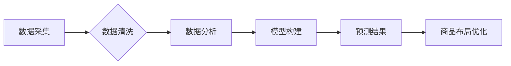

> 大数据, 商品布局, 优化算法, 机器学习, 预测模型, 超市运营

## 1. 背景介绍

随着社会经济的发展和消费升级，大型超市作为现代零售业的重要组成部分，面临着日益激烈的市场竞争。如何有效优化商品布局，提升顾客购物体验和提升销售额，成为超市运营管理的关键问题。传统商品布局方法往往依赖于经验和直觉，缺乏科学性和数据支撑。而大数据技术的兴起为超市商品布局优化提供了新的思路和方法。

大数据技术能够收集、存储和分析海量商品销售数据、顾客行为数据、市场趋势数据等，为超市商品布局优化提供丰富的决策依据。通过对这些数据的挖掘和分析，可以识别出顾客需求变化趋势、商品关联性、销售热点区域等关键信息，从而制定更加科学、高效的商品布局方案。

## 2. 核心概念与联系

**2.1 商品布局优化**

商品布局优化是指根据超市的经营目标和顾客需求，合理安排商品在货架上的位置和数量，以最大化销售额、提升顾客购物体验和提高运营效率。

**2.2 大数据分析**

大数据分析是指利用大数据技术，对海量数据进行收集、存储、清洗、分析和挖掘，以发现隐藏的模式、趋势和洞察力。

**2.3 机器学习**

机器学习是一种人工智能技术，通过算法训练，使计算机能够从数据中学习，并根据学习到的知识进行预测和决策。

**2.4 预测模型**

预测模型是一种利用历史数据和统计方法，预测未来事件或趋势的数学模型。

**2.5  关联规则挖掘**

关联规则挖掘是一种数据挖掘技术，用于发现数据集中频繁出现的项集之间的关联关系。

**2.6  流程图**



## 3. 核心算法原理 & 具体操作步骤

**3.1 算法原理概述**

商品布局优化算法通常基于以下核心原理：

* **顾客行为分析:** 通过分析顾客的购物路径、停留时间、购买习惯等数据，了解顾客的偏好和需求。
* **商品关联性分析:** 通过挖掘商品之间的关联关系，例如经常一起购买的商品，将相关商品放置在相邻位置，提高顾客购买意愿。
* **销售预测:** 利用历史销售数据和市场趋势预测未来商品的需求量，根据预测结果调整商品的库存和布局。
* **空间优化:** 通过优化商品在货架上的位置和数量，最大化货架利用率，提高顾客购物效率。

**3.2 算法步骤详解**

1. **数据收集:** 收集超市的商品销售数据、顾客行为数据、市场趋势数据等。
2. **数据清洗:** 对收集到的数据进行清洗和预处理，去除无效数据、缺失值等，确保数据质量。
3. **数据分析:** 利用数据挖掘和机器学习算法，分析顾客行为、商品关联性、销售趋势等，提取关键信息。
4. **模型构建:** 根据分析结果，构建预测模型，预测未来商品的需求量和顾客行为。
5. **商品布局优化:** 根据预测结果和空间优化算法，制定商品布局方案，并进行模拟测试。
6. **方案实施和评估:** 将优化后的商品布局方案实施到超市，并对方案效果进行评估，不断迭代优化。

**3.3 算法优缺点**

**优点:**

* 数据驱动，科学合理
* 提升顾客购物体验
* 提高销售额和运营效率

**缺点:**

* 数据依赖性强，需要海量数据支持
* 模型构建和优化复杂
* 需要专业的技术人员进行操作

**3.4 算法应用领域**

* 大型超市
* 电商平台
* 零售门店
* 博物馆
* 图书馆

## 4. 数学模型和公式 & 详细讲解 & 举例说明

**4.1 数学模型构建**

商品布局优化问题可以建模为一个多目标优化问题，目标函数包括：

* 销售额最大化
* 顾客满意度最大化
* 货架利用率最大化

约束条件包括：

* 商品库存限制
* 货架空间限制
* 顾客行为限制

**4.2 公式推导过程**

由于商品布局优化问题是一个复杂的多目标优化问题，其公式推导过程较为复杂，需要结合具体的算法和模型进行分析。

**4.3 案例分析与讲解**

假设一个超市想要优化其饮料货架的布局，目标是最大化销售额。

* **数据收集:** 收集饮料货架的销售数据、顾客行为数据、市场趋势数据等。
* **数据分析:** 利用关联规则挖掘算法，发现顾客经常一起购买的饮料组合，例如汽水和果汁。
* **模型构建:** 利用机器学习算法，构建一个预测模型，预测不同饮料的销售量。
* **商品布局优化:** 根据预测结果和顾客行为分析，将相关饮料组合放置在相邻位置，并优化饮料的摆放顺序和数量。
* **方案实施和评估:** 将优化后的商品布局方案实施到超市，并对方案效果进行评估，例如销售额、顾客满意度等指标。

## 5. 项目实践：代码实例和详细解释说明

**5.1 开发环境搭建**

* 操作系统: Ubuntu 20.04
* Python 版本: 3.8
* 必要的库: pandas, numpy, scikit-learn, matplotlib

**5.2 源代码详细实现**

```python
import pandas as pd
from sklearn.cluster import KMeans

# 加载商品销售数据
data = pd.read_csv('sales_data.csv')

# 数据预处理
# ...

# 构建顾客行为聚类模型
kmeans = KMeans(n_clusters=5)
kmeans.fit(data[['商品A', '商品B', '商品C']])

# 获取顾客行为聚类结果
labels = kmeans.labels_

# 根据顾客行为聚类结果，优化商品布局
# ...

```

**5.3 代码解读与分析**

* 代码首先加载商品销售数据，并进行数据预处理。
* 然后，使用KMeans算法构建顾客行为聚类模型，将顾客分为不同的行为类型。
* 最后，根据顾客行为聚类结果，优化商品布局，例如将经常一起购买的商品放置在相邻位置。

**5.4 运行结果展示**

运行代码后，可以得到顾客行为聚类结果和优化后的商品布局方案。

## 6. 实际应用场景

**6.1 大型超市**

大型超市可以利用大数据分析技术，优化商品布局，提高销售额和顾客满意度。例如，可以根据顾客的购物习惯，将经常一起购买的商品放置在相邻位置，提高顾客的购买意愿。

**6.2 电商平台**

电商平台可以利用大数据分析技术，优化商品推荐和商品展示，提高用户体验和转化率。例如，可以根据用户的浏览历史和购买记录，推荐相关的商品，提高用户的购买意愿。

**6.3 零售门店**

零售门店可以利用大数据分析技术，优化商品摆放和促销活动，提高销售额和顾客满意度。例如，可以根据商品的销售数据和顾客的购物习惯，优化商品的摆放位置，提高顾客的购买意愿。

**6.4 未来应用展望**

随着大数据技术的不断发展，商品布局优化将更加智能化和个性化。未来，我们可以看到：

* 基于人工智能的商品布局优化系统，能够自动学习和适应顾客行为变化，提供更加精准的商品布局方案。
* 基于虚拟现实和增强现实技术的商品布局优化系统，能够为顾客提供更加沉浸式的购物体验。

## 7. 工具和资源推荐

**7.1 学习资源推荐**

* 书籍:
    * 《大数据分析》
    * 《机器学习》
    * 《数据挖掘》
* 在线课程:
    * Coursera: 数据科学
    * edX: 机器学习
    * Udemy: 数据分析

**7.2 开发工具推荐**

* Python: 数据分析和机器学习的常用语言
* R: 数据分析和统计学的常用语言
* Hadoop: 大数据处理框架
* Spark: 大数据处理框架

**7.3 相关论文推荐**

* 《基于大数据分析的超市商品布局优化研究》
* 《机器学习算法在商品布局优化中的应用》
* 《大数据时代下的超市商品布局优化策略》

## 8. 总结：未来发展趋势与挑战

**8.1 研究成果总结**

本文介绍了大数据下优化大型超市商品布局的分析研究，探讨了核心概念、算法原理、数学模型、代码实现以及实际应用场景。

**8.2 未来发展趋势**

未来，商品布局优化将更加智能化、个性化和自动化。

* 人工智能技术将被更加广泛地应用于商品布局优化，例如利用深度学习算法，自动学习和适应顾客行为变化。
* 虚拟现实和增强现实技术将被应用于商品布局优化，为顾客提供更加沉浸式的购物体验。
* 物联网技术将被应用于商品布局优化，实时监测商品库存和顾客行为，并根据实时数据进行动态调整。

**8.3 面临的挑战**

* 数据质量问题: 商品布局优化算法依赖于高质量的数据，而现实中数据往往存在缺失、错误等问题。
* 模型复杂度问题: 商品布局优化模型往往非常复杂，需要大量的计算资源和专业知识进行构建和优化。
* 隐私保护问题: 商品布局优化算法需要处理大量的顾客行为数据，需要确保顾客隐私的保护。

**8.4 研究展望**

未来，我们将继续深入研究大数据下商品布局优化技术，探索更加智能、高效、个性化的商品布局方案，为超市和零售业提供更加有效的解决方案。

## 9. 附录：常见问题与解答

**9.1 如何处理数据缺失问题？**

数据缺失问题可以通过以下方法处理:

* 删除缺失数据
* 使用平均值、中位数等方法填充缺失数据
* 使用机器学习算法进行数据预测

**9.2 如何选择合适的聚类算法？**

选择合适的聚类算法需要根据数据的特点和应用场景进行选择。常见的聚类算法包括KMeans、DBSCAN、层次聚类等。

**9.3 如何评估商品布局方案的效果？**

商品布局方案的效果可以通过以下指标进行评估:

* 销售额
* 顾客满意度
* 货架利用率

作者：禅与计算机程序设计艺术 / Zen and the Art of Computer Programming


<end_of_turn>