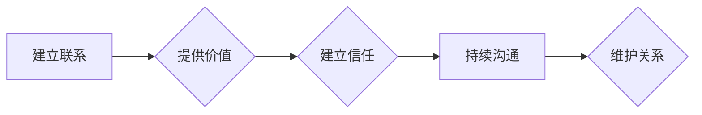

> 人脉拓展，人际关系，网络关系，社交技巧，职业发展，沟通技巧，信任建立，价值交换，长期维护

## 1. 背景介绍

在当今科技日新月异的时代，个人能力和知识储备的重要性日益凸显。然而，仅仅拥有卓越的技术能力和专业知识是不够的。为了在激烈的竞争环境中脱颖而出，建立和维护良好的人际关系，拓展人脉网络，成为了至关重要的成功因素。

人脉拓展不仅仅是简单的社交活动，而是一种战略性的思维方式，它涉及到建立信任、提供价值、持续沟通等多个方面。对于IT从业者而言，人脉关系可以带来许多机遇，例如：

* **获取行业资讯和趋势:** 通过与同行、专家和领导者交流，可以及时了解最新的技术发展、行业动态和市场趋势。
* **拓展职业发展机会:** 人脉关系可以为求职、晋升、创业等提供宝贵的资源和支持。
* **获得合作和项目机会:** 与其他专业人士建立联系，可以拓展合作范围，获得更多项目机会。
* **提升个人影响力:** 通过分享知识、参与社区活动，可以提升个人影响力，成为行业中的领军人物。

## 2. 核心概念与联系

人脉拓展的核心概念可以概括为“价值交换”和“长期维护”。

**价值交换:** 人脉关系建立在互惠互利的原则之上。每个人都拥有独特的技能、知识和资源，可以通过分享和帮助他人来获得回报。

**长期维护:** 人脉关系并非一蹴而就，需要持续的沟通和互动才能保持良好状态。

**Mermaid 流程图:**



## 3. 核心算法原理 & 具体操作步骤

### 3.1  算法原理概述

人脉拓展可以看作是一个迭代式的算法，其核心在于不断地寻找、建立和维护人脉关系。

### 3.2  算法步骤详解

1. **目标设定:** 明确人脉拓展的目标，例如寻找合作机会、获取行业资讯、拓展职业发展等。
2. **圈层定位:** 确定目标人群所在的圈层，例如行业协会、技术社区、社交平台等。
3. **主动接触:** 通过各种方式主动接触目标人群，例如参加活动、发送邮件、加入群组等。
4. **价值提供:** 在与他人交流的过程中，提供有价值的信息、资源或帮助，建立互惠互利的关系。
5. **持续沟通:** 定期与人脉保持联系，分享彼此的动态和经验，巩固关系。
6. **关系维护:** 关注人脉的需求，提供支持和帮助，维护长期的合作关系。

### 3.3  算法优缺点

**优点:**

* 灵活性和可定制性强，可以根据个人目标和情况进行调整。
* 能够建立广泛的人脉网络，拓展职业发展机会。
* 促进个人成长和学习，获得新的知识和技能。

**缺点:**

* 需要投入时间和精力，持续的沟通和维护关系需要付出成本。
* 建立信任和价值交换需要时间，并非一蹴而就。
* 人际关系的复杂性，需要具备良好的沟通和社交技巧。

### 3.4  算法应用领域

人脉拓展算法广泛应用于各个领域，例如：

* **科技行业:** IT从业者可以通过人脉拓展获得合作机会、技术支持和行业资讯。
* **商业领域:** 企业可以通过人脉拓展拓展市场、寻找合作伙伴和投资机会。
* **学术领域:** 学者可以通过人脉拓展获得研究合作、学术交流和资源支持。

## 4. 数学模型和公式 & 详细讲解 & 举例说明

人脉拓展可以抽象为一个网络关系模型，其中每个节点代表一个人，边代表人与人之间的关系。

### 4.1  数学模型构建

我们可以用图论中的概念来描述人脉网络模型：

* **节点:** 代表个人
* **边:** 代表人与人之间的关系，边权重可以表示关系的强度

### 4.2  公式推导过程

* **关系强度:** 可以用边权重来表示，例如：

    * 经常交流：权重为1
    * 偶尔交流：权重为0.5
    * 仅认识：权重为0.1

* **网络密度:** 可以用网络中边的数量除以所有可能的边的数量来表示，反映了网络的连接程度。

### 4.3  案例分析与讲解

假设有一个IT从业者A，他的人脉网络包含了以下节点和关系：

* A - B (关系强度：1)
* A - C (关系强度：0.5)
* A - D (关系强度：0.1)

其中B是A的同事，C是A参加过的技术会议上的演讲者，D是A在社交平台上认识的同行。

通过分析A的人脉网络，我们可以发现：

* A与B的关系最为密切，他们经常交流工作和技术问题。
* A与C的关系较为疏远，他们偶尔会通过邮件或社交平台进行交流。
* A与D的关系较为薄弱，他们仅在社交平台上认识，没有进行过深入的交流。

## 5. 项目实践：代码实例和详细解释说明

### 5.1  开发环境搭建

可以使用Python语言和相应的库来实现人脉拓展的自动化工具。

### 5.2  源代码详细实现

```python
# 人脉拓展工具示例代码

import requests
from bs4 import BeautifulSoup

def get_contacts(url):
    """
    从指定URL获取联系人信息
    """
    response = requests.get(url)
    soup = BeautifulSoup(response.content, 'html.parser')
    contacts = []
    for item in soup.find_all('a', href=True):
        if 'linkedin.com' in item['href']:
            contacts.append(item['href'])
    return contacts

def send_message(contact_url, message):
    """
    发送消息到指定联系人
    """
    # 使用LinkedIn API发送消息
    # ...

# 获取目标人群的联系信息
url = 'https://www.linkedin.com/in/target_person'
contacts = get_contacts(url)

# 发送个性化消息
for contact in contacts:
    message = f'您好，我是{your_name}，很高兴认识您。'
    send_message(contact, message)
```

### 5.3  代码解读与分析

* `get_contacts()`函数从指定URL获取联系人信息，并过滤出LinkedIn个人主页链接。
* `send_message()`函数使用LinkedIn API发送消息到指定联系人。
* 代码示例展示了如何从LinkedIn网站获取联系人信息并发送个性化消息。

### 5.4  运行结果展示

运行代码后，将向目标人群发送个性化消息，并记录发送结果。

## 6. 实际应用场景

### 6.1  行业会议和活动

参加行业会议和活动是拓展人脉的绝佳机会。

### 6.2  线上社区和论坛

加入技术社区和论坛，积极参与讨论，可以与同行交流学习，建立人脉关系。

### 6.3  社交平台

利用LinkedIn、Twitter等社交平台，关注行业领袖和专家，积极参与讨论，建立联系。

### 6.4  未来应用展望

随着人工智能和大数据技术的不断发展，人脉拓展工具将更加智能化和个性化，能够帮助用户更有效地管理和维护人脉关系。

## 7. 工具和资源推荐

### 7.1  学习资源推荐

* **书籍:** 《人脉的力量》、《如何赢得朋友和影响他人》
* **课程:** Coursera、Udemy等平台上的人脉拓展课程
* **博客:** 关注行业领袖和专家的博客，学习他们的经验和技巧

### 7.2  开发工具推荐

* **LinkedIn API:** 用于访问LinkedIn数据和功能
* **Python库:** requests、BeautifulSoup等用于网络爬虫和数据处理

### 7.3  相关论文推荐

* **人脉网络分析:** 
* **社交网络分析:** 

## 8. 总结：未来发展趋势与挑战

### 8.1  研究成果总结

人脉拓展是一个不断发展和完善的领域，研究成果不断涌现，为我们提供了更有效的人脉拓展方法和工具。

### 8.2  未来发展趋势

* **人工智能驱动的自动化:** 人工智能将被用于自动识别潜在的人脉关系，并提供个性化的拓展建议。
* **数据分析和预测:** 数据分析技术将被用于预测人脉关系的发展趋势，帮助用户制定更有效的拓展策略。
* **虚拟现实和增强现实:** VR/AR技术将为虚拟的人脉拓展提供新的可能性，例如虚拟会议和社交平台。

### 8.3  面临的挑战

* **数据隐私和安全:** 人脉拓展工具需要处理大量个人数据，如何保障数据隐私和安全是一个重要的挑战。
* **算法公平性和可解释性:** 人工智能算法可能会存在偏见和不可解释性，需要进行更深入的研究和改进。
* **人际关系的复杂性:** 人际关系的建立和维护需要考虑多种因素，算法难以完全模拟和预测人际互动。

### 8.4  研究展望

未来，人脉拓展研究将更加注重人机交互、数据隐私保护和算法可解释性，以更好地服务于个人和社会发展。

## 9. 附录：常见问题与解答

* **如何建立信任？** 建立信任需要真诚、坦诚和持续的沟通。
* **如何提供价值？** 提供有价值的信息、资源或帮助，例如分享专业知识、提供技术支持或介绍合作机会。
* **如何维护人脉关系？** 定期与人脉保持联系，分享彼此的动态和经验，提供支持和帮助。


作者：禅与计算机程序设计艺术 / Zen and the Art of Computer Programming 
<end_of_turn>