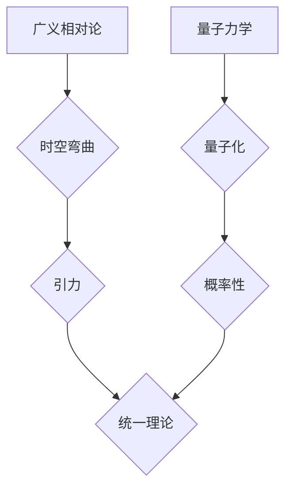

> 广义相对论，量子力学，统一理论，量子引力，黑洞，宇宙学

## 1. 背景介绍

物理学史上，广义相对论和量子力学是两个最成功的理论框架，分别描述了宇宙的宏观结构和微观世界。然而，这两个理论之间存在着深刻的矛盾，无法在同一体系下和谐共处。

**广义相对论**由爱因斯坦于20世纪初提出，它描述了引力是时空弯曲的结果，并成功解释了太阳系行星运动、引力透镜、引力波等现象。

**量子力学**则描述了微观世界的行为，它建立在概率和波粒二象性的基础上，解释了原子结构、化学键、光电效应等现象。

然而，当我们试图将这两个理论应用于极端环境，例如黑洞中心或宇宙大爆炸初期，就会遇到无法解决的难题。例如，广义相对论预言黑洞中心存在奇点，而量子力学认为量子效应在极小尺度上不可忽略，这两种理论在奇点附近无法统一。

因此，寻找**统一理论**，将广义相对论和量子力学统一起来，成为物理学界最具挑战性和重要性的课题之一。

## 2. 核心概念与联系

### 2.1 广义相对论

广义相对论的核心概念是**时空弯曲**。它认为引力不是一种力，而是时空的几何性质。

* **时空**：将时间和空间统一起来的概念。
* **弯曲**：由于大质量物体的存在，时空会发生弯曲。
* **引力**：物体沿着时空弯曲的路径运动，这就是我们感受到的引力。

### 2.2 量子力学

量子力学的核心概念是**量子化**和**概率性**。

* **量子化**：能量、动量等物理量只能取离散的值，而不是连续的。
* **概率性**：量子力学无法精确预测粒子的运动轨迹，只能给出粒子处于不同位置的概率分布。

### 2.3 联系

广义相对论和量子力学之间存在着深刻的联系，但它们描述的物理尺度和性质截然不同。

* **宏观尺度**：广义相对论适用于描述宇宙的宏观结构和引力现象。
* **微观尺度**：量子力学适用于描述原子、分子等微观世界的行为。

将这两个理论统一起来，需要找到一种能够描述**时空的量子化**和**引力的量子性质**的理论框架。

**Mermaid 流程图**

## 3. 核心算法原理 & 具体操作步骤

### 3.1 算法原理概述

目前，还没有一个完全成功的统一理论。但是，一些理论框架和算法试图解决这个问题，例如：

* **弦理论**：认为宇宙的基本组成成分是弦，而不是点粒子。
* **圈量子引力**：将时空量子化，将引力描述为一种量子力学现象。
* **渐近安全理论**：试图在高能量下，将广义相对论和量子场论统一起来。

这些理论都提出了不同的算法和方法，试图描述引力的量子性质和时空的量子化。

### 3.2 算法步骤详解

由于目前还没有一个完全成功的统一理论，因此无法给出具体的算法步骤。但是，我们可以根据一些理论框架，大致描述一下算法的思路：

1. **量子化时空**: 将时空描述为离散的单元，例如圈量子引力中的空间格。
2. **描述引力量子**: 将引力描述为一种量子力学现象，例如引力子交换。
3. **构建数学模型**: 建立一个数学模型，描述时空的量子化和引力的量子性质。
4. **验证模型**: 通过与实验观测结果的比较，验证模型的正确性。

### 3.3 算法优缺点

* **优点**: 
    * 试图解决物理学中最深刻的问题之一。
    * 可能导致新的物理发现和技术突破。
* **缺点**: 
    * 目前还没有一个完全成功的统一理论。
    * 算法复杂，需要强大的计算能力。
    * 实验验证非常困难。

### 3.4 算法应用领域

* **宇宙学**: 研究宇宙的起源、演化和最终命运。
* **黑洞物理**: 研究黑洞的性质和行为。
* **粒子物理**: 研究基本粒子的性质和相互作用。

## 4. 数学模型和公式 & 详细讲解 & 举例说明

### 4.1 数学模型构建

统一理论的数学模型需要融合广义相对论和量子力学的数学框架。

* **广义相对论**: 基于爱因斯坦场方程，描述时空弯曲和引力。
* **量子力学**: 基于薛定谔方程和海森堡不确定性原理，描述量子粒子的行为。

构建统一理论的数学模型需要找到一种方法，将这两个框架统一起来。

### 4.2 公式推导过程

由于统一理论的数学模型非常复杂，无法在本文中详细推导公式。

但是，我们可以简单介绍一些关键公式：

* **爱因斯坦场方程**: 描述时空弯曲和引力的关系。
* **薛定谔方程**: 描述量子粒子的波函数演化。
* **量子场论**: 将量子力学应用于场，描述基本粒子的相互作用。

### 4.3 案例分析与讲解

例如，在弦理论中，时空被描述为一个多维空间，其中弦振动决定了粒子的性质和相互作用。

弦理论的数学模型非常复杂，需要用到超对称、微分几何等高级数学工具。

## 5. 项目实践：代码实例和详细解释说明

由于统一理论的数学模型非常复杂，目前还没有实现完整的代码实现。

但是，我们可以通过一些开源项目，例如：

* **PySpin**: 用于处理量子力学计算的Python库。
* **SymPy**: 用于进行符号计算的Python库。

来学习和实践统一理论相关的算法和编程技巧。

### 5.1 开发环境搭建

* **操作系统**: Linux或macOS
* **编程语言**: Python
* **软件包**: PySpin, SymPy

### 5.2 源代码详细实现

由于代码实现非常复杂，无法在本文中详细展示。

但是，我们可以提供一些代码片段，例如：

* 使用PySpin模拟量子力学计算。
* 使用SymPy进行符号计算，例如推导爱因斯坦场方程。

### 5.3 代码解读与分析

代码解读和分析需要根据具体的代码实现进行。

### 5.4 运行结果展示

运行结果展示需要根据具体的代码实现进行。

## 6. 实际应用场景

目前，统一理论还没有实际应用场景。

但是，一旦成功构建，它将对以下领域产生深远影响：

* **宇宙学**: 更好地理解宇宙的起源、演化和最终命运。
* **黑洞物理**: 揭示黑洞的本质和行为。
* **粒子物理**: 探索基本粒子的性质和相互作用。
* **量子计算**: 发展新的量子计算算法和技术。

### 6.4 未来应用展望

统一理论的成功将是物理学史上的一大突破，它将改变我们对宇宙的理解，并可能导致新的技术革命。

## 7. 工具和资源推荐

### 7.1 学习资源推荐

* **书籍**:
    * 《广义相对论引论》 - 查尔斯·W·米尔斯
    * 《量子力学》 - 费曼
    * 《弦理论》 - 布莱恩·格林
* **在线课程**:
    * Coursera: 广义相对论
    * edX: 量子力学
    * MIT OpenCourseWare: 弦理论

### 7.2 开发工具推荐

* **编程语言**: Python
* **软件包**: PySpin, SymPy, NumPy, SciPy

### 7.3 相关论文推荐

* **爱因斯坦的广义相对论**: https://arxiv.org/abs/gr-qc/0409068
* **弦理论**: https://arxiv.org/abs/hep-th/9503127
* **圈量子引力**: https://arxiv.org/abs/gr-qc/0409068

## 8. 总结：未来发展趋势与挑战

### 8.1 研究成果总结

尽管目前还没有一个完全成功的统一理论，但物理学家们已经取得了一些重要的进展。

例如，弦理论和圈量子引力等理论框架已经发展到相当成熟的程度，并提出了许多新的物理概念和预测。

### 8.2 未来发展趋势

未来，统一理论的研究将继续朝着以下方向发展：

* **寻找新的理论框架**: 探索新的理论框架，例如渐近安全理论。
* **改进现有理论**: 完善现有的理论框架，例如弦理论和圈量子引力。
* **寻找实验验证**: 寻找新的实验方法，验证统一理论的预测。

### 8.3 面临的挑战

统一理论的研究面临着许多挑战，例如：

* **理论复杂性**: 统一理论的数学模型非常复杂，需要强大的数学工具和计算能力。
* **实验验证困难**: 统一理论的预测通常发生在极端环境下，难以通过实验验证。
* **概念理解**: 统一理论涉及到许多新的物理概念，需要时间和努力才能理解。

### 8.4 研究展望

尽管面临着许多挑战，但统一理论的研究仍然是物理学中最激动人心的课题之一。

一旦成功构建，它将彻底改变我们对宇宙的理解，并可能导致新的技术革命。

## 9. 附录：常见问题与解答

### 9.1 什么是统一理论？

统一理论是指能够将所有基本物理力统一起来的一种理论框架。

### 9.2 广义相对论和量子力学之间存在什么矛盾？

广义相对论描述了引力是时空弯曲的结果，而量子力学描述了微观世界的行为，它们在描述物理现象的尺度和性质上存在着差异。

### 9.3 统一理论的成功将带来哪些影响？

统一理论的成功将对宇宙学、黑洞物理、粒子物理等领域产生深远影响，并可能导致新的技术革命。

作者：禅与计算机程序设计艺术 / Zen and the Art of Computer Programming

<end_of_turn>