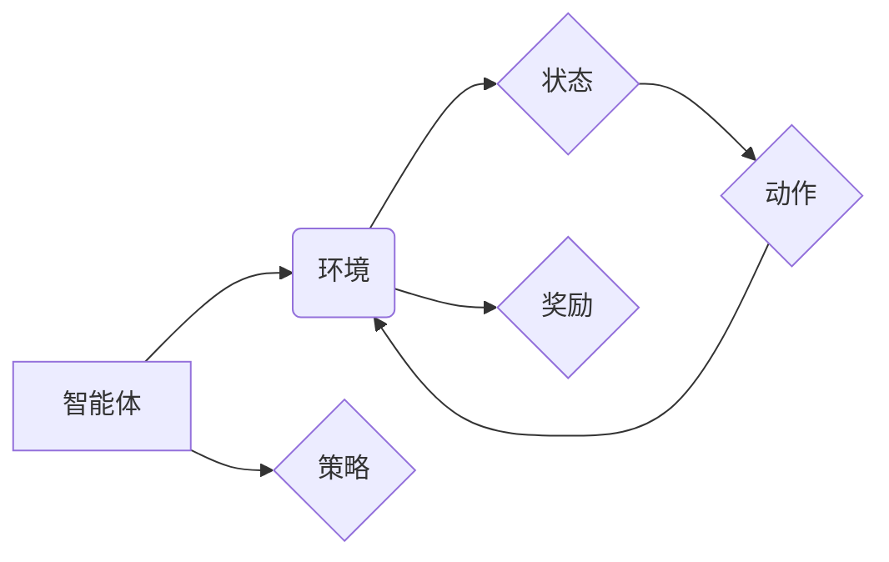

> 强化学习、Reinforcement Learning、Q-learning、Deep Q-Network、算法原理、代码实例、Python

## 1. 背景介绍

强化学习 (Reinforcement Learning, RL) 作为机器学习领域的重要分支，近年来发展迅速，并在机器人控制、游戏 AI、推荐系统等领域取得了显著成果。与监督学习和无监督学习不同，强化学习的核心在于让智能体通过与环境的交互学习最优策略，以最大化累积的奖励。

想象一下，一个机器人需要学习如何行走。通过监督学习，我们可以提供大量标注好的数据，告诉机器人每个步骤应该如何移动。但现实世界中，环境复杂多变，难以预料所有情况。强化学习则提供了一种更灵活的学习方式：机器人通过尝试不同的动作，观察环境的反馈（奖励或惩罚），并根据反馈调整自己的策略，最终学习到最优的行走方式。

## 2. 核心概念与联系

在强化学习中，主要涉及以下核心概念：

* **智能体 (Agent):** 学习和决策的实体，例如机器人、游戏角色等。
* **环境 (Environment):** 智能体所处的外部世界，包括状态和动作空间。
* **状态 (State):** 环境的当前描述，例如机器人的位置、速度等。
* **动作 (Action):** 智能体可以执行的操作，例如向前移动、向左转等。
* **奖励 (Reward):** 环境对智能体动作的反馈，可以是正向奖励或负向惩罚。
* **策略 (Policy):** 智能体根据当前状态选择动作的规则。

**核心概念关系图:**



## 3. 核心算法原理 & 具体操作步骤

### 3.1  算法原理概述

Q-learning 是一种经典的强化学习算法，它通过学习一个 Q-表来评估每个状态-动作对的价值。Q-表是一个表格，其中每个单元格存储了从当前状态执行特定动作后获得的期望奖励。

Q-learning 的目标是找到一个策略，使得智能体在任何状态下选择动作，都能获得最大的累积奖励。

### 3.2  算法步骤详解

1. **初始化 Q-表:** 将 Q-表中的所有单元格初始化为 0 或一个小随机值。
2. **选择动作:** 根据当前状态和策略选择一个动作。
3. **执行动作:** 在环境中执行选择的动作，并观察环境的反馈（下一个状态和奖励）。
4. **更新 Q-表:** 使用 Bellman 方程更新 Q-表中的对应单元格：

```
Q(s, a) = Q(s, a) + α [r + γ max Q(s', a') - Q(s, a)]
```

其中：

* Q(s, a) 是当前状态 s 下执行动作 a 的 Q 值。
* α 是学习率，控制着学习速度。
* r 是从当前状态执行动作 a 后获得的奖励。
* γ 是折扣因子，控制着未来奖励的权重。
* s' 是执行动作 a 后进入的下一个状态。
* max Q(s', a') 是下一个状态 s' 下所有动作的 Q 值的最大值。

5. **重复步骤 2-4:** 直到智能体学习到一个满足要求的策略。

### 3.3  算法优缺点

**优点:**

* 能够学习复杂的环境和策略。
* 适用于离散状态和动作空间。

**缺点:**

* 对于连续状态和动作空间，Q-表会变得非常庞大，难以存储和更新。
* 学习速度可能较慢，尤其是在高维状态空间中。

### 3.4  算法应用领域

* **机器人控制:** 训练机器人学习行走、抓取、导航等动作。
* **游戏 AI:** 训练游戏角色学习策略，例如玩游戏、完成任务。
* **推荐系统:** 训练推荐系统学习用户偏好，并推荐合适的商品或内容。
* **金融交易:** 训练交易策略，自动进行股票交易。

## 4. 数学模型和公式 & 详细讲解 & 举例说明

### 4.1  数学模型构建

强化学习的核心数学模型是马尔可夫决策过程 (Markov Decision Process, MDP)。MDP 由以下五个要素组成：

* **状态空间 S:** 所有可能的系统状态的集合。
* **动作空间 A:** 在每个状态下智能体可以执行的动作的集合。
* **转移概率 P(s', r | s, a):** 从状态 s 执行动作 a 后，转移到状态 s' 并获得奖励 r 的概率。
* **奖励函数 R(s, a):** 在状态 s 执行动作 a 后获得的奖励。
* **折扣因子 γ:** 控制着未来奖励的权重，通常取值在 0 到 1 之间。

### 4.2  公式推导过程

Q-learning 算法的目标是找到一个策略 π，使得智能体在任何状态下选择动作，都能获得最大的累积奖励。

Q-learning 使用 Bellman 方程来更新 Q-表中的值：

```
Q(s, a) = Q(s, a) + α [r + γ max Q(s', a') - Q(s, a)]
```

其中：

* Q(s, a) 是当前状态 s 下执行动作 a 的 Q 值。
* α 是学习率，控制着学习速度。
* r 是从当前状态执行动作 a 后获得的奖励。
* γ 是折扣因子，控制着未来奖励的权重。
* s' 是执行动作 a 后进入的下一个状态。
* max Q(s', a') 是下一个状态 s' 下所有动作的 Q 值的最大值。

### 4.3  案例分析与讲解

假设一个机器人需要学习如何行走，环境包含两个状态： "起点" 和 "终点"，动作有 "向前" 和 "向后" 两种。

* 从 "起点" 状态向前移动，获得奖励 1，进入 "终点" 状态。
* 从 "起点" 状态向后移动，获得奖励 -1，仍然在 "起点" 状态。
* 从 "终点" 状态向前或向后移动，获得奖励 0，保持在 "终点" 状态。

使用 Q-learning 算法，我们可以训练机器人学习策略，使得它能够从 "起点" 到达 "终点" 并获得最大奖励。

## 5. 项目实践：代码实例和详细解释说明

### 5.1  开发环境搭建

* Python 3.x
* TensorFlow 或 PyTorch

### 5.2  源代码详细实现

```python
import numpy as np

# 定义环境
class Environment:
    def __init__(self):
        self.state = "start"

    def step(self, action):
        if self.state == "start":
            if action == 0:  # 向前移动
                self.state = "goal"
                reward = 1
            else:  # 向后移动
                reward = -1
        else:
            reward = 0
        return self.state, reward

# 定义 Q-learning 算法
class QLearning:
    def __init__(self, learning_rate=0.1, discount_factor=0.9, epsilon=0.1):
        self.learning_rate = learning_rate
        self.discount_factor = discount_factor
        self.epsilon = epsilon
        self.q_table = {}

    def choose_action(self, state):
        if np.random.uniform(0, 1) < self.epsilon:
            return np.random.choice([0, 1])  # 随机选择动作
        else:
            return np.argmax(self.q_table.get(state, [0, 0]))  # 选择 Q 值最大的动作

    def update_q_table(self, state, action, reward, next_state):
        if state not in self.q_table:
            self.q_table[state] = [0, 0]
        self.q_table[state][action] = (1 - self.learning_rate) * self.q_table[state][action] + self.learning_rate * (reward + self.discount_factor * max(self.q_table.get(next_state, [0, 0])))

# 创建环境和 Q-learning 算法实例
env = Environment()
agent = QLearning()

# 训练
for episode in range(1000):
    state = env.state
    while state != "goal":
        action = agent.choose_action(state)
        next_state, reward = env.step(action)
        agent.update_q_table(state, action, reward, next_state)
        state = next_state

# 测试
state = env.state
while state != "goal":
    action = agent.choose_action(state)
    next_state, reward = env.step(action)
    state = next_state

print("训练完成！")
```

### 5.3  代码解读与分析

* **环境类 `Environment`:** 定义了环境的状态和动作，以及状态转移和奖励函数。
* **Q-learning 类 `QLearning`:** 实现 Q-learning 算法的核心逻辑，包括选择动作、更新 Q 值等。
* **训练循环:** 训练过程中，智能体不断与环境交互，根据环境的反馈更新 Q 值，最终学习到最优策略。
* **测试循环:** 测试阶段，使用训练好的策略，让智能体在环境中执行动作，观察其行为。

### 5.4  运行结果展示

运行代码后，智能体将学习到从 "起点" 到达 "终点" 的策略，并能够在测试阶段成功完成任务。

## 6. 实际应用场景

### 6.1  机器人控制

强化学习在机器人控制领域有着广泛的应用，例如：

* **自主导航:** 训练机器人学习在复杂环境中自主导航，避开障碍物，到达目标位置。
* **抓取和 Manipulation:** 训练机器人学习抓取和操作物体，例如抓取苹果、打开门等。
* **运动控制:** 训练机器人学习流畅、稳定的运动，例如行走、跑步、跳跃等。

### 6.2  游戏 AI

强化学习在游戏 AI 领域取得了显著成果，例如：

* **策略游戏:** 训练 AI 玩家学习玩策略游戏，例如围棋、象棋、Go等。
* **动作游戏:** 训练 AI 角色学习玩动作游戏，例如玩 Super Mario Bros.、玩 Dota 2 等。
* **虚拟现实游戏:** 训练 AI 角色在虚拟现实游戏中与玩家互动，提供更逼真的游戏体验。

### 6.3  推荐系统

强化学习可以用于训练推荐系统，学习用户偏好，并推荐更相关的商品或内容。例如：

* **商品推荐:** 训练推荐系统学习用户喜欢的商品类型，并推荐相关的商品。
* **内容推荐:** 训练推荐系统学习用户喜欢的新闻、视频、音乐等内容，并推荐相关的推荐。
* **个性化推荐:** 训练推荐系统学习每个用户的个性化偏好，并提供个性化的推荐。

### 6.4  未来应用展望

强化学习在未来将有更广泛的应用，例如：

* **自动驾驶:** 训练自动驾驶汽车学习在复杂道路环境中安全驾驶。
* **医疗诊断:** 训练 AI 医生学习诊断疾病，辅助医生做出更准确的诊断。
* **金融交易:** 训练交易策略，自动进行股票交易，提高投资收益。

## 7. 工具和资源推荐

### 7.1  学习资源推荐

* **书籍:**
    * Reinforcement Learning: An Introduction by Richard S. Sutton and Andrew G. Barto
    * Deep Reinforcement Learning Hands-On by Maxim Lapan
* **在线课程:**
    * Coursera: Reinforcement Learning Specialization by David