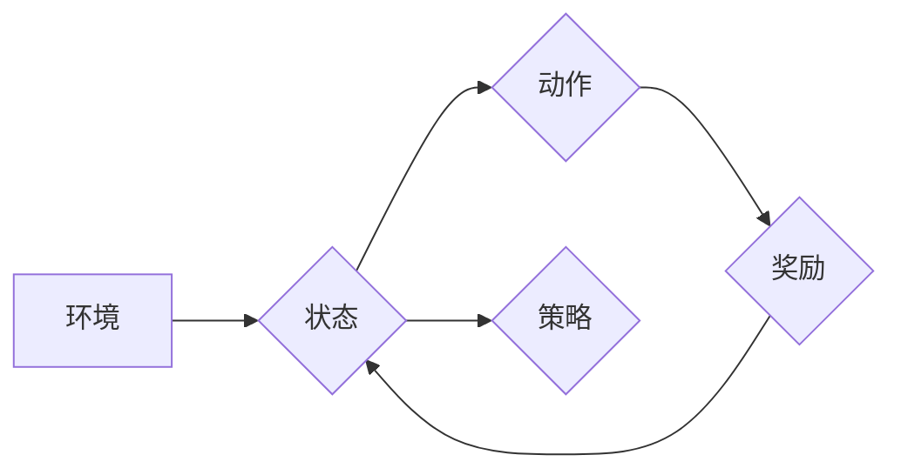

> 强化学习，无人驾驶，深度学习，强化信号，状态空间，动作空间，奖励函数，Q-learning，Deep Q-Network (DQN)

## 1. 背景介绍

无人驾驶技术作为人工智能领域最具前沿性和应用价值的研究方向之一，近年来取得了显著进展。从早期基于规则和地图导航的系统，到如今能够感知环境、做出决策并自主驾驶的智能汽车，无人驾驶技术的发展离不开人工智能技术的驱动。其中，强化学习 (Reinforcement Learning, RL) 作为一种模仿人类学习机制的机器学习方法，在无人驾驶领域展现出巨大的潜力。

传统的无人驾驶系统主要依赖于预先定义的规则和地图信息，难以应对复杂、动态变化的驾驶场景。而强化学习则通过与环境的交互学习，不断优化驾驶策略，从而实现更灵活、更安全、更智能的驾驶行为。

## 2. 核心概念与联系

强化学习的核心概念包括：

* **状态空间 (State Space):**  描述无人驾驶系统当前的驾驶环境，例如车辆位置、速度、方向、周围车辆信息等。
* **动作空间 (Action Space):**  描述无人驾驶系统可以执行的动作，例如加速、减速、转向、刹车等。
* **奖励函数 (Reward Function):**  评估无人驾驶系统在特定状态下执行特定动作的优劣，引导系统学习最优驾驶策略。
* **策略 (Policy):**  描述无人驾驶系统在特定状态下选择动作的规则，是强化学习的目标。

**强化学习流程图:**



## 3. 核心算法原理 & 具体操作步骤

### 3.1  算法原理概述

Q-learning 是一种经典的强化学习算法，其核心思想是通过学习一个 Q-表来评估在每个状态下执行每个动作的价值。Q-表是一个表格，其中每个单元格存储了在特定状态下执行特定动作的期望回报。

通过不断与环境交互，Q-learning 算法会更新 Q-表的每个单元格，最终学习到最优的驾驶策略。

### 3.2  算法步骤详解

1. **初始化 Q-表:** 将 Q-表中的所有单元格初始化为 0。
2. **选择动作:** 根据当前状态，选择一个动作。可以使用 ε-贪婪策略，即以概率 ε 选择随机动作，以概率 1-ε 选择 Q-表中最大值的动作。
3. **执行动作:** 在环境中执行选择的动作。
4. **获得奖励:** 从环境获得奖励。
5. **更新 Q-表:** 使用 Bellman 方程更新 Q-表的每个单元格:

```
Q(s, a) = Q(s, a) + α [r + γ max Q(s', a') - Q(s, a)]
```

其中：

* Q(s, a) 是在状态 s 下执行动作 a 的期望回报。
* α 是学习率，控制着学习速度。
* r 是获得的奖励。
* γ 是折扣因子，控制着未来奖励的权重。
* s' 是执行动作 a 后进入的下一个状态。
* a' 是在下一个状态 s' 中选择执行的动作。

6. **重复步骤 2-5:** 直到达到终止条件，例如达到最大迭代次数或学习到足够好的策略。

### 3.3  算法优缺点

**优点:**

* 能够学习复杂的驾驶策略。
* 不需要预先定义规则和地图信息。
* 可以适应动态变化的驾驶场景。

**缺点:**

* 训练时间长，需要大量的训练数据。
* 容易陷入局部最优解。
* 难以处理高维状态空间。

### 3.4  算法应用领域

Q-learning 算法广泛应用于无人驾驶、机器人控制、游戏 AI 等领域。

## 4. 数学模型和公式 & 详细讲解 & 举例说明

### 4.1  数学模型构建

强化学习的数学模型可以概括为一个马尔可夫决策过程 (Markov Decision Process, MDP)。

MDP 由以下五个要素组成：

* **状态空间 S:** 描述系统所有可能的运行状态。
* **动作空间 A:** 描述系统在每个状态下可以执行的所有动作。
* **转移概率 P(s', r | s, a):** 描述从状态 s 执行动作 a 后转移到状态 s' 并获得奖励 r 的概率。
* **奖励函数 R(s, a):** 描述在状态 s 执行动作 a 后获得的奖励。
* **策略 π(a | s):** 描述在状态 s 下选择执行动作 a 的概率分布。

### 4.2  公式推导过程

强化学习的目标是学习一个最优策略 π*，使得在该策略下，系统获得最大的累积奖励。

Bellman 方程是强化学习的核心公式，用于更新 Q-表中的每个单元格。

```
Q(s, a) = Q(s, a) + α [r + γ max Q(s', a') - Q(s, a)]
```

其中：

* Q(s, a) 是在状态 s 下执行动作 a 的期望回报。
* α 是学习率，控制着学习速度。
* r 是获得的奖励。
* γ 是折扣因子，控制着未来奖励的权重。
* s' 是执行动作 a 后进入的下一个状态。
* a' 是在下一个状态 s' 中选择执行的动作。

### 4.3  案例分析与讲解

假设无人驾驶汽车处于十字路口，需要选择向左转、向右转或直行的动作。

* 状态空间 S 包含汽车的位置、速度、方向、周围车辆信息等。
* 动作空间 A 包含向左转、向右转、直行等动作。
* 转移概率 P(s', r | s, a) 描述了执行特定动作后进入下一个状态和获得奖励的概率。
* 奖励函数 R(s, a) 可以设计为奖励安全驾驶、惩罚违反交通规则的行为。

通过 Q-learning 算法，无人驾驶汽车可以学习到在不同状态下选择最优动作的策略，从而实现安全、高效的驾驶行为。

## 5. 项目实践：代码实例和详细解释说明

### 5.1  开发环境搭建

* Python 3.x
* TensorFlow 或 PyTorch 深度学习框架
* OpenAI Gym 或 CARLA 等强化学习仿真环境

### 5.2  源代码详细实现

```python
import gym
import numpy as np
from tensorflow.keras.models import Sequential
from tensorflow.keras.layers import Dense, Flatten

# 定义环境
env = gym.make('CartPole-v1')

# 定义神经网络模型
model = Sequential()
model.add(Flatten(input_shape=env.observation_space.shape))
model.add(Dense(128, activation='relu'))
model.add(Dense(env.action_space.n, activation='linear'))

# 定义损失函数和优化器
model.compile(loss='mse', optimizer='adam')

# 训练模型
for episode in range(1000):
    state = env.reset()
    done = False
    total_reward = 0

    while not done:
        # 选择动作
        action = np.argmax(model.predict(state.reshape(1, -1)))

        # 执行动作
        next_state, reward, done, _ = env.step(action)

        # 更新模型
        target = reward
        if not done:
            target = reward + 0.99 * np.max(model.predict(next_state.reshape(1, -1)))
        model.fit(state.reshape(1, -1), target.reshape(1, 1), epochs=1, verbose=0)

        # 更新状态
        state = next_state

        # 更新总奖励
        total_reward += reward

    print(f'Episode {episode+1}, Total Reward: {total_reward}')

# 保存模型
model.save('cartpole_model.h5')
```

### 5.3  代码解读与分析

* 代码首先定义了环境和神经网络模型。
* 然后，代码使用 Q-learning 算法训练模型。
* 在每个时间步，模型会根据当前状态预测动作，执行动作，并根据奖励更新模型参数。
* 训练完成后，模型可以用来控制无人驾驶汽车在仿真环境中行驶。

### 5.4  运行结果展示

训练完成后，模型可以用来控制无人驾驶汽车在仿真环境中行驶。

## 6. 实际应用场景

* **自动驾驶汽车:** 强化学习可以用于训练自动驾驶汽车的决策系统，使其能够在复杂道路环境中安全、高效地行驶。
* **机器人控制:** 强化学习可以用于训练机器人执行各种任务，例如抓取物体、导航、协作等。
* **游戏 AI:** 强化学习可以用于训练游戏 AI，使其能够学习游戏规则并取得高分。

### 6.4  未来应用展望

* **更复杂的驾驶场景:** 强化学习可以用于训练无人驾驶汽车在更复杂的驾驶场景中行驶，例如拥堵路段、恶劣天气等。
* **人机协作:** 强化学习可以用于训练人机协作系统，例如自动驾驶汽车与驾驶员之间的协作。
* **个性化驾驶体验:** 强化学习可以用于训练个性化驾驶体验，例如根据驾驶员的喜好调整驾驶风格。

## 7. 工具和资源推荐

### 7.1  学习资源推荐

* **书籍:**
    * Reinforcement Learning: An Introduction by Richard S. Sutton and Andrew G. Barto
    * Deep Reinforcement Learning Hands-On by Maxim Lapan
* **在线课程:**
    * Deep Reinforcement Learning Specialization by DeepLearning.AI
    * Reinforcement Learning by David Silver (University of DeepMind)

### 7.2  开发工具推荐

* **OpenAI Gym:** 一个用于强化学习研究和开发的开源库。
* **CARLA:** 一个用于自动驾驶研究和开发的开源仿真平台。
* **TensorFlow:** 一个开源深度学习框架。
* **PyTorch:** 一个开源深度学习框架。

### 7.3  相关论文推荐

* Deep Q-Network (DQN) by Volodymyr Mnih et al. (2015)
* Proximal Policy Optimization Algorithms by John Schulman et al. (2017)
* Asynchronous Methods for Deep Reinforcement Learning by David Silver et al. (2016)

## 8. 总结：未来发展趋势与挑战

### 8.1  研究成果总结

近年来，强化学习在无人驾驶领域取得了显著进展，例如 AlphaGo、DQN 等算法的成功应用证明了强化学习的强大潜力。

### 8.2  未来发展趋势

* **更强大的算法:** 研究更强大的强化学习算法，例如基于模型的强化学习、强化学习与深度学习的结合等。
* **更复杂的场景:** 将强化学习应用于更复杂的驾驶场景，例如城市道路、高速公路等。
* **更安全的系统:** 研究更安全的强化学习算法，例如安全约束强化学习、可解释性强化学习等。

### 8.3  面临的挑战

* **数据效率:** 强化学习算法需要大量的训练数据，而获取真实驾驶数据成本高且困难。
* **安全性和可靠性:** 强化学习算法的决策过程难以解释，难以保证其在所有情况下都能做出安全可靠的决策。
* **计算资源:** 训练大型强化学习模型需要大量的计算资源。

### 8.4  研究展望

未来，强化学习将在无人驾驶领域发挥越来越重要的作用，推动无人驾驶技术向更安全、更智能、更可靠的方向发展。


## 9. 附录：常见问题与解答

**Q1: 强化学习与监督学习的区别是什么？**

**A1:** 强化学习和监督学习都是机器学习的范式，但它们的目标和训练方式不同。监督学习的目标是学习一个函数，将输入映射到输出，而强化学习的目标是学习一个策略，在与环境交互的过程中最大化累积奖励。

**Q2: 强化学习的训练过程如何进行？**

**A2:** 强化学习的