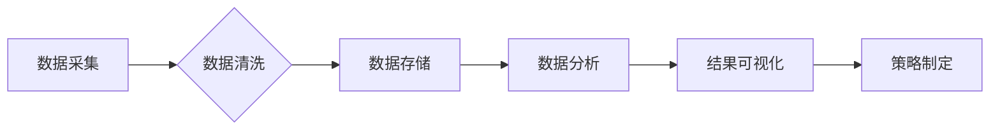

> 搜索数据分析，电商策略，用户行为，推荐系统，机器学习，数据挖掘，A/B测试

## 1. 背景介绍

在当今数据爆炸的时代，电商平台拥有海量用户行为数据，这些数据蕴藏着宝贵的商业价值。通过对搜索数据进行深入分析，电商平台可以洞察用户需求，优化商品推荐，提升用户体验，最终促进销售额增长。

搜索数据分析在电商领域扮演着至关重要的角色。用户在电商平台上搜索商品时，其搜索词、浏览历史、购买记录等信息都反映了其潜在需求和偏好。通过分析这些数据，电商平台可以：

* **了解用户需求**: 识别热门搜索词、用户搜索趋势，洞察用户需求变化，为商品开发和运营提供方向。
* **优化商品推荐**: 根据用户搜索历史和行为特征，推荐更精准、更相关的商品，提升用户转化率。
* **提升用户体验**: 分析用户搜索行为，优化搜索结果排序、搜索建议等功能，提升用户搜索体验。
* **制定营销策略**: 通过分析用户搜索数据，制定精准的营销策略，例如针对特定用户群体推送个性化广告。

## 2. 核心概念与联系

**2.1 搜索数据类型**

电商平台上的搜索数据主要包括以下几种类型：

* **搜索词**: 用户在搜索框中输入的关键词。
* **搜索结果**: 用户点击的搜索结果页面。
* **点击行为**: 用户点击搜索结果的次数和频率。
* **浏览行为**: 用户浏览商品详情页的次数和停留时间。
* **购买行为**: 用户购买商品的记录。

**2.2 数据分析方法**

常用的搜索数据分析方法包括：

* **数据挖掘**: 从海量数据中发现隐藏的模式和规律。
* **机器学习**: 利用算法训练模型，预测用户行为和需求。
* **统计分析**: 使用统计方法分析数据分布、趋势和关联性。

**2.3 数据分析流程**

搜索数据分析流程一般包括以下几个步骤：

1. **数据收集**: 收集电商平台上的各种搜索数据。
2. **数据清洗**: 对收集到的数据进行清洗和预处理，去除无效数据和噪声。
3. **数据分析**: 使用数据挖掘、机器学习等方法对数据进行分析，发现用户需求和行为模式。
4. **结果可视化**: 将分析结果以图表、报告等形式呈现，方便理解和决策。
5. **策略制定**: 根据分析结果，制定相应的电商策略，例如优化商品推荐、调整营销策略等。

**2.4 数据分析架构**



## 3. 核心算法原理 & 具体操作步骤

### 3.1 算法原理概述

**3.1.1  关键词提取**

关键词提取是搜索数据分析的基础，其目的是从搜索词中提取出最重要的关键词，以便更好地理解用户需求。常用的关键词提取算法包括：

* **TF-IDF**: 基于词频和逆向文档频率的算法，可以衡量关键词在文档中的重要性。
* **LDA**: 主题模型，可以自动发现文档中的潜在主题，并提取每个主题的关键关键词。

**3.1.2  用户画像构建**

用户画像是指对用户的行为、兴趣、偏好等特征进行描述的模型。通过构建用户画像，电商平台可以更精准地理解用户需求，提供个性化服务。常用的用户画像构建方法包括：

* **基于规则的画像**: 根据用户属性、行为特征等规则，将用户划分为不同的画像类型。
* **基于机器学习的画像**: 利用机器学习算法，从用户行为数据中学习用户画像特征。

**3.1.3  商品推荐**

商品推荐是指根据用户的兴趣和需求，推荐相关的商品。常用的商品推荐算法包括：

* **基于内容的推荐**: 根据商品的属性和描述，推荐与用户兴趣相符的商品。
* **基于协同过滤的推荐**: 根据其他用户的购买行为，推荐用户可能感兴趣的商品。
* **基于深度学习的推荐**: 利用深度学习算法，从用户行为数据中学习用户兴趣，推荐更精准的商品。

### 3.2 算法步骤详解

**3.2.1 关键词提取步骤**

1. 收集电商平台上的搜索词数据。
2. 对搜索词进行预处理，例如去除停用词、转换词形等。
3. 使用TF-IDF或LDA算法提取关键词。
4. 对提取的关键词进行筛选和聚类，得到最终的关键词列表。

**3.2.2 用户画像构建步骤**

1. 收集用户行为数据，例如搜索历史、浏览记录、购买记录等。
2. 对用户行为数据进行清洗和预处理。
3. 使用基于规则或基于机器学习的方法构建用户画像。
4. 对用户画像进行评估和优化。

**3.2.3 商品推荐步骤**

1. 收集用户行为数据和商品信息数据。
2. 使用预处理方法对数据进行清洗和转换。
3. 选择合适的商品推荐算法，例如基于内容的推荐、基于协同过滤的推荐或基于深度学习的推荐。
4. 训练推荐模型，并对模型进行评估和优化。
5. 将推荐结果展示给用户。

### 3.3 算法优缺点

**3.3.1 关键词提取算法**

* **TF-IDF**: 优点：简单易实现，效果较好。缺点：无法捕捉关键词之间的语义关系。
* **LDA**: 优点：可以发现文档中的潜在主题，提取更精准的关键词。缺点：计算复杂度较高，需要较大的数据量才能训练。

**3.3.2 用户画像构建算法**

* **基于规则的画像**: 优点：易于理解和实施。缺点：难以捕捉用户行为的复杂性。
* **基于机器学习的画像**: 优点：可以学习用户行为的复杂模式，构建更精准的用户画像。缺点：需要大量的训练数据，模型训练复杂。

**3.3.3 商品推荐算法**

* **基于内容的推荐**: 优点：可以推荐与用户兴趣相符的商品。缺点：容易陷入“同质化推荐”的困境。
* **基于协同过滤的推荐**: 优点：可以发现用户之间的相似性，推荐用户可能感兴趣的商品。缺点：需要大量的用户行为数据才能训练，容易出现“冷启动”问题。
* **基于深度学习的推荐**: 优点：可以学习用户行为的复杂模式，推荐更精准的商品。缺点：模型训练复杂，需要大量的计算资源。

### 3.4 算法应用领域

* **电商平台**: 优化商品推荐、个性化营销、用户画像构建等。
* **搜索引擎**: 关键词提取、搜索结果排序、搜索建议等。
* **社交媒体**: 用户兴趣分析、内容推荐、广告投放等。
* **金融行业**: 风险评估、欺诈检测、客户画像构建等。

## 4. 数学模型和公式 & 详细讲解 & 举例说明

### 4.1 数学模型构建

**4.1.1 TF-IDF 模型**

TF-IDF 模型用于衡量关键词在文档中的重要性。

* **TF (Term Frequency)**: 词频，即关键词在文档中出现的次数。
* **IDF (Inverse Document Frequency)**: 逆向文档频率，即关键词在整个文档集合中出现的频率的倒数。

TF-IDF 值的计算公式如下：

$$TF-IDF(t, d) = TF(t, d) \times IDF(t)$$

其中：

* $t$ 表示关键词
* $d$ 表示文档

**4.1.2  协同过滤模型**

协同过滤模型基于用户的行为相似性，推荐用户可能感兴趣的商品。

* **用户-商品矩阵**: 将用户和商品映射到一个矩阵中，每个元素表示用户对商品的评分或购买行为。
* **相似度计算**: 使用余弦相似度等方法计算用户之间的相似度。
* **推荐算法**: 根据用户相似度，推荐用户可能感兴趣的商品。

### 4.2 公式推导过程

**4.2.1 TF-IDF 公式推导**

TF 值的计算公式如下：

$$TF(t, d) = \frac{f(t, d)}{\sum_{t' \in d} f(t', d)}$$

其中：

* $f(t, d)$ 表示关键词 $t$ 在文档 $d$ 中出现的次数。

IDF 值的计算公式如下：

$$IDF(t) = \log \frac{N}{df(t)}$$

其中：

* $N$ 表示文档总数。
* $df(t)$ 表示关键词 $t$ 在所有文档中出现的次数。

**4.2.2 协同过滤模型相似度计算**

余弦相似度的计算公式如下：

$$sim(u, v) = \frac{u \cdot v}{||u|| ||v||}$$

其中：

* $u$ 和 $v$ 表示两个用户的向量表示。
* $u \cdot v$ 表示两个向量的点积。
* $||u||$ 和 $||v||$ 表示两个向量的模长。

### 4.3 案例分析与讲解

**4.3.1 TF-IDF 应用案例**

假设我们有一个电商平台，用户搜索了“手机壳”。使用 TF-IDF 模型可以提取出与“手机壳”相关的关键词，例如“苹果手机壳”、“三星手机壳”、“透明手机壳”等。这些关键词可以用于优化商品搜索结果，提高用户搜索体验。

**4.3.2 协同过滤应用案例**

假设用户 A 和用户 B 都购买了苹果手机和苹果手机壳。使用协同过滤模型可以计算出用户 A 和用户 B 之间的相似度。如果用户 A 购买了三星手机壳，则可以根据用户 B 的购买行为，推荐三星手机壳给用户 A。

## 5. 项目实践：代码实例和详细解释说明

### 5.1 开发环境搭建

* **操作系统**: Ubuntu 20.04
* **编程语言**: Python 3.8
* **开发工具**: Jupyter Notebook
* **库依赖**: pandas, numpy, scikit-learn, matplotlib

### 5.2 源代码详细实现

```python
import pandas as pd
from sklearn.feature_extraction.text import TfidfVectorizer

# 加载搜索词数据
data = pd.read_csv('search_data.csv')

# 使用 TF-IDF 模型提取关键词
vectorizer = TfidfVectorizer()
tfidf_matrix = vectorizer.fit_transform(data['search_term'])

# 获取关键词权重
feature_names = vectorizer.get_feature_names_out()
feature_weights = tfidf_matrix.toarray()

# 打印关键词权重
for i, name in enumerate(feature_names):
    print(f'{name}: {feature_weights[0, i]}')
```

### 5.3 代码解读与分析

* **数据加载**: 使用 pandas 库加载搜索词数据。
* **TF-IDF 模型**: 使用 scikit-learn 库中的 TfidfVectorizer 类构建 TF-IDF 模型。
* **关键词提取**: 使用 fit_transform 方法训练模型并提取关键词权重。
* **关键词权重输出**: 使用 get_feature_names_out 方法获取关键词名称，并使用 toarray 方法获取关键词权重。

### 5.4 运行结果展示

运行上述代码后，会输出每个关键词的 TF-IDF 值，可以根据 TF-IDF 值的大小排序，得到最重要的关键词。

## 6. 实际应用场景

**6.1 商品推荐**

电商平台可以根据用户的搜索历史、浏览记录、购买记录等数据，使用协同过滤或深度学习算法，推荐用户可能感兴趣的商品。

**6.2 个性化营销**

电商平台可以根据用户的画像信息，进行个性化营销，例如推送个性化广告、推荐个性化商品。

**6.3 搜索结果优化**

电商平台可以根据用户的搜索行为，优化搜索结果排序，提高用户搜索体验。

**6.4 未来应用展望**

* **语音搜索**: 随着语音搜索技术的普及，搜索数据分析将更加注重语音数据的分析和处理。