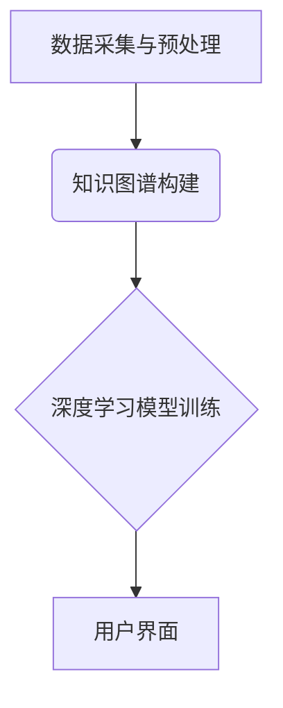

> AI 辅助记忆，记忆宫殿，神经网络，深度学习，知识图谱，自然语言处理，认知科学

## 1. 背景介绍

人类的记忆力是认知能力的核心，它让我们能够学习、理解和应用知识。然而，随着信息量的爆炸式增长，传统的记忆方法已经难以应对。如何有效地存储、检索和利用海量信息成为了当今社会面临的重大挑战。

近年来，人工智能（AI）技术取得了长足的进步，为解决这一问题提供了新的思路。AI辅助记忆技术，特别是基于深度学习的记忆模型，展现出巨大的潜力。

## 2. 核心概念与联系

**2.1 记忆宫殿**

记忆宫殿是一种古老的记忆技巧，其核心思想是将要记忆的信息与已知的空间环境（例如房屋、街道）进行关联，并通过想象的方式将信息“放置”在这些空间中。这种方法利用了人类对空间的自然认知能力，能够有效地提高记忆效率。

**2.2 AI 辅助记忆**

AI 辅助记忆技术利用人工智能算法，例如深度学习和自然语言处理，来辅助人类记忆。它可以帮助我们：

* **存储信息：** 将信息转化为 AI 能够理解的格式，并将其存储在知识库中。
* **检索信息：** 根据关键词或语义进行信息检索，快速找到所需的信息。
* **组织信息：** 将信息进行分类、关联和结构化，方便理解和记忆。
* **生成信息：** 基于已有的知识库，生成新的信息或回答问题。

**2.3 核心架构**

AI 辅助记忆系统的核心架构通常包括以下几个部分：

* **数据采集与预处理：** 收集各种形式的信息，并进行清洗、格式化和转换。
* **知识图谱构建：** 将信息转化为知识图谱，构建知识网络，并建立实体和关系之间的连接。
* **深度学习模型训练：** 利用深度学习算法，训练模型以实现信息存储、检索和生成等功能。
* **用户界面：** 提供用户友好的界面，方便用户与系统交互。



## 3. 核心算法原理 & 具体操作步骤

**3.1 算法原理概述**

AI 辅助记忆的核心算法通常基于深度学习，例如循环神经网络（RNN）和 transformers。这些模型能够学习语言的语义和结构，并将其应用于信息存储、检索和生成。

**3.2 算法步骤详解**

1. **数据预处理：** 将原始数据进行清洗、格式化和转换，例如文本分词、词向量化等。
2. **模型训练：** 利用深度学习算法，训练模型以学习语言的语义和结构。训练数据通常包括文本、代码、图像等多种形式的信息。
3. **信息存储：** 将新的信息转化为模型能够理解的格式，并将其存储在模型的知识库中。
4. **信息检索：** 根据用户输入的关键词或语义，模型会从知识库中检索相关信息。
5. **信息生成：** 根据用户需求，模型可以生成新的信息或回答问题。

**3.3 算法优缺点**

**优点：**

* **高效的记忆能力：** 深度学习模型能够学习复杂的模式，并实现高效的信息存储和检索。
* **灵活的应用场景：** AI 辅助记忆技术可以应用于各种场景，例如学习、工作、娱乐等。
* **个性化的体验：** 模型可以根据用户的学习习惯和记忆方式进行个性化定制。

**缺点：**

* **数据依赖性：** 深度学习模型需要大量的训练数据，否则性能会下降。
* **解释性不足：** 深度学习模型的决策过程往往难以解释，这可能会导致用户对模型的信任度降低。
* **伦理问题：** AI 辅助记忆技术可能会引发一些伦理问题，例如数据隐私、信息操控等。

**3.4 算法应用领域**

AI 辅助记忆技术在以下领域具有广泛的应用前景：

* **教育：** 帮助学生记忆知识、提高学习效率。
* **医疗：** 辅助医生记忆病历、诊断疾病。
* **商业：** 帮助企业员工记忆客户信息、提高销售效率。
* **个人生活：** 帮助个人记忆日常事务、提高生活效率。

## 4. 数学模型和公式 & 详细讲解 & 举例说明

**4.1 数学模型构建**

AI 辅助记忆系统通常采用基于神经网络的数学模型，例如循环神经网络（RNN）和 transformers。这些模型可以看作是复杂的函数，其输入是信息，输出是记忆或生成的信息。

**4.2 公式推导过程**

RNN 和 transformers 的数学模型涉及大量的矩阵运算和激活函数。其核心思想是通过多层神经网络，学习信息之间的依赖关系，并将其编码为向量表示。

**4.3 案例分析与讲解**

例如，在文本生成任务中，RNN 模型会将输入的文本序列逐个处理，并根据之前处理过的信息生成下一个词。 transformers 模型则通过注意力机制，学习文本中不同词之间的关系，并生成更准确的文本。

## 5. 项目实践：代码实例和详细解释说明

**5.1 开发环境搭建**

* Python 3.x
* TensorFlow 或 PyTorch
* Jupyter Notebook

**5.2 源代码详细实现**

```python
# 使用 TensorFlow 实现简单的 RNN 模型
import tensorflow as tf

# 定义模型结构
model = tf.keras.Sequential([
    tf.keras.layers.Embedding(input_dim=vocab_size, output_dim=embedding_dim),
    tf.keras.layers.LSTM(units=hidden_size),
    tf.keras.layers.Dense(units=vocab_size, activation='softmax')
])

# 编译模型
model.compile(optimizer='adam', loss='sparse_categorical_crossentropy', metrics=['accuracy'])

# 训练模型
model.fit(x_train, y_train, epochs=10)

# 预测文本
text = 'This is a'
predictions = model.predict(text)
```

**5.3 代码解读与分析**

* `Embedding` 层将单词转化为向量表示。
* `LSTM` 层学习文本序列中的依赖关系。
* `Dense` 层输出每个单词的概率分布。
* `adam` 优化器用于训练模型。
* `sparse_categorical_crossentropy` 损失函数用于计算模型的误差。

**5.4 运行结果展示**

训练完成后，模型可以用于预测下一个单词，从而生成新的文本。

## 6. 实际应用场景

**6.1 教育领域**

* **个性化学习：** AI 辅助记忆系统可以根据学生的学习进度和理解能力，提供个性化的学习内容和练习。
* **知识点复习：** 学生可以通过 AI 辅助记忆系统，快速复习和巩固知识点。
* **考试模拟：** AI 辅助记忆系统可以模拟考试场景，帮助学生进行练习和评估。

**6.2 医疗领域**

* **病历记忆：** AI 辅助记忆系统可以帮助医生记忆病历信息，提高诊断效率。
* **药物知识：** AI 辅助记忆系统可以帮助医生记忆药物信息，避免药物错误。
* **手术模拟：** AI 辅助记忆系统可以模拟手术场景，帮助医生进行练习和培训。

**6.3 商业领域**

* **客户关系管理：** AI 辅助记忆系统可以帮助企业员工记忆客户信息，提高客户服务质量。
* **销售线索管理：** AI 辅助记忆系统可以帮助企业员工记忆销售线索，提高销售效率。
* **市场调研：** AI 辅助记忆系统可以帮助企业员工记忆市场调研信息，提高决策效率。

**6.4 未来应用展望**

随着 AI 技术的不断发展，AI 辅助记忆技术将有更广泛的应用场景，例如：

* **虚拟助手：** AI 辅助记忆系统可以成为更智能的虚拟助手，帮助我们管理日程、安排会议、完成任务等。
* **个性化娱乐：** AI 辅助记忆系统可以根据用户的喜好，推荐个性化的电影、音乐、书籍等娱乐内容。
* **增强现实：** AI 辅助记忆系统可以与增强现实技术结合，为我们提供更丰富的交互体验。

## 7. 工具和资源推荐

**7.1 学习资源推荐**

* **书籍：**
    * 《深度学习》
    * 《自然语言处理》
    * 《人工智能：一种现代方法》
* **在线课程：**
    * Coursera
    * edX
    * Udacity

**7.2 开发工具推荐**

* **TensorFlow:** https://www.tensorflow.org/
* **PyTorch:** https://pytorch.org/
* **Jupyter Notebook:** https://jupyter.org/

**7.3 相关论文推荐**

* **Attention Is All You Need:** https://arxiv.org/abs/1706.03762
* **BERT: Pre-training of Deep Bidirectional Transformers for Language Understanding:** https://arxiv.org/abs/1810.04805

## 8. 总结：未来发展趋势与挑战

**8.1 研究成果总结**

AI 辅助记忆技术取得了显著的进展，能够有效地帮助人类存储、检索和利用信息。

**8.2 未来发展趋势**

* **更强大的模型：** 研究人员将继续开发更强大的 AI 模型，例如 Transformer 的升级版，以提高记忆能力和生成质量。
* **更个性化的体验：** AI 辅助记忆系统将更加个性化，根据用户的学习习惯和记忆方式进行定制。
* **更广泛的应用场景：** AI 辅助记忆技术将应用于更多领域，例如医疗、教育、商业等。

**8.3 面临的挑战**

* **数据隐私：** AI 辅助记忆系统需要大量用户数据，如何保护用户隐私是一个重要的挑战。
* **模型解释性：** 深度学习模型的决策过程往往难以解释，这可能会导致用户对模型的信任度降低。
* **伦理问题：** AI 辅助记忆技术可能会引发一些伦理问题，例如信息操控、知识垄断等。

**8.4 研究展望**

未来，AI 辅助记忆技术将继续朝着更智能、更个性化、更安全的方向发展。研究人员将致力于解决技术挑战，并探索 AI 辅助记忆技术在人类认知和社会发展中的更深远影响。

## 9. 附录：常见问题与解答

**9.1 如何使用 AI 辅助记忆系统？**

使用 AI 辅助记忆系统通常需要注册账号，并上传自己的学习资料或知识库。然后，系统会根据您的需求，提供相应的记忆和学习功能。

**9.2 AI 辅助记忆系统是否会取代人类记忆？**

AI 辅助记忆系统可以帮助我们提高记忆效率，但它不会取代人类记忆。人类的记忆能力是复杂的，它不仅包括存储信息，还包括理解、分析和创造。

**9.3 AI 辅助记忆系统有哪些安全风险？**

AI 辅助记忆系统需要处理大量用户数据，因此存在数据泄露和隐私侵犯的风险。选择信誉良好的平台，并注意保护自己的个人信息。


作者：禅与计算机程序设计艺术 / Zen and the Art of Computer Programming 
<end_of_turn>