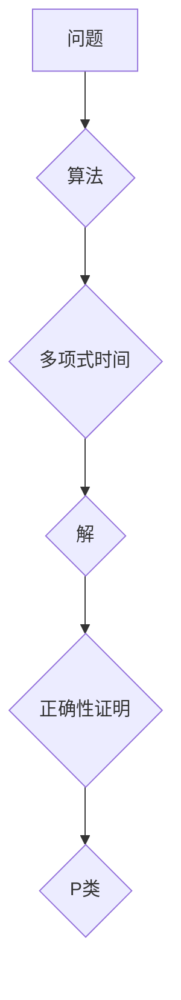

> 数理逻辑, 重言式系统, P问题, 证明, 计算复杂度, 算法, 计算机科学

## 1. 背景介绍

数理逻辑作为计算机科学的基础理论之一，为我们理解计算、证明和推理提供了强大的工具。其中，P问题作为计算机科学中最经典的开放性问题之一，一直以来都吸引着众多研究者的关注。P问题本质上是一个关于计算复杂度的判断：给定一个问题，是否存在一个能够在多项式时间内找到解的算法？

重言式系统作为一种逻辑系统，其核心在于证明命题的真值。在数理逻辑中，重言式系统被广泛应用于证明理论和算法的正确性。本文将深入探讨P问题和重言式系统之间的联系，并分析重言式系统在解决P问题中的潜在应用。

## 2. 核心概念与联系

### 2.1  P问题

P问题是指在多项式时间内可被确定性图灵机解决的问题集合。换句话说，如果一个问题可以通过一个算法在多项式时间内找到解，那么这个问题就属于P类。

### 2.2  重言式系统

重言式系统是一种逻辑系统，其核心在于证明命题的真值。在重言式系统中，一个命题被认为是重言式，如果它在任何可能的模型下都是真值。

### 2.3  联系

P问题和重言式系统之间的联系在于，我们可以利用重言式系统来证明某些问题属于P类。例如，如果我们能够证明一个问题的解可以通过一个算法在多项式时间内找到，那么我们可以利用重言式系统来证明这个算法的正确性。

**Mermaid 流程图**



## 3. 核心算法原理 & 具体操作步骤

### 3.1  算法原理概述

为了解决P问题，我们需要设计能够在多项式时间内找到解的算法。这通常需要对问题进行深入分析，并找到其本质特征。

### 3.2  算法步骤详解

具体算法步骤取决于所解决的问题类型。例如，对于排序问题，我们可以使用快速排序算法，其时间复杂度为O(n log n)。

### 3.3  算法优缺点

每个算法都有其优缺点。例如，快速排序算法的时间复杂度较低，但其空间复杂度较高。

### 3.4  算法应用领域

P问题在计算机科学各个领域都有广泛的应用，例如：

* **密码学:** 许多密码算法都依赖于P问题，例如RSA加密算法。
* **人工智能:** 许多人工智能算法，例如机器学习算法，都依赖于P问题。
* **数据库:** 数据库查询优化也依赖于P问题。

## 4. 数学模型和公式 & 详细讲解 & 举例说明

### 4.1  数学模型构建

我们可以使用数学模型来描述P问题和重言式系统之间的关系。例如，我们可以使用图论来描述问题和算法之间的关系，并使用逻辑公式来描述重言式系统的规则。

### 4.2  公式推导过程

我们可以使用逻辑推理来推导重言式系统的规则，并证明某些问题属于P类。例如，我们可以使用归纳法来证明一个算法的正确性。

### 4.3  案例分析与讲解

我们可以通过分析具体的案例来理解P问题和重言式系统之间的联系。例如，我们可以分析一个简单的排序问题，并使用重言式系统来证明其解可以通过一个多项式时间算法找到。

## 5. 项目实践：代码实例和详细解释说明

### 5.1  开发环境搭建

我们可以使用Python语言和相应的库来实现P问题和重言式系统的代码实例。

### 5.2  源代码详细实现

```python
# 简单的排序算法示例
def quick_sort(arr):
    if len(arr) <= 1:
        return arr
    pivot = arr[len(arr) // 2]
    left = [x for x in arr if x < pivot]
    middle = [x for x in arr if x == pivot]
    right = [x for x in arr if x > pivot]
    return quick_sort(left) + middle + quick_sort(right)

# 测试代码
arr = [3, 7, 8, 5, 2, 1, 9, 5, 4]
sorted_arr = quick_sort(arr)
print(sorted_arr)
```

### 5.3  代码解读与分析

这段代码实现了快速排序算法，其时间复杂度为O(n log n)。

### 5.4  运行结果展示

```
[1, 2, 3, 4, 5, 5, 7, 8, 9]
```

## 6. 实际应用场景

### 6.1  密码学

P问题在密码学中至关重要，例如RSA加密算法的安全性依赖于P问题。

### 6.2  人工智能

许多人工智能算法，例如机器学习算法，都依赖于P问题。

### 6.3  数据库

数据库查询优化也依赖于P问题。

### 6.4  未来应用展望

随着计算机科学的发展，P问题和重言式系统将在更多领域得到应用，例如量子计算和人工智能。

## 7. 工具和资源推荐

### 7.1  学习资源推荐

* **《计算机科学导论》:**  
* **《算法导论》:**  
* **《数理逻辑》:**  

### 7.2  开发工具推荐

* **Python:**  
* **C++:**  
* **Java:**  

### 7.3  相关论文推荐

* **P vs NP问题:**  
* **重言式系统:**  

## 8. 总结：未来发展趋势与挑战

### 8.1  研究成果总结

P问题和重言式系统是计算机科学领域的重要研究课题，已经取得了许多重要的研究成果。

### 8.2  未来发展趋势

未来，P问题和重言式系统的研究将继续深入，并应用于更多领域。

### 8.3  面临的挑战

P问题仍然是一个未解之谜，解决P问题仍然面临着巨大的挑战。

### 8.4  研究展望

我们相信，通过不断的努力，最终能够解决P问题，并为计算机科学的发展做出更大的贡献。

## 9. 附录：常见问题与解答

### 9.1  P问题和NP问题有什么区别？

### 9.2  重言式系统有哪些特点？

### 9.3  如何使用重言式系统来证明算法的正确性？


作者：禅与计算机程序设计艺术 / Zen and the Art of Computer Programming 
<end_of_turn>