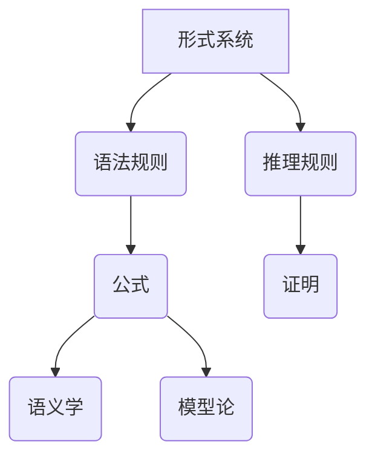

> 数理逻辑，形式系统，证明理论，推理规则，语义学，模型论，计算机科学，人工智能

## 1. 背景介绍

数理逻辑作为数学和计算机科学的桥梁，为我们提供了构建和分析复杂系统、解决问题和进行推理的强大工具。它以形式化的语言和严密的推理规则，描述和研究知识的结构、关系和演绎过程。

在现代社会，数据爆炸和人工智能的快速发展，对数理逻辑的需求日益增长。从自然语言处理、机器学习到软件验证和安全保障，数理逻辑在各个领域发挥着至关重要的作用。

## 2. 核心概念与联系

**2.1  形式系统**

形式系统是一个由符号、语法规则和推理规则组成的结构化体系。

* **符号:**  形式系统的基本元素，可以是字母、数字、逻辑运算符等。
* **语法规则:**  规定了符号如何组合成合法的公式或句子。
* **推理规则:**  规定了从已知公式推导出新公式的合法方式。

**2.2  语义学**

语义学研究的是符号和公式的意义。它试图解释公式在特定语境下的含义，并建立公式与现实世界之间的联系。

**2.3  模型论**

模型论研究的是形式系统的模型，即满足特定公式的结构。通过分析模型，我们可以理解形式系统的性质和能力。

**2.4  证明理论**

证明理论研究的是如何用形式化的推理规则证明公式的真值。它为我们提供了严格的逻辑推理方法，确保证明的可靠性和有效性。

**2.5  关系图**



## 3. 核心算法原理 & 具体操作步骤

**3.1  算法原理概述**

数理逻辑的核心算法主要包括：

* **语义推导:**  根据公式的语义，推导出新的公式。
* **语法推导:**  根据公式的语法规则，推导出新的公式。
* **模型检验:**  检查公式是否在特定模型中成立。

**3.2  算法步骤详解**

1. **公式化问题:** 将问题转化为形式逻辑的公式。
2. **选择推理规则:** 根据问题和已知公式，选择合适的推理规则。
3. **进行推理:**  根据推理规则，从已知公式推导出新的公式。
4. **验证结果:**  检查推导出的公式是否满足问题条件。

**3.3  算法优缺点**

* **优点:** 
    * 逻辑严密，推理过程可追溯。
    * 可用于解决复杂问题，提供精确的答案。
    * 可用于自动证明和验证。
* **缺点:** 
    * 公式化过程可能复杂，需要专业知识。
    * 推理过程可能耗时，对于大型问题效率较低。
    * 难以处理不确定性和模糊性问题。

**3.4  算法应用领域**

* **人工智能:**  知识表示、推理、机器学习。
* **软件工程:**  软件验证、代码分析、安全保障。
* **数学证明:**  自动证明定理，发现新的数学结果。
* **哲学:**  逻辑推理、知识论、形而上学。

## 4. 数学模型和公式 & 详细讲解 & 举例说明

**4.1  数学模型构建**

数理逻辑的数学模型通常采用集合论和关系论的框架。

* **集合:**  表示概念或对象。
* **关系:**  表示概念或对象之间的联系。

**4.2  公式推导过程**

数理逻辑的公式推导过程遵循一定的推理规则，例如：

* ** Modus Ponens:**  如果 A 蕴含 B，并且 A 成立，则 B 也成立。
* ** Modus Tollens:**  如果 A 蕴含 B，并且 B 不成立，则 A 不成立。

**4.3  案例分析与讲解**

**命题逻辑:**

* **公式:**  p ∧ q (p 且 q)
* **解释:**  p 和 q 都是命题，公式表示 p 和 q 都成立。
* **推导:**  如果 p 和 q 都成立，则 p ∧ q 成立。

**4.4  举例说明**

```latex
\forall x (P(x) \rightarrow Q(x)) \wedge P(a) \rightarrow Q(a)
```

**解释:**  对于所有 x，如果 x 满足性质 P，则 x 也满足性质 Q。并且 a 满足性质 P，因此 a 也满足性质 Q。

## 5. 项目实践：代码实例和详细解释说明

**5.1  开发环境搭建**

* **编程语言:**  Python
* **库:**  sympy (符号计算库)

**5.2  源代码详细实现**

```python
from sympy import symbols, Eq, solve

# 定义符号变量
x = symbols('x')

# 定义公式\nequation = Eq(x**2 - 4, 0)

# 求解公式
solutions = solve(equation, x)

# 打印结果
print(f"方程 {equation} 的解为: {solutions}")
```

**5.3  代码解读与分析**

* 使用 sympy 库进行符号计算。
* 定义符号变量 x。
* 定义方程 x^2 - 4 = 0。
* 使用 solve 函数求解方程。
* 打印解集。

**5.4  运行结果展示**

```
方程 Eq(x**2 - 4, 0) 的解为: [-2, 2]
```

## 6. 实际应用场景

**6.1  自然语言处理**

* **文本分类:**  使用数理逻辑构建分类规则，自动识别文本的类别。
* **情感分析:**  分析文本中的情感倾向，识别正面、负面或中性情绪。

**6.2  机器学习**

* **知识表示:**  使用数理逻辑表示机器学习模型的知识，提高模型的解释性和可理解性。
* **推理和决策:**  使用数理逻辑进行推理和决策，帮助机器学习模型做出更智能的判断。

**6.3  软件工程**

* **软件验证:**  使用数理逻辑验证软件的正确性，确保软件的功能和安全性。
* **代码分析:**  使用数理逻辑分析代码的结构和行为，发现潜在的错误和漏洞。

**6.4  未来应用展望**

* **人工智能增强:**  将数理逻辑与人工智能技术相结合，构建更智能、更强大的 AI 系统。
* **自动推理和决策:**  开发更强大的自动推理和决策系统，解决更复杂的问题。
* **知识图谱构建:**  利用数理逻辑构建更完善的知识图谱，促进知识共享和发现。

## 7. 工具和资源推荐

**7.1  学习资源推荐**

* **书籍:**
    * 《数学逻辑基础》
    * 《形式逻辑》
    * 《人工智能：现代方法》
* **在线课程:**
    * Coursera:  Logic and Reasoning
    * edX:  Introduction to Logic

**7.2  开发工具推荐**

* **Prover9:**  自动定理证明系统
* **Vampire:**  自动定理证明系统
* **Coq:**  形式化软件验证系统

**7.3  相关论文推荐**

* **The Logic of Programming Languages**
* **Formal Verification of Software Systems**
* **Knowledge Representation and Reasoning**

## 8. 总结：未来发展趋势与挑战

**8.1  研究成果总结**

数理逻辑在过去几十年取得了显著的进展，为人工智能、软件工程和数学证明等领域提供了强大的工具。

**8.2  未来发展趋势**

* **更强大的推理能力:**  开发更强大的自动推理系统，解决更复杂的问题。
* **更灵活的逻辑系统:**  构建更灵活的逻辑系统，能够处理不确定性和模糊性问题。
* **更广泛的应用领域:**  将数理逻辑应用于更多领域，例如生物学、医学和社会科学。

**8.3  面临的挑战**

* **复杂性:**  数理逻辑的理论和应用都非常复杂，需要深入的数学和计算机科学知识。
* **效率:**  对于大型问题，数理逻辑的推理过程可能非常耗时。
* **解释性:**  一些数理逻辑系统难以解释其推理过程，这限制了其在某些领域的应用。

**8.4  研究展望**

未来，数理逻辑的研究将继续朝着更强大、更灵活、更广泛应用的方向发展。


## 9. 附录：常见问题与解答

**9.1  什么是形式系统？**

形式系统是一个由符号、语法规则和推理规则组成的结构化体系。

**9.2  什么是语义学？**

语义学研究的是符号和公式的意义。

**9.3  什么是模型论？**

模型论研究的是形式系统的模型，即满足特定公式的结构。

**9.4  什么是证明理论？**

证明理论研究的是如何用形式化的推理规则证明公式的真值。


作者：禅与计算机程序设计艺术 / Zen and the Art of Computer Programming 
<end_of_turn>