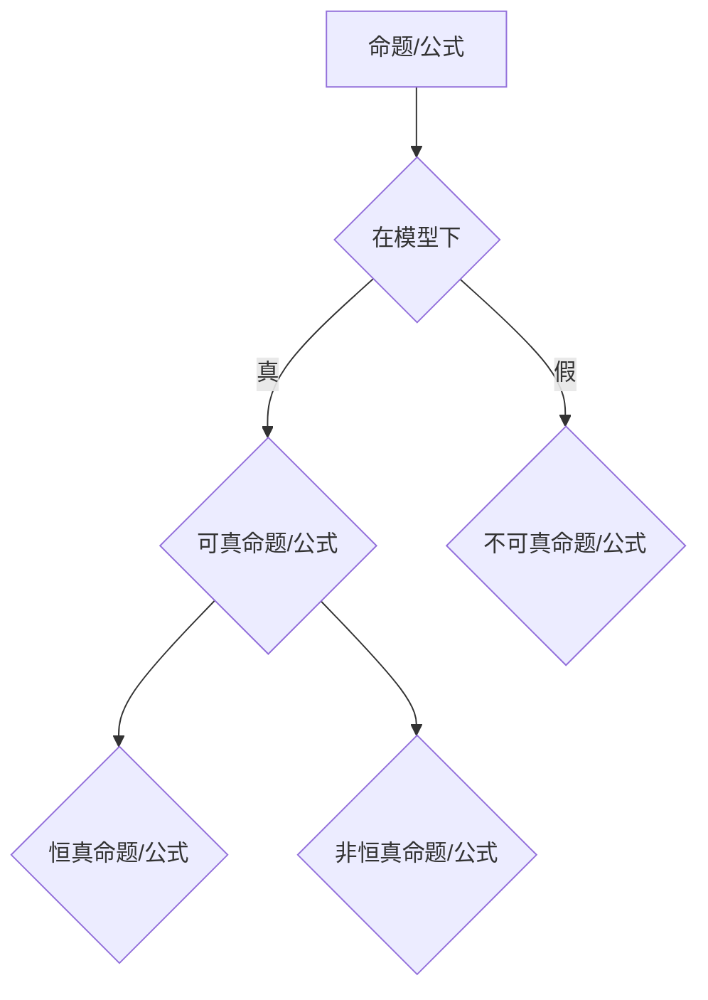

> 数理逻辑，恒真性，可真性，命题逻辑，谓词逻辑，模型论，证明论

## 1. 背景介绍

数理逻辑作为计算机科学的基础理论之一，为我们理解和构建复杂的计算系统提供了坚实的逻辑框架。其中，恒真性和可真性是数理逻辑的核心概念，它们揭示了命题和公式在不同模型下的真值性质，为逻辑推理和证明提供了重要的依据。

随着人工智能、机器学习等领域的蓬勃发展，数理逻辑在实际应用中的重要性日益凸显。例如，在人工智能领域，逻辑推理和知识表示是构建智能系统的关键技术，而恒真性和可真性则为这些技术提供了坚实的逻辑基础。

## 2. 核心概念与联系

**2.1 恒真性**

一个命题或公式如果在任何可能的模型下都为真，则称之为恒真命题或恒真公式。恒真性意味着命题或公式本身蕴含着必然的真值，与具体的模型或语境无关。

**2.2 可真性**

一个命题或公式如果在至少一个可能的模型下为真，则称之为可真命题或可真公式。可真性意味着命题或公式可能在某些情况下为真，但也可能在某些情况下为假。

**2.3 关系**

恒真性是可真性的一个特例。所有恒真命题都是可真命题，但并非所有可真命题都是恒真命题。

**2.4 Mermaid 流程图**



## 3. 核心算法原理 & 具体操作步骤

**3.1 算法原理概述**

判断一个命题或公式是否恒真或可真通常需要借助模型论和证明论的工具。

* **模型论**研究的是逻辑公式在不同模型下的真值性质。一个模型包含一个域和一些解释，解释将逻辑符号映射到域中的元素。
* **证明论**研究的是如何从已知的逻辑公理和推理规则推导出新的逻辑结论。

**3.2 算法步骤详解**

1. **构建模型:** 根据具体的逻辑系统和命题或公式，构建一个合适的模型。
2. **解释符号:** 将逻辑符号在模型中进行解释，将它们映射到模型中的元素。
3. **评估真值:** 根据模型的解释和逻辑规则，评估命题或公式在模型下的真值。
4. **判定恒真性或可真性:** 如果命题或公式在所有可能的模型下都为真，则判定为恒真命题或恒真公式；否则，如果命题或公式在至少一个可能的模型下为真，则判定为可真命题或可真公式。

**3.3 算法优缺点**

* **优点:** 能够准确地判断命题或公式的真值性质。
* **缺点:** 构建模型和评估真值可能比较复杂，需要一定的逻辑和数学基础。

**3.4 算法应用领域**

* **人工智能:** 用于知识表示、逻辑推理和智能决策。
* **软件验证:** 用于验证软件程序的正确性。
* **自动定理证明:** 用于自动证明数学定理。

## 4. 数学模型和公式 & 详细讲解 & 举例说明

**4.1 数学模型构建**

在数理逻辑中，我们通常使用符号系统来表示命题和公式。例如，我们可以使用以下符号：

* **p, q, r:** 表示命题变量。
* **¬:** 表示否定操作。
* **∧:** 表示合取操作。
* **∨:** 表示析取操作。
* **→:** 表示蕴涵操作。
* **↔:** 表示双向蕴涵操作。

**4.2 公式推导过程**

我们可以使用逻辑规则和公理来推导出新的逻辑结论。例如，以下是一些常用的逻辑规则：

* **Modus Ponens:** 如果我们知道 p → q 和 p 为真，那么我们可以推导出 q 为真。
* **Modus Tollens:** 如果我们知道 p → q 和 ¬q 为真，那么我们可以推导出 ¬p 为真。

**4.3 案例分析与讲解**

**例题:** 证明命题 ¬(p ∧ ¬p) 是恒真命题。

**证明:**

1. 由于 p ∧ ¬p 是一个矛盾命题，它在任何模型下都是假的。
2. ¬(p ∧ ¬p) 表示“非(p ∧ ¬p)”
3. 由于 p ∧ ¬p 是假的，所以 ¬(p ∧ ¬p) 是真的。

因此，命题 ¬(p ∧ ¬p) 是恒真命题。

## 5. 项目实践：代码实例和详细解释说明

**5.1 开发环境搭建**

可以使用 Python 和一些逻辑推理库来实现数理逻辑的计算。例如，可以使用 `sympy` 库来进行符号计算和逻辑推理。

**5.2 源代码详细实现**

```python
from sympy import symbols, simplify

# 定义命题变量
p = symbols('p')

# 定义命题公式
formula = simplify(~(p & ~p))

# 打印公式
print(formula)
```

**5.3 代码解读与分析**

* `symbols('p')`: 定义一个命题变量 p。
* `simplify(~(p & ~p))`: 使用 `simplify` 函数简化公式，并使用 `~` 和 `&` 操作符表示否定和合取操作。
* `print(formula)`: 打印简化后的公式。

**5.4 运行结果展示**

```
True
```

运行结果表明，公式 ¬(p ∧ ¬p) 是恒真命题。

## 6. 实际应用场景

**6.1 知识表示和推理**

数理逻辑可以用于表示知识和进行逻辑推理。例如，我们可以使用谓词逻辑来表示世界中的实体和关系，然后使用逻辑规则进行推理，以获取新的知识。

**6.2 软件验证**

数理逻辑可以用于验证软件程序的正确性。例如，我们可以使用模型检查技术来验证程序在所有可能的输入下都能正确执行。

**6.3 自动定理证明**

数理逻辑可以用于自动证明数学定理。例如，可以使用自动定理证明系统来从已知的公理和推理规则推导出新的数学结论。

**6.4 未来应用展望**

随着人工智能和机器学习的快速发展，数理逻辑在实际应用中的重要性将进一步提升。例如，在自然语言处理领域，数理逻辑可以用于理解和生成自然语言文本；在机器人领域，数理逻辑可以用于规划机器人运动和决策。

## 7. 工具和资源推荐

**7.1 学习资源推荐**

* **《数学逻辑》** by Herbert B. Enderton
* **《数理逻辑基础》** by  Alfred Tarski
* **Stanford Encyclopedia of Philosophy: Logic**

**7.2 开发工具推荐**

* **Coq**
* **Isabelle/HOL**
* **Lean**

**7.3 相关论文推荐**

* **The Logic of Programming** by David Harel
* **Automated Theorem Proving** by  John Harrison

## 8. 总结：未来发展趋势与挑战

**8.1 研究成果总结**

数理逻辑已经取得了长足的进展，为计算机科学和人工智能的发展提供了坚实的理论基础。

**8.2 未来发展趋势**

* **更加强大的自动定理证明系统:** 能够处理更复杂和更抽象的数学问题。
* **更加灵活和高效的逻辑推理引擎:** 能够应用于更广泛的领域，例如自然语言处理和机器人学。
* **更加深入的数理逻辑与人工智能的融合:** 能够构建更加智能和更加可靠的人工智能系统。

**8.3 面临的挑战**

* **复杂性:** 数理逻辑本身是一个非常复杂的研究领域，需要大量的数学和逻辑基础。
* **效率:** 许多数理逻辑算法在处理大型问题时效率低下。
* **可解释性:** 许多人工智能系统基于数理逻辑，但它们的决策过程往往难以解释。

**8.4 研究展望**

未来，数理逻辑的研究将继续朝着更加强大、更加灵活和更加可解释的方向发展。


## 9. 附录：常见问题与解答

**9.1 什么是逻辑模型？**

逻辑模型是一个包含一个域和一些解释的结构，用于解释逻辑符号。

**9.2 什么是逻辑规则？**

逻辑规则是用于推导出新的逻辑结论的准则。

**9.3 如何判断一个命题或公式是否恒真？**

如果一个命题或公式在任何可能的模型下都为真，则称之为恒真命题或恒真公式。

**9.4 如何判断一个命题或公式是否可真？**

如果一个命题或公式在至少一个可能的模型下为真，则称之为可真命题或可真公式。


作者：禅与计算机程序设计艺术 / Zen and the Art of Computer Programming 
<end_of_turn>