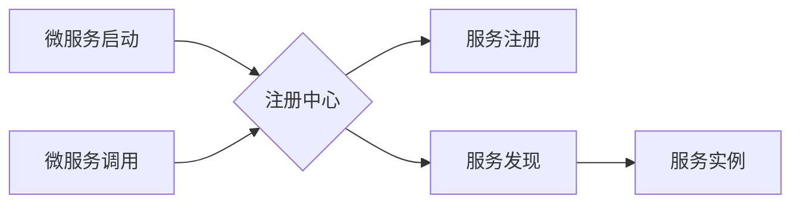

> 服务注册中心、微服务架构、服务发现、负载均衡、一致性哈希、分布式系统

## 1. 背景介绍

随着互联网技术的不断发展，传统的单体架构逐渐难以满足现代应用的需求。微服务架构应运而生，它将大型应用程序拆分成多个小型、独立的服务，每个服务负责特定的业务功能。微服务架构的优势在于：

* **松耦合:** 微服务之间通过轻量级的通信协议进行交互，降低了服务之间的依赖关系。
* **独立部署:** 每个微服务可以独立部署和更新，提高了开发和运维效率。
* **弹性伸缩:** 根据业务需求，可以动态地增加或减少服务的实例数量。

然而，微服务架构也带来了新的挑战，其中之一就是服务发现。在微服务架构中，每个服务都需要知道其他服务的地址和端口，以便进行通信。传统的中心式服务发现机制难以满足微服务架构的动态性和弹性需求。因此，服务注册中心应运而生。

服务注册中心是一个分布式系统，它负责维护所有微服务的注册信息，并提供服务发现和负载均衡的功能。当一个微服务启动时，它会向注册中心注册自己的信息，包括服务名称、地址、端口等。当另一个微服务需要调用某个服务时，它可以向注册中心查询该服务的地址和端口信息。

## 2. 核心概念与联系

### 2.1 服务注册中心

服务注册中心是微服务架构中不可或缺的组件，它负责管理和维护微服务的注册信息。

* **注册:** 当微服务启动时，会向注册中心注册自己的信息，包括服务名称、地址、端口等。
* **发现:** 当微服务需要调用其他服务时，会向注册中心查询目标服务的地址和端口信息。
* **负载均衡:** 注册中心可以根据策略将请求分发到不同的服务实例，实现负载均衡。

### 2.2 服务发现

服务发现是指微服务之间动态地发现和获取其他服务的地址和端口信息。

* **动态发现:** 服务发现机制需要能够适应微服务架构的动态性，能够实时更新服务信息。
* **可靠性:** 服务发现机制需要保证服务信息准确性和一致性，避免服务不可用。

### 2.3 负载均衡

负载均衡是指将请求分发到多个服务实例，以提高系统的吞吐量和可用性。

* **算法:** 负载均衡算法可以根据不同的策略将请求分发到不同的服务实例，例如轮询、随机、加权等。
* **策略:** 负载均衡策略可以根据业务需求和系统情况进行调整，例如根据服务实例的健康状态、响应时间等进行负载均衡。

### 2.4 Mermaid 流程图



## 3. 核心算法原理 & 具体操作步骤

### 3.1 算法原理概述

服务注册中心通常采用一致性哈希算法来实现服务发现和负载均衡。一致性哈希算法将服务实例映射到一个虚拟环上，每个服务实例对应一个哈希值，请求根据哈希值路由到对应的服务实例。

### 3.2 算法步骤详解

1. **构建虚拟环:** 将所有服务实例的哈希值映射到一个虚拟环上，环上的节点代表服务实例。
2. **路由请求:** 当一个请求到达注册中心时，注册中心会计算请求的哈希值，然后根据哈希值在虚拟环上找到对应的服务实例，并将请求路由到该实例。
3. **更新虚拟环:** 当服务实例启动或停止时，注册中心会更新虚拟环上的节点信息，确保虚拟环始终保持一致。

### 3.3 算法优缺点

**优点:**

* **高可用性:** 即使部分服务实例不可用，其他服务实例仍然可以正常工作。
* **动态性:** 能够适应微服务架构的动态性，能够实时更新服务信息。
* **负载均衡:** 可以将请求均匀地分发到不同的服务实例，提高系统的吞吐量和可用性。

**缺点:**

* **复杂性:** 一致性哈希算法的实现相对复杂。
* **性能:** 一致性哈希算法的性能可能会受到虚拟环大小和哈希函数的影响。

### 3.4 算法应用领域

一致性哈希算法广泛应用于分布式系统中，例如：

* **服务注册中心:** 如前面所述，一致性哈希算法是服务注册中心的核心算法。
* **缓存系统:** 一致性哈希算法可以用于缓存数据的分布式存储和访问。
* **数据库集群:** 一致性哈希算法可以用于数据库集群的负载均衡和数据分片。

## 4. 数学模型和公式 & 详细讲解 & 举例说明

### 4.1 数学模型构建

一致性哈希算法的核心是将服务实例映射到一个虚拟环上，每个服务实例对应一个哈希值。虚拟环上的节点代表服务实例，请求根据哈希值路由到对应的服务实例。

### 4.2 公式推导过程

假设我们有n个服务实例，每个服务实例都有一个唯一的哈希值，记为h(i)，其中i为服务实例的标识。我们将所有哈希值按照从小到大排序，形成一个虚拟环。

虚拟环上的节点可以表示为：

```
h(0), h(1), h(2), ..., h(n-1)
```

当一个请求到达注册中心时，注册中心会计算请求的哈希值h(req)，然后在虚拟环上找到h(req)对应的服务实例。

### 4.3 案例分析与讲解

假设我们有3个服务实例，它们的哈希值为：

* h(0) = 10
* h(1) = 20
* h(2) = 30

当一个请求的哈希值为15时，根据虚拟环上的节点顺序，请求应该路由到服务实例h(1)，即服务实例2。

## 5. 项目实践：代码实例和详细解释说明

### 5.1 开发环境搭建

* 操作系统: Ubuntu 20.04
* 编程语言: Go
* 工具: Docker, Kubernetes

### 5.2 源代码详细实现

```go
package main

import (
\t"fmt"
\t"hash/fnv"
)

// 服务实例结构体
type Service struct {
\tName string
\tAddr string
}

// 注册中心结构体
type Registry struct {
\tservices map[string]*Service
}

// 新建注册中心实例
func NewRegistry() *Registry {
\treturn &Registry{
\t\tservices: make(map[string]*Service),
\t}
}

// 注册服务
func (r *Registry) Register(service *Service) {
\tr.services[service.Name] = service
}

// 获取服务实例
func (r *Registry) GetService(serviceName string) *Service {
\treturn r.services[serviceName]
}

// 计算哈希值
func hash(key string) uint32 {
\th := fnv.New32a()
\th.Write([]byte(key))
\treturn h.Sum32()
}

func main() {
\tregistry := NewRegistry()

\t// 注册服务实例
\tservice1 := &Service{Name: "service1", Addr: "127.0.0.1:8080"}
\tregistry.Register(service1)

\tservice2 := &Service{Name: "service2", Addr: "127.0.0.1:8081"}
\tregistry.Register(service2)

\t// 获取服务实例
\tservice := registry.GetService("service1")
\tfmt.Println(service.Addr)
}
```

### 5.3 代码解读与分析

* `Service` 结构体定义了服务实例的基本信息，包括服务名称和地址。
* `Registry` 结构体定义了注册中心，包含一个服务实例的映射表。
* `NewRegistry()` 函数创建了一个新的注册中心实例。
* `Register()` 函数将服务实例注册到注册中心。
* `GetService()` 函数根据服务名称获取对应的服务实例。
* `hash()` 函数计算服务实例的哈希值。
* `main()` 函数演示了如何使用注册中心注册和获取服务实例。

### 5.4 运行结果展示

```
127.0.0.1:8080
```

## 6. 实际应用场景

### 6.1 微服务架构

服务注册中心是微服务架构中不可或缺的组件，它负责管理和维护微服务的注册信息，并提供服务发现和负载均衡的功能。

### 6.2 云原生应用

在云原生应用中，服务注册中心可以帮助管理和发现容器化应用，并实现服务发现和负载均衡。

### 6.3 分布式系统

在分布式系统中，服务注册中心可以帮助管理和发现分布式服务，并实现服务发现和负载均衡。

### 6.4 未来应用展望

随着微服务架构和云原生应用的普及，服务注册中心将越来越重要。未来，服务注册中心可能会朝着以下方向发展：

* **更智能化:** 服务注册中心可能会具备更智能的决策能力，例如根据服务性能和可用性自动调整负载均衡策略。
* **更安全:** 服务注册中心可能会集成更安全的认证和授权机制，确保服务之间的安全通信。
* **更易用:** 服务注册中心可能会提供更友好的用户界面和API，方便开发人员使用。

## 7. 工具和资源推荐

### 7.1 学习资源推荐

* **书籍:**
    * 《微服务架构实践》
    * 《分布式系统设计与实践》
* **博客:**
    * https://www.infoq.com/
    * https://martinfowler.com/

### 7.2 开发工具推荐

* **Etcd:** https://etcd.io/
* **Consul:** https://www.consul.io/
* **Eureka:** https://github.com/Netflix/eureka

### 7.3 相关论文推荐

* **Consistent Hashing and Fault-Tolerant Distributed Data Storage**
* **The Design and Implementation of a Distributed Service Discovery System**

## 8. 总结：未来发展趋势与挑战

### 8.1 研究成果总结

服务注册中心是微服务架构中不可或缺的组件，它提供了服务发现和负载均衡的功能，提高了系统的可用性和弹性。一致性哈希算法是服务注册中心的核心算法，它能够有效地解决服务发现和负载均衡的问题。

### 8.2 未来发展趋势

未来，服务注册中心可能会朝着更智能化、更安全、更易用方向发展。

### 8.3 面临的挑战

* **高可用性:** 服务注册中心需要保证高可用性，即使部分节点故障，仍然能够正常工作。
* **性能:** 服务注册中心需要能够处理大量的服务注册和查询请求，保证性能。
* **安全性:** 服务注册中心需要保护服务信息的安全，防止攻击和数据泄露。

### 8.4 研究展望

未来，研究人员可以继续探索新的服务注册中心架构和算法，提高其性能、可用性和安全性。


## 9. 附录：常见问题与解答

### 9.1 什么是服务注册中心？

服务注册中心是一个分布式系统，它负责管理和维护微服务的注册信息，并提供服务发现和负载均衡的功能。

### 9.2 为什么需要服务注册中心？

在微服务架构中，每个服务都需要知道其他服务的地址和端口信息，才能进行通信。传统的中心式服务发现机制难以满足微服务架构的动态性和弹性需求，因此需要使用服务注册中心。

### 9.3 一致性哈希算法是如何实现服务发现的？

一致性哈希算法将服务实例映射到一个虚拟环上，每个服务实例对应一个哈希值。当一个请求到达注册中心时，注册中心会计算请求的哈希值，然后在虚拟环上找到对应的服务实例，并将请求路由到该实例。

### 9.4 服务注册中心有哪些常见的实现方案？

常见的服务注册中心实现方案包括：

* Etcd
* Consul
