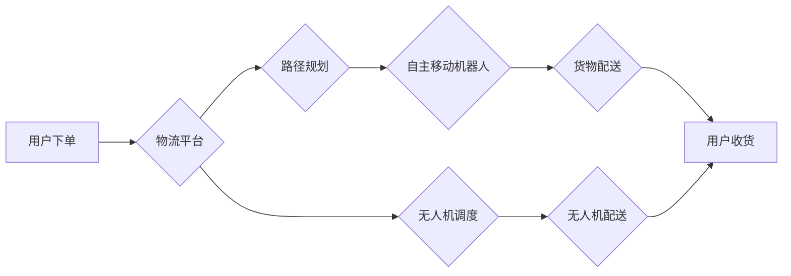

> 智能物流，自主移动机器人，无人机配送，人工智能，机器学习，路径规划，物流优化，未来趋势

## 1. 背景介绍

随着全球人口增长、城市化进程加速和电子商务的蓬勃发展，物流行业面临着前所未有的挑战。传统物流模式的效率低下、成本高昂、环境污染等问题日益突出。为了应对这些挑战，智慧物流应运而生，并以自主移动机器人和无人机配送为代表的新技术成为物流行业发展的重要方向。

2050年，智慧物流将成为物流行业的主流模式，自主移动机器人和无人机配送将广泛应用于各个领域。

## 2. 核心概念与联系

**2.1  自主移动机器人**

自主移动机器人是指能够自主感知环境、规划路径、避障导航、执行任务的智能机器。它们通常配备了传感器、处理器、 actuators 和软件系统，能够在复杂的环境中自主行动。

**2.2  无人机配送**

无人机配送是指利用无人机进行货物运输的物流模式。无人机具有速度快、灵活性高、成本低等优势，特别适合在城市拥堵、交通不便的地区进行配送。

**2.3  核心概念联系**

自主移动机器人和无人机配送共同构成了智慧物流的核心技术体系。它们相互协作，形成一个高效、智能、可持续的物流网络。

**2.4  架构图**



## 3. 核心算法原理 & 具体操作步骤

**3.1  算法原理概述**

智慧物流的核心算法包括路径规划、避障导航、任务调度、资源优化等。这些算法利用人工智能、机器学习等技术，实现对物流过程的智能化控制。

**3.2  算法步骤详解**

**3.2.1  路径规划**

路径规划算法的目标是找到从起点到终点的最优路径，同时考虑各种因素，如道路状况、交通流量、时间限制等。常用的路径规划算法包括 Dijkstra 算法、A* 算法、遗传算法等。

**3.2.2  避障导航**

避障导航算法使机器人能够在复杂的环境中避开障碍物，安全到达目的地。常用的避障导航算法包括 SLAM（Simultaneous Localization and Mapping）、粒子滤波、深度学习等。

**3.2.3  任务调度**

任务调度算法负责分配任务给机器人或无人机，并优化任务执行顺序，以提高物流效率。常用的任务调度算法包括优先级调度、遗传算法、模拟退火算法等。

**3.2.4  资源优化**

资源优化算法旨在优化物流资源的分配和利用，降低物流成本。常用的资源优化算法包括线性规划、整数规划、模拟退火算法等。

**3.3  算法优缺点**

不同的算法具有不同的优缺点，需要根据实际应用场景选择合适的算法。

**3.4  算法应用领域**

智慧物流的核心算法广泛应用于各个领域，如：

* **仓储物流:** 自动化仓储、货物搬运、订单拣选等。
* **配送物流:** 自动化配送、无人机配送、智能配送路线规划等。
* **跨境物流:** 海关通关、货物清关、跨境运输等。

## 4. 数学模型和公式 & 详细讲解 & 举例说明

**4.1  数学模型构建**

智慧物流的数学模型通常基于优化问题，目标是找到最优的物流方案，以最小化成本、最大化效率。常用的数学模型包括线性规划、整数规划、动态规划等。

**4.2  公式推导过程**

例如，路径规划问题可以用 Dijkstra 算法来解决。Dijkstra 算法的核心思想是通过不断更新距离信息，找到从起点到终点的最短路径。

**4.3  案例分析与讲解**

假设有一个仓库，需要将货物从仓库A运送到仓库B。可以使用 Dijkstra 算法计算最短路径，并根据路径信息调度机器人进行货物运输。

## 5. 项目实践：代码实例和详细解释说明

**5.1  开发环境搭建**

可以使用 Python 语言和 ROS（Robot Operating System）框架开发智慧物流项目。

**5.2  源代码详细实现**

```python
# 路径规划代码示例
import heapq

def dijkstra(graph, start, end):
    distances = {node: float('inf') for node in graph}
    distances[start] = 0
    previous_nodes = {node: None for node in graph}
    priority_queue = [(0, start)]

    while priority_queue:
        current_distance, current_node = heapq.heappop(priority_queue)

        if current_node == end:
            break

        if current_distance > distances[current_node]:
            continue

        for neighbor, weight in graph[current_node].items():
            distance = current_distance + weight
            if distance < distances[neighbor]:
                distances[neighbor] = distance
                previous_nodes[neighbor] = current_node
                heapq.heappush(priority_queue, (distance, neighbor))

    return distances, previous_nodes

# ... 其他代码实现 ...
```

**5.3  代码解读与分析**

上述代码实现了 Dijkstra 算法，用于计算最短路径。

**5.4  运行结果展示**

运行代码后，可以得到从起点到终点的最短路径信息。

## 6. 实际应用场景

**6.1  城市配送**

无人机配送可以解决城市拥堵、交通不便的问题，提高配送效率。

**6.2  农村配送**

无人机配送可以覆盖农村地区，解决农村物流配送的“最后一公里”问题。

**6.3  医疗配送**

无人机可以快速运输药品、医疗器械等，提高医疗服务效率。

**6.4  未来应用展望**

未来，智慧物流将更加智能化、自动化、个性化。

## 7. 工具和资源推荐

**7.1  学习资源推荐**

* **书籍:** 《机器人学导论》、《人工智能》
* **在线课程:** Coursera、edX、Udacity

**7.2  开发工具推荐**

* **ROS:** Robot Operating System
* **Gazebo:** 仿真平台
* **Python:** 编程语言

**7.3  相关论文推荐**

* **论文:** “Autonomous Mobile Robots: A Survey”
* **论文:** “Drone Delivery: A Survey”

## 8. 总结：未来发展趋势与挑战

**8.1  研究成果总结**

智慧物流技术取得了显著进展，自主移动机器人和无人机配送已成为现实。

**8.2  未来发展趋势**

* **更智能化:** 利用人工智能、机器学习等技术，实现更智能的物流决策和控制。
* **更自动化:** 利用自动化技术，提高物流效率和降低成本。
* **更个性化:** 根据用户的需求，提供个性化的物流服务。

**8.3  面临的挑战**

* **技术挑战:** 提高机器人的自主性、安全性、可靠性。
* **政策法规:** 制定完善的政策法规，规范无人机配送等新技术应用。
* **社会接受度:** 提高公众对智慧物流的认知和接受度。

**8.4  研究展望**

未来，智慧物流将继续发展，成为物流行业的重要驱动力。

## 9. 附录：常见问题与解答

**9.1  问题:**  无人机配送安全吗？

**9.2  解答:**  无人机配送的安全问题是需要认真考虑的。

**9.3  问题:**  智慧物流会取代人类工作吗？

**9.4  解答:**  智慧物流不会完全取代人类工作，而是会改变人类的工作方式。

作者：禅与计算机程序设计艺术 / Zen and the Art of Computer Programming


<end_of_turn>