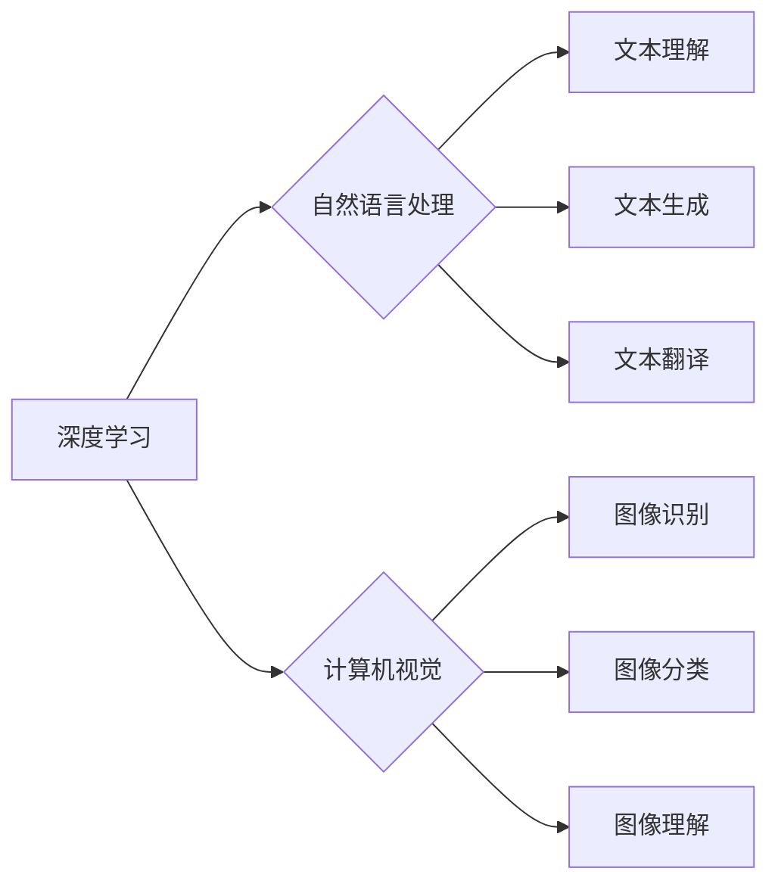

> AI 2.0, 产业变革, 深度学习, 自然语言处理, 计算机视觉, 伦理问题, 监管政策, 未来趋势

## 1. 背景介绍

人工智能（AI）技术近年来发展迅速，从最初的局限于特定领域的应用，逐渐发展到广泛应用于各个领域，深刻地改变着我们的生活方式和生产方式。随着深度学习算法的突破和计算能力的提升，AI技术进入了一个新的发展阶段——AI 2.0时代。

AI 2.0时代的特点是：

* **更强大的计算能力:** 硬件技术的进步，如GPU和TPU的出现，为深度学习模型的训练提供了强大的计算支持。
* **更丰富的算法模型:** 深度学习算法不断发展，出现了Transformer、BERT等更强大的模型，能够处理更复杂的任务。
* **更海量的训练数据:** 数据是深度学习的燃料，随着互联网的发展和数据收集技术的进步，训练数据的规模不断扩大。
* **更广泛的应用场景:** AI技术已经应用于各个领域，包括医疗、金融、教育、交通等，并正在不断拓展新的应用场景。

## 2. 核心概念与联系

AI 2.0时代的核心概念包括：

* **深度学习:** 深度学习是一种机器学习的子集，它利用多层神经网络来模拟人类大脑的学习过程，能够从海量数据中学习复杂的特征和模式。
* **自然语言处理 (NLP):** NLP是让计算机理解和处理人类语言的技术，在AI 2.0时代，NLP技术取得了长足的进步，能够进行更精准的文本理解、生成和翻译。
* **计算机视觉 (CV):** CV是让计算机“看”和理解图像的技术，在AI 2.0时代，CV技术能够识别、分类和理解图像中的物体和场景。

**Mermaid 流程图:**



## 3. 核心算法原理 & 具体操作步骤

### 3.1  算法原理概述

深度学习算法的核心是多层神经网络。神经网络由多个层组成，每层包含多个神经元。每个神经元接收来自上一层的输入信号，并通过激活函数进行处理，输出到下一层。通过训练，神经网络能够学习到输入和输出之间的映射关系。

### 3.2  算法步骤详解

1. **数据预处理:** 将原始数据转换为深度学习模型可以理解的格式。
2. **模型构建:** 设计神经网络的结构，包括层数、神经元数量等参数。
3. **模型训练:** 使用训练数据训练神经网络，调整神经网络参数，使模型能够准确地预测输出。
4. **模型评估:** 使用测试数据评估模型的性能，例如准确率、召回率等指标。
5. **模型部署:** 将训练好的模型部署到实际应用场景中。

### 3.3  算法优缺点

**优点:**

* 能够学习复杂的特征和模式。
* 性能优于传统机器学习算法。
* 能够处理海量数据。

**缺点:**

* 训练时间长，需要大量的计算资源。
* 对训练数据的质量要求高。
* 模型解释性差，难以理解模型的决策过程。

### 3.4  算法应用领域

深度学习算法广泛应用于各个领域，例如：

* **图像识别:** 人脸识别、物体检测、图像分类等。
* **自然语言处理:** 文本分类、情感分析、机器翻译等。
* **语音识别:** 语音转文本、语音助手等。
* **推荐系统:** 商品推荐、内容推荐等。
* **医疗诊断:** 疾病诊断、影像分析等。

## 4. 数学模型和公式 & 详细讲解 & 举例说明

### 4.1  数学模型构建

深度学习模型的数学基础是神经网络。神经网络可以看作是一个由多个层组成的函数复合体。每个层包含多个神经元，每个神经元接收来自上一层的输入信号，并通过激活函数进行处理，输出到下一层。

**激活函数:** 激活函数是神经网络中一个重要的组成部分，它决定了神经元的输出。常见的激活函数包括 sigmoid 函数、ReLU 函数、tanh 函数等。

**损失函数:** 损失函数用于衡量模型的预测结果与真实值的差距。常用的损失函数包括均方误差 (MSE)、交叉熵损失 (Cross-Entropy Loss) 等。

### 4.2  公式推导过程

**反向传播算法:** 反向传播算法是深度学习模型训练的核心算法。它通过计算损失函数对模型参数的梯度，并利用梯度下降法更新模型参数，从而使模型的预测结果越来越接近真实值。

**梯度下降法:** 梯度下降法是一种迭代优化算法，它通过沿着梯度方向更新模型参数，来最小化损失函数的值。

### 4.3  案例分析与讲解

**图像分类:**

假设我们有一个图像分类任务，目标是将图像分类为不同的类别，例如猫、狗、鸟等。我们可以使用卷积神经网络 (CNN) 来解决这个问题。CNN 是一种专门用于处理图像数据的深度学习模型。

CNN 的结构包括卷积层、池化层和全连接层。卷积层用于提取图像的特征，池化层用于降低特征的维度，全连接层用于分类。

训练 CNN 模型时，我们会使用大量的图像数据，并使用反向传播算法来更新模型参数。最终，训练好的 CNN 模型能够准确地将图像分类为不同的类别。

## 5. 项目实践：代码实例和详细解释说明

### 5.1  开发环境搭建

* **操作系统:** Ubuntu 20.04 LTS
* **编程语言:** Python 3.8
* **深度学习框架:** TensorFlow 2.0
* **GPU:** NVIDIA GeForce RTX 3080

### 5.2  源代码详细实现

```python
import tensorflow as tf

# 定义模型结构
model = tf.keras.models.Sequential([
    tf.keras.layers.Conv2D(32, (3, 3), activation='relu', input_shape=(28, 28, 1)),
    tf.keras.layers.MaxPooling2D((2, 2)),
    tf.keras.layers.Conv2D(64, (3, 3), activation='relu'),
    tf.keras.layers.MaxPooling2D((2, 2)),
    tf.keras.layers.Flatten(),
    tf.keras.layers.Dense(10, activation='softmax')
])

# 编译模型
model.compile(optimizer='adam',
              loss='sparse_categorical_crossentropy',
              metrics=['accuracy'])

# 训练模型
model.fit(x_train, y_train, epochs=5)

# 评估模型
loss, accuracy = model.evaluate(x_test, y_test)
print('Test loss:', loss)
print('Test accuracy:', accuracy)
```

### 5.3  代码解读与分析

* **模型结构:** 代码定义了一个简单的卷积神经网络模型，包含两层卷积层、两层池化层和一层全连接层。
* **激活函数:** 使用 ReLU 激活函数，可以提高模型的训练效率。
* **损失函数:** 使用交叉熵损失函数，适合多分类任务。
* **优化器:** 使用 Adam 优化器，可以快速收敛。
* **训练过程:** 使用训练数据训练模型，并设置训练轮数 (epochs)。
* **评估过程:** 使用测试数据评估模型的性能，并打印测试损失和准确率。

### 5.4  运行结果展示

训练完成后，我们可以使用测试数据评估模型的性能。例如，如果模型的测试准确率达到 95%，则说明模型已经训练成功。

## 6. 实际应用场景

### 6.1  医疗诊断

AI 2.0时代，深度学习算法在医疗诊断领域取得了突破性进展。例如，可以利用深度学习算法分析医学影像，辅助医生诊断疾病，提高诊断准确率。

### 6.2  金融风险控制

AI 2.0时代，深度学习算法可以用于金融风险控制，例如识别欺诈交易、预测市场风险等。

### 6.3  智能客服

AI 2.0时代，自然语言处理技术的发展使得智能客服能够更好地理解用户的需求，并提供更精准的回复。

### 6.4  未来应用展望

AI 2.0时代，AI技术将应用于更多领域，例如自动驾驶、个性化教育、智能家居等。

## 7. 工具和资源推荐

### 7.1  学习资源推荐

* **课程:** Coursera、edX、Udacity 等平台提供深度学习相关的课程。
* **书籍:** 《深度学习》、《动手学深度学习》等书籍。
* **博客:** TensorFlow、PyTorch 等深度学习框架的官方博客。

### 7.2  开发工具推荐

* **深度学习框架:** TensorFlow、PyTorch、Keras 等。
* **数据处理工具:** Pandas、NumPy 等。
* **可视化工具:** Matplotlib、Seaborn 等。

### 7.3  相关论文推荐

* **《ImageNet Classification with Deep Convolutional Neural Networks》**
* **《Attention Is All You Need》**
* **《BERT: Pre-training of Deep Bidirectional Transformers for Language Understanding》**

## 8. 总结：未来发展趋势与挑战

### 8.1  研究成果总结

AI 2.0时代，深度学习算法取得了长足的进步，在各个领域取得了突破性应用。

### 8.2  未来发展趋势

* **模型规模和能力的提升:** 未来，深度学习模型的规模和能力将继续提升，能够处理更复杂的任务。
* **算法的创新:** 未来，新的深度学习算法将不断涌现，例如强化学习、生成对抗网络等。
* **边缘计算和联邦学习:** 未来，深度学习模型将更多地部署到边缘设备，并利用联邦学习技术进行隐私保护。

### 8.3  面临的挑战

* **数据安全和隐私保护:** 深度学习模型依赖于海量数据，如何保证数据安全和隐私保护是一个重要的挑战。
* **算法可解释性和公平性:** 深度学习模型的决策过程难以解释，如何提高算法的可解释性和公平性是一个重要的研究方向。
* **伦理问题:** AI技术的发展引发了伦理问题，例如算法偏见、工作岗位替代等，需要社会各界共同探讨和解决。

### 8.4  研究展望

未来，AI技术将继续发展，并对我们的生活产生更深远的影响。我们需要加强对AI技术的理解和研究，并积极应对AI技术带来的挑战，推动AI技术朝着更加安全、可持续的方向发展。

## 9. 附录：常见问题与解答

**Q1: 深度学习算法的训练时间很长，如何加速训练过程？**

**A1:** 可以使用以下方法加速深度学习算法的训练过程：

* 使用更强大的计算资源，例如GPU或TPU。
* 使用数据并行训练，将数据分块并行训练多个模型。
* 使用模型压缩技术，减少模型参数量。

**Q2: 深度学习模型的解释性差，如何提高模型的可解释性？**

**A2:** 可以使用以下方法提高深度学习模型的可解释性：

* 使用可解释的机器学习模型，例如决策树、线性回归等。
* 使用模型解释技术，例如LIME、SHAP等。
* 使用可视化技术，例如激活图、权重图等，直观地展示模型的决策过程。


作者：禅与计算机程序设计艺术 / Zen and the Art of Computer Programming 
<end_of_turn>