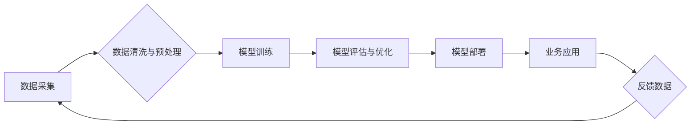

> AI 2.0, 商业价值, 深度学习, 自然语言处理, 计算机视觉, 算法优化, 数据驱动, 伦理问题

## 1. 背景介绍

人工智能（AI）技术近年来发展迅速，从最初的局限性应用，逐渐发展到各个领域，深刻地改变着我们的生活方式和工作模式。李开复先生在《AI 2.0 时代的商业价值》一书中，深入探讨了AI 2.0时代对商业的深刻影响，并提出了AI商业化的关键要素和发展趋势。

AI 2.0时代，指的是深度学习算法的兴起和应用，其核心特点是：

* **数据驱动**: AI 2.0时代，数据成为了最重要的生产要素，深度学习算法需要海量数据进行训练才能获得良好的性能。
* **算法优化**: 深度学习算法不断优化，模型规模和性能不断提升，使得AI应用更加广泛和精准。
* **跨领域融合**: AI技术与其他领域如物联网、云计算、大数据等融合，形成新的应用场景和商业模式。

## 2. 核心概念与联系

AI 2.0时代商业价值的核心概念包括：

* **深度学习**: 深度学习是一种机器学习算法，通过多层神经网络模拟人类大脑的学习过程，能够自动从数据中提取特征，并进行预测和决策。
* **自然语言处理 (NLP)**: NLP是AI领域的一个重要分支，旨在使计算机能够理解和处理人类语言。
* **计算机视觉**: 计算机视觉是AI领域另一个重要分支，旨在使计算机能够“看”和理解图像和视频。
* **数据分析**: 数据分析是AI商业化的基础，通过对海量数据的分析，可以发现商业机会和潜在风险。

**Mermaid 流程图**



## 3. 核心算法原理 & 具体操作步骤

### 3.1  算法原理概述

深度学习算法的核心原理是多层神经网络。神经网络由多个层组成，每层包含多个神经元。每个神经元接收来自上一层的输入信号，并通过激活函数进行处理，输出到下一层。通过多层神经网络的叠加，可以实现对数据的抽象和特征提取。

### 3.2  算法步骤详解

深度学习算法的训练过程主要包括以下步骤：

1. **数据准备**: 收集和清洗数据，并将其转换为模型可以理解的格式。
2. **模型构建**: 根据任务需求，选择合适的深度学习模型架构，并设置模型参数。
3. **模型训练**: 使用训练数据训练模型，通过调整模型参数，使模型的预测结果与真实值尽可能接近。
4. **模型评估**: 使用测试数据评估模型的性能，并根据评估结果进行模型优化。
5. **模型部署**: 将训练好的模型部署到实际应用场景中，用于进行预测和决策。

### 3.3  算法优缺点

**优点**:

* **高精度**: 深度学习算法能够学习到数据的复杂特征，从而实现高精度的预测和决策。
* **自动化**: 深度学习算法能够自动学习特征，无需人工特征工程。
* **泛化能力强**: 深度学习算法能够从少量数据中学习到通用的知识，并应用于新的数据。

**缺点**:

* **数据依赖**: 深度学习算法需要海量数据进行训练，否则性能会下降。
* **计算资源消耗大**: 深度学习算法的训练过程需要大量的计算资源。
* **可解释性差**: 深度学习模型的内部机制复杂，难以解释其决策过程。

### 3.4  算法应用领域

深度学习算法已广泛应用于各个领域，例如：

* **图像识别**: 人脸识别、物体检测、图像分类
* **自然语言处理**: 机器翻译、文本摘要、情感分析
* **语音识别**: 语音转文本、语音助手
* **推荐系统**: 商品推荐、内容推荐
* **医疗诊断**: 疾病诊断、影像分析

## 4. 数学模型和公式 & 详细讲解 & 举例说明

### 4.1  数学模型构建

深度学习模型通常采用多层感知机 (MLP) 或卷积神经网络 (CNN) 等结构。

**多层感知机 (MLP)**

MLP由多个全连接层组成，每个神经元接收来自上一层的所有输入信号，并通过激活函数进行处理。

**卷积神经网络 (CNN)**

CNN利用卷积层和池化层来提取图像特征。卷积层通过卷积核对图像进行卷积运算，提取图像局部特征。池化层对卷积层的输出进行降维，减少计算量并提高模型鲁棒性。

### 4.2  公式推导过程

深度学习模型的训练过程基于梯度下降算法。梯度下降算法的目标是找到模型参数，使得模型的损失函数最小化。

**损失函数**: 损失函数衡量模型预测结果与真实值的差距。常见的损失函数包括均方误差 (MSE) 和交叉熵损失 (Cross-Entropy Loss)。

**梯度**: 梯度表示损失函数对模型参数的偏导数，方向指示损失函数下降的方向。

**更新规则**: 模型参数通过梯度下降算法进行更新，更新规则如下：

```
参数 = 参数 - 学习率 * 梯度
```

其中，学习率是一个超参数，控制着参数更新的步长。

### 4.3  案例分析与讲解

例如，在图像分类任务中，可以使用CNN模型进行训练。训练过程中，模型会学习到图像特征，并将其映射到不同的类别。

## 5. 项目实践：代码实例和详细解释说明

### 5.1  开发环境搭建

深度学习开发环境通常需要安装Python、深度学习框架 (如TensorFlow、PyTorch) 和必要的库。

### 5.2  源代码详细实现

以下是一个使用TensorFlow实现图像分类的简单代码示例：

```python
import tensorflow as tf

# 定义模型架构
model = tf.keras.models.Sequential([
    tf.keras.layers.Conv2D(32, (3, 3), activation='relu', input_shape=(28, 28, 1)),
    tf.keras.layers.MaxPooling2D((2, 2)),
    tf.keras.layers.Conv2D(64, (3, 3), activation='relu'),
    tf.keras.layers.MaxPooling2D((2, 2)),
    tf.keras.layers.Flatten(),
    tf.keras.layers.Dense(10, activation='softmax')
])

# 编译模型
model.compile(optimizer='adam',
              loss='sparse_categorical_crossentropy',
              metrics=['accuracy'])

# 训练模型
model.fit(x_train, y_train, epochs=5)

# 评估模型
loss, accuracy = model.evaluate(x_test, y_test)
print('Test loss:', loss)
print('Test accuracy:', accuracy)
```

### 5.3  代码解读与分析

这段代码定义了一个简单的CNN模型，用于图像分类任务。模型包含两层卷积层、两层池化层、一层全连接层和一层输出层。

### 5.4  运行结果展示

训练完成后，模型可以用于预测新的图像类别。

## 6. 实际应用场景

AI 2.0时代，深度学习算法已广泛应用于各个领域，例如：

### 6.1  医疗保健

* **疾病诊断**: 利用深度学习算法分析医学影像，辅助医生诊断疾病。
* **药物研发**: 利用深度学习算法加速药物研发过程，预测药物的有效性和安全性。

### 6.2  金融服务

* **欺诈检测**: 利用深度学习算法识别金融交易中的欺诈行为。
* **风险管理**: 利用深度学习算法评估投资风险，帮助投资者做出更明智的决策。

### 6.3  零售业

* **个性化推荐**: 利用深度学习算法分析用户的购买历史和行为，提供个性化的商品推荐。
* **库存管理**: 利用深度学习算法预测商品需求，优化库存管理。

### 6.4  未来应用展望

AI 2.0时代，深度学习算法将继续推动各个领域的创新发展，例如：

* **自动驾驶**: 深度学习算法将推动自动驾驶技术的进步，实现更安全、更智能的驾驶体验。
* **机器人**: 深度学习算法将赋予机器人更强的感知和决策能力，使其能够更好地服务于人类。
* **个性化教育**: 深度学习算法将根据学生的学习情况，提供个性化的学习方案，提高学习效率。

## 7. 工具和资源推荐

### 7.1  学习资源推荐

* **在线课程**: Coursera、edX、Udacity 等平台提供丰富的深度学习课程。
* **书籍**: 《深度学习》 (Ian Goodfellow)、《动手学深度学习》 (Aurelien Geron) 等书籍是深度学习学习的经典教材。
* **博客**: TensorFlow、PyTorch 等深度学习框架的官方博客提供最新的技术资讯和应用案例。

### 7.2  开发工具推荐

* **TensorFlow**: Google开发的开源深度学习框架，支持多种硬件平台和编程语言。
* **PyTorch**: Facebook开发的开源深度学习框架，以其灵活性和易用性而闻名。
* **Keras**: TensorFlow和Theano的高级API，简化了深度学习模型的构建和训练。

### 7.3  相关论文推荐

* **ImageNet Classification with Deep Convolutional Neural Networks** (Alex Krizhevsky, Ilya Sutskever, Geoffrey E. Hinton)
* **Deep Residual Learning for Image Recognition** (Kaiming He, Xiangyu Zhang, Shaoqing Ren, Jian Sun)
* **Attention Is All You Need** (Ashish Vaswani, Noam Shazeer, Niki Parmar, Jakob Uszkoreit, Llion Jones, Aidan N Gomez, Łukasz Kaiser, Illia Polosukhin)

## 8. 总结：未来发展趋势与挑战

### 8.1  研究成果总结

AI 2.0时代，深度学习算法取得了显著的成果，在图像识别、自然语言处理、语音识别等领域取得了突破性的进展。

### 8.2  未来发展趋势

* **模型规模和性能的提升**: 深度学习模型的规模和性能将继续提升，实现更精准的预测和决策。
* **算法的创新**: 新的深度学习算法将不断涌现，解决现有算法的局限性，例如可解释性差、数据依赖等问题。
* **跨领域融合**: 深度学习算法将与其他领域融合，形成新的应用场景和商业模式。

### 8.3  面临的挑战

* **数据安全和隐私**: 深度学习算法依赖于海量数据，如何保障数据安全和隐私是一个重要的挑战。
* **算法可解释性**: 深度学习模型的内部机制复杂，难以解释其决策过程，这可能会导致算法的不可信和不可控。
* **伦理问题**: AI技术的快速发展引发了伦理问题，例如算法偏见、工作岗位替代等，需要社会各界共同探讨和解决。

### 8.4  研究展望

未来，深度学习研究将继续朝着更安全、更可靠、更可解释的方向发展，并与其他领域深度融合，为人类社会带来更多福祉。

## 9. 附录：常见问题与解答

### 9.1  深度学习算法需要多少数据才能训练？

深度学习算法的数据需求取决于模型的复杂度和任务的难度。一般来说，需要大量的训练数据才能获得良好的性能。

### 9.2  如何选择合适的深度学习框架？

选择深度学习框架需要考虑以下因素：

* **模型类型**: 不同的框架对不同类型的模型有不同的支持。
* **编程语言**: 选择与自己熟悉的编程语言兼容的框架。
* **社区支持**: 选择拥有活跃社区支持的框架，可以获得更丰富的学习资源和技术支持。

### 9.3  如何解决深度学习算法的过拟合问题？

过拟合是指模型在训练数据上表现良好