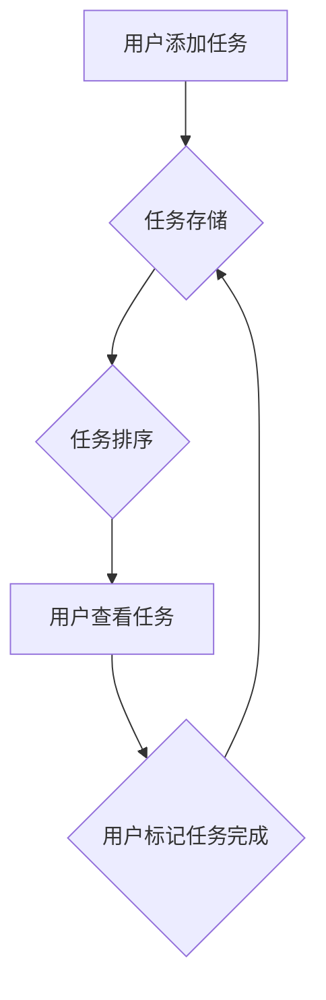

> 待办管理，插件开发，软件架构，算法设计，数据结构，用户体验，项目实践

## 1. 背景介绍

在当今快速节奏的生活中，高效地管理待办事项已成为许多人提高工作和生活效率的关键。传统的待办清单往往难以满足复杂任务的分解和协同管理需求。因此，开发一个功能强大、易于使用的待办管理插件，能够帮助用户更好地组织和完成任务，显得尤为重要。

本篇文章将以开发一个待办管理插件为例，深入探讨插件开发的各个环节，包括核心概念、算法设计、代码实现、用户体验设计等方面。通过对待办管理插件的深入分析，我们不仅可以学习到插件开发的知识和技能，更能理解软件开发的本质和背后的设计理念。

## 2. 核心概念与联系

待办管理插件的核心概念包括：

* **任务:** 待办管理插件的基本单位，代表一个需要完成的行动。
* **项目:** 多个相关任务的集合，用于组织和管理大型项目。
* **优先级:** 任务的优先级，用于区分任务的紧急程度和重要性。
* **截止日期:** 任务的完成期限，用于设定任务的完成时间。
* **状态:** 任务的当前状态，例如待完成、进行中、已完成等。

这些概念相互关联，共同构成了待办管理插件的逻辑框架。

**Mermaid 流程图:**



## 3. 核心算法原理 & 具体操作步骤

### 3.1  算法原理概述

待办管理插件的核心算法主要涉及任务排序、任务状态管理和任务搜索等方面。

* **任务排序:** 根据任务的优先级、截止日期等因素对任务进行排序，以便用户优先处理重要任务。常用的排序算法包括冒泡排序、插入排序、快速排序等。
* **任务状态管理:** 根据任务的完成情况，将任务的状态更新为待完成、进行中或已完成，以便用户清晰地了解任务的进度。
* **任务搜索:** 根据用户输入的关键词或条件，快速查找目标任务，提高用户效率。常用的搜索算法包括线性搜索、二分搜索等。

### 3.2  算法步骤详解

**任务排序算法 (示例: 优先级排序)**

1. 定义任务优先级等级，例如高、中、低。
2. 遍历所有任务，获取每个任务的优先级。
3. 根据优先级等级，将任务进行排序，优先级高的任务排在前面。

**任务状态管理算法 (示例: 完成标记)**

1. 当用户标记任务完成时，更新任务的状态为“已完成”。
2. 将已完成的任务从待办事项列表中移除，并将其存入已完成任务列表。

**任务搜索算法 (示例: 线性搜索)**

1. 遍历所有任务，逐个检查任务名称或描述是否包含用户输入的关键词。
2. 如果找到匹配的任务，将其返回给用户。

### 3.3  算法优缺点

**冒泡排序:**

* 优点: 简单易懂，实现代码简洁。
* 缺点: 时间复杂度较高，效率较低。

**快速排序:**

* 优点: 时间复杂度较低，效率较高。
* 缺点: 实现代码复杂度较高。

**线性搜索:**

* 优点: 实现代码简单，易于理解。
* 缺点: 时间复杂度较高，效率较低。

### 3.4  算法应用领域

待办管理插件中的算法原理和技术可以应用于其他领域，例如：

* **邮件管理:** 根据邮件重要程度和发送时间对邮件进行排序。
* **文件管理:** 根据文件类型、修改时间等因素对文件进行分类和排序。
* **日程安排:** 根据事件重要程度和时间安排对事件进行排序。

## 4. 数学模型和公式 & 详细讲解 & 举例说明

### 4.1  数学模型构建

待办管理插件可以采用以下数学模型来表示任务的优先级和截止日期:

* **优先级:** 使用整数表示任务的优先级，例如 1 表示最高优先级， 3 表示最低优先级。
* **截止日期:** 使用时间戳表示任务的截止日期。

### 4.2  公式推导过程

**任务排序公式:**

```
排序结果 = 优先级 * 距离截止日期的倒数
```

**解释:**

* 优先级越高，排序结果越大。
* 距离截止日期越近，排序结果越大。

**举例说明:**

假设有两个任务:

* 任务 A: 优先级为 2，截止日期为 2023-12-25。
* 任务 B: 优先级为 1，截止日期为 2023-12-20。

根据公式计算:

* 任务 A 排序结果 = 2 * (1 / (2023-12-25 - 当前日期))
* 任务 B 排序结果 = 1 * (1 / (2023-12-20 - 当前日期))

由于任务 B 的优先级更高，并且距离截止日期更近，因此任务 B 的排序结果会更大，排在前面。

### 4.3  案例分析与讲解

通过以上公式和举例说明，我们可以看到，待办管理插件的排序算法可以根据任务的优先级和截止日期进行动态排序，从而帮助用户优先处理重要任务。

## 5. 项目实践：代码实例和详细解释说明

### 5.1  开发环境搭建

本示例使用 Python 语言开发待办管理插件，开发环境如下:

* 操作系统: Windows/macOS/Linux
* Python 版本: 3.7+
* IDE: PyCharm/VS Code

### 5.2  源代码详细实现

```python
class Task:
    def __init__(self, name, priority, due_date):
        self.name = name
        self.priority = priority
        self.due_date = due_date
        self.status = "待完成"

    def mark_complete(self):
        self.status = "已完成"

tasks = []

def add_task():
    name = input("请输入任务名称: ")
    priority = int(input("请输入任务优先级 (1-3): "))
    due_date = input("请输入任务截止日期 (YYYY-MM-DD): ")
    task = Task(name, priority, due_date)
    tasks.append(task)
    print("任务已添加!")

def view_tasks():
    if not tasks:
        print("待办列表为空!")
        return

    for i, task in enumerate(tasks):
        print(f"{i+1}. {task.name} (优先级: {task.priority}, 截止日期: {task.due_date}, 状态: {task.status})")

def main():
    while True:
        print("
待办管理插件")
        print("1. 添加任务")
        print("2. 查看任务")
        print("3. 退出")

        choice = input("请输入您的选择: ")

        if choice == "1":
            add_task()
        elif choice == "2":
            view_tasks()
        elif choice == "3":
            break
        else:
            print("无效选择!")

if __name__ == "__main__":
    main()
```

### 5.3  代码解读与分析

* **Task 类:** 定义了任务的基本属性，包括名称、优先级、截止日期和状态。
* **tasks 列表:** 用于存储所有任务。
* **add_task 函数:** 获取用户输入的任务信息，创建 Task 对象并添加到 tasks 列表中。
* **view_tasks 函数:** 遍历 tasks 列表，打印所有任务的信息。
* **main 函数:** 提供了主程序的逻辑，包括菜单显示、用户选择处理等。

### 5.4  运行结果展示

运行代码后，用户可以按照菜单选项添加任务、查看任务列表等操作。

## 6. 实际应用场景

待办管理插件可以应用于各种场景，例如：

* **个人待办管理:** 记录个人学习、工作、生活中的待办事项，提高效率。
* **团队协作:** 团队成员可以共同管理项目任务，提高协作效率。
* **项目管理:** 项目经理可以利用插件管理项目进度和任务分配。

### 6.4  未来应用展望

待办管理插件可以进一步扩展功能，例如：

* **时间管理:** 与日历集成，自动安排任务时间。
* **提醒功能:** 设置任务提醒，避免遗漏重要事项。
* **跨平台同步:** 实现手机、电脑等设备的同步，随时随地查看待办任务。

## 7. 工具和资源推荐

### 7.1  学习资源推荐

* **Python 官方文档:** https://docs.python.org/
* **Python 教程:** https://www.w3schools.com/python/
* **软件开发书籍:** 《代码大全》、《设计模式》

### 7.2  开发工具推荐

* **PyCharm:** https://www.jetbrains.com/pycharm/
* **VS Code:** https://code.visualstudio.com/

### 7.3  相关论文推荐

* **待办管理系统的设计与实现:** https://www.researchgate.net/publication/330474777_Design_and_Implementation_of_To-Do_List_System

## 8. 总结：未来发展趋势与挑战

### 8.1  研究成果总结

本篇文章深入探讨了待办管理插件的开发过程，从核心概念、算法设计、代码实现到实际应用场景，全面分析了插件开发的各个环节。

### 8.2  未来发展趋势

待办管理插件将朝着以下方向发展:

* **人工智能:** 利用人工智能技术，自动识别任务类型、优先级和截止日期，提高任务管理效率。
* **个性化定制:** 根据用户的习惯和需求，提供个性化的待办管理方案。
* **跨平台协作:** 实现跨平台协作，方便团队成员共同管理任务。

### 8.3  面临的挑战

待办管理插件的开发也面临一些挑战:

* **数据安全:** 保护用户数据安全，防止信息泄露。
* **用户体验:** 提供简洁易用的用户界面，提高用户体验。
* **算法优化:** 持续优化算法，提高任务管理效率。

### 8.4  研究展望

未来，我们将继续研究待办管理插件的算法优化、人工智能应用、跨平台协作等方面，致力于开发更智能、更便捷的待办管理工具，帮助用户更高效地管理任务，提升工作和生活效率。

## 9. 附录：常见问题与解答

* **Q: 如何添加任务?**
    * **A:** 在插件菜单中选择“添加任务”，输入任务名称、优先级和截止日期即可。
* **Q: 如何查看任务列表?**
    * **A:** 在插件菜单中选择“查看任务”，即可查看所有待办任务列表。
* **Q: 如何标记任务完成?**
    * **A:** 在任务列表中，点击任务名称即可标记任务完成。


作者：禅与计算机程序设计艺术 / Zen and the Art of Computer Programming 
<end_of_turn>