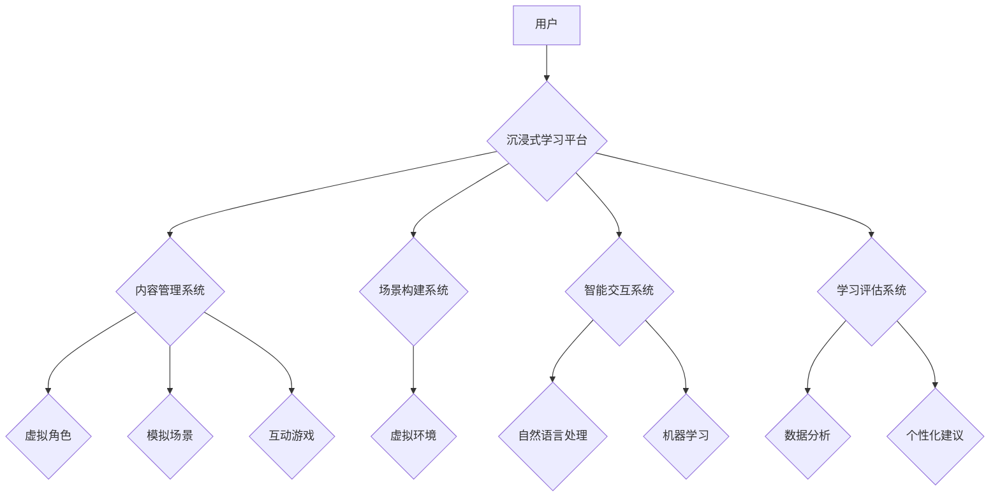

> 沉浸式学习，人工智能，教育科技，虚拟现实，增强现实，个性化学习，机器学习，自然语言处理

## 1. 背景介绍

教育，作为人类文明的基石，一直致力于传递知识、培养人才，推动社会进步。然而，传统的教育模式往往面临着诸多挑战，例如：教学内容单一、学习方式被动、个性化程度低、学习效率不高等。随着人工智能技术的飞速发展，它为教育领域带来了前所未有的机遇，为构建更加高效、个性化、沉浸式的学习体验提供了强大的技术支撑。

沉浸式学习，顾名思义，是指通过模拟真实环境或场景，让学生身临其境地体验学习内容，从而加深理解、提升记忆和参与度。近年来，虚拟现实（VR）和增强现实（AR）技术的发展为沉浸式学习提供了强大的技术基础。VR技术可以构建虚拟世界，让学生身临其境地体验不同的场景和事件；AR技术则可以将虚拟内容叠加到现实世界中，增强现实世界的互动性和趣味性。

## 2. 核心概念与联系

**2.1 沉浸式学习的核心概念**

沉浸式学习的核心概念在于创造一种身临其境、高度参与的学习体验。它强调以下几个方面：

* **身临其境：** 通过虚拟现实或增强现实技术，让学生身临其境地体验学习内容，增强学习的真实感和代入感。
* **互动性：** 鼓励学生主动参与学习过程，通过与虚拟环境或虚拟角色的互动，加深对知识的理解和掌握。
* **个性化：** 根据学生的学习进度、兴趣和能力，定制个性化的学习内容和学习路径，提高学习效率和效果。
* **反馈机制：** 提供实时反馈，帮助学生及时了解自己的学习情况，并根据反馈进行调整和改进。

**2.2 AI与沉浸式学习的联系**

人工智能技术为沉浸式学习提供了强大的技术支撑，主要体现在以下几个方面：

* **内容生成：** 利用自然语言处理（NLP）技术，自动生成个性化的学习内容，例如虚拟角色对话、模拟场景、互动游戏等。
* **场景构建：** 利用计算机图形学和3D建模技术，构建逼真的虚拟环境，为学生提供沉浸式的学习体验。
* **智能交互：** 利用机器学习（ML）技术，实现虚拟角色和学习系统的智能交互，提供更加个性化和人性化的学习体验。
* **学习评估：** 利用数据分析和机器学习技术，对学生的学习情况进行实时评估，并提供个性化的学习建议。

**2.3 沉浸式学习的架构**



## 3. 核心算法原理 & 具体操作步骤

### 3.1  算法原理概述

沉浸式学习的核心算法原理主要包括：

* **虚拟现实技术：** 利用头戴式显示器和传感器，模拟真实世界的视觉、听觉和触觉体验，构建沉浸式的虚拟环境。
* **增强现实技术：** 利用摄像头和投影技术，将虚拟内容叠加到现实世界中，增强现实世界的互动性和趣味性。
* **自然语言处理技术：** 理解和生成自然语言，实现虚拟角色和学习系统的智能交互。
* **机器学习技术：** 从数据中学习，预测和分析学生的学习情况，提供个性化的学习建议。

### 3.2  算法步骤详解

**3.2.1 虚拟现实技术**

1. **环境建模：** 利用3D建模软件构建虚拟环境的模型，包括场景、物体、人物等。
2. **渲染引擎：** 利用渲染引擎将虚拟环境模型渲染成图像，并根据用户的视角进行实时更新。
3. **头戴式显示器：** 将渲染出的图像显示在头戴式显示器上，模拟用户的视觉体验。
4. **传感器融合：** 利用传感器收集用户的头部运动、手势等信息，并将其反馈到虚拟环境中，实现用户的交互。

**3.2.2 增强现实技术**

1. **摄像头采集：** 利用摄像头采集现实世界的图像。
2. **图像识别：** 利用图像识别技术识别图像中的物体和场景。
3. **虚拟内容生成：** 根据识别结果生成虚拟内容，例如虚拟物体、虚拟角色等。
4. **叠加显示：** 将虚拟内容叠加到现实世界的图像上，实现增强现实的效果。

**3.2.3 自然语言处理技术**

1. **文本预处理：** 对输入的文本进行清洗、分词、词性标注等预处理操作。
2. **语义分析：** 利用语义分析模型理解文本的含义和关系。
3. **对话生成：** 根据语义分析结果，生成自然流畅的对话文本。

**3.2.4 机器学习技术**

1. **数据收集：** 收集学生的学习数据，例如学习进度、学习行为、学习成绩等。
2. **模型训练：** 利用机器学习算法对学习数据进行训练，建立预测模型。
3. **个性化推荐：** 根据学生的学习情况，利用预测模型推荐个性化的学习内容和学习路径。

### 3.3  算法优缺点

**3.3.1 虚拟现实技术**

* **优点：** 沉浸感强，交互性高，能够有效提高学习兴趣和参与度。
* **缺点：** 成本高，设备要求高，容易引起晕动症。

**3.3.2 增强现实技术**

* **优点：** 成本相对较低，设备要求相对较低，能够将虚拟内容与现实世界结合，增强学习的趣味性和实用性。
* **缺点：** 沉浸感相对较弱，交互性相对较低。

**3.3.3 自然语言处理技术**

* **优点：** 可以实现人机自然交互，提高学习的便捷性和效率。
* **缺点：** 语言理解和生成能力有限，难以处理复杂和多义的文本。

**3.3.4 机器学习技术**

* **优点：** 可以根据学生的学习情况提供个性化的学习建议，提高学习效率和效果。
* **缺点：** 需要大量的学习数据进行训练，模型的准确性依赖于数据质量。

### 3.4  算法应用领域

* **教育培训：** 构建沉浸式的虚拟课堂，让学生身临其境地体验学习内容，例如历史场景模拟、科学实验演示等。
* **技能培训：** 提供虚拟环境下的技能训练，例如手术模拟、飞行模拟等，提高技能的熟练度和安全系数。
* **游戏化学习：** 将学习内容融入到游戏中，提高学生的学习兴趣和参与度。
* **个性化学习：** 根据学生的学习进度、兴趣和能力，定制个性化的学习内容和学习路径。

## 4. 数学模型和公式 & 详细讲解 & 举例说明

### 4.1  数学模型构建

沉浸式学习的数学模型可以从以下几个方面进行构建：

* **虚拟环境建模：** 利用三维几何学和计算机图形学构建虚拟环境的数学模型，描述场景、物体和人物的形状、位置、运动等。
* **用户交互建模：** 利用控制理论和机器人学建模用户与虚拟环境的交互行为，描述用户的动作、手势、语音等输入，以及虚拟环境对用户的反馈。
* **学习效果评估模型：** 利用统计学和机器学习构建学习效果评估模型，评估学生的学习进度、学习行为、学习成绩等，并根据评估结果提供个性化的学习建议。

### 4.2  公式推导过程

**4.2.1 虚拟环境建模**

* **场景坐标系：** 定义虚拟环境的坐标系，描述场景中物体的相对位置。
* **物体模型：** 利用三维几何模型描述物体的形状，例如球体、圆柱体、多边形等。
* **材质属性：** 定义物体的材质属性，例如颜色、纹理、光泽度等。

**4.2.2 用户交互建模**

* **运动控制：** 利用控制理论描述用户的运动控制，例如键盘、鼠标、手柄等输入设备的映射关系。
* **手势识别：** 利用机器学习算法识别用户的手势，例如握拳、伸展、点按等。
* **语音识别：** 利用语音识别技术识别用户的语音输入，并将其转换为文本。

**4.2.3 学习效果评估模型**

* **学习进度：** 计算学生的学习进度，例如完成的学习任务数量、学习时间等。
* **学习行为：** 分析学生的学习行为，例如点击次数、停留时间、错误次数等。
* **学习成绩：** 评估学生的学习成绩，例如考试分数、作业得分等。

### 4.3  案例分析与讲解

**4.3.1 虚拟手术模拟**

利用虚拟现实技术构建虚拟手术场景，模拟真实的手术操作，让医学生在虚拟环境中进行手术练习，提高手术技能和操作熟练度。

**4.3.2 增强现实历史场景模拟**

利用增强现实技术将历史场景叠加到现实世界中，例如将古代建筑、人物、事件等虚拟化，让学生身临其境地体验历史场景，加深对历史知识的理解。

**4.3.3 个性化学习路径推荐**

利用机器学习技术分析学生的学习数据，例如学习进度、学习行为、学习成绩等，并根据分析结果推荐个性化的学习路径，帮助学生更高效地完成学习目标。

## 5. 项目实践：代码实例和详细解释说明

### 5.1  开发环境搭建

* **操作系统：** Windows/macOS/Linux
* **编程语言：** Python
* **虚拟现实框架：** Unity/Unreal Engine
* **增强现实框架：** ARKit/ARCore
* **机器学习库：** TensorFlow/PyTorch

### 5.2  源代码详细实现

以下是一个简单的虚拟现实场景构建的代码示例，使用Python和Unity框架：

```python
# Unity脚本
using UnityEngine;

public class VRSceneController : MonoBehaviour
{
    public GameObject player;
    public GameObject[] objects;

    void Start()
    {
        // 初始化玩家角色
        player.transform.position = new Vector3(0, 1, 0);
    }

    void Update()
    {
        // 玩家移动
        float horizontalInput = Input.GetAxis("Horizontal");
        float verticalInput = Input.GetAxis("Vertical");
        player.transform.Translate(new Vector3(horizontalInput, 0, verticalInput) * Time.deltaTime * 5);

        // 玩家旋转
        float rotationInput = Input.GetAxis("Mouse X");
        player.transform.Rotate(0, rotationInput * Time.deltaTime * 100, 0);
    }
}
```

### 5.3  代码解读与分析

* **`using UnityEngine;`**: 引入Unity引擎的命名空间。
* **`public class VRSceneController : MonoBehaviour`**: 定义一个名为`VRSceneController`的脚本类，继承自`MonoBehaviour`类。
* **`public GameObject player;`**: 定义一个公共变量`player`，用于存储玩家角色的GameObject对象。
* **`public GameObject[] objects;`**: 定义一个公共变量`objects`，用于存储场景中其他物体的GameObject数组。
* **`Start()`**: 在脚本开始执行时调用，用于初始化场景。
* **`Update()`**: 在每一帧更新时调用，用于处理玩家的输入和场景的更新。
* **`Input.GetAxis("Horizontal")`**: 获取玩家水平方向的输入值。
* **`Input.GetAxis("Vertical")`**: 获取玩家垂直方向的输入值。
* **`player.transform.Translate()`**: 移动玩家角色。
* **`player.transform.Rotate()`**: