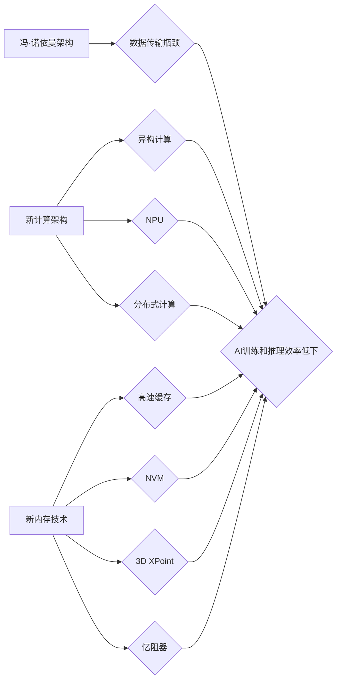

> 冯·诺依曼瓶颈，内存革命，AI加速，计算架构，新内存技术，神经网络，数据处理

## 1. 背景介绍

人工智能（AI）的蓬勃发展，特别是深度学习的兴起，对计算资源提出了前所未有的挑战。传统基于冯·诺依曼架构的计算机系统，其CPU和内存之间存在着明显的性能瓶颈。数据传输速度的限制，导致AI模型训练和推理速度缓慢，难以满足日益增长的需求。

冯·诺依曼架构，自其诞生以来，已经主导了计算机的发展方向数十年。其核心思想是将数据和指令存储在同一个内存空间中，并由CPU进行处理。然而，这种架构存在着固有的局限性：

* **数据传输瓶颈:** CPU和内存之间的数据传输速度相对较慢，成为AI模型训练和推理的瓶颈。
* **内存带宽限制:** 传统的内存带宽有限，难以满足大规模AI模型对数据访问的需求。
* **计算与存储分离:** 计算和存储功能分离，导致数据传输开销增加，效率降低。

这些瓶颈严重制约了AI的发展速度，迫切需要新的计算架构和内存技术来突破限制。

## 2. 核心概念与联系

为了解决冯·诺依曼瓶颈，近年来，研究者们提出了多种新兴的计算架构和内存技术，旨在提高数据处理速度和效率。

**2.1 计算架构**

* **异构计算:** 将CPU、GPU、FPGA等不同类型的处理器结合起来，协同工作，以提高计算效率。
* **神经网络专用处理器 (NPU):** 专为深度学习模型设计的处理器，具有更高的计算效率和更低的功耗。
* **分布式计算:** 将计算任务分解成多个子任务，并分别在不同的计算节点上执行，以提高计算速度和并行度。

**2.2 新内存技术**

* **高速缓存:** 提高CPU和内存之间的数据传输速度，减少数据访问延迟。
* **非易失性内存 (NVM):** 具有持久存储能力的内存，可以减少数据写入和读取的开销。
* **三维交叉点阵列 (3D XPoint):** 采用三维交叉点阵列结构的内存，具有更高的存储密度和更快的读写速度。
* **忆阻器 (Memristor):** 是一种新型的电子元件，具有记忆功能，可以用于构建新型的存储器和计算器件。

**2.3 架构关系图**



## 3. 核心算法原理 & 具体操作步骤

为了突破冯·诺依曼瓶颈，需要开发新的算法和技术来优化数据处理过程。

**3.1 算法原理概述**

* **数据并行化:** 将数据分解成多个子数据块，并分别在不同的处理器上进行处理，以提高并行度。
* **算法优化:** 对深度学习算法进行优化，减少计算量和数据传输量。
* **近似计算:** 使用近似计算方法，在保证一定精度的前提下，减少计算量。

**3.2 算法步骤详解**

1. **数据预处理:** 将原始数据进行清洗、转换和格式化，使其适合深度学习模型的训练。
2. **数据并行化:** 将数据划分为多个子数据块，并分别分配给不同的处理器进行处理。
3. **模型训练:** 使用深度学习算法对数据进行训练，学习数据之间的关系和模式。
4. **模型评估:** 使用测试数据对模型进行评估，并根据评估结果进行模型调优。
5. **模型部署:** 将训练好的模型部署到实际应用场景中，用于预测、分类或其他任务。

**3.3 算法优缺点**

* **优点:** 提高了计算效率和并行度，缩短了训练时间。
* **缺点:** 需要复杂的硬件支持和软件开发，对数据分布和模型结构有较高的要求。

**3.4 算法应用领域**

* **图像识别:** 人脸识别、物体检测、图像分类等。
* **自然语言处理:** 文本分类、机器翻译、语音识别等。
* **推荐系统:** 商品推荐、用户画像、个性化服务等。

## 4. 数学模型和公式 & 详细讲解 & 举例说明

深度学习模型的训练过程本质上是一个优化问题，目标是找到模型参数，使得模型在训练数据上的损失函数最小化。

**4.1 数学模型构建**

假设我们有一个深度学习模型，其参数为θ，输入数据为x，输出为y。模型的损失函数为L(θ, x, y)。我们的目标是找到最优的模型参数θ，使得损失函数最小化：

```latex
\theta^* = \arg \min_{\theta} L(\theta, x, y)
```

**4.2 公式推导过程**

为了找到最优的模型参数θ，我们通常使用梯度下降算法。梯度下降算法的基本思想是迭代地更新模型参数，方向由梯度决定，步长由学习率控制。

梯度下降算法的更新公式为：

```latex
\theta = \theta - \eta \nabla_{\theta} L(\theta, x, y)
```

其中：

* η 是学习率，控制更新步长。
* ∇θL(θ, x, y) 是损失函数关于模型参数θ的梯度。

**4.3 案例分析与讲解**

假设我们有一个简单的线性回归模型，其损失函数为均方误差：

```latex
L(\theta, x, y) = \frac{1}{2} \sum_{i=1}^{n} (y_i - \theta x_i)^2
```

其中：

* n 是样本数量。
* yi 是第i个样本的真实值。
* xi 是第i个样本的特征值。
* θ 是模型参数。

我们可以使用梯度下降算法来更新模型参数θ：

```latex
\theta = \theta - \eta \frac{1}{n} \sum_{i=1}^{n} (y_i - \theta x_i) x_i
```

## 5. 项目实践：代码实例和详细解释说明

为了验证上述算法原理，我们可以使用Python语言实现一个简单的线性回归模型，并使用梯度下降算法进行训练。

**5.1 开发环境搭建**

* Python 3.x
* NumPy
* Matplotlib

**5.2 源代码详细实现**

```python
import numpy as np
import matplotlib.pyplot as plt

# 生成随机数据
np.random.seed(0)
X = np.random.rand(100, 1) * 10
y = 2 * X + 1 + np.random.randn(100, 1)

# 定义线性回归模型
class LinearRegression:
    def __init__(self, learning_rate=0.01, iterations=1000):
        self.learning_rate = learning_rate
        self.iterations = iterations
        self.theta = None

    def fit(self, X, y):
        self.theta = np.zeros((1, 1))
        for _ in range(self.iterations):
            y_pred = self.predict(X)
            dw = (1 / len(X)) * X.T @ (y_pred - y)
            self.theta -= self.learning_rate * dw

    def predict(self, X):
        return X @ self.theta

# 实例化模型
model = LinearRegression()

# 训练模型
model.fit(X, y)

# 生成预测结果
y_pred = model.predict(X)

# 可视化结果
plt.scatter(X, y, label='真实数据')
plt.plot(X, y_pred, color='red', label='预测结果')
plt.legend()
plt.show()
```

**5.3 代码解读与分析**

* 代码首先定义了线性回归模型类，包含模型参数theta和训练方法fit()和预测方法predict()。
* 然后，代码生成随机数据，并实例化模型对象。
* 接着，代码调用模型的fit()方法进行训练，使用梯度下降算法更新模型参数。
* 最后，代码使用模型的predict()方法生成预测结果，并使用Matplotlib库可视化训练结果。

**5.4 运行结果展示**

运行代码后，会生成一个散点图，其中真实数据点和预测结果曲线清晰可见。

## 6. 实际应用场景

突破冯·诺依曼瓶颈的新计算架构和内存技术，在多个实际应用场景中展现出巨大的潜力。

**6.1 高性能计算**

* **科学计算:** 天体模拟、分子动力学、气候模型等。
* **金融建模:** 风险评估、投资策略、市场预测等。
* **工程设计:** 结构分析、流体模拟、材料科学等。

**6.2 人工智能**

* **深度学习训练:** 训练大型深度学习模型，例如图像识别、自然语言处理等。
* **AI推理:** 提高AI模型的推理速度和效率，例如智能助手、自动驾驶等。

**6.3 数据分析**

* **大数据处理:** 处理海量数据，进行快速分析和挖掘。
* **实时数据分析:** 对实时数据进行分析，支持实时决策。

**6.4 未来应用展望**

随着新计算架构和内存技术的不断发展，未来将有更多新的应用场景出现，例如：

* **边缘计算:** 将计算能力部署到边缘设备，实现更低延迟和更高效率的计算。
* **量子计算:** 与量子计算相结合，实现更强大的计算能力。
* **脑机接口:** 与脑机接口技术相结合，实现人机交互的新模式。

## 7. 工具和资源推荐

**7.1 学习资源推荐**

* **书籍:**
    * 《深度学习》
    * 《人工智能：一种现代方法》
    * 《计算机体系结构：设计与实现》
* **在线课程:**
    * Coursera: 深度学习
    * edX: 人工智能
    * Udacity: 计算机体系结构

**7.2 开发工具推荐**

* **编程语言:** Python, C++, Java
* **深度学习框架:** TensorFlow, PyTorch, Keras
* **硬件平台:** NVIDIA GPU, Intel Xeon CPU

**7.3 相关论文推荐**

* 《突破冯·诺依曼瓶颈:AI时代的内存革命》
* 《异构计算架构在深度学习中的应用》
* 《新型内存技术在人工智能中的应用》

## 8. 总结：未来发展趋势与挑战

突破冯·诺依曼瓶颈是人工智能发展的重要方向，新计算架构和内存技术将推动人工智能的快速发展。

**8.1 研究成果总结**

近年来，在突破冯·诺依曼瓶颈方面取得了显著进展，包括：

* 新型计算架构的提出和发展，例如异构计算、NPU等。
* 新型内存技术的研发，例如高速缓存、NVM、3D XPoint等。
* 深度学习算法的优化，例如数据并行化、算法优化等。

**8.2 未来发展趋势**

未来，突破冯·诺依曼瓶颈的研究将继续深入，主要发展趋势包括：

* **更先进的计算架构:** 探索更灵活、更高效的计算架构，例如神经形态计算、量子计算等。
* **更强大的内存技术:** 开发更高效、更高密度的内存技术，例如忆阻器、光存储等。
* **更智能的算法:** 设计