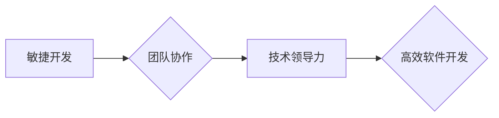

> 软件开发，团队管理，协作模式，沟通技巧，高效工作，敏捷开发，项目管理，代码质量，技术领导力

## 1. 背景介绍

在当今科技日新月异的时代，软件开发已成为推动社会进步的引擎之一。然而，软件开发项目往往面临着复杂的技术挑战、紧迫的交付压力以及团队成员之间的协作难题。如何有效管理团队，激发团队潜能，提高软件开发效率和质量，成为摆在软件开发领导者面前的重大课题。

传统的管理模式往往强调命令式管理和层级结构，这在某些情况下可能有效，但对于软件开发团队来说，这种模式往往难以适应快速迭代、创新驱动的开发环境。现代软件开发强调协作、沟通和自主性，因此，我们需要一种新的管理智慧，一种能够激发团队潜能、促进团队协作、提升团队效率的管理模式。

## 2. 核心概念与联系

### 2.1  敏捷开发

敏捷开发是一种迭代式、增量式软件开发方法，强调团队协作、客户反馈和快速迭代。它摒弃了传统的瀑布式开发模式，将项目划分为多个小周期（称为“冲刺”），在每个冲刺结束时交付一个可工作的软件版本。敏捷开发的核心价值观包括：

* **个人和交互高于流程和工具**
* **工作软件高于全面文档**
* **客户合作高于合同谈判**
* **响应变化高于遵循计划**

### 2.2  团队协作

团队协作是敏捷开发的核心要素之一。敏捷开发强调团队成员之间的平等合作，鼓励成员积极沟通、分享知识和经验，共同解决问题。有效的团队协作需要建立良好的沟通机制、明确的角色分工和共同的目标。

### 2.3  技术领导力

技术领导力是指能够引领团队技术方向，推动技术创新，解决技术难题的领导能力。技术领导者需要具备深厚的技术背景、优秀的沟通能力和团队管理能力。

**核心概念与联系流程图**

## 3. 核心算法原理 & 具体操作步骤

### 3.1  算法原理概述

在软件开发过程中，算法设计和优化是提高软件效率和性能的关键环节。高效的算法能够帮助我们解决复杂问题，提高代码的运行速度和内存利用率。

### 3.2  算法步骤详解

算法的步骤详解需要根据具体的算法类型进行描述。例如，对于排序算法，我们可以详细描述冒泡排序、插入排序、快速排序等算法的步骤，并分析其时间复杂度和空间复杂度。

### 3.3  算法优缺点

算法的优缺点需要根据其时间复杂度、空间复杂度、易读性、易实现性等方面进行评估。例如，快速排序算法的时间复杂度为O(n log n)，空间复杂度为O(log n)，但其实现较为复杂；而冒泡排序算法的时间复杂度为O(n^2)，空间复杂度为O(1)，但其效率较低。

### 3.4  算法应用领域

算法的应用领域非常广泛，例如：

* **数据结构:** 链表、栈、队列、树、图等数据结构的实现和应用。
* **排序算法:** 快速排序、归并排序、堆排序等算法用于对数据进行排序。
* **搜索算法:** 二分查找、线性查找等算法用于在数据集中查找特定元素。
* **图算法:** 最短路径算法、拓扑排序等算法用于解决图论问题。

## 4. 数学模型和公式 & 详细讲解 & 举例说明

### 4.1  数学模型构建

在软件开发中，我们可以使用数学模型来描述软件系统的行为和性能。例如，我们可以使用状态机模型来描述软件系统的状态转换，使用 Petri 网模型来描述软件系统的并发行为。

### 4.2  公式推导过程

在软件开发过程中，我们经常需要使用数学公式来计算软件系统的性能指标，例如：

* **时间复杂度:** 用于描述算法运行时间随输入数据规模变化的规律。
* **空间复杂度:** 用于描述算法运行过程中使用的内存空间大小。

### 4.3  案例分析与讲解

我们可以通过具体的案例分析来讲解数学模型和公式的应用。例如，我们可以分析快速排序算法的时间复杂度和空间复杂度，并通过实验验证其理论分析结果。

## 5. 项目实践：代码实例和详细解释说明

### 5.1  开发环境搭建

在进行项目实践之前，我们需要搭建一个合适的开发环境。这包括安装必要的软件工具、配置开发环境变量和创建项目目录结构。

### 5.2  源代码详细实现

我们需要编写源代码来实现具体的软件功能。这包括设计类结构、编写方法实现和测试代码。

### 5.3  代码解读与分析

我们需要对源代码进行解读和分析，理解代码的逻辑结构、算法实现和数据流。

### 5.4  运行结果展示

我们需要运行代码并观察运行结果，验证代码的正确性和性能。

## 6. 实际应用场景

### 6.1  电商平台

在电商平台中，敏捷开发模式可以帮助快速迭代新功能，满足用户不断变化的需求。

### 6.2  金融系统

在金融系统中，高效的算法和严谨的代码质量保证是至关重要的。

### 6.3  医疗软件

在医疗软件中，安全性、可靠性和数据隐私保护是首要考虑因素。

### 6.4  未来应用展望

随着人工智能、云计算和物联网技术的快速发展，软件开发将面临更多新的挑战和机遇。敏捷开发模式将继续演进，并与新兴技术相结合，推动软件开发行业的发展。

## 7. 工具和资源推荐

### 7.1  学习资源推荐

* **书籍:** 《敏捷软件开发实践指南》、《代码大全》、《设计模式》
* **在线课程:** Coursera、Udemy、edX 等平台提供丰富的软件开发课程。
* **博客和论坛:** Stack Overflow、GitHub 等平台提供丰富的技术文档和社区支持。

### 7.2  开发工具推荐

* **版本控制系统:** Git、SVN
* **代码编辑器:** Visual Studio Code、Sublime Text、Atom
* **构建工具:** Maven、Gradle
* **测试工具:** JUnit、Mockito

### 7.3  相关论文推荐

* **敏捷软件开发:** Agile Software Development: Principles, Patterns, and Practices
* **软件工程:** Software Engineering: A Practitioner's Approach
* **算法设计:** Introduction to Algorithms

## 8. 总结：未来发展趋势与挑战

### 8.1  研究成果总结

本文探讨了敏捷开发模式、团队协作和技术领导力在软件开发中的重要性，并介绍了算法设计、数学模型和代码实践等关键技术。

### 8.2  未来发展趋势

未来软件开发将更加注重自动化、智能化和云化。人工智能、机器学习和云计算技术将被广泛应用于软件开发各个环节，提高开发效率和软件质量。

### 8.3  面临的挑战

软件开发行业面临着人才短缺、技术迭代速度快和安全风险等挑战。我们需要不断提升技术能力、加强团队合作和关注安全问题。

### 8.4  研究展望

未来研究将继续关注敏捷开发模式的优化、人工智能在软件开发中的应用、云原生开发技术和软件安全保障等领域。

## 9. 附录：常见问题与解答

### 9.1  Q1: 敏捷开发适合所有类型的软件项目吗？

### 9.2  A1: 敏捷开发模式更适合迭代开发、需求变化频繁的项目。对于一些大型、复杂、需求相对稳定的项目，传统瀑布式开发模式可能更合适。

### 9.3  Q2: 如何建立高效的团队协作机制？

### 9.4  A2: 建立高效的团队协作机制需要明确角色分工、建立良好的沟通机制、鼓励团队成员积极参与和分享知识。

### 9.5  Q3: 如何提升技术领导力？

### 9.6  A3: 提升技术领导力需要不断学习新技术、积累实践经验、提升沟通能力和团队管理能力。

作者：禅与计算机程序设计艺术 / Zen and the Art of Computer Programming 
<end_of_turn>